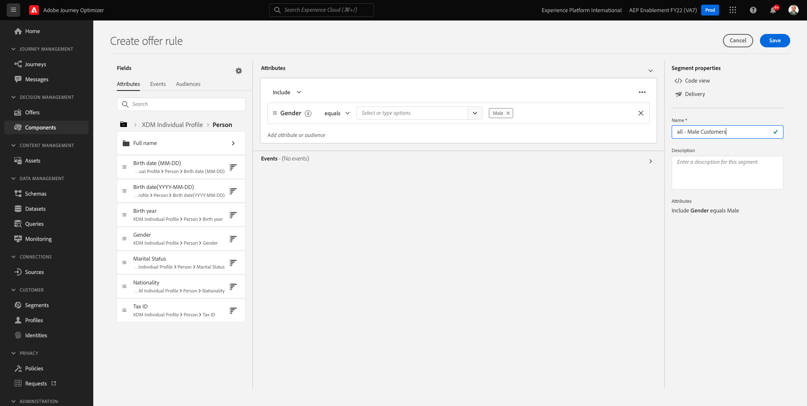
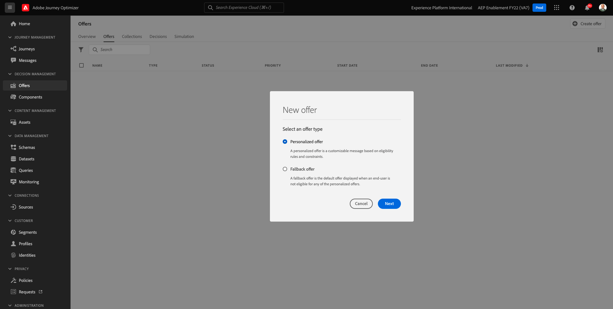

# 9.1Offer decisioning101

## 9.1.1 用語

offer decisioningに関する理解を深めるために、 [概要](https://experienceleague.adobe.com/docs/journey-optimizer/using/offer-decisioniong/get-started-decision/starting-offer-decisioning.html?lang=en) Adobe Experience PlatformでのOffer decisioningアプリケーションサービスの動作方法を参照してください。

offer decisioningを使用する場合、次の概念を理解する必要があります。

| 用語 | 説明 |
| ------------------------- | -------------------------------------------------------------------------------------------------------------------------------------------------------------------------------------------------------------------------------------------------------- |
| **オファー** | オファーとは、オファーを表示する資格のあるユーザーを指定するルールが関連付けられているマーケティングメッセージです。オファーのステータスは次のとおりです。下書き、承認済みまたはアーカイブ済み。 |
| **プレースメント** | エンドユーザーに対してオファーが表示される場所（またはチャネルタイプ）とコンテキスト（またはコンテンツタイプ）の組み合わせ。 実際には、モバイル、Web、ソーシャル、インスタントメッセージング、非デジタルの各チャネルのテキスト、HTML、画像、JSON の組み合わせです。 |
| **規則** | オファーのエンドユーザーの実施要件を定義および制御するロジックです。 |
| **パーソナライズされたオファー** | 実施要件ルールと制約に基づいてカスタマイズ可能なマーケティングメッセージ。 |
| **フォールバックオファー** | エンドユーザーが使用されるコレクションのオファーの実施要件を満たしていない場合に表示されるデフォルトオファー。 |
| **キャッピング** | オファー定義で使用して、オファーの合計提示回数と特定のユーザーに対してオファーを提示できる回数を定義します。 |
| **優先度** | レベル：オファーの結果セットから優先順位を決定します。 |
| **コレクション** | パーソナライズされたオファーリストからオファーのサブセットを除外して、offer decisioningプロセスを高速化するために使用します。 |
| **決定** | マーケターが最適なオファーを提供するために求める、一連のオファー、配置、プロファイルの組み合わせ。 |
| **AEM Assets Essentials** | Adobe Experience CloudソリューションとAdobe Experience Platformをまたいでアセットを保存、検索、選択するための、一元化された汎用エクスペリエンスです。 |

{style=&quot;table-layout:auto&quot;}

## 9.1.2Offer decisioning

に移動してAdobe Journey Optimizerにログインします。 [Adobe Experience Cloud](https://experience.adobe.com). クリック **Journey Optimizer**.

リダイレクト先： **ホーム**  Journey Optimizerで表示 まず、正しいサンドボックスを使用していることを確認します。 使用するサンドボックスは、と呼ばれます。 `--aepSandboxId--`. サンドボックス間を切り替えるには、 **実稼動 (VA7)** リストからサンドボックスを選択します。 この例では、サンドボックスの名前はです。 **AEP 有効化 FY22**. その後、 **ホーム** サンドボックスの表示 `--aepSandboxId--`.

左側のメニューで、 **オファー**. オファー、コレクション、決定などが含まれるオファーメニューが表示されます。

クリック **コンポーネント**. プレースメント、タグ、ルール、ランクなどが含まれるオファーメニューが表示されます。

## 9.1.3 配置

に移動します。 **配置**.

内 **配置** 「 」タブでは、オファーの配置を定義できます。 決定を定義する際に、配置によって、生成されるオファーの表示場所（チャネルタイプ）と、形状またはフォーム（コンテンツタイプ）が定義されます。

Adobe Experience Platformインスタンスに配置が表示されない場合は、以下とスクリーンショットに示すように配置を作成してください。

| 名前 | チャネルのタイプ | コンテンツタイプ |
| ---------------------- | ------------ | ------------ |
| **非デジタル - テキスト** | 非デジタル | テキスト |
| **Web - JSON** | Web | JSON |
| **Web -HTML** | Web | HTML |
| **Web — テキスト** | Web | テキスト |
| **Web - 画像** | Web | 画像 |
| **電子メール — JSON** | メール | JSON |
| **E メール —HTML** | メール | HTML |
| **メール — テキスト** | メール | テキスト |
| **メール - 画像** | メール | 画像 |

{style=&quot;table-layout:auto&quot;}

**注意**:既に使用可能な配置には何も変更しないでください。

任意の配置をクリックして、その設定を視覚化します。

これで、プレースメントのすべてのフィールドが表示されます。

- **名前** 配置の
- **プレースメント ID**
- **チャネルタイプ** 配置用
- **コンテンツタイプ** 配置の ( **テキスト**, **HTML**, **画像** または **JSON**
- **説明** プレースメントの説明を追加できるフィールド

## 9.1.4 決定ルール

ルール（実施要件ルールとも呼ばれます）は、 **セグメント**. ルールは、実際には、Adobe Experience Platformのプロファイルに最適なオファーを提供するために、ルールとオファーを併用できるという唯一の違いを持つセグメント自体です。

以前のイネーブルメントモジュールに基づいてセグメントを定義する方法を既に知っているので、セグメント化環境に簡単に戻ってみましょう。

に移動します。 **ルール**. クリック **+ルールを作成**.

次に、Adobe Experience Platformのセグメント化環境が表示されます。

リアルタイム顧客プロファイルの和集合スキーマの一部であるすべてのフィールドにアクセスし、任意のルールを作成できるようになりました。

また、Adobe Experience Platformで既に定義済みのセグメントを、 **オーディエンス** > ``--aepTenantIdSchema--``.

次の内容が表示されます。

必要に応じて、独自のルールを設定できます。 この演習では、次の 2 つのルールが必要です。

- すべて — 男性のお客様
- すべて — 女性客

これらのルールがまだ存在しない場合は、作成してください。 既に存在する場合は、これらのルールを使用し、新しいルールは作成しないでください。

ルールの作成に使用する属性は、次のとおりです。 **XDM 個人プロファイル** > **人物** > **性別**.

例として、ルールのルール定義を次に示します **すべて — 男性のお客様**:

例として、ルールのルール定義を次に示します **すべて — 女性客**:

## 9.1.5 オファー

に移動します。 **オファー** を選択し、 **オファー**. クリック **+オファーを作成**.

その後、このポップアップが表示されます。

今はオファーを作成しないでください。次の演習で作成します。

これで、次の 2 種類のオファーが表示されます。

- パーソナライズされたオファー
- フォールバックオファー

パーソナライズされたオファーとは、特定の状況に表示する必要のある特定のコンテンツです。 パーソナライズされたオファーは、特定の条件が満たされた場合に、個人のエクスペリエンスやコンテキストに応じたエクスペリエンスを提供するために特別に構築されます。

フォールバックオファーは、パーソナライズされたオファーの条件が満たされない場合に表示されるオファーです。

## 9.1.6 決定

決定は、配置、パーソナライズされたオファーのコレクション、フォールバックオファーを組み合わせて、優先度、実施要件の制約、合計/ユーザー上限など、個々にパーソナライズされたオファーの特性に基づいて、特定のプロファイルに最適なオファーを見つけます。

次の手順で **決定**&#x200B;をクリックし、 **決定**.

次の演習では、独自のオファーと決定を設定します。

次のステップ： [9.2 オファーと決定の設定](./ex2.md)

[モジュール 9 に戻る](./offer-decisioning.md)

[すべてのモジュールに戻る](./../../overview.md)
