# 9.2 オファーと決定の設定

## 9.2.1 パーソナライズされたオファーの作成

この練習では、4 つの **パーソナライズされたオファー**. これらのオファーを作成する際に考慮すべき詳細は次のとおりです。

| 名前 | 日付範囲 | メールの画像リンク | Web 用画像リンク | テキスト | 優先度 | 実施要件 | 言語 |
|-----|------------|----------------------|--------------------|------|:--------:|--------------|:-------:|
| `--demoProfileLdap-- - Nadia Elements Shell` | 今日 — 1 か月後 | https://bit.ly/3nPiwdZ | https://bit.ly/2INwXjt | `{{ profile.person.name.firstName }}, 10% discount on Nadia Elements Shell` | 25 | すべて — 女性客 | 英語（米国） |
| `--demoProfileLdap-- - Radiant Tee` | 今日 — 1 か月後 | https://bit.ly/2HfA17v | https://bit.ly/3pEIdzn | `{{ profile.person.name.firstName }}, 5% discount on Radiant Tee` | 15 | すべて — 女性客 | 英語（米国） |
| `--demoProfileLdap-- - Zeppelin Yoga Pant` | 今日 — 1 か月後 | https://bit.ly/2IOaItW | https://bit.ly/2INZHZd | `{{ profile.person.name.firstName }}, 10% discount on Zeppelin Yoga Pant` | 25 | すべて — 男性のお客様 | 英語（米国） |
| `--demoProfileLdap-- - Proteus Fitness Jackshirt` | 今日 — 1 か月後 | https://bit.ly/330a43n | https://bit.ly/36USaQW | `{{ profile.person.name.firstName }}, 5% discount on Proteus Fitness Jackshirt` | 15 | すべて — 男性のお客様 | 英語（米国） |

{style=&quot;table-layout:auto&quot;}

に移動してAdobe Journey Optimizerにログインします。 [Adobe Experience Cloud](https://experience.adobe.com). クリック **Journey Optimizer**.

リダイレクト先： **ホーム**  Journey Optimizerで表示 まず、正しいサンドボックスを使用していることを確認します。 使用するサンドボックスは、と呼ばれます。 `--aepSandboxId--`. サンドボックス間を切り替えるには、 **実稼動 (VA7)** リストからサンドボックスを選択します。 この例では、サンドボックスの名前はです。 **AEP 有効化 FY22**. その後、 **ホーム** サンドボックスの表示 `--aepSandboxId--`.

左側のメニューで、 **オファー** その後、 **オファー**. クリック **+オファーを作成**.

その後、このポップアップが表示されます。 選択 **パーソナライズされたオファー** をクリックし、 **次へ**.

これで、 **詳細** 表示

この場合、オファーを設定する必要があります `--demoProfileLdap-- - Nadia Elements Shell`. 上記の表の情報を使用して、フィールドに入力します。 この例では、パーソナライズされたオファーの名前は **vangeluw — ナディアエレメントシェル**. また、 **開始日時** 昨日にして **終了日時** 今から 1 ヶ月後の日付に。

完了したら、次の処理を行う必要があります。 「**次へ**」をクリックします。

次は、 **表示域**. 表示域は、 **配置** 実際の資産です

の場合 **表現 1**、選択：

- チャネル：Web
- 配置：Web — 画像
- コンテンツ：URL
- 公開場所：列から URL をコピー **Web 用画像リンク** 上の表の

または、 **アセットライブラリ** コンテンツの **参照**.

アセットライブラリのポップアップが表示され、フォルダーに移動します。 **enablement-assets** をクリックし、画像ファイルを選択します。 **nadia-web.png**. 次に、「 **選択**.

次の内容が表示されます。

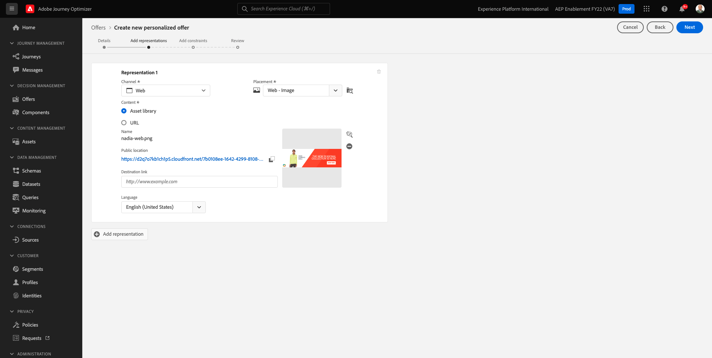

クリック **+表示域を追加**.

の場合 **表現 2**、選択：

- チャネル：電子メール
- 配置：電子メール — 画像
- コンテンツ：URL
- 公開場所：列から URL をコピー **メールの画像リンク** 上の表の

または、 **アセットライブラリ** コンテンツの **参照**.

アセットライブラリのポップアップが表示され、フォルダーに移動します。 **enablement-assets** をクリックし、画像ファイルを選択します。 **nadia-email.png**. 次に、「 **選択**.

次の内容が表示されます。

次に、「 **+表示域を追加**.

の場合 **表現 3**、選択：

- チャネル：非デジタル
- 配置：非デジタル — テキスト

次に、コンテンツを追加する必要があります。 この場合、コールトゥアクションとして使用するテキストを追加することを意味します。

クリック **コンテンツを追加**.

その後、このポップアップが表示されます。

選択 **カスタムテキスト** 次のフィールドに入力します。

以下を見る： **テキスト** 上のテーブルのフィールドに入力し、ここにそのテキストを入力します。この場合、 `{{ profile.person.name.firstName }}, 10% discount on Nadia Elements Shell`.

また、任意のプロファイル属性を選択して、オファーテキストに動的フィールドとして含めることもできます。 この例では、フィールド `{{ profile.person.name.firstName }}` により、このオファーを受け取る顧客の名が必ずオファーテキストに含まれるようになります。

これが見えます 「**保存**」をクリックします。

これです。 「**次へ**」をクリックします。

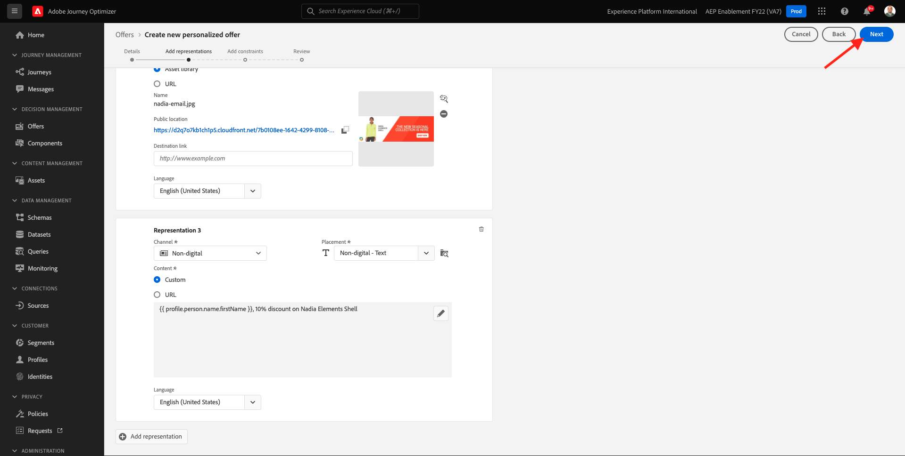

次の内容が表示されます。

選択 **定義された決定ルール別** をクリックし、 **+** ルールを追加するアイコン **すべて — 女性客**.

これが見えます 次の項目に入力します。 **優先度** 上記の表に示すように。 「**次へ**」をクリックします。

新しい **パーソナライズされたオファー**.

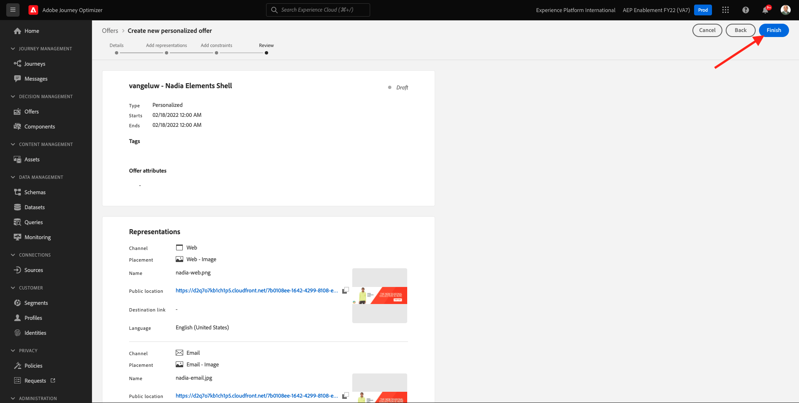

最後に、「 **保存して承認**.

その後、新しく作成したパーソナライズされたオファーがオファーの概要に表示されます。

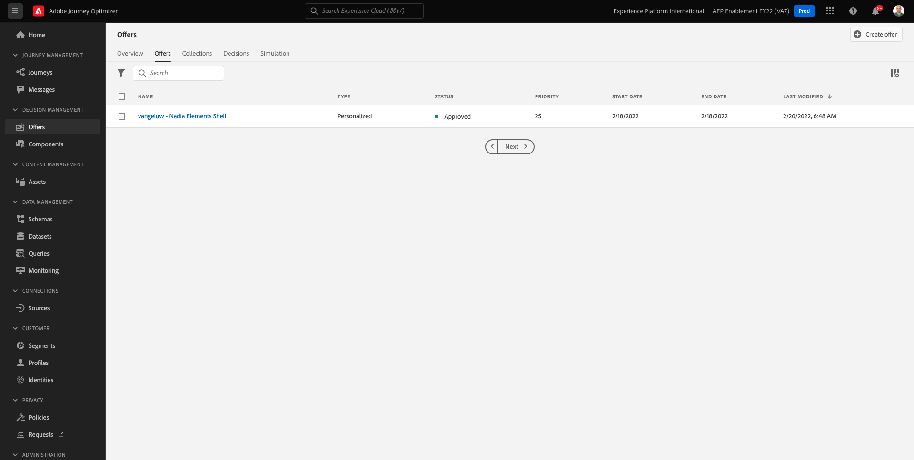

次に、上記の手順を繰り返して、Radiant Tee、Zeppelin Yoga Pant、Proteus Fitness Jackshirt という製品用の 3 つのパーソナライズされたオファーを作成する必要があります。

完了したら、 **オファーの概要** ～のための画面 **パーソナライズされたオファー** にすべてのオファーが表示されます。

## 9.2.2 フォールバックオファーの作成

パーソナライズされた 4 つのオファーを作成した後、次に **フォールバックオファー**.

次の場所にいることを確認します： **オファー** 表示：

クリック **+オファーを作成**.

その後、このポップアップが表示されます。 選択 **フォールバックオファー** をクリックし、 **次へ**.

次の内容が表示されます。

フォールバックオファーに対して、この名前を入力します。 `--demoProfileLdap-- - Luma Fallback Offer`. 「**次へ**」をクリックします。

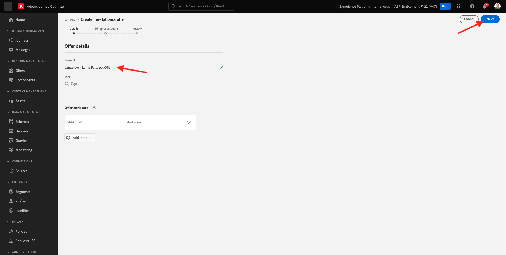

次は、 **表示域**. 表示域は、 **配置** 実際の資産です

の場合 **表現 1**、選択：

- チャネル：Web
- 配置：Web — 画像
- コンテンツ：URL
- 公開場所： `https://bit.ly/3nBOt9h`

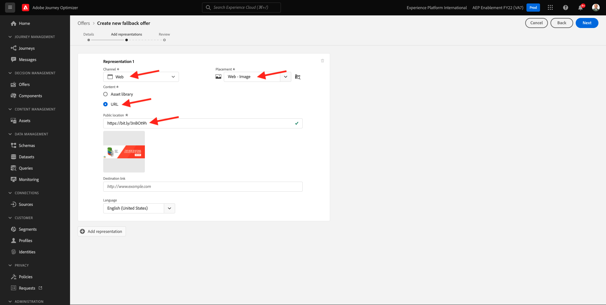

または、 **アセットライブラリ** コンテンツの **参照**.

アセットライブラリのポップアップが表示され、フォルダーに移動します。 **enablement-assets** をクリックし、画像ファイルを選択します。 **spriteyogastraps-web.png**. 次に、「 **選択**.

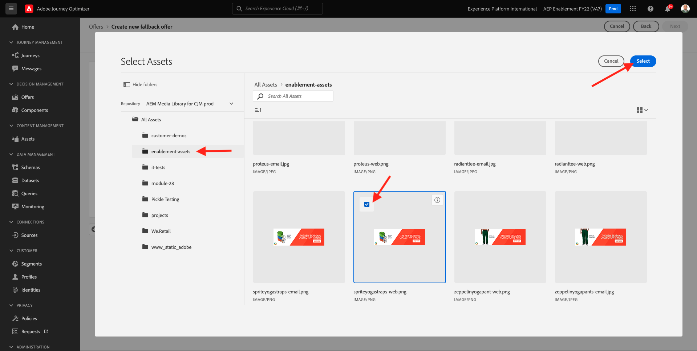

次の内容が表示されます。

の場合 **表現 2**、選択：

- チャネル：電子メール
- 配置：電子メール — 画像
- コンテンツ：URL
- 公開場所： `https://bit.ly/3nF4qvE`

または、 **アセットライブラリ** コンテンツの **参照**.

アセットライブラリのポップアップが表示され、フォルダーに移動します。 **enablement-assets** をクリックし、画像ファイルを選択します。 **spriteyogastraps-email.png**. 次に、「 **選択**.

次の内容が表示されます。

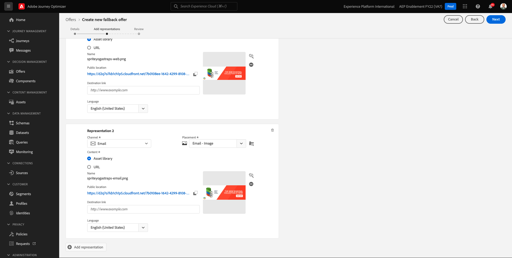

次に、「 **+表示域を追加**.

の場合 **表現 3**、選択：

- チャネル：非デジタル
- 配置：非デジタル — テキスト

次に、コンテンツを追加する必要があります。 この場合は、画像リンクを追加することを意味します。

クリック **コンテンツを追加**.

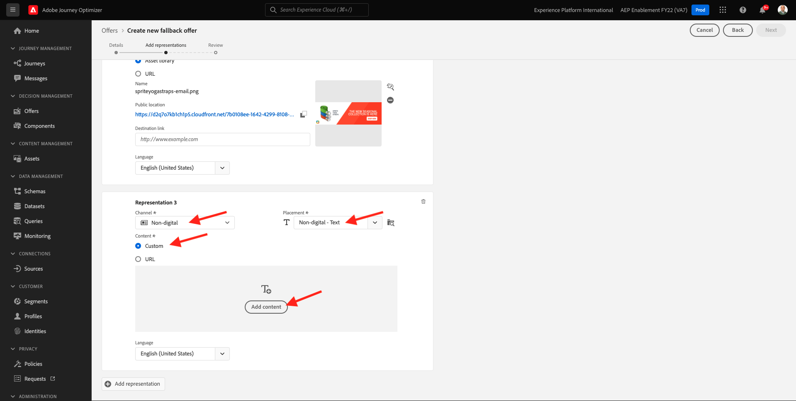

その後、このポップアップが表示されます。

選択 **カスタムテキスト** 次のフィールドに入力します。

テキストを入力 `{{ profile.person.name.firstName }}, discover our Sprite Yoga Straps!` をクリックし、 **保存**.

これが見えます 「**次へ**」をクリックします。

新しい **フォールバックオファー**. 「**完了**」をクリックします。

最後に、「 **保存して承認**.

を **オファーの概要** 画面には、次の情報が表示されます。

## 9.2.3 コレクションの作成

コレクションは **フィルター** パーソナライズされたオファーリストからオファーのサブセットを除外し、決定プロセスを迅速に実行するために、決定の一部として使用します。

に移動します。 **コレクション**. クリック **+コレクションを作成**.

その後、このポップアップが表示されます。 次のようにコレクションを設定します。 「**次へ**」をクリックします。

- コレクション名：use `--demoProfileLdap-- - Luma Collection`
- 選択 **静的コレクションを作成**.

次の画面で、 **パーソナライズされたオファー** 前の演習で作成した内容。 「**保存**」をクリックします。

次の内容が表示されます。

## 9.2.4 決定の作成

決定は、配置、パーソナライズされたオファーのコレクション、フォールバックオファーを組み合わせて、最終的にOffer decisioningエンジンで使用し、優先度、実施要件の制約、合計/ユーザー制限などの個々のパーソナライズされたオファーの特性に基づいて、特定のプロファイルに最適なオファーを見つけます。

次の手順で **決定**&#x200B;に移動します。 **決定**. クリック **+アクティビティを作成**.

次の内容が表示されます。

次のようなフィールドに入力します。 「**次へ**」をクリックします。

- 名前: `--demoProfileLdap-- - Luma Decision`
- 開始日時：昨日
- 終了日時：今日+ 1 か月

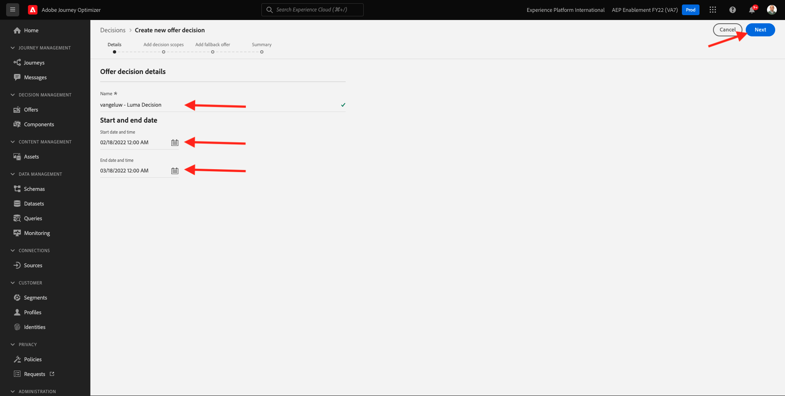

次の画面で、決定範囲に配置を追加する必要があります。 配置の決定範囲を作成する必要があります **Web — 画像**, **電子メール — 画像** および **非デジタル — テキスト**.

まず、次の決定範囲を作成します。 **非デジタル — テキスト** ドロップダウンでその配置を選択します。 次に、 **追加** ボタンをクリックして、評価条件を追加します。

コレクションを選択 `--demoProfileLdap-- - Luma Collection` をクリックし、 **追加**.

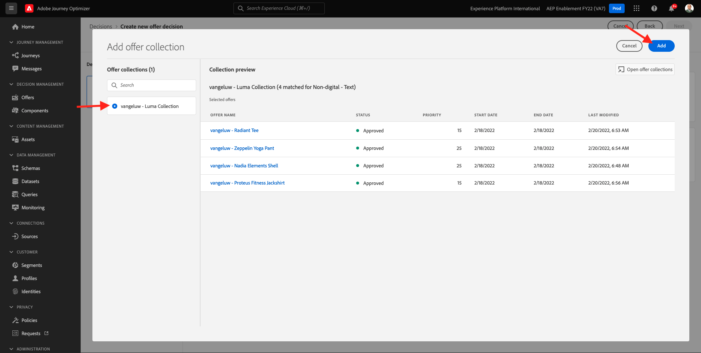

これが見えます 次をクリック： **-** ボタンをクリックして、新しい決定範囲を追加します。

配置を選択 **Web — 画像** コレクションを追加します。 `--demoProfileLdap-- - Luma Collection` を選択します。 次に、 **+** ボタンを再度クリックして、新しい決定範囲を追加します。

配置を選択 **電子メール — 画像** コレクションを追加します。 `--demoProfileLdap-- - Luma Collection` を選択します。 次に、「**次へ**」をクリックします。

次に、 **フォールバックオファー**（という名前） `--demoProfileLdap-- - Luma Fallback Offer`. 「**次へ**」をクリックします。

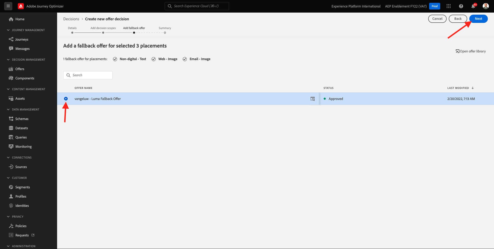

決定を確認します。 「**完了**」をクリックします。

ポップアップで、 **保存してアクティブ化**.

最後に、決定が概要に表示されます。

これで、決定が正常に設定されました。 これで、決定が実行され、最適化され、パーソナライズされたオファーをリアルタイムで顧客に配信できます。

次のステップ： [9.3Offer decisioning用のデータ収集クライアントプロパティと Web SDK 設定の準備](./ex3.md)

[モジュール 9 に戻る](./offer-decisioning.md)

[すべてのモジュールに戻る](./../../overview.md)
