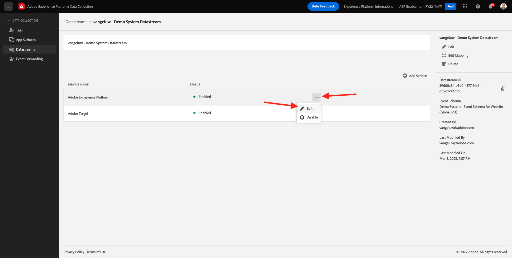
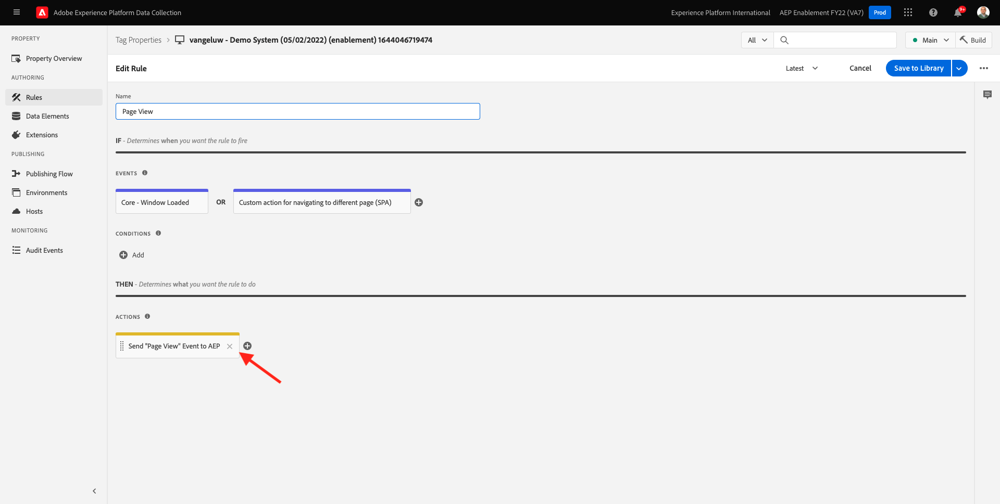
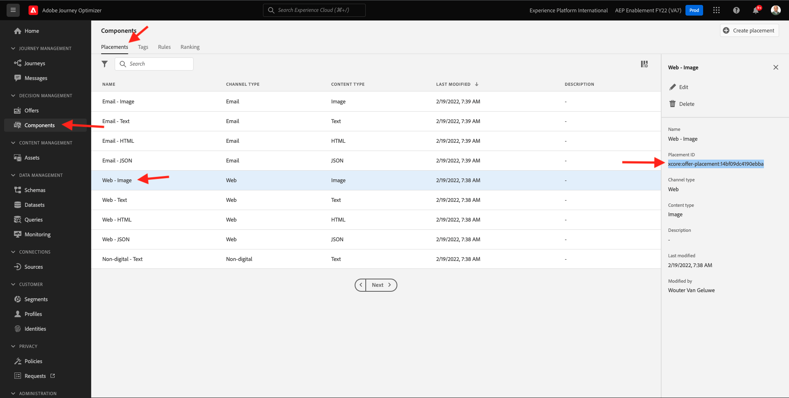

# 9.3Offer decisioning用に、Adobe Experience Platform Data Collection Client プロパティと Web SDK 設定を準備する

>[!NOTE]
>
>現在、Adobe Experience Platform Web SDK での Offer Decisioning の使用は、一部のユーザーが早期にアクセスできます。この機能は、一部の IMS 組織ではご利用いただけきません。

## 9.3.1 データストリームの更新

In [演習 0.2](./../../modules/module0/ex2.md)独自に作成した **[!UICONTROL Datastream]**. その後、名前を使用しました `--demoProfileLdap-- - Demo System Datastream`.

この演習では、を設定する必要があります **[!UICONTROL Datastream]** 働く **[!DNL Offer Decisioning]**.

それには、に移動します。 [https://experience.adobe.com/#/data-collection/](https://experience.adobe.com/#/data-collection/). これが見えます クリック **[!UICONTROL データストリーム]** または **[!UICONTROL データストリーム（ベータ版）]**.

画面の右上隅で、サンドボックス名を選択します。この名前は、 `--aepSandboxId--`.


を検索します。 **[!UICONTROL Datastream]**（という名前） `--demoProfileLdap-- - Demo System Datastream`. クリック **[!UICONTROL Datastream]** をクリックして開きます。


これが見えます クリック **...** 次の **Adobe Experience Platform** 次に、 **編集**.



有効にするには **[!DNL Offer Decisioning]**、 **[!DNL Offer Decisioning]**. 「**保存**」をクリックします。


お使いの **[!UICONTROL Datastream]** これで、 **[!DNL Offer Decisioning]**.


## 9.3.2 パーソナライズされたオファーをリクエストするためのAdobe Experience Platformデータ収集クライアントプロパティの設定

に移動します。 [https://experience.adobe.com/#/data-collection/](https://experience.adobe.com/#/data-collection/)、 **[!UICONTROL クライアント]**. データ収集プロパティを検索します。このプロパティの名前はです。 `--demoProfileLdap-- - Demo System (DD/MM/YYYY)`. Web 用のデータ収集クライアントプロパティを開きます。


プロパティで、に移動します。 **[!UICONTROL ルール]** ルールを開きます。 **[!UICONTROL ページビュー]**.


クリックして [!UICONTROL アクション] **[!UICONTROL AEP Web SDK — イベントを送信]**.



これが見えます 次のメニューオプションが表示されます。 **[!UICONTROL 決定範囲]**.


エッジとAdobe Experience Platformに送信されるリクエストごとに、1 つ以上の **[!UICONTROL 決定範囲]**. A **[!UICONTROL 決定範囲]** は、次の 2 つの要素の組み合わせです。

- [!UICONTROL 決定 ID]
- [!UICONTROL プレースメント ID]

まず、2 つの要素を見つける場所を見てみましょう。

### 9.3.2.1 [!UICONTROL プレースメント ID]

この [!UICONTROL プレースメント ID] 必要なアセットの場所とタイプを識別します。 例えば、Luma の Web サイトのホームページ上のヒーロー画像は、 [!UICONTROL プレースメント ID] 対象 [!UICONTROL Web — 画像].

>[!NOTE]
>
>モジュール 6 の一部として、ホームページ上のヒーローの場所の画像を変更するAdobe Targetエクスペリエンスのターゲット設定アクティビティを既に設定しています。これは、スクリーンショットに示すように変更されます。 演習のために、スクリーンショットに示すように、ヒーロー画像の下の画像にオファーが表示されるようにします。


次を検索： [!UICONTROL プレースメント ID] 対象 [!UICONTROL Web — 画像] Adobe Journey Optimizerに行く [Adobe Experience Cloud](https://experience.adobe.com). クリック **Journey Optimizer**.


リダイレクト先： **ホーム**  Journey Optimizerで表示 まず、正しいサンドボックスを使用していることを確認します。 使用するサンドボックスは、と呼ばれます。 `--aepSandboxId--`. サンドボックス間を切り替えるには、 **実稼動 (VA7)** リストからサンドボックスを選択します。 この例では、サンドボックスの名前はです。 **AEP 有効化 FY22**. その後、 **ホーム** サンドボックスの表示 `--aepSandboxId--`.


次へ、に移動します。 [!UICONTROL コンポーネント] その後 [!UICONTROL 配置]. 次をクリック： [!UICONTROL Web — 画像] 配置を使用して詳細を確認できます。



上の画像に表示されるように、この例では [!UICONTROL プレースメント ID] が `xcore:offer-placement:14bf09dc4190ebba`. 以下を書き留めます。 [!UICONTROL プレースメント ID] あなたの配置のために [!UICONTROL Web — 画像] 次の演習で必要になるので、

### 9.3.2.2. [!UICONTROL 決定 ID]

この [!UICONTROL 決定 ID] は、使用するパーソナライズされたオファーとフォールバックオファーの組み合わせを識別します。 前の練習では、独自の [!UICONTROL 決定] そして名前を付けた `--demoProfileLdap-- - Luma Decision`.

次を検索： [!UICONTROL 決定 ID] の `--demoProfileLdap-- - Luma Decision`に移動します。 [https://platform.adobe.com](https://platform.adobe.com).

次へ、に移動します。 [!UICONTROL オファー] その後、 [!UICONTROL 決定]. クリックして [!UICONTROL 決定]（という名前） `--demoProfileLdap-- - Luma Decision`.


上の画像に表示されるように、この例では [!UICONTROL 決定 ID] が `xcore:offer-activity:14c052382e1b6505`. 以下を書き留めます。 [!UICONTROL 決定 ID] あなたの決定に対して `--demoProfileLdap-- - Luma Decision` 次の演習で必要になるので、

これで、次の 2 つの要素を取得しました。 **[!UICONTROL 決定範囲]**&#x200B;を使用すると、次の手順（決定範囲のエンコードを含む）に進むことができます。

### 9.3.2.3 BASE64 エンコーディング

この **[!UICONTROL 決定範囲]** は、BASE64 でエンコードされた文字列です。 この BASE64 エンコードされた文字列は、 [!UICONTROL プレースメント ID] そして [!UICONTROL 決定 ID]、以下に示すように。

```json
{
  "activityId":"xcore:offer-activity:14c052382e1b6505",
  "placementId":"xcore:offer-placement:14bf09dc4190ebba"
}
```

この **[!UICONTROL 決定範囲]** は、次の 2 つの方法で生成できます。

- のような公共サービスを使用する [https://www.base64encode.org/](https://www.base64encode.org/). 上記の JSON コードを入力し、「 **[!UICONTROL エンコード]** BASE64 エンコードされた文字列は以下に表示されます。

   

- BASE64 エンコードされた文字列をAdobe Experience Platformから取得します。 に移動します。 [!UICONTROL 決定] をクリックして、 [!UICONTROL 決定]（という名前） `--demoProfileLdap-- - Luma Decision`.

   

   開いた後 `--demoProfileLdap-- - Luma Decision`、表示されます。 配置を見つけます [!UICONTROL Web — 画像] をクリックし、 **[!UICONTROL コピー]** 」ボタンをクリックします。 次に、「 **[!UICONTROL エンコードされた決定範囲]**. この **[!UICONTROL 決定範囲]** がクリップボードにコピーされました。

   

次に、Launch に戻り、アクションに移動します。 **[!UICONTROL AEP Web SDK — イベントを送信]**.


エンコードした決定範囲を入力フィールドに貼り付けます。


アクションでの変更の保存 **[!UICONTROL AEP Web SDK — イベントを送信]** クリックして **[!UICONTROL 変更を保持]**.


次に、「 **[!UICONTROL 保存]** または **[!UICONTROL ライブラリに保存]**


Adobe Experience Platform Data Collection で、に移動します。 **[!UICONTROL 公開フロー]** を開き、 **[!UICONTROL 開発ライブラリ]** これは、 **[!UICONTROL メイン]**. クリック **[!UICONTROL +変更されたすべてのリソースを追加]** 次に、 **[!UICONTROL 開発用に保存およびビルド]**. これで、変更がデモ Web サイトに公開されます。


を読み込むたびに **一般ページ** 次に、例えば、デモ Web サイトのホームページと同様に、Offer decisioningは該当するオファーを評価し、表示するオファーの詳細と共に、応答を Web サイトに返します。 Web サイトにオファーを表示するには、追加の設定が必要ですが、次の手順で設定します。

## 9.3.3 パーソナライズされたオファーを受け取り、適用するためのAdobe Experience Platformデータ収集クライアントプロパティの設定

に移動します。 [https://experience.adobe.com/#/data-collection/](https://experience.adobe.com/#/data-collection/)、 **[!UICONTROL プロパティ]**. データ収集プロパティを検索します。このプロパティの名前はです。 `--demoProfileLdap-- - Demo System (DD/MM/YYYY)`. Web のデータ収集プロパティを開きます。


プロパティで、に移動します。 **[!UICONTROL ルール]**.


ルールを検索して開く **決定を受け取りました**.


これが見えます アクションを開く **ページにオファーを配置する**.


**[!UICONTROL エディターを開く]**&#x200B;をクリックします。


エディターに下のコードを貼り付けて、コードを上書きします。

```javascript
if(!Array.isArray(event.decisions)) {
  console.log('No decisions returned')
  return;
}
console.log("decision",event.decisions)

event.decisions.forEach(function(payload) {
  payload.items.forEach(function(item){
    console.log("Response from Offer Decisioning ", item.data.content);
   
    var element = document.querySelector("#root > div > div > div.app-content > div > section.feature_part.padding_top > div > div.row.align-items-center.justify-content-between > div.col-lg-7.col-sm-6.\\30  > div");
    if(!element){
      console.log("Offer Placement Area Selector not found")
      return;
    }
    if(!item.data){
      return
    }
    //check if offer already exists
    var offer = document.querySelector("#root > div > div > div.app-content > div > section.feature_part.padding_top > div > div.row.align-items-center.justify-content-between > div.col-lg-7.col-sm-6.\\30  > div");
    if(!offer){ 
      element.insertAdjacentHTML('afterbegin', item.data.content) 
    }
    else { 
      console.log("item.data.deliveryURL: " + item.data.deliveryURL)
      document.querySelector("#root > div > div > div.app-content > div > section.feature_part.padding_top > div > div.row.align-items-center.justify-content-between > div.col-lg-7.col-sm-6.\\30  > div").style.background="url('"+item.data.deliveryURL+"')";
      document.querySelector("#root > div > div > div.app-content > div > section.feature_part.padding_top > div > div.row.align-items-center.justify-content-between > div.col-lg-7.col-sm-6.\\30  > div").style.backgroundRepeat="no-repeat";
      document.querySelector("#root > div > div > div.app-content > div > section.feature_part.padding_top > div > div.row.align-items-center.justify-content-between > div.col-lg-7.col-sm-6.\\30  > div").style.backgroundPosition="center center";
      document.querySelector("#root > div > div > div.app-content > div > section.feature_part.padding_top > div > div.row.align-items-center.justify-content-between > div.col-lg-7.col-sm-6.\\30  > div").style.backgroundSize = "contain";
    }  
  })
});
```

26-27-28-29行目は、Offer decisioningから返された画像を Web サイトに適用します。 「**[!UICONTROL 保存]**」をクリックします。


「**[!UICONTROL 変更を保存]**」をクリックします。


次に、「 **[!UICONTROL 保存]** または **[!UICONTROL ライブラリに保存]**


Adobe Experience Platform Data Collection で、に移動します。 **[!UICONTROL 公開フロー]** を開き、 **[!UICONTROL 開発ライブラリ]** これは、 **[!UICONTROL メイン]**. クリック **[!UICONTROL +変更されたすべてのリソースを追加]** 次に、 **[!UICONTROL 開発用に保存およびビルド]**. これで、変更がデモ Web サイトに公開されます。


この変更により、Adobe Experience Platform Data Collection のこのルールは、Web SDK の応答の一部であるOffer decisioningからの応答をリッスンするようになり、応答を受け取ると、オファーの画像がホームページに表示されるようになりました。

デモ Web サイトを見ると、この画像が置き換えられます。

>[!NOTE]
>
>モジュール 6 の一部として、ホームページ上のヒーローの場所の画像を変更するAdobe Targetエクスペリエンスのターゲット設定アクティビティを既に設定しています。これは、スクリーンショットに示すように変更されます。 演習のために、スクリーンショットに示すように、ヒーロー画像の下の画像にオファーが表示されるようにします。


デフォルトの Luma Web サイトの画像の代わりに、次のようなオファーが表示されます。 この場合、フォールバックオファーが表示されます。


次の 2 種類のパーソナライゼーションを設定しました。

- モジュール 6 のAdobe Targetを使用する 1 つのエクスペリエンスのターゲット設定アクティビティ
- 1 データ収集プロパティを使用したOffer decisioning実装

次の演習では、Adobe Journey Optimizerで作成したオファーと決定を、Adobe Targetエクスペリエンスのターゲット設定アクティビティと組み合わせる方法を確認します。

次のステップ： [9.4Adobe TargetとOffer decisioningの結合](./ex4.md)

[モジュール 9 に戻る](./offer-decisioning.md)

[すべてのモジュールに戻る](./../../overview.md)
