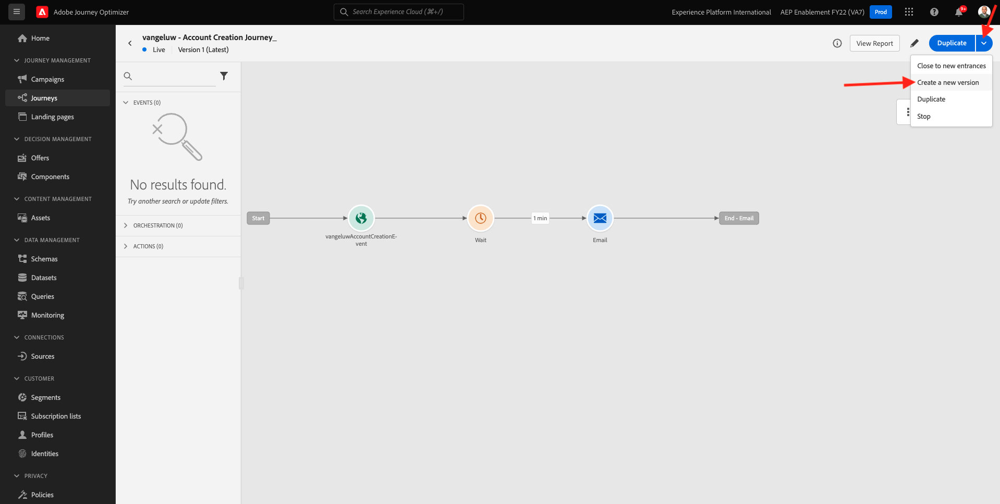

# 9.5 決定を電子メールで使用

この演習では、決定を使用して E メールと SMS の配信をパーソナライズします。

に移動します。 **ジャーニー**. 演習 7.2 で作成したジャーニーを見つけます。このジャーニーの名前はです。 `--demoProfileLdap-- - Account Creation Journey`. ジャーニーをクリックして開きます。

これが見えます クリック **新しいバージョンを作成**.

クリック **新しいバージョンを作成**.

次をクリック： **電子メール** 「 」アクションを選択し、「 」をクリックします。 **コンテンツを編集**.

メッセージダッシュボードが表示されます。 クリック **メールデザイナー**.

これが見えます

これが見えます 新しい **1:1 列** 構造コンポーネントをキャンバス上に配置します。

メニューで、に移動します。 **コンテンツコンポーネント**. を選択します。 **オファーの決定** コンポーネントを開き、指定されたように、e メールのコンテンツオファープレースホルダーにこのコンポーネントをドラッグ&amp;ドロップします。 次に、「 **追加**.

電子メールに含める配置のタイプを選択します。 内 **配置** ドロップダウンメニュー選択 **電子メール — 画像**、決定を選択します。 `--demoProfileLdap-- - Luma Decision`. 「**追加**」をクリックします。

これで、パーソナライズされたすべてのオファーと、E メールデザイナー内で視覚化されたフォールバックオファーが表示されます。 クリック  **コンテンツをシミュレート** ：実際の顧客プロファイルを使用して e メールメッセージをプレビューします。

まず、プレビューに使用するプロファイルを指定します。 を選択します。 **電子メール** 名前空間を作成し、デモ Web サイトで作成した顧客プロファイルの電子メールアドレスを入力します。 次に、「 **プレビュー**.

E メールが正しく表示されたら、 **閉じる** 」ボタンをクリックします。

最後に、「 **保存**.

次に、矢印をクリックして前の画面に戻ります。

これが見えます 左上隅の矢印をクリックして、ジャーニーに戻ります。

クリック **Ok** を閉じます。 **電子メール** アクション。

クリック **公開** 更新したジャーニーを公開する。

「 」をクリックして確定 **公開** 再び

これで、メッセージが公開されました。

デモ Web サイトで新しいアカウントを作成すると、次の電子メールが届きます。

この練習は終わりました。

次のステップ： [9.6 API を使用した決定のテスト](./ex6.md)

[モジュール 9 に戻る](./offer-decisioning.md)

[すべてのモジュールに戻る](./../../overview.md)
