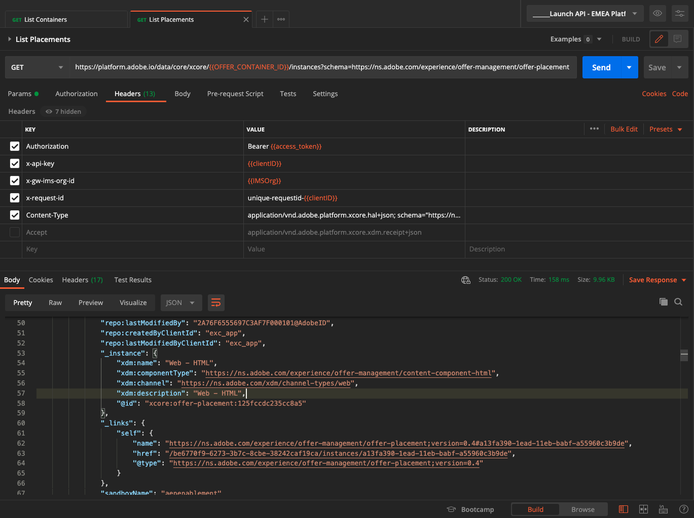
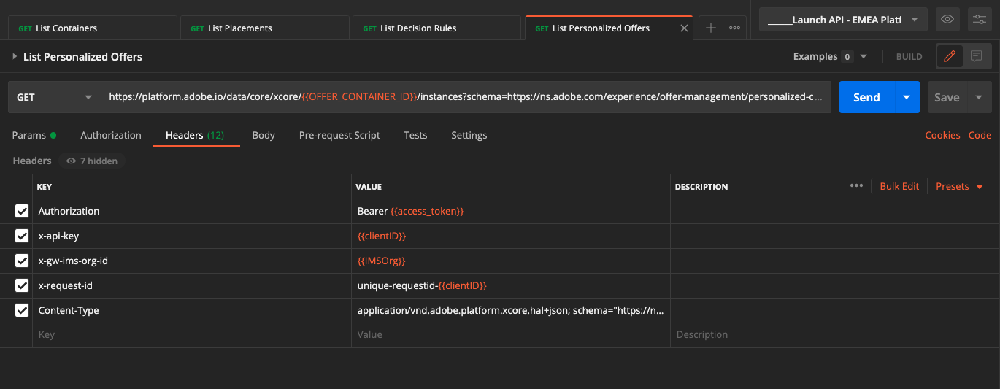
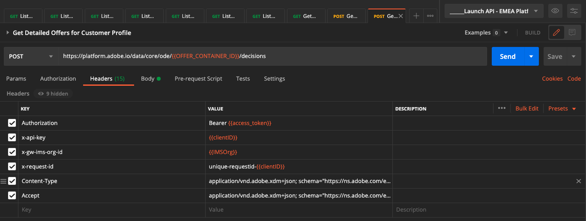

# 9.6 API を使用して決定をテストする

## 9.6.1 Postmanを使用したOffer decisioningAPI の操作

ダウンロード [このPostmanOffer decisioningコレクション](./../../assets/postman/postman_offer-decisioning.zip) をデスクトップに解凍します。 その後、次の情報が表示されます。

これで、このファイルがデスクトップに保存されました。

- [!UICONTROL _Module 14- Decisioning Service.postman_collection.json]

In [演習 3.3.3 -Adobe I/OへのPostman認証](./../../modules/module3/ex3.md) Postmanをインストールしました。 この演習では、Postmanを再度使用する必要があります。

Postmanを開きます。 「**[!UICONTROL Import]**」をクリックします。

クリック **[!UICONTROL ファイルをアップロード]**.

ファイルを選択 **[!UICONTROL _Module 14- Decisioning Service.postman_collection.json]** をクリックし、 **[!UICONTROL 開く]**.

その後、このコレクションをPostmanで利用できるようになります。

これで、API を使用してAdobe Experience Platformとの対話を開始するためにPostmanで必要なすべてが揃いました。

### 9.6.1.1 リストコンテナ

クリックしてリクエストを開きます **[!UICONTROL GET — コンテナリスト]**.

の下 **[!UICONTROL パラメーター]**&#x200B;次のように表示されます。

- プロパティ：`_instance.parentName==aepenablementfy22`

このパラメータでは、 **[!UICONTROL aepenablementfy22]** は、Adobe Experience Platformで使用されるサンドボックスの名前です。 使用する必要のあるサンドボックスは、です。 `--aepSandboxId--`. テキストを置換 **[!UICONTROL aepenablementfy22]** 作成者 `--aepSandboxId--`.

サンドボックス名を置き換えた後、 **[!UICONTROL 送信]**.

これは応答で、指定したサンドボックスのオファーコンテナを表示します。 をコピーしてください **[!UICONTROL container instanceId]** 以下に示すように、コンピューター上のテキストファイルに書き留めます。 これを使用する必要があります **[!UICONTROL container instanceId]** 次の練習のために！

### 9.6.1.2 リスト配置

クリックしてリクエストを開きます **[!UICONTROL GET — 配置のリスト]**. 「**[!UICONTROL 送信]**」をクリックします。

これで、オファーコンテナ内の使用可能な配置がすべて表示されます。 表示される配置は、で確認できるように、Adobe Experience Platform UI で定義されています [演習 9.1.3](./ex1.md).

### 9.6.1.3 リストの決定ルール

クリックしてリクエストを開きます **[!UICONTROL GET — 決定ルールのリスト]**. 「**[!UICONTROL 送信]**」をクリックします。

応答には、 Adobe Experience Platform UI で定義した決定ルールが表示されます。詳しくは、 [演習 9.1.4](./ex1.md).

### 9.6.1.4 パーソナライズされたオファーのリスト

クリックしてリクエストを開きます **[!UICONTROL GET — パーソナライズされたオファーのリスト]**. 「**[!UICONTROL 送信]**」をクリックします。

応答には、Adobe Experience Platform UI で定義したパーソナライズされたオファーが [演習 9.2.1](./ex2.md).

### 9.6.1.5 フォールバックオファーのリスト

クリックしてリクエストを開きます **[!UICONTROL GET — フォールバックオファーのリスト]**. 「**[!UICONTROL 送信]**」をクリックします。

応答には、 Adobe Experience Platform UI で定義したフォールバックオファーが [演習 9.2.2](./ex2.md).

### 9.6.1.6 リストコレクション

クリックしてリクエストを開きます **[!UICONTROL GET — コレクションのリスト]**.

応答には、定義したコレクションが、Adobe Experience Platform UI の [演習 9.2.3](./ex2.md).

### 9.6.1.7 顧客プロファイル向けの詳細なオファーの取得

クリックしてリクエストを開きます **[!UICONTROL POST — 顧客プロファイルの詳細なオファーを取得]**. このリクエストは前のリクエストに似ていますが、実際には画像 URL やテキストなどの詳細が返されます。

このリクエストの場合、前の演習と同様の要件を持つのと同様、 **[!UICONTROL xdm:placementId]** および **[!UICONTROL xdm:activityId]** ：顧客の特定のオファー詳細を取得します。

フィールド **[!UICONTROL xdm:activityId]** 入力する必要があります。 次に示すように、Adobe Experience Platform UI で取得できます。

フィールド **[!UICONTROL xdm:placementId]** 入力する必要があります。 次に示すように、Adobe Experience Platform UI で取得できます。 以下の例では、プレースメントの placementId を確認できます **[!UICONTROL Web — 画像]**.

に移動します。 **[!UICONTROL 本文]** オファーをリクエストする顧客のメールアドレスを入力します。 「**[!UICONTROL 送信]**」をクリックします。

最後に、パーソナライズされたオファーの種類と、この顧客に表示する必要のあるアセットの種類の結果が表示されます。

これで、この練習が完了しました。

次のステップ： [概要とメリット](./summary.md)

[モジュール 9 に戻る](./offer-decisioning.md)

[すべてのモジュールに戻る](./../../overview.md)
