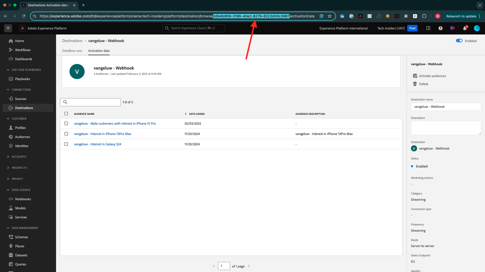
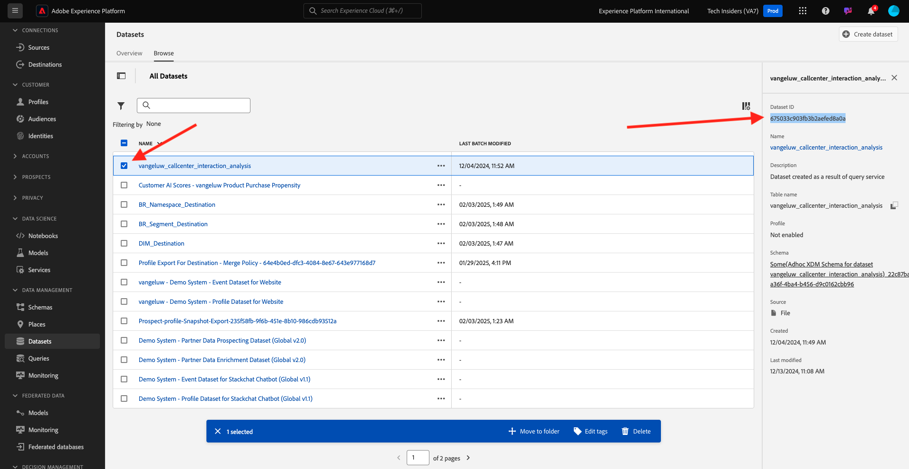

# 完了の測定方法

[https://certification.adobe.com/courses/1258](https://certification.adobe.com/courses/1258) に移動します。

モジュールを完了するには、完了証明書を提供する必要があります。

各モジュールで想定される完了証明書は次のとおりです。

## はじめに

モジュール **はじめに** の完了の見込み配達確認は、作成した web のデモシステムプロジェクトの ID です。

Web 形式のデモシステムプロジェクトの ID は `--aepUserLdap-- - QIMU` のようになります。

## 1.1 Adobe Experience Platform Data Collection と Web SDK拡張機能

モジュール **データ収集および Web SDK** の完了証明書として期待されるのは、Web のデータ収集プロパティの **環境 ID** です。

Web 形式のデータ収集プロパティの環境 ID は、`EN5211f7792b4442f8a45deb68f8902d3a` のようになります。

## 1.2 データ取り込み

モジュール **データ取り込み** の完了証明書として期待されるのは、データランディングゾーンのSource接続のデータフロー ID です。

データフロー ID は、**374c2c6d-f39a-4b0b-b568-40c41e6c4e8e** のようになります。

## 1.3 Federated Audience の構成

モジュール **Federated Audience Composition** の完了の見込み証明書は、作成した連合データモデルの ID です。

連合データモデルの ID は **DMO5110** のようになります。これは、次の画像に示す URL から取得できます。

## 2.1 リアルタイム顧客プロファイル

モジュール **リアルタイム顧客プロファイル** の完了証明書として期待されるのは、`--aepUserLdap-- - Male customers with interest in iPhone 15 Pro` の UI を使用して作成したオーディエンスの **オーディエンス ID** です。

オーディエンス ID は、**81a9acbe-12e6-424b-b658-abba3a435c83** のようになります。

## 2.2 インテリジェントサービス

モジュール **インテリジェントサービス** の完了証明書として期待されるのは、`--aepUserLdap-- - Customer AI High Propensity` の UI を使用して作成したオーディエンスの **オーディエンス ID** です。

オーディエンス ID は、**cb6db21d-8fa3-484a-93ac-25aa1ab48412** のようになります。

## 2.3 Real-Time CDP：オーディエンスを作成し、アクションを起こします。

モジュール **Real-Time CDPの完了に必要な証明書：オーディエンスを作成してアクションを実行します。** は **宛先SDK Webhook 宛先** の ID です。

Webhook 宛先の ID は、**b5b4b959-3166-40e2-8279-8223d00c3987** のように表示され、次の画像に示すように、URL から取得できます。

## 2.4 Real-Time CDP:Microsoft Azure Event Hub へのAudience Activation

モジュール **Real-Time CDP:Microsoft Azure Event Hub** へのAudience Activationの完了証明書として期待されるのは、Adobe Experience Platformの宛先 **Microsoft Azure Event Hub** の ID です。

次に示す URL に、**43cf85bc-3d01-49fd-80c9-a2913db45e3c** のような **Microsoft Azure Event Hub 宛先 ID** があります。

## 2.5 Real-Time CDP接続：イベント転送

モジュール **Real-Time CDP Connections: Event Forwarding** の完了証明書として期待されているのは、**Event Forwarding プロパティ ID** です。

次の画像に示すように、URL に **PRa18819171c1241dfb16d74a49993dd5b** のような **イベント転送プロパティ ID** があります。

## 2.6 Apache Kafka からReal-Time CDPへのデータのストリーミング

モジュール **Apache Kafka からReal-Time CDPにデータをストリーミングする** の完了証明書として期待される証明書は、ソースコネクタ `--aepUserLdap-- - Kafka` の ID です。

ID は **f843d50a-ee30-4ca8-a766-0e4f3d29a2f7** のようになります。この ID は、次の場所で確認できます。

## 3.1 Adobe Journey Optimizer：オーケストレーション

モジュール **Adobe Journey Optimizer：オーケストレーション** の完了証明書として期待されるのは、ジャーニーが作成された場合の ID です。

ジャーニー ID は **594fa01f-1a3b-450c-ba09-b7e3ff377c0f** のように表示され、次の画像に示すように URL から取得できます。

## 3.2 Adobe Journey Optimizer：外部データソースとカスタムアクション

モジュール **Adobe Journey Optimizer：外部データソースおよびカスタムアクションの完了証明書として期待されているものは** 作成したジャーニー ID です。

ジャーニー ID は次のようになります。**6962d3bc-4f44-4f9c-b326-83978f245f2a**。次の画像に示すように、URL から取得できます。

## 3.3 Adobe Journey Optimizer:Offer decisioning

モジュール **Adobe Journey Optimizer:Offer decisioning** の完了証明書として期待されているものは、作成した **Decision** の ID です。

**決定 ID** は次の **dps:offer-activity:1a08ba4b529b2fb2** のようになります。

## 3.4 Adobe Journey Optimizer：イベントベースのジャーニー

モジュール **Adobe Journey Optimizer：イベントベースのジャーニー** の完了証明書として期待されているものは、作成したジャーニーの ID です。

ジャーニー ID は次のようになります。**5f5efc7e-49f7-44c1-85df-b23482b38d32**。次の画像に示すように、URL から取得できます。

## 4.1 Customer Journey Analytics:Analysis Workspaceを使用したダッシュボードの構築

モジュール **Customer Journey Analytics: Analysis Workspaceを使用してダッシュボードを作成するの** 完了の見込み証明は、プロジェクト `--aepUserLdap-- - Omnichannel Analysis` の ID です。

形式は次のようになります。**677bcb247064db3c7de2a0e4**、プロジェクトを開くと、URL 内で見つけることができます。

## 4.2Customer Journey Analytics:BigQuery Source コネクタを使用したAdobe Experience PlatformでのGoogle Analyticsデータの取り込みと分析

モジュール **Customer Journey Analytics: BigQuery Source コネクタを使用してAdobe Experience PlatformでGoogle Analytics データを取り込み、分析する** の完了証明書として期待される証明書は、**BigQuery** ソース接続の ID です。

**BigQuery 接続 ID** は、次の **b63a810c-a8cc-4c6b-a57e-dcb7e3368cf8** のようになります。

## 5.1 クエリサービス

モジュール **クエリサービス** の完了証明書として期待されるのは、モジュールを完了した後に取得する `--aepUserLdap--_callcenter_interaction_analysis` - データセットのデータセット ID です。

ID は **675033c903fb3b2aefed8a0a** のようになります。

{width="50px" align="left"}

>[!NOTE]
>
>ご不明な点がある場合は、have suggestions on future content の一般的なフィードバックをお知らせください。**techinsiders@adobe.com** に電子メールを送信して、技術インサイダーに直接問い合わせてください。

[すべてのモジュールに戻る](./overview.md)