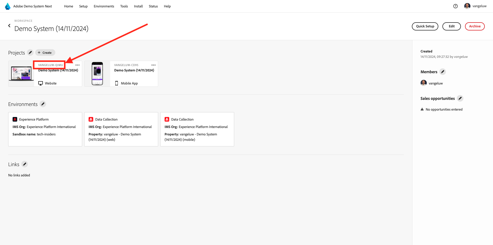

# 完了の測定方法

[https://certification.adobe.com](https://certification.adobe.com) に移動し、コース **XXX** に移動します。

モジュールを完了するには、完了証明書を提供する必要があります。

各モジュールで想定される完了証明書は次のとおりです。

## はじめに

モジュール **はじめに** の完了の見込み配達確認は、作成した web のデモシステムプロジェクトの ID です。

Web 形式のデモシステムプロジェクトの ID は `--demoProfileLdap-- - OCUC` のようになります。

## 1.1 Adobe Experience Platform Data Collection と Web SDK 拡張機能

モジュール **Data Collection &amp; Web SDK** で期待される完了証明書は、web のデータ収集プロパティの名前です。

Web 形式のデータ収集プロパティの名前は、`--demoProfileLdap-- - Demo System (05/02/2022) (enablement) 1644046719474` のようになります。

## 1.2 データ取り込み

モジュール **データ取り込み** の完了証明書として期待されるのは、作成した 2 つのデータセットのデータセット ID です。

データセット ID の形式は、**5f069724723ef41916a8b5d2** のようになります。

`--demoProfileLdap-- - Demo System - Event Dataset for Website`

`--demoProfileLdap-- - Demo System - Profile Dataset for Website`

## 1.3 Federated Audience の構成

モジュール **Federated Audience Composition** の完了証明書として期待されているものは次のとおりです。

## 2.1 リアルタイム顧客プロファイル

モジュール **リアルタイム顧客プロファイル** の完了証明書として期待されるのは、`--demoProfileLdap-- - Male customers with interest in Montana Wind Jacket` の UI を使用して作成したセグメントの **セグメント ID** です。

セグメント ID の形式は **8cb7034d-d4ae-4d26-a61f-a76559c12457** のようになります。

## 2.2 インテリジェントサービス

モジュール **インテリジェントサービス** の完了証明書として期待されるのは、**製品購入傾向の顧客 AI サービス** の ID です。

形式は次のようになります。**12729** そして、サービスを開いたときに、URL から取得できます。

## 2.3 Real-Time CDP：オーディエンスを作成し、アクションを起こします。

モジュール **Real-Time CDP** の完了証明書として期待されているものは、**Adobe Target アクティビティ** の ID です。

形式は次のようになります。**111804**

## 2.4 Real-Time CDP:Microsoft Azure Event Hub へのAudience Activation

モジュール **RTCDP: EventHub** の完了証明書として期待されているものは、Adobe Experience Platformの **Microsoft Azure Event Hub** 宛先の ID です。

**Microsoft Azure Event Hub 宛先 ID** は、次の **fa3f7ce5-86fd-4096-bf7c-e586fdc096ba** のようになります。

## 2.5 Real-Time CDP接続：イベント転送

モジュール **RTCDP Connections** の完了証明書として期待されているのは、**イベント転送プロパティ ID** です。

**イベント転送プロパティ ID** は次の **PR40f44184c888472e9c19d8d602aab0de** のようになります。

## 2.6 Apache Kafka からReal-Time CDPへのデータのストリーミング

モジュール **Apache Kafka** の完了証明書として期待されているものは、ソースコネクタ `--demoProfileLdap-- - Kafka` の ID です。

ID は **f843d50a-ee30-4ca8-a766-0e4f3d29a2f7** のようになります。この ID は、次の場所で確認できます。

## 3.1 Adobe Journey Optimizer：オーケストレーション

モジュール **AJO: オーケストレーション** の完了証明書として期待されているものは、`--demoProfileLdap--AccountCreationEvent` の eventID です。

形式は次のようになります。**227402c540eb8f8855c6b2333adf6d54d7153d9d7d56fa475a6866081c574736**

## 3.2 Adobe Journey Optimizer：外部データソースとカスタムアクション

モジュール **AJO: カスタムアクション** の完了証明書として期待されているものは、イベント `--demoProfileLdap--GeofenceEntry` の eventID です。

形式は次のようになります。**fa42ab7982ba55f039eacec24c1e32e5c51b310c67f0fa559ab49b89b63f4934**

## 3.3 Adobe Journey Optimizer:Offer decisioning

モジュール **AJO：オファー** の完了証明書として期待されるのは、作成した **オファー決定** の ID です。

**オファー決定 ID** は、次の **xcore:offer-activity:1122fcc4603ea499** のようになります。

## 3.4 Adobe Journey Optimizer：イベントベースのジャーニー

モジュール **AJO: Events** の完了証明書として期待されているものは、`--demoProfileLdap--StoreEntryEvent` の eventID です。

形式は次のようになります。**e3a8f0bdc0b609667cd96a72a6b1e5aafa0ddaf6ccf121c574e6a2030860a633**

## 4.1 Customer Journey Analytics:Analysis Workspaceを使用したダッシュボードの構築

モジュール **CJA** の完了証明書として期待されているものは、プロジェクト `--demoProfileLdap-- - Omnichannel Analysis` の ID です。

形式は次のようになります。**6217344f6249ac70c726db60**、プロジェクトを開くと、URL 内で見つけることができます。

## 4.2Customer Journey Analytics:BigQuery Source コネクタを使用したAdobe Experience PlatformでのGoogle Analyticsデータの取り込みと分析

モジュール **CJA:BigQuery** の完了証明書として期待されているものは、**BigQuery** 接続の ID です。

**BigQuery 接続 ID** は、次の **85a2394d-8b94-410c-a239-4d8b94b10c38** のようになります。

## 5.1 クエリサービス

モジュール **クエリサービス** の完了証明書として期待されるのは、モジュールを完了した後に取得する `--demoProfileLdap--_callcenter_interaction_analysis` - データセットのデータセット ID です。

形式は次のようになります。**62076f68f14a9d194995d4e2**

[すべてのモジュールに戻る](./overview.md)
