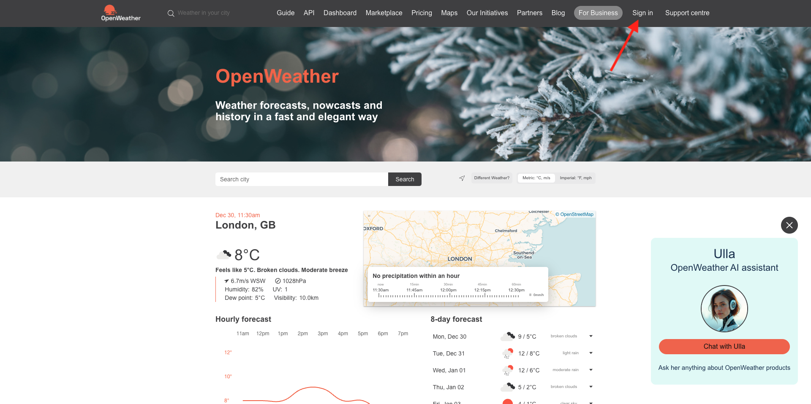
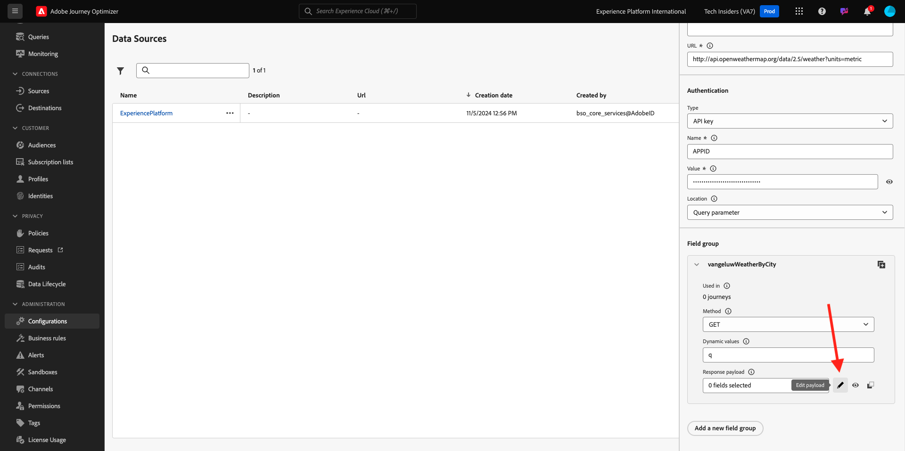
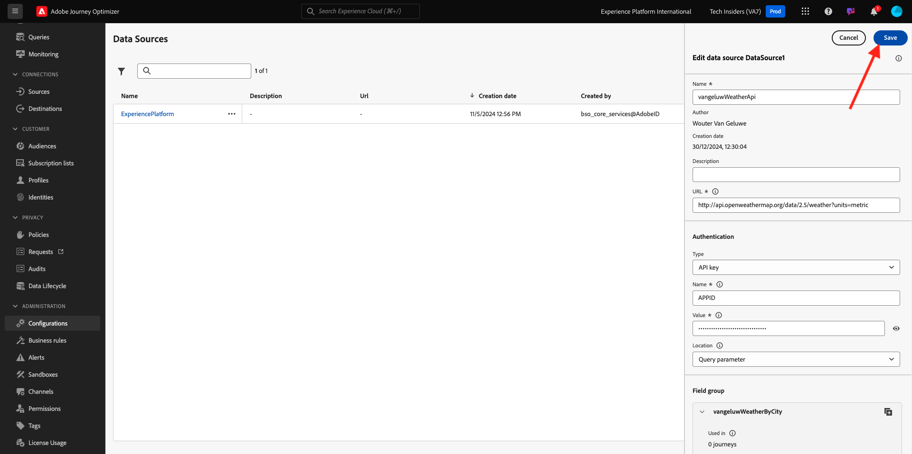

# 3.2.2 外部データソースの定義

この演習では、Adobe Journey Optimizerを使用してカスタムの外部データソースを作成します。

[Adobe Experience Cloud](https://experience.adobe.com) に移動して、Adobe Journey Optimizerにログインします。 **Journey Optimizer** をクリックします。


Journey Optimizerの **ホーム** ビューにリダイレクトされます。 最初に、正しいサンドボックスを使用していることを確認します。 使用するサンドボックスは `--aepSandboxName--` です。 その後、サンドボックス `--aepSandboxName--` ージの **ホーム** ビューに移動します。


左側のメニューで、下にスクロールして、**設定** をクリックします。 次に、「データソース **の下にある** 管理 **ボタンをクリック** ます。


**データソース** リストが表示されます。
「**データSourceを作成**」をクリックして、データソースの追加を開始します。


空のデータソースポップアップが表示されます。


この設定を開始する前に、**Open Weather Map** サービスのアカウントが必要です。 次の手順に従って、アカウントを作成し、API キーを取得します。

[https://openweathermap.org/](https://openweathermap.org/) に移動します。 ホームページで、「**ログイン**」をクリックします。



**アカウントを作成** をクリックします。


詳細を入力します。 **アカウントを作成** をクリックします。


その後、アカウントページにリダイレクトされます。


メニューで、**API キー** をクリックして、カスタム外部データソースを設定する必要がある API キーを取得します。


**API キー** は `b2c4c36b6bb59c3458d6686b05311dc3` のようになります。

**Current Weather** については、**API のドキュメント** を参照してください [&#x200B; こちら &#x200B;](https://openweathermap.org/current)。

このユースケースでは、**都市名による組み込み API リクエスト** を使用して、顧客の市区町村に基づく Open Weather Map との接続を実装します。


**Adobe Journey Optimizer** に戻り、空の **外部データSource** ポップアップに移動します。


データソースの名前として、`--aepUserLdap--WeatherApi` を使用します。

説明を `Access to the Open Weather Map` に設定します。

Open Weather Map API の URL は次のとおりです：**http://api.openweathermap.org/data/2.5/weather?units=metric**


次に、使用する認証を選択する必要があります。

次の変数を使用します。

| フィールド | 値 |
|:-----------------------:| :-----------------------|
| タイプ | **API キー** |
| 名前 | **APPID** |
| 値 | **API キー** |
| ロケーション | **クエリパラメーター** |


最後に、**FieldGroup** を定義する必要があります。これは、基本的に Weather API に送信するリクエストです。 ここでは、市区町村の名前を使用して、その市区町村の現在の天気をリクエストします。


Weather API のドキュメントによると、パラメーター `q=City` を送信する必要があります。


期待される API リクエストに一致させるために、次のようにフィールドグループを設定します。

>[!IMPORTANT]
>
>フィールドグループ名は一意である必要があります。次の命名規則を使用してください：`--aepUserLdap--WeatherByCity`


応答ペイロードには、Weather API から送信される応答の例を貼り付ける必要があります。

期待される API JSON 応答は、API ドキュメントページ [&#x200B; こちら &#x200B;](https://openweathermap.org/current)、「**JSON**」件名の下にあります。


または、ここから JSON 応答をコピーできます。

```json
{
   "coord": {
      "lon": 7.367,
      "lat": 45.133
   },
   "weather": [
      {
         "id": 501,
         "main": "Rain",
         "description": "moderate rain",
         "icon": "10d"
      }
   ],
   "base": "stations",
   "main": {
      "temp": 284.2,
      "feels_like": 282.93,
      "temp_min": 283.06,
      "temp_max": 286.82,
      "pressure": 1021,
      "humidity": 60,
      "sea_level": 1021,
      "grnd_level": 910
   },
   "visibility": 10000,
   "wind": {
      "speed": 4.09,
      "deg": 121,
      "gust": 3.47
   },
   "rain": {
      "1h": 2.73
   },
   "clouds": {
      "all": 83
   },
   "dt": 1726660758,
   "sys": {
      "type": 1,
      "id": 6736,
      "country": "IT",
      "sunrise": 1726636384,
      "sunset": 1726680975
   },
   "timezone": 7200,
   "id": 3165523,
   "name": "Province of Turin",
   "cod": 200
}    
```

上記の JSON 応答をクリップボードにコピーし、カスタムデータソース設定画面に移動します。

**ペイロードを編集** アイコンをクリックします。



上記の JSON 応答を貼り付ける必要があるポップアップが表示されます。


JSON 応答を貼り付けると、これが表示されます。 「**保存**」をクリックします。


これで、カスタムデータソース設定が完了しました。 上にスクロールして、「**保存**」をクリックします。



これでデータソースが正常に作成され、**データソース** リストに含まれています。


次の手順：[3.2.3 カスタムアクションの定義 &#x200B;](./ex3.md)

[モジュール 3.2 に戻る](journey-orchestration-external-weather-api-sms.md)

[すべてのモジュールに戻る](../../../overview.md)
