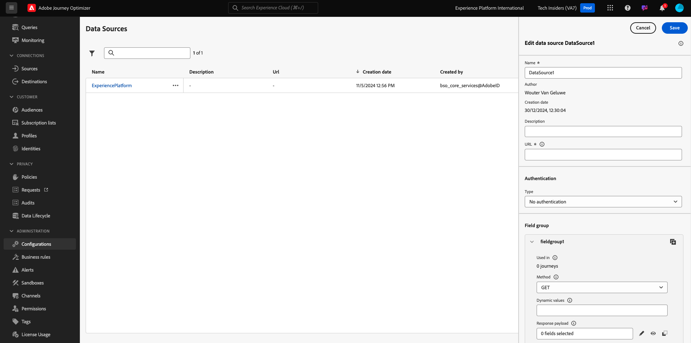
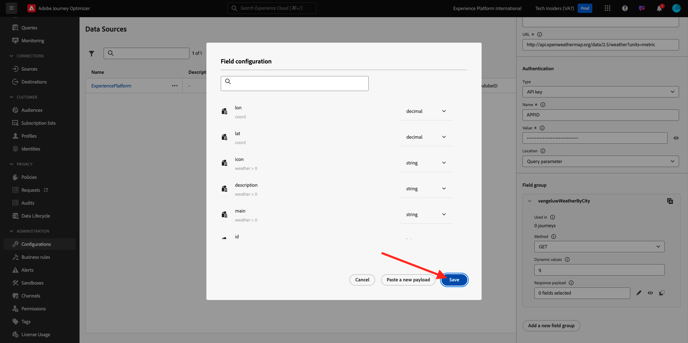

# 3.2.2 外部データソースの定義

この演習では、Adobe Journey Optimizerを使用してカスタムの外部データソースを作成します。

[Adobe Experience Cloud](https://experience.adobe.com) に移動して、Adobe Journey Optimizerにログインします。 **Journey Optimizer** をクリックします。


Journey Optimizerの **ホーム** ビューにリダイレクトされます。 最初に、正しいサンドボックスを使用していることを確認します。 使用するサンドボックスは `--aepSandboxId--` です。 サンドボックスを切り替えるには、「**実稼動製品（VA7）」をクリックし** リストからサンドボックスを選択します。 この例では、サンドボックスの名前は **AEP イネーブルメント FY22** です。 その後、サンドボックス `--aepSandboxId--` ージの **ホーム** ビューに移動します。


左側のメニューで、下にスクロールして、**設定** をクリックします。 次に、「データソース **の下にある** 管理 **ボタンをクリック** ます。


**データソース** リストが表示されます。
「**データSourceを作成**」をクリックして、データソースの追加を開始します。


空のデータソースポップアップが表示されます。



この設定を開始する前に、**Open Weather Map** サービスのアカウントが必要です。 次の手順に従って、アカウントを作成し、API キーを取得します。

[https://openweathermap.org/](https://openweathermap.org/) に移動します。 ホームページで、「**ログイン**」をクリックします。


**アカウントを作成** をクリックします。


詳細を入力します。


**アカウントを作成** をクリックします。


その後、アカウントページにリダイレクトされます。


メニューで、**API キー** をクリックして、カスタム外部データソースを設定する必要がある API キーを取得します。


**API キー** は `b2c4c36b6bb59c3458d6686b05311dc3` のようになります。

**Current Weather** については、**API のドキュメント** を参照してください [ こちら ](https://openweathermap.org/current)。

このユースケースでは、顧客の市区町村に基づいて Open Weather Map との接続を実装します。


**Adobe Journey Optimizer** に戻り、空の **外部データSource** ポップアップに移動します。


データソースの名前として、`--demoProfileLdap--WeatherApi` を使用します。 この例では、データソース名は `vangeluwWeatherApi ` です。

説明を `Access to the Open Weather Map` に設定します。

Open Weather Map API の URL は次のとおりです：**http://api.openweathermap.org/data/2.5/weather?units=metric**


次に、使用する認証を選択する必要があります。

次の変数を使用します。

| フィールド | 値 |
|:-----------------------:| :-----------------------|
| タイプ | **API キー** |
| 名前 | **APPID** |
| 値 | **API キー** |
| ロケーション | **クエリパラメーター** |


最後に、**FieldGroup** を定義する必要があります。これは、基本的に Weather API に送信するリクエストです。 ここでは、市区町村の名前を使用して、その市区町村の現在の天気をリクエストします。


Weather API ドキュメントによると、パラメーター `q=City` を送信する必要があります。


期待される API リクエストに一致させるために、次のようにフィールドグループを設定します。

>[!IMPORTANT]
>
>フィールドグループ名は一意である必要があります。次の命名規則を使用してください：`--demoProfileLdap--WeatherByCity` この場合、名前は `vangeluwWeatherByCity` にする必要があります


応答ペイロードには、Weather API から送信される応答の例を貼り付ける必要があります。

期待される API JSON 応答は、API ドキュメントページ [ こちら ](https://openweathermap.org/current) で確認できます。


または、ここから JSON 応答をコピーできます。

```json
{"coord": { "lon": 139,"lat": 35},
  "weather": [
    {
      "id": 800,
      "main": "Clear",
      "description": "clear sky",
      "icon": "01n"
    }
  ],
  "base": "stations",
  "main": {
    "temp": 281.52,
    "feels_like": 278.99,
    "temp_min": 280.15,
    "temp_max": 283.71,
    "pressure": 1016,
    "humidity": 93
  },
  "wind": {
    "speed": 0.47,
    "deg": 107.538
  },
  "clouds": {
    "all": 2
  },
  "dt": 1560350192,
  "sys": {
    "type": 3,
    "id": 2019346,
    "message": 0.0065,
    "country": "JP",
    "sunrise": 1560281377,
    "sunset": 1560333478
  },
  "timezone": 32400,
  "id": 1851632,
  "name": "Shuzenji",
  "cod": 200
}
```

上記の JSON 応答をクリップボードにコピーし、カスタムデータソース設定画面に移動します。

**ペイロードを編集** アイコンをクリックします。


上記の JSON 応答を貼り付ける必要があるポップアップが表示されます。


JSON 応答を貼り付けると、これが表示されます。 「**保存**」をクリックします。



これで、カスタムデータソース設定が完了しました。 上にスクロールして、「**保存**」をクリックします。


これでデータソースが正常に作成され、**データソース** リストに含まれています。


次の手順：[3.2.3 カスタムアクションの定義 ](./ex3.md)

[モジュール 3.2 に戻る](journey-orchestration-external-weather-api-sms.md)

[すべてのモジュールに戻る](../../../overview.md)
