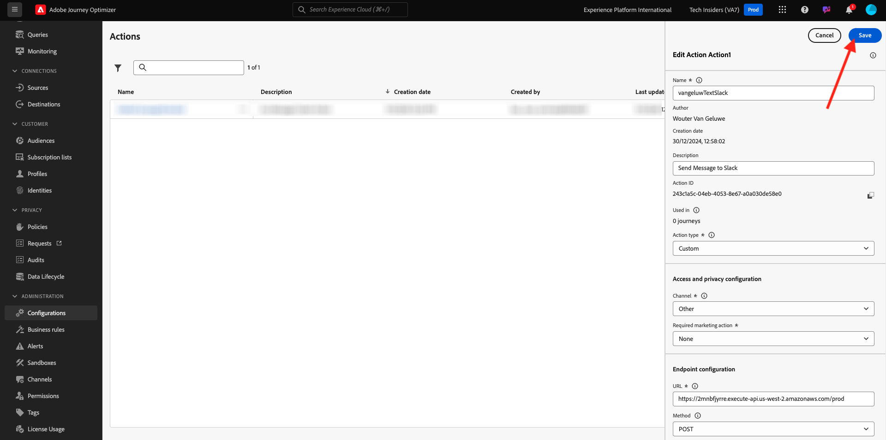

# 3.2.3 カスタムアクションの定義

この演習では、Adobe Journey Optimizerを組み合わせて使用することで、2 つのカスタムアクションを作成します。

[Adobe Experience Cloud](https://experience.adobe.com) に移動して、Adobe Journey Optimizerにログインします。 **Journey Optimizer** をクリックします。


Journey Optimizerの **ホーム** ビューにリダイレクトされます。 最初に、正しいサンドボックスを使用していることを確認します。 使用するサンドボックスは `--aepSandboxId--` です。 サンドボックスを切り替えるには、「**実稼動製品（VA7）」をクリックし** リストからサンドボックスを選択します。 この例では、サンドボックスの名前は **AEP イネーブルメント FY22** です。 その後、サンドボックス `--aepSandboxId--` ージの **ホーム** ビューに移動します。


左側のメニューで、下にスクロールして、**設定** をクリックします。 次に、「アクション **の下にある** 管理 **ボタンをクリック** ます。


**アクション** リストが表示されます。


Slackチャンネルにテキストを送信するアクションを 1 つ定義します。

## 3.2.3.1 アクション：Slackチャンネルにテキストを送る

次に、既存のSlackチャンネルを使用し、そのSlackチャンネルにメッセージを送信します。 Slackには使いやすい API があり、Adobe Journey Optimizerを使用して API をトリガーします。


「**アクションを作成**」をクリックして、新しいアクションの追加を開始します。


空のアクションポップアップが表示されます。


アクションの名前として、`--demoProfileLdap--TextSlack` を使用します。 この例では、アクション名は `vangeluwTextSlack` です。

説明を `Send Text to Slack` に設定します。


**URL 設定** には、次を使用します。

- URL: `https://2mnbfjyrre.execute-api.us-west-2.amazonaws.com/prod`
- メソッド：**POST**

>[!NOTE]
>
>上記の URL は、AWSの Lambda 関数を参照しています。この関数は、上記のようにリクエストをSlackチャネルに転送します。 これは、Adobeが所有するSlackチャネルへのアクセスを保護するために行われます。 独自のSlackチャネルがある場合、[https://api.slack.com/](https://api.slack.com/) を通じてSlackアプリを作成し、そのSlackアプリで受信 Webhook を作成し、上記の URL を受信 Webhook の URL に置き換える必要があります。

ヘッダーフィールドを変更する必要はありません。


**認証** は、[ 認証なし **に設定する必要があ** ます。


**アクションパラメーター** については、Slackに送信するフィールドを定義する必要があります。 論理的には、Adobe Journey OptimizerとAdobe Experience Platformをパーソナライズの頭脳として使用したいので、Slackに送信するテキストはAdobe Journey Optimizerで定義した後、Slackに送信して実行する必要があります。

そのため、**アクションパラメーター** については、**ペイロードを編集** アイコンをクリックします。


すると、空のポップアップウィンドウが表示されます。


以下のテキストをコピーして、空のポップアップウィンドウに貼り付けます。

```json
{
 "text": {
  "toBeMapped": true,
  "dataType": "string",
  "label": "textToSlack"
 }
}
```

参考：以下のフィールドを指定すると、これらのフィールドにカスタマージャーニーからアクセスできるようになり、ジャーニーから動的に入力できるようになります。

**&quot;toBeMapped&quot;:true,**

**&quot;dataType&quot;: &quot;string&quot;,**

**&quot;label&quot;: &quot;textToSlack&quot;**

次の画面が表示されます。


「**保存**」をクリックします。


上にスクロールして、もう一度 **保存** をクリックして、カスタムアクションを保存します。



カスタムアクションは、**アクション** リストの一部になりました。


イベント、外部データソースおよびアクションを定義しました。 次に、これらすべてを 1 つのジャーニーに統合します。

次の手順：[3.2.4 ジャーニーとメッセージを作成する ](./ex4.md)

[モジュール 8 に戻る](journey-orchestration-external-weather-api-sms.md)

[すべてのモジュールに戻る](../../../overview.md)
