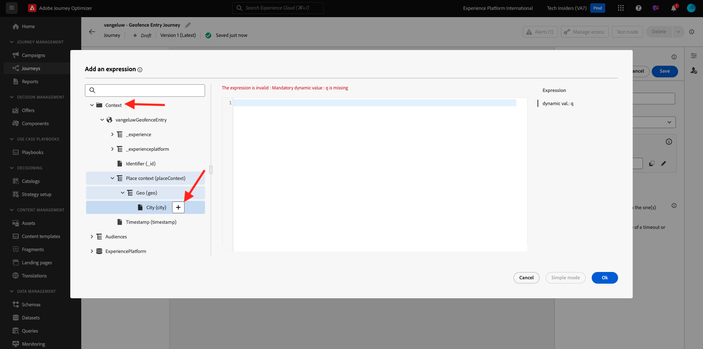
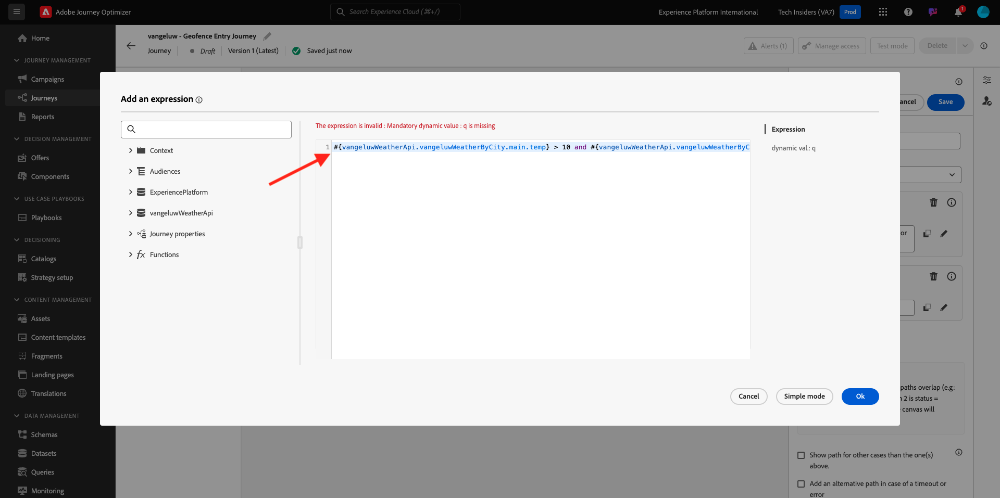
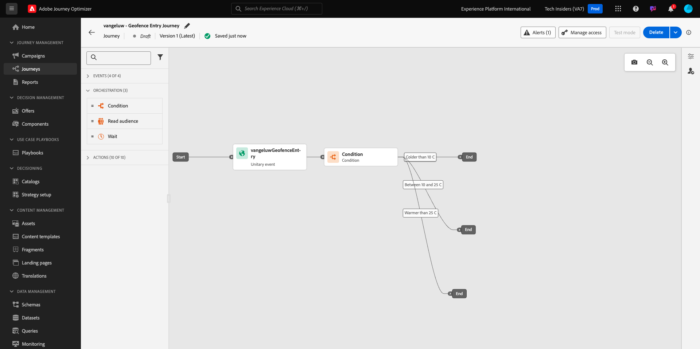
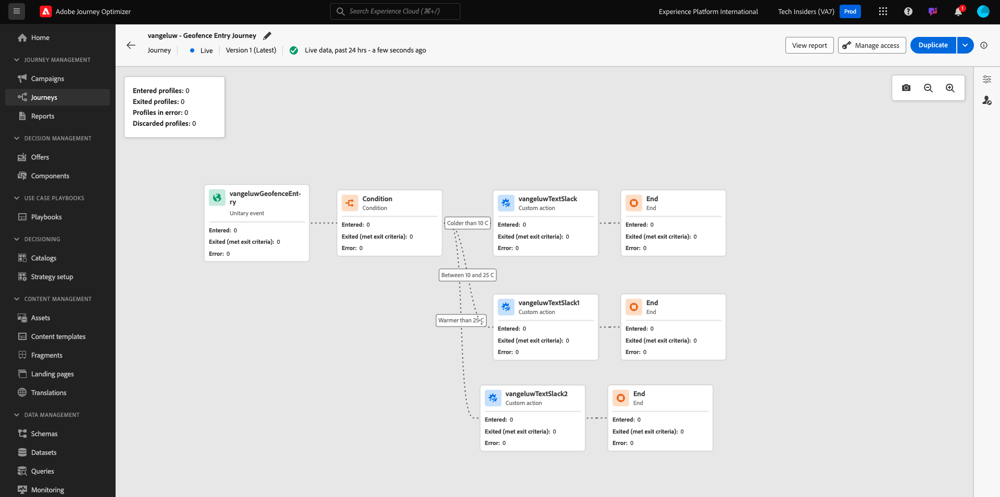

# 3.2.4 ジャーニーとメッセージの作成

この演習では、Adobe Journey Optimizerを使用して、ジャーニーを作成し、複数のテキストメッセージを作成します。

このユースケースでは、顧客の場所の気象条件に基づいて様々な SMS メッセージを送信することが目標です。 次の 3 つのシナリオが定義されています。

- 摂氏 10 度より寒い
- 摂氏 10～25 度
- 摂氏 25 度より暖かい

これらの 3 つの条件の場合、Adobe Journey Optimizerで 3 つの SMS メッセージを定義する必要があります。

## 3.2.4.1 ジャーニーの作成

[Adobe Experience Cloud](https://experience.adobe.com) に移動して、Adobe Journey Optimizerにログインします。 **Journey Optimizer** をクリックします。


Journey Optimizerの **ホーム** ビューにリダイレクトされます。 最初に、正しいサンドボックスを使用していることを確認します。 使用するサンドボックスは `--aepSandboxId--` です。 サンドボックスを切り替えるには、「**実稼動製品（VA7）」をクリックし** リストからサンドボックスを選択します。 この例では、サンドボックスの名前は **AEP イネーブルメント FY22** です。 その後、サンドボックス `--aepSandboxId--` ージの **ホーム** ビューに移動します。


左側のメニューで、**ジャーニーに移動し** 「ジャーニーを作成 **」をクリックして**&#x200B;ジャーニーの作成を開始します。


まず、ジャーニーに名前を付ける必要があります。

ジャーニーの名前として、`--demoProfileLdap-- - Geofence Entry Journey` を使用します。 この例では、ジャーニー名は `vangeluw - Geofence Entry Journey` です。 現時点では、他の値を設定する必要はありません。 「**OK**」をクリックします。


画面の左側で、**イベント** を確認します。 以前に作成したイベントがそのリストに表示されます。 選択して、ジャーニーキャンバスにドラッグ&amp;ドロップします。 ジャーニーは次のようになります。 「**OK**」をクリックします。


次に、「**オーケストレーション**」をクリックします。 使用可能な **オーケストレーション** 機能が表示されます。 **条件** を選択し、ジャーニーキャンバスにドラッグ&amp;ドロップします。


次の 3 つの条件を定義する必要があります。

- 気温はセ氏 10 度より寒いです
- 気温はセ氏 10 度から 25 度の間です
- 気温は摂氏 25 度を超えています

最初の条件を定義します。

### 状態 1：摂氏 10 度より寒い

**条件** をクリックします。  **Path1** をクリックし、パスの名前を **10 C より寒い** に編集します。 Path1 の式の **編集** アイコンをクリックします。


すると、空の **シンプルなエディター** 画面が表示されます。 クエリはもう少し高度なので、**詳細設定モード** が必要です。 **詳細設定モード** をクリックします。


次に、コードを入力できる **詳細エディター** が表示されます。


以下のコードを選択して、**詳細エディター** に貼り付けます。

`#{--demoProfileLdap--WeatherApi.--demoProfileLdap--WeatherByCity.main.temp} <= 10`

その後、これが表示されます。


この条件の一部として気温を取得するには、顧客が現在いる市区町村を指定する必要があります。
**市区町村** は、以前に Open Weather API ドキュメントで見たように、動的パラメーター `q` にリンクする必要があります。

スクリーンショットに示されているフィールド **dynamic val: q** をクリックします。


次に、利用可能なデータソースの 1 つで、顧客の現在の市区町村を含むフィールドを見つける必要があります。



`--demoProfileLdap--GeofenceEntry.placeContext.geo.city` に移動すると、フィールドを見つけることができます。

そのフィールドをクリックすると、パラメーター `q` の動的な値として追加されます。 このフィールドには、例えばモバイルアプリに実装した geolocation-service が入力されます。 ここでは、デモ Web サイトの Admin Console を使用してこれをシミュレートします。 「**OK**」をクリックします。


### 条件 2：摂氏 10～25 度

最初の条件を追加すると、この画面が表示されます。 **パスを追加** をクリックします。


**Path1** をダブルクリックし、パス名を **10～25 C** に編集します。 このパスの式の **編集** アイコンをクリックします。


すると、空の **シンプルなエディター** 画面が表示されます。 クエリはもう少し高度なので、**詳細設定モード** が必要です。 **詳細設定モード** をクリックします。


次に、コードを入力できる **詳細エディター** が表示されます。


以下のコードを選択して、**詳細エディター** に貼り付けます。

`#{--demoProfileLdap--WeatherApi.--demoProfileLdap--WeatherByCity.main.temp} > 10 and #{--demoProfileLdap--WeatherApi.--demoProfileLdap--WeatherByCity.main.temp} <= 25`

その後、これが表示されます。



この条件の一部として気温を取得するには、顧客が現在いる市区町村を指定する必要があります。
**City** は、以前に Open Weather API ドキュメントで見たように、動的パラメーター **q** にリンクする必要があります。

スクリーンショットに示されているフィールド **dynamic val: q** をクリックします。


次に、利用可能なデータソースの 1 つで、顧客の現在の市区町村を含むフィールドを見つける必要があります。


`--demoProfileLdap--GeofenceEntry.placeContext.geo.city` に移動すると、フィールドを見つけることができます。 そのフィールドをクリックすると、パラメーター **q** の動的な値として追加されます。 このフィールドには、例えばモバイルアプリに実装した geolocation-service が入力されます。 ここでは、デモ Web サイトの Admin Console を使用してこれをシミュレートします。 「**OK**」をクリックします。


次に、3 番目の条件を追加します。

### 状態 3：摂氏 25 度より暖かい

2 番目の条件を追加すると、この画面が表示されます。 **パスを追加** をクリックします。


Path1 をダブルクリックして、名前を **25 C より暖かい** に変更します。
次に、このパスの式の **編集** アイコンをクリックします。


すると、空の **シンプルなエディター** 画面が表示されます。 クエリはもう少し高度なので、**詳細設定モード** が必要です。 **詳細設定モード** をクリックします。


次に、コードを入力できる **詳細エディター** が表示されます。


以下のコードを選択して、**詳細エディター** に貼り付けます。

`#{--demoProfileLdap--WeatherApi.--demoProfileLdap--WeatherByCity.main.temp} > 25`

その後、これが表示されます。


この条件の一部として気温を取得するには、顧客が現在いる市区町村を指定する必要があります。
**City** は、以前に Open Weather API ドキュメントで見たように、動的パラメーター **q** にリンクする必要があります。

スクリーンショットに示されているフィールド **dynamic val: q** をクリックします。


次に、利用可能なデータソースの 1 つで、顧客の現在の市区町村を含むフィールドを見つける必要があります。


```--demoProfileLdap--GeofenceEntry.placeContext.geo.city``` に移動すると、フィールドを見つけることができます。 そのフィールドをクリックすると、パラメーター **q** の動的な値として追加されます。 このフィールドには、例えばモバイルアプリに実装した geolocation-service が入力されます。 ここでは、デモ Web サイトの Admin Console を使用してこれをシミュレートします。 「**OK**」をクリックします。


これで、3 つのパスが設定されました。 「**OK**」をクリックします。


これは学習目的のジャーニーなので、マーケターがメッセージを配信するために必要な様々なオプションを紹介するために、いくつかのアクションを設定します。

## 3.2.4.2 パスのメッセージを送信：摂氏 10 度より寒い

温度コンテキストごとに、お客様にテキストメッセージを送信しようとします。 顧客が使用できる携帯電話番号がある場合にのみテキストメッセージを送信できるので、まず確認する必要があります。

**10°C より寒い** に焦点を当てましょう。



別の **条件** 要素を使用して、以下のスクリーンショットに示すようにドラッグします。 この顧客の携帯電話番号が使用可能かどうかを確認します。


これは一例に過ぎず、顧客の携帯電話番号が使用可能な場合にのみオプションを設定します。 **モバイルありますか？** というラベルを追加します。

**Path1** パスの式の **編集** アイコンをクリックします。


左側に示したデータソースで、「**ExperiencePlatform.ProfileFieldGroup.profile.mobilePhone.number**」に移動します。 これで、Adobe Experience Platformのリアルタイム顧客プロファイルから携帯電話番号を直接読み取れるようになりました。


フィールド **数値** を選択し、条件キャンバスにドラッグ&amp;ドロップします。

演算子 **空でない** を選択します。 「**OK**」をクリックします。


その後、これが表示されます。 もう一度 **OK** をクリックします。


ジャーニーは次のようになります。 スクリーンショットに示されているように、**アクション** をクリックします。


アクション **SMS** を選択し、追加した条件の後にドラッグ&amp;ドロップします。


**カテゴリ** を **マーケティング** に設定し、SMS を送信できる SMS サーフェスを選択します。 この場合、選択するメールサーフェスは **SMS** です。


次の手順では、メッセージを作成します。 それには、「**コンテンツを編集** をクリックします。


メッセージダッシュボードが表示され、SMS のテキストを設定できます。 **メッセージを作成** エリアをクリックして、メッセージを作成します。


次のテキストを入力します：`Brrrr... {{profile.person.name.firstName}}, it's freezing. 20% discount on jackets today!`。 「**保存**」をクリックします。


その後、これが表示されます。 左上隅の矢印をクリックして、ジャーニーに戻ります。


その後、ここに戻ります。 「**OK**」をクリックします。


左側のメニューで、「**アクション**」に戻り、「アクション」 `--demoProfileLdap--TextSlack` プションを選択して、「**メッセージ**」アクションの後にドラッグ&amp;ドロップします。


**アクションパラメーター** に移動し、パラメーター `TEXTTOSLACK` の **編集** アイコンをクリックします。


ポップアップウィンドウで、「**詳細設定モード**」をクリックします。


以下のコードを選択し、コピーして **詳細モードエディター** に貼り付けます。 「**OK**」をクリックします。

`"Brrrr..." + #{ExperiencePlatform.ProfileFieldGroup.profile.person.name.firstName} + " It's freezing. 20% discount on Jackets today!"`


完了したアクションが表示されます。 「**OK**」をクリックします。


これで、ジャーニーのこのパスの準備が整いました。

## 3.2.4.3 パスのメッセージを送信：摂氏 10～25 度

温度コンテキストごとに、お客様にテキストメッセージを送信しようとします。 顧客が使用できる携帯電話番号がある場合にのみテキストメッセージを送信できるので、まず確認する必要があります。

**10～25°C** のパスに焦点を当ててみましょう。


別の **条件** 要素を使用して、以下のスクリーンショットに示すようにドラッグします。 この顧客の携帯電話番号が使用可能かどうかを確認します。


これは一例に過ぎず、顧客の携帯電話番号が使用可能な場合にのみオプションを設定します。 **モバイルありますか？** というラベルを追加します。

**Path1** パスの式の **編集** アイコンをクリックします。


左側に示したデータソースで、「**ExperiencePlatform.ProfileFieldGroup.profile.mobilePhone.number**」に移動します。 これで、Adobe Experience Platformのリアルタイム顧客プロファイルから携帯電話番号を直接読み取れるようになりました。


フィールド **数値** を選択し、条件キャンバスにドラッグ&amp;ドロップします。

演算子 **空でない** を選択します。 「**OK**」をクリックします。


その後、これが表示されます。 「**OK**」をクリックします。


ジャーニーは次のようになります。 スクリーンショットに示されているように、**アクション** をクリックします。


アクション **SMS** を選択し、追加した条件の後にドラッグ&amp;ドロップします。


**カテゴリ** を **マーケティング** に設定し、SMS を送信できる SMS サーフェスを選択します。 この場合、選択するメールサーフェスは **SMS** です。


次の手順では、メッセージを作成します。 それには、「**コンテンツを編集** をクリックします。


メッセージダッシュボードが表示され、SMS のテキストを設定できます。 **メッセージを作成** エリアをクリックして、メッセージを作成します。


次のテキストを入力します：`What a nice weather for the time of year, {{profile.person.name.firstName}} - 20% discount on Sweaters today!`。 「**保存**」をクリックします。


その後、これが表示されます。 左上隅の矢印をクリックして、ジャーニーに戻ります。


完了したアクションが表示されます。 「**OK**」をクリックします。


左側のメニューで、「**アクション**」に戻り、「アクション」 `--demoProfileLdap--TextSlack` プションを選択して、「**メッセージ**」アクションの後にドラッグ&amp;ドロップします。


**アクションパラメーター** に移動し、パラメーター `TEXTTOSLACK` の **編集** アイコンをクリックします。


ポップアップウィンドウで、「**詳細設定モード**」をクリックします。


以下のコードを選択し、コピーして **詳細モードエディター** に貼り付けます。 「**OK**」をクリックします。

`"What nice weather for the time of year, " + #{ExperiencePlatform.ProfileFieldGroup.profile.person.name.firstName} + " 20% discount on Sweaters today!"`


完了したアクションが表示されます。 「**OK**」をクリックします。


これで、ジャーニーのこのパスの準備が整いました。

## 3.2.4.4 パスのメッセージを送信：摂氏 25 度より高い

温度コンテキストごとに、お客様にテキストメッセージを送信しようとします。 顧客が使用できる携帯電話番号がある場合にのみテキストメッセージを送信できるので、まず確認する必要があります。

**25°C よりも暖かい** パスに焦点を当てましょう。


別の **条件** 要素を使用して、以下のスクリーンショットに示すようにドラッグします。 この顧客の携帯電話番号が使用可能かどうかを確認します。


これは一例に過ぎず、顧客の携帯電話番号が使用可能な場合にのみオプションを設定します。 **モバイルありますか？** というラベルを追加します。

**Path1** パスの式の **編集** アイコンをクリックします。


左側に示したデータソースで、「**ExperiencePlatform.ProfileFieldGroup.profile.mobilePhone.number**」に移動します。 これで、Adobe Experience Platformのリアルタイム顧客プロファイルから携帯電話番号を直接読み取れるようになりました。


フィールド **数値** を選択し、条件キャンバスにドラッグ&amp;ドロップします。

演算子 **空でない** を選択します。 「**OK**」をクリックします。


その後、これが表示されます。 「**OK**」をクリックします。


ジャーニーは次のようになります。 スクリーンショットに示されているように、**アクション** をクリックします。


アクション **SMS** を選択し、追加した条件の後にドラッグ&amp;ドロップします。


**カテゴリ** を **マーケティング** に設定し、SMS を送信できる SMS サーフェスを選択します。 この場合、選択するメールサーフェスは **SMS** です。


次の手順では、メッセージを作成します。 それには、「**コンテンツを編集** をクリックします。


メッセージダッシュボードが表示され、SMS のテキストを設定できます。 **メッセージを作成** エリアをクリックして、メッセージを作成します。


次のテキストを入力します：`So warm, {{profile.person.name.firstName}}! 20% discount on swimwear today!`。 「**保存**」をクリックします。


その後、これが表示されます。 左上隅の矢印をクリックして、ジャーニーに戻ります。


完了したアクションが表示されます。 「**OK**」をクリックします。


左側のメニューで、「**アクション**」に戻り、「アクション」 `--demoProfileLdap--TextSlack` プションを選択して、「**メッセージ**」アクションの後にドラッグ&amp;ドロップします。


**アクションパラメーター** に移動し、パラメーター `TEXTTOSLACK` の **編集** アイコンをクリックします。


ポップアップウィンドウで、「**詳細設定モード**」をクリックします。


以下のコードを選択し、コピーして **詳細モードエディター** に貼り付けます。 「**OK**」をクリックします。

`"So warm, " + #{ExperiencePlatform.ProfileFieldGroup.profile.person.name.firstName} + "! 20% discount on swimwear today!"`


完了したアクションが表示されます。 「**OK**」をクリックします。


これで、ジャーニーのこのパスの準備が整いました。

## 3.2.4.5 Publishのジャーニー

これで、ジャーニーが完全に設定されました。 「**公開**」をクリックします。


もう一度 **0}Publish} をクリックします。**


これで、ジャーニーが公開されました。



次の手順：[3.2.5 ジャーニーをトリガーにする ](./ex5.md)

[モジュール 3.2 に戻る](journey-orchestration-external-weather-api-sms.md)

[すべてのモジュールに戻る](../../../overview.md)
