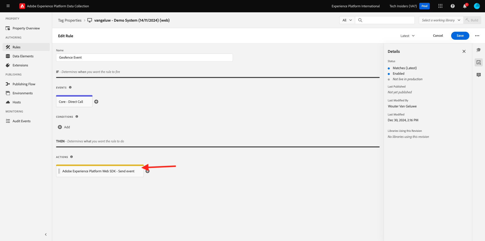
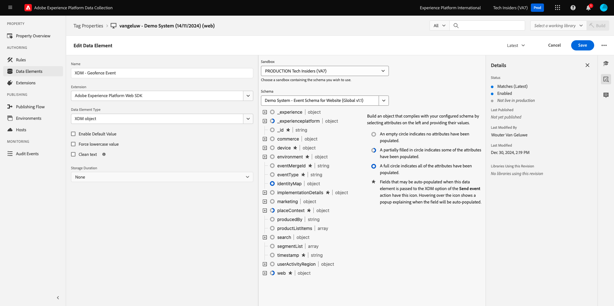
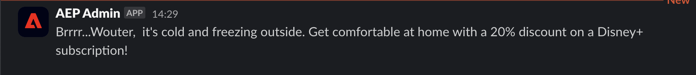

# 3.2.5 ジャーニーのトリガー

この演習では、このモジュールで設定したジャーニーをテストし、トリガーします。

## 3.2.5.1 ジオフェンスイベント設定の更新

[Adobe Experience Platform Data Collection に移動し ](https://experience.adobe.com/launch/) 「**Tags**」を選択します。

これは、以前に表示したAdobe Experience Platform データ収集のプロパティページです。

モジュール 0 で、デモシステムは 2 つのクライアントプロパティを作成しました。1 つは Web サイト用、もう 1 つはモバイルアプリ用です。 **[!UICONTROL 検索]** ボックスで `--aepUserLdap--` を検索して見つけます。 クリックして **Web** プロパティを開きます。

その後、これが表示されます。

左側のメニューで、**ルール** に移動し、ルール **ジオフェンスイベント** を検索します。 ルール **ジオフェンスイベント** をクリックして開きます。

このルールの詳細が表示されます。 クリックしてアクション **「ジオフェンスイベントを AEP に送信」 – トリガー JO** を開きます。

次に、このアクションがトリガーされると、特定のデータ要素を使用して XDM データ構造が定義されます。 そのデータ要素を更新し、**演習 8.1** で設定したイベントの [ イベント ID](./ex1.md) を定義する必要があります。

ここで、データ要素 **XDM - ジオフェンスイベント** を更新する必要があります。 これを行うには、**データ要素** に移動します。 **XDM - ジオフェンスイベント** を検索し、クリックしてデータ要素を開きます。

次の画面が表示されます。

フィールド `_experience.campaign.orchestration.eventID` に移動します。 現在の値を削除し、eventID をそこに貼り付けます。

イベント ID はAdobe Journey Optimizerの **設定/イベント** にあり、イベント ID はイベントのサンプルペイロードに次のように表示されます。`"eventID": "fa42ab7982ba55f039eacec24c1e32e5c51b310c67f0fa559ab49b89b63f4934"`

次に、このデータ要素で都市を定義する必要があります。 **placeContext/地域/市区町村** に移動し、任意の市区町村を入力します。 次に、「**保存**」または **ライブラリに保存** をクリックします。

最後に、変更を公開する必要があります。 左メニューの **公開フロー** に移動します。

「**変更されたリソースをすべて追加**」をクリックし、「**開発用に保存およびビルド**」をクリックします。

## 3.2.5.2 ジャーニーのトリガー

[https://builder.adobedemo.com/projects](https://builder.adobedemo.com/projects) に移動します。 Adobe IDでログインすると、このが表示されます。 Web サイトプロジェクトをクリックして開きます。

その後、デモ Web サイトが開きます。 URL を選択してクリップボードにコピーします。

新しい匿名ブラウザーウィンドウを開きます。

前の手順でコピーしたデモ Web サイトの URL を貼り付けます。 その後、Adobe IDを使用してログインするように求められます。

アカウントタイプを選択し、ログインプロセスを完了します。

次に、匿名ブラウザーウィンドウに web サイトが読み込まれます。 デモごとに、新しい匿名ブラウザーウィンドウを使用して、デモ Web サイトの URL を読み込む必要があります。

画面の左上隅にあるAdobeロゴアイコンをクリックして、プロファイルビューアを開きます。

現在は不明なこの顧客のプライマリ ID として **0} ユーザー ID} を持つプロファイルビューアパネルとリアルタイムExperience Cloudプロファイルをご覧ください。**

登録/ログインページに移動します。 **アカウントを作成** をクリックします。

詳細を入力して **登録** をクリックすると、前のページにリダイレクトされます。

プロファイルビューアパネルを開き、リアルタイム顧客プロファイルに移動します。 プロファイルビューアパネルには、新しく追加されたメール識別子や電話識別子など、すべての個人データが表示されます。

[ プロファイル ビューア ] パネルで、[**ユーティリティ**] をクリックします。 `geofenceevent` と入力し、「**送信**」をクリックします。

数秒後、Adobe Journey Optimizerから SMS が届きます。

次の手順：[ 概要とメリット ](./summary.md)

[モジュール 3.2 に戻る](journey-orchestration-external-weather-api-sms.md)

[すべてのモジュールに戻る](../../../overview.md)
