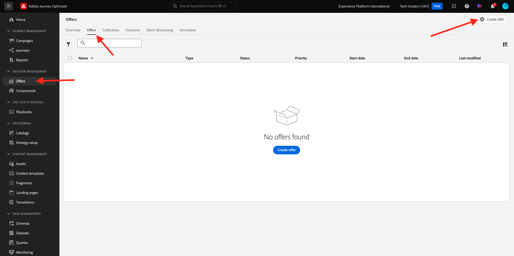
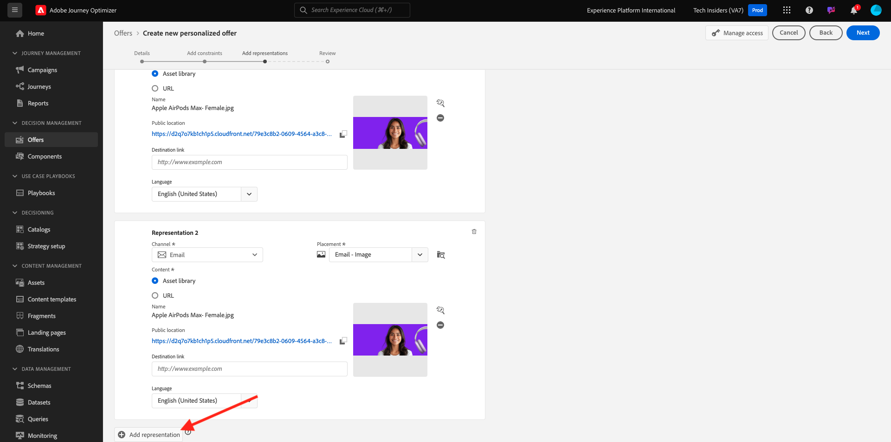
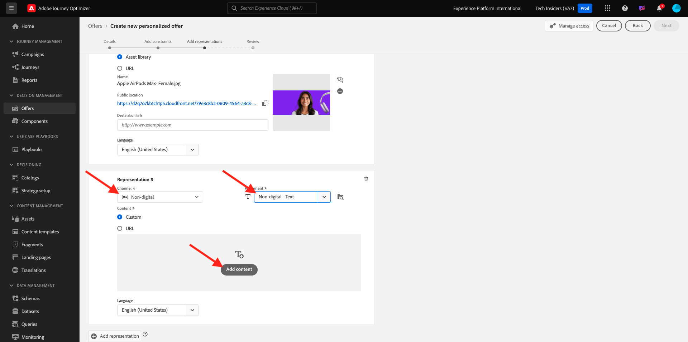
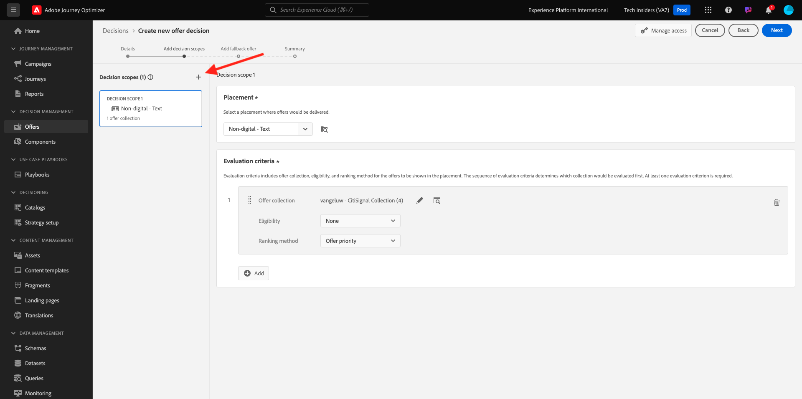

# 3.3.2 オファーと決定の設定

## 3.3.2.1 パーソナライズされたオファーの作成

この演習では、4 つの **パーソナライズされたオファー** を作成します。 これらのオファーを作成する際に考慮する詳細を次に示します。

| 名前 | 日付範囲 | メールの画像リンク | Web の画像リンク | テキスト | 優先度 | 実施要件 | 言語 |
|-----|------------|----------------------|--------------------|------|:--------:|--------------|:-------:|
| `--aepUserLdap-- - Nadia Elements Shell` | 今日 – 1 か月後 | https://bit.ly/3nPiwdZ | https://bit.ly/2INwXjt | `{{ profile.person.name.firstName }}, 10% discount on Nadia Elements Shell` | 25 | all – 女性のお客様 | 英語（米国） |
| `--aepUserLdap-- - Radiant Tee` | 今日 – 1 か月後 | https://bit.ly/2HfA17v | https://bit.ly/3pEIdzn | `{{ profile.person.name.firstName }}, 5% discount on Radiant Tee` | 15 | all – 女性のお客様 | 英語（米国） |
| `--aepUserLdap-- - Zeppelin Yoga Pant` | 今日 – 1 か月後 | https://bit.ly/2IOaItW | https://bit.ly/2INZHZd | `{{ profile.person.name.firstName }}, 10% discount on Zeppelin Yoga Pant` | 25 | all – 男性の顧客 | 英語（米国） |
| `--aepUserLdap-- - Proteus Fitness Jackshirt` | 今日 – 1 か月後 | https://bit.ly/330a43n | https://bit.ly/36USaQW | `{{ profile.person.name.firstName }}, 5% discount on Proteus Fitness Jackshirt` | 15 | all – 男性の顧客 | 英語（米国） |

{style="table-layout:auto"}

[Adobe Experience Cloud](https://experience.adobe.com) に移動して、Adobe Journey Optimizerにログインします。 **Journey Optimizer** をクリックします。

Journey Optimizerの **ホーム** ビューにリダイレクトされます。 最初に、正しいサンドボックスを使用していることを確認します。 使用するサンドボックスは `--aepSandboxName--` です。 サンドボックスを切り替えるには、「**実稼動製品（VA7）」をクリックし** リストからサンドボックスを選択します。 この例では、サンドボックスの名前は **AEP イネーブルメント FY22** です。 その後、サンドボックス `--aepSandboxName--` ージの **ホーム** ビューに移動します。

左側のメニューで **オファー** をクリックし、**オファー** に移動します。 「**+ オファーを作成**」をクリックします。

このポップアップが表示されます。 「**パーソナライズされたオファー**」を選択し、「**次へ**」をクリックします。

**詳細** ビューを開きます。

この場合、オファー `--aepUserLdap-- - Nadia Elements Shell` を設定する必要があります。 上記のテーブルの情報を使用して、フィールドに入力します。 この例では、パーソナライズされたオファーの名前は **vangeluw - Nadia Elements Shell** です。 また、**開始日時** を昨日に、**終了日時** を今後 1 か月の日付に設定します。

完了したら、次のようになります。 「**次へ**」をクリックします。

ここで、**表示域** を作成する必要があります。 表示域は、**プレースメント** と実際のアセットの組み合わせです。

**表示域 1** について、次を選択します。

- チャネル : Web
- プレースメント : Web – 画像
- コンテンツ : URL
- 公開場所：前述の表の列 **Web の画像リンク** から URL をコピーします

または、コンテンツの **アセットライブラリ** を選択し、「**参照** をクリックすることもできます。

次に、Assets ライブラリのポップアップが表示されるので、**enablement-assets** フォルダーで画像ファイル **nadia-web.png** を選択します。 次に、「**選択**」をクリックします。

次の画面が表示されます。

「**+表示域を追加**」をクリックします。

**表示域 2** について、次を選択します。

- チャネル：メール
- プレースメント : メール – 画像
- コンテンツ : URL
- 公開場所：上記の表の列 **メールの画像リンク** から URL をコピーします

または、コンテンツの **アセットライブラリ** を選択し、「**参照** をクリックすることもできます。

次に、Assets ライブラリのポップアップが表示されるので、**enablement-assets** フォルダーに移動して、画像ファイル **nadia-email.png** を選択します。 次に、「**選択**」をクリックします。

次の画面が表示されます。

次に、「**+表示域を追加**」をクリックします。

**表示域 3** について、次を選択します。

- チャネル：非デジタル
- プレースメント：非デジタル – テキスト

次に、コンテンツを追加する必要があります。 この場合、コールトゥアクションとして使用するテキストを追加することを意味します。

**コンテンツを追加** をクリックします。

このポップアップが表示されます。

**カスタムテキスト** を選択し、次のフィールドに入力します。

上記のテーブルの **テキスト** フィールドを見て、ここにテキストを入力します。この場合は、「`{{ profile.person.name.firstName }}, 10% discount on Nadia Elements Shell`」とします。

また、任意のプロファイル属性を選択し、オファーテキストの動的フィールドとして含めることもできます。 この例では、「`{{ profile.person.name.firstName }}`」フィールドにより、このオファーを受け取る顧客の名がオファーテキストに確実に含まれます。

その後、これが表示されます。 「**保存**」をクリックします。

あなたはこれを手に入れました。 「**次へ**」をクリックします。

次の画面が表示されます。

**定義済みの決定ルール別** を選択し、「**+**」アイコンをクリックしてルール **すべて – 女性顧客** を追加します。

その後、これが表示されます。 上記の表に示すように、**優先度** を入力します。 「**次へ**」をクリックします。

次に、新しい **パーソナライズされたオファー** の概要が表示されます。

最後に、「**保存して承認**」をクリックします。

次に、新しく作成したパーソナライズされたオファーがオファーの概要で使用できるようになります。

ここで、上記の手順を繰り返して、Radiant Tee、Zeppelin Yoga Pant、Proteus Fitness Jackshirt という製品の 3 つの他のパーソナライズされたオファーを作成する必要があります。

完了すると、**パーソナライズされたオファー** の **オファーの概要** 画面にすべてのオファーが表示されます。

## 3.3.2.2 フォールバックオファーの作成

4 つのパーソナライズされたオファーを作成したら、**フォールバックオファー** を設定する必要があります。

**オファー** 表示になっていることを確認します。

「**+ オファーを作成**」をクリックします。

このポップアップが表示されます。 **フォールバックオファー** を選択し、「**次へ**」をクリックします。

次の画面が表示されます。

フォールバックオファーの名前を入力：`--aepUserLdap-- - Luma Fallback Offer`。 「**次へ**」をクリックします。

ここで、**表示域** を作成する必要があります。 表示域は、**プレースメント** と実際のアセットの組み合わせです。

**表示域 1** について、次を選択します。

- チャネル : Web
- プレースメント : Web – 画像
- コンテンツ : URL
- 公開場所：`https://bit.ly/3nBOt9h`

または、コンテンツの **アセットライブラリ** を選択し、「**参照** をクリックすることもできます。

次に、Assets ライブラリのポップアップが表示されます。**enablement-assets** フォルダーに移動して、画像ファイル **spriteyogastroaps-web.png** を選択します。 次に、「**選択**」をクリックします。

次の画面が表示されます。

**表示域 2** について、次を選択します。

- チャネル：メール
- プレースメント : メール – 画像
- コンテンツ : URL
- 公開場所：`https://bit.ly/3nF4qvE`

または、コンテンツの **アセットライブラリ** を選択し、「**参照** をクリックすることもできます。

次に、Assets ライブラリのポップアップが表示されます。**enablement-assets** フォルダーに移動して、画像ファイル **spriteyogastaps-email.png** を選択します。 次に、「**選択**」をクリックします。

次の画面が表示されます。

次に、「**+表示域を追加**」をクリックします。

**表示域 3** について、次を選択します。

- チャネル：非デジタル
- プレースメント：非デジタル – テキスト

次に、コンテンツを追加する必要があります。 この場合、画像リンクを追加します。

**コンテンツを追加** をクリックします。

このポップアップが表示されます。

**カスタムテキスト** を選択し、次のフィールドに入力します。

テキスト `{{ profile.person.name.firstName }}, discover our Sprite Yoga Straps!` を入力し、「保存 **をクリック** ます。

その後、これが表示されます。 「**次へ**」をクリックします。

次に、新しい **フォールバックオファー** の概要が表示されます。 「**完了**」をクリックします。

最後に、「**保存して承認**」をクリックします。

**オファーの概要** 画面に、次の情報が表示されます。

## 3.3.2.3 コレクションの作成

コレクションを使用して、パーソナライズされたオファーリストからオファーのサブセットを **フィルター** 除外し、それを決定の一部として使用して、決定プロセスを高速化します。

**コレクション** に移動します。 「**+ コレクションを作成**」をクリックします。

このポップアップが表示されます。 このようにコレクションを設定します。 「**次へ**」をクリックします。

- コレクション名：使用 `--aepUserLdap-- - Luma Collection`
- **静的コレクションを作成** を選択します。

次の画面で、前の演習で作成した 4 つの **パーソナライズされたオファー** を選択します。 「**保存**」をクリックします。

次の項目が表示されます。

## 3.3.2.4 決定の作成

決定は、プレースメント、パーソナライズされたオファーのコレクション、フォールバックオファーを組み合わせ、最終的にOffer decisioningエンジンで使用し、優先度、実施要件の制約、合計/ユーザーキャッピングなど、個々のパーソナライズされたオファーの特性に基づいて、特定のプロファイルに最適なオファーを見つけます。

**決定** を設定するには、**決定** に移動します。 「**+ アクティビティを作成**」をクリックします。

次の画面が表示されます。

このようなフィールドに入力します。 「**次へ**」をクリックします。

- 名前：`--aepUserLdap-- - Luma Decision`
- 開始日時：昨日
- 終了日時：今日+ 1 か月

次の画面では、決定範囲にプレースメントを追加する必要があります。 プレースメント **web – 画像**、**メール – 画像**、**非デジタル – テキスト** の決定範囲を作成する必要があります。

まず、ドロップダウンでプレースメントを選択して、**非デジタル – テキスト** の決定範囲を作成します。 次に、「**追加** ボタンをクリックして、評価条件を追加します。

コレクション `--aepUserLdap-- - Luma Collection` を選択し、「**追加**」をクリックします。

その後、これが表示されます。 **-** ボタンをクリックして、新しい決定範囲を追加します。

プレースメント **Web – 画像** を選択し、評価条件の下にコレクション `--aepUserLdap-- - Luma Collection` を追加します。 次に、「**+**」ボタンを再度クリックして、新しい決定範囲を追加します。

プレースメント **メール – 画像** を選択し、評価条件の下でコレクション `--aepUserLdap-- - Luma Collection` を追加します。 次に、「**次へ**」をクリックします。

次に、`--aepUserLdap-- - Luma Fallback Offer` という名前の **フォールバックオファー** を選択する必要があります。 「**次へ**」をクリックします。

決定をレビューします。 「**完了**」をクリックします。

ポップアップで、「保存して有効化 **をクリックし** す。

最後に、概要に決定が表示されます。

これで、決定が正常に設定されました。 これで決定が実稼働し、最適化され、パーソナライズされたオファーをリアルタイムで顧客に提供できるようになります。

次の手順：[3.3.3 データ収集クライアントプロパティと Web SDK 設定を準備してOffer decisioningする ](./ex3.md)

[モジュール 3.3 に戻る](./offer-decisioning.md)

[すべてのモジュールに戻る](./../../../overview.md)
