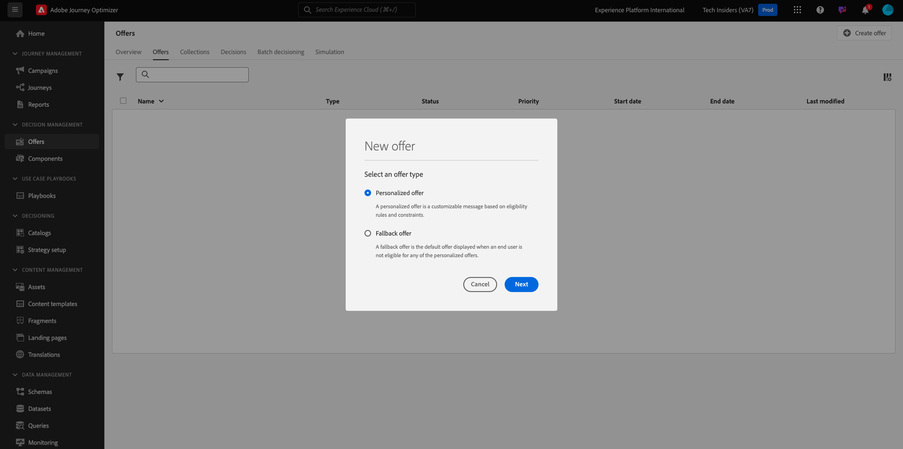
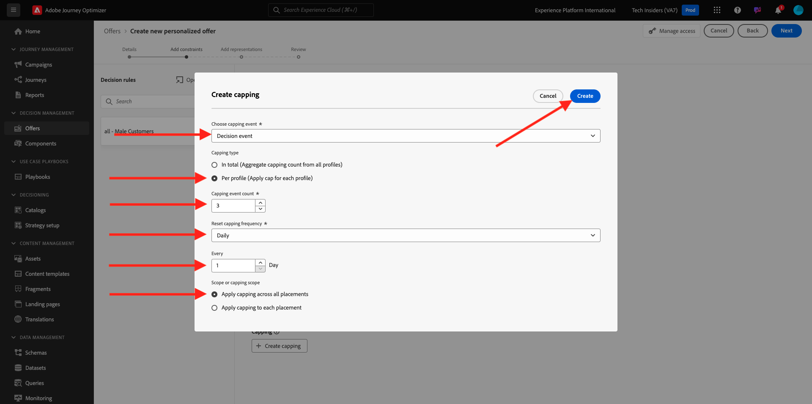
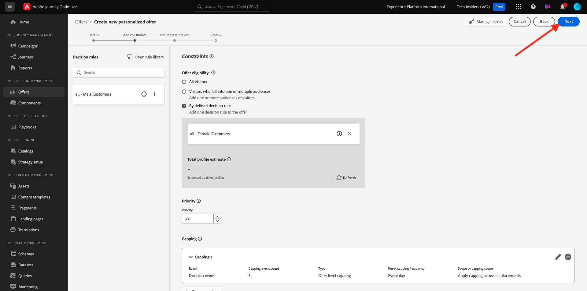
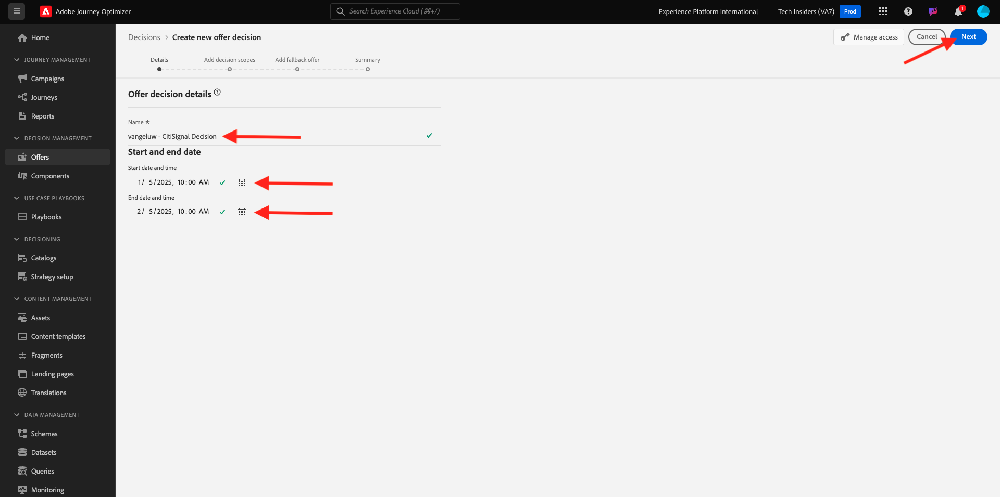
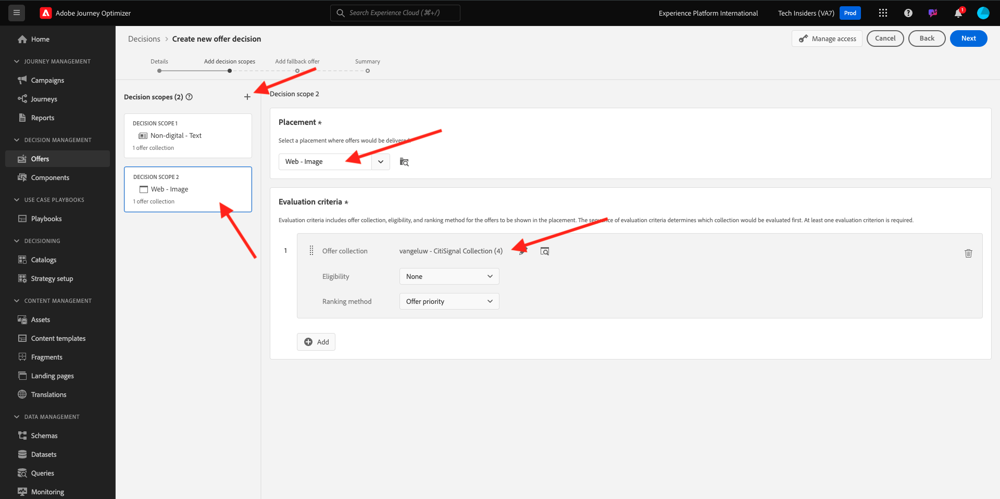

# 3.3.2 オファーと決定の設定

## 3.3.2.1 パーソナライズされたオファーの作成

この演習では、4 つの **パーソナライズされたオファー** を作成します。 これらのオファーを作成する際に考慮する詳細を次に示します。

| 名前 | 日付範囲 | メールの画像リンク | Web の画像リンク | テキスト | 優先度 | 実施要件 | 言語 | キャッピング頻度 | 画像名 |
|-----|------------|----------------------|--------------------|------|:--------:|--------------|:-------:|:-------:|:-------:|
| `--aepUserLdap-- - AirPods Max` | 今日 – 1 か月後 | https://bit.ly/4a9RJ5d | Assets ライブラリから選択 | `{{ profile.person.name.firstName }}, 10% discount on AirPods Max` | 25 | all – 女性のお客様 | 英語（米国） | 3 | Apple AirPods Max- Female.jpg |
| `--aepUserLdap-- - Galaxy S24` | 今日 – 1 か月後 | https://bit.ly/3W8yuDv | Assets ライブラリから選択 | `{{ profile.person.name.firstName }}, 5% discount on Galaxy S24` | 15 | all – 女性のお客様 | 英語（米国） | 3 | Galaxy S24 - Female.jpg |
| `--aepUserLdap-- - Apple Watch` | 今日 – 1 か月後 | https://bit.ly/4fGwfxX | https://bit.ly/4fGwfxX | `{{ profile.person.name.firstName }}, 10% discount on Apple Watch` | 25 | all – 男性の顧客 | 英語（米国） | 3 | Apple ウォッチ - Male.jpg |
| `--aepUserLdap-- - Galaxy Watch 7` | 今日 – 1 か月後 | https://bit.ly/4gTrkeo | Assets ライブラリから選択 | `{{ profile.person.name.firstName }}, 5% discount on Galaxy Watch 7` | 15 | all – 男性の顧客 | 英語（米国） | 3 | Galaxy Watch7 - Male.jpg |

{style="table-layout:auto"}

[Adobe Experience Cloud](https://experience.adobe.com) に移動して、Adobe Journey Optimizerにログインします。 **Journey Optimizer** をクリックします。

Journey Optimizerの **ホーム** ビューにリダイレクトされます。 最初に、正しいサンドボックスを使用していることを確認します。 使用するサンドボックスは `--aepSandboxName--` です。 その後、サンドボックス `--aepSandboxName--` ージの **ホーム** ビューに移動します。

左側のメニューで **オファー** をクリックし、**オファー** に移動します。 「**+ オファーを作成**」をクリックします。

このポップアップが表示されます。 「**パーソナライズされたオファー**」を選択し、「**次へ**」をクリックします。

**詳細** ビューを開きます。

この場合、オファー `--aepUserLdap-- - AirPods Max` を設定する必要があります。 上記のテーブルの情報を使用して、フィールドに入力します。 この例では、パーソナライズされたオファーの名前は **vangeluw - AirPods Max** です。 また、**開始日時** を今日に設定し、**終了日時** を今後 1 か月の日付に設定します。

完了したら、次のようになります。 「**次へ**」をクリックします。

次の画面が表示されます。

**定義済みの決定ルール別** を選択し、「**+**」アイコンをクリックしてルール **すべて – 女性顧客** を追加します。

上記の表に示すように、**優先度** を入力します。 次に、「**+ キャッピングを作成」をクリックして** このオファーを顧客に表示できる回数を定義します。

キャッピングの場合は、次のオプションを選択します。

- **キャッピングイベントを選択**:**決定イベント**
- **キャッピングタイプ**:**プロファイルあたり（各プロファイルにキャップを適用）**
- **キャッピングイベント数**:**3**
- **キャッピング頻度のリセット**: **毎日**
- **ごと**: **1 日**

これにより、このオファーが 1 人の顧客について 1 日に 3 回以上表示されなくなります。

「**作成**」をクリックします。

その後、ここに戻ります。 「**次へ**」をクリックします。

ここで、**表示域** を作成する必要があります。 表示域は、**プレースメント** と実際のアセットの組み合わせです。

**表示域 1** について、次を選択します。

- チャネル : Web
- プレースメント : Web – 画像
- コンテンツ : URL
- 公開場所：前述の表の列 **Web の画像リンク** から URL をコピーします

または、コンテンツの **アセットライブラリ** を選択し、「**参照** をクリックすることもできます。

次に、Assets ライブラリのポップアップが表示されます。**enablement-assets** フォルダーに移動して、画像ファイル **Apple AirPods Max - Female.jpg** を選択します。 次に、「**選択**」をクリックします。

その後、これが表示されます。 「**+表示域を追加**」をクリックします。

**表示域 2** について、次を選択します。

- チャネル：メール
- プレースメント : メール – 画像
- コンテンツ : URL
- 公開場所：**アセットライブラリ** を選択します。 **参照** をクリックします

次に、Assets ライブラリのポップアップが表示されます。**enablement-assets** フォルダーに移動して、画像ファイル **Apple AirPods Max - Female.jpg** を選択します。 次に、「**選択**」をクリックします。

その後、これが表示されます。 次に、「**+表示域を追加**」をクリックします。

**表示域 3** について、次を選択します。

- チャネル：非デジタル
- プレースメント：非デジタル – テキスト

次に、コンテンツを追加する必要があります。 この場合、コールトゥアクションとして使用するテキストを追加することを意味します。

**カスタム** を選択し、「**コンテンツを追加**」をクリックします。

このポップアップが表示されます。

上記のテーブルの **テキスト** フィールドを見て、ここにテキストを入力します。この場合は、「`{{ profile.person.name.firstName }}, 10% discount on AirPods Max`」とします。

また、任意のプロファイル属性を選択し、オファーテキストの動的フィールドとして含めることもできます。 この例では、「`{{ profile.person.name.firstName }}`」フィールドにより、このオファーを受け取る顧客の名がオファーテキストに確実に含まれます。

その後、これが表示されます。 「**保存**」をクリックします。

あなたはこれを手に入れました。 「**次へ**」をクリックします。

次に、新しい **パーソナライズされたオファー** の概要が表示されます。 「**完了**」をクリックします。

**保存して承認** をクリックします。

次に、新しく作成したパーソナライズされたオファーがオファーの概要で使用できるようになります。

ここで、上記の手順を繰り返して、上記の表にある製品の他の 3 つのパーソナライズされたオファーを作成します。

完了すると、**パーソナライズされたオファー** の **オファーの概要** 画面にすべてのオファーが表示されます。

## 3.3.2.2 フォールバックオファーの作成

4 つのパーソナライズされたオファーを作成したら、**フォールバックオファー** を設定する必要があります。

**オファー** ビューにいることを確認します。 「**+ オファーを作成**」をクリックします。

このポップアップが表示されます。 **フォールバックオファー** を選択し、「**次へ**」をクリックします。

その後、これが表示されます。 フォールバックオファーの名前を入力：`--aepUserLdap-- - CitiSignal Fallback Offer`。 「**次へ**」をクリックします。

ここで、**表示域** を作成する必要があります。 表示域は、**プレースメント** と実際のアセットの組み合わせです。

**表示域 1** について、次を選択します。

- **チャネル**: **Web**
- **プレースメント**: **Web – 画像**
- **コンテンツ**: **アセットライブラリ**

**参照** をクリックして、画像を選択します。

次に、Assets ライブラリのポップアップが表示されます。**citi-signal-images** フォルダーに移動して、画像ファイル **App-Banner-Ad.jpg** を選択します。 次に、「**選択**」をクリックします。

その後、これが表示されます。 「**+表示域を追加**」をクリックします。

**表示域 2** について、次を選択します。

- **チャネル**: **メール**
- **プレースメント**: **メール – 画像**
- **コンテンツ**: **アセットライブラリ**

**参照** をクリックして、画像を選択します。

次に、Assets ライブラリのポップアップが表示されます。**citi-signal-images** フォルダーに移動して、画像ファイル **App-Banner-Ad.jpg** を選択します。 次に、「**選択**」をクリックします。

その後、これが表示されます。 「**+表示域を追加**」をクリックします。

**表示域 3** について、次を選択します。

- **チャネル**: **非デジタル**
- **プレースメント**: **非デジタル – テキスト**
- **コンテンツ**: **カスタム**

**コンテンツを追加** をクリックします。

このポップアップが表示されます。 テキスト `{{ profile.person.name.firstName }}, download the CitiSignal app now!` を入力し、「保存 **をクリック** ます。

その後、これが表示されます。 「**次へ**」をクリックします。

次に、新しい **フォールバックオファー** の概要が表示されます。 「**完了**」をクリックします。

最後に、「**保存して承認**」をクリックします。

**オファーの概要** 画面に、次の情報が表示されます。

## 3.3.2.3 コレクションの作成

コレクションを使用して、パーソナライズされたオファーリストからオファーのサブセットを **フィルター** 除外し、それを決定の一部として使用して、決定プロセスを高速化します。

**コレクション** に移動します。 「**+ コレクションを作成**」をクリックします。

このポップアップが表示されます。 このようにコレクションを設定します。 「**次へ**」をクリックします。

- コレクション名：使用 `--aepUserLdap-- - CitiSignal Collection`
- **静的コレクションを作成** を選択します。

「**次へ**」をクリックします。

次の画面で、前の演習で作成した 4 つの **パーソナライズされたオファー** を選択します。 「**保存**」をクリックします。

次の項目が表示されます。

## 3.3.2.4 決定の作成

決定は、プレースメント、パーソナライズされたオファーのコレクション、フォールバックオファーを組み合わせ、最終的にOffer decisioningエンジンで使用し、優先度、実施要件の制約、合計/ユーザーキャッピングなど、個々のパーソナライズされたオファーの特性に基づいて、特定のプロファイルに最適なオファーを見つけます。

**決定** を設定するには、**決定** に移動します。 「**+決定を作成**」をクリックします。

その後、これが表示されます。 このようなフィールドに入力します。 「**次へ**」をクリックします。

- 名前：`--aepUserLdap-- - CitiSignal Decision`
- 開始日時：今日
- 終了日時：今日+ 1 か月

次の画面では、決定範囲にプレースメントを追加する必要があります。 プレースメント **web – 画像**、**メール – 画像**、**非デジタル – テキスト** の決定範囲を作成する必要があります。

まず、ドロップダウンでプレースメントを選択して、**非デジタル – テキスト** の決定範囲を作成します。 次に、「**追加** ボタンをクリックして、評価条件を追加します。

コレクション `--aepUserLdap-- - CitiSignal Collection` を選択し、「**追加**」をクリックします。

その後、これが表示されます。 「**+**」ボタンをクリックして、新しい決定範囲を追加します。

プレースメント **Web – 画像** を選択し、評価条件の下にコレクション `--aepUserLdap-- - CitiSignal Collection` を追加します。 次に、「**+**」ボタンを再度クリックして、新しい決定範囲を追加します。

プレースメント **メール – 画像** を選択し、評価条件の下でコレクション `--aepUserLdap-- - CitiSignal Collection` を追加します。 次に、「**次へ**」をクリックします。

次に、`--aepUserLdap-- - CitiSignal Fallback Offer` という名前の **フォールバックオファー** を選択する必要があります。 「**次へ**」をクリックします。

決定をレビューします。 「**完了**」をクリックします。

ポップアップで、「保存して有効化 **をクリックし** す。

最後に、概要に決定が表示されます。

これで、決定が正常に設定されました。 これで決定が実稼働し、最適化され、パーソナライズされたオファーをリアルタイムで顧客に提供できるようになります。

次の手順：[3.3.3 データ収集クライアントプロパティと、Offer decisioning用の web SDK設定を準備する &#x200B;](./ex3.md)

[モジュール 3.3 に戻る](./offer-decisioning.md)

[すべてのモジュールに戻る](./../../../overview.md)
