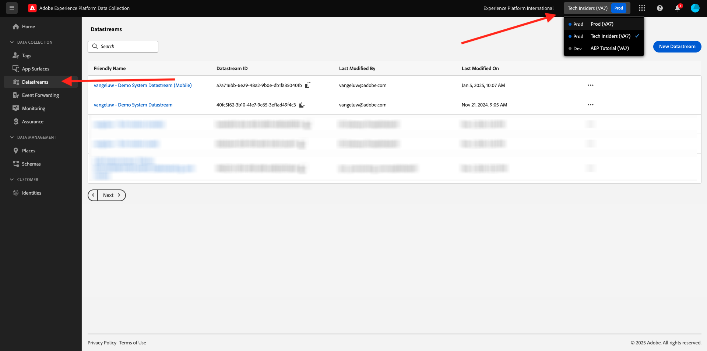
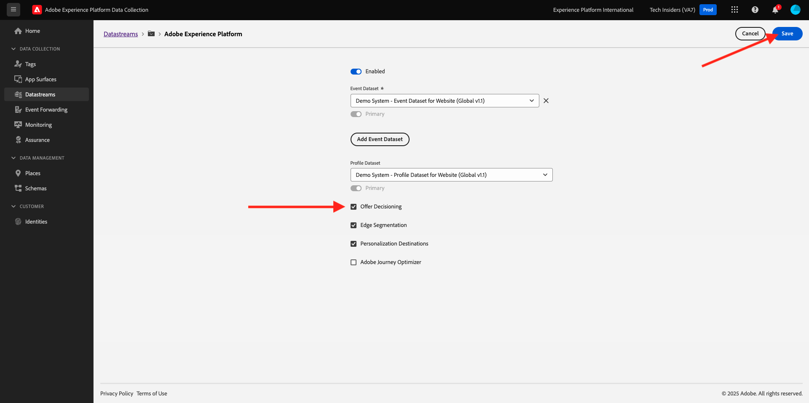
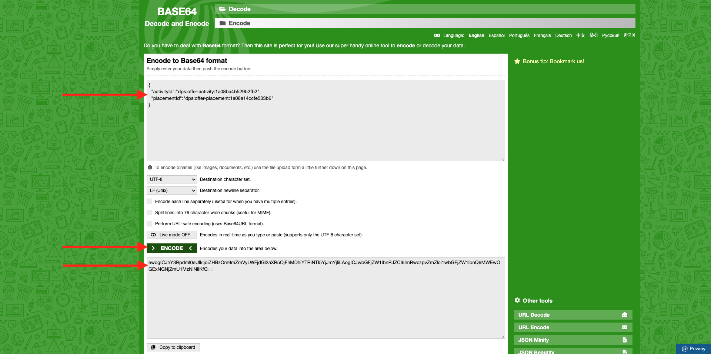
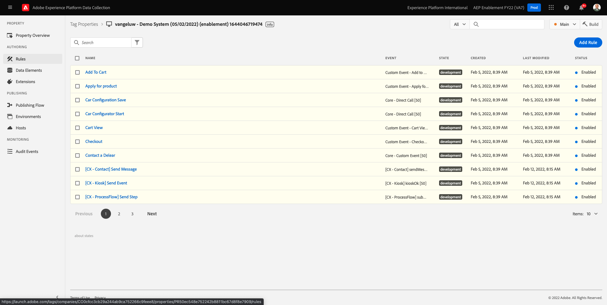

# 3.3.3Offer decisioning用のAdobe Experience Platform Data Collection Client プロパティと Web SDK セットアップの準備

## 3.3.3.1 データストリームの更新

[ 演習 0.2](./../../../modules/gettingstarted/gettingstarted/ex2.md) で、独自の **[!UICONTROL データストリーム]** を作成しました。 その後、`--demoProfileLdap-- - Demo System Datastream` という名前を使用しました。

この演習では、**[!DNL Offer Decisioning]** と連携するように **[!UICONTROL データストリーム]** を設定する必要があります。

その場合は、[https://experience.adobe.com/#/data-collection/](https://experience.adobe.com/#/data-collection/) にアクセスしてください。 その後、これが表示されます。 **[!UICONTROL データストリーム]** または **[!UICONTROL データストリーム（Beta）]** をクリックします。

画面の右上隅にあるサンドボックス名を選択します（`--aepSandboxId--` にする必要があります）。



**[!UICONTROL Datastream]** を検索します。名前は `--demoProfileLdap-- - Demo System Datastream` です。 **[!UICONTROL データストリーム]** をクリックして開きます。


その後、これが表示されます。 「**Adobe Experience Platform**」の横にある「**...**」をクリックし、「**編集**」をクリックします。


**[!DNL Offer Decisioning]** を有効にするには、**[!DNL Offer Decisioning]** のチェックボックスをオンにします。 「**保存**」をクリックします。



これで、**[!UICONTROL データストリーム]** を **[!DNL Offer Decisioning]** で使用する準備が整いました。


## 3.3.3.2 パーソナライズされたオファーをリクエストするようにAdobe Experience Platform データ収集クライアントプロパティを設定する

[https://experience.adobe.com/#/data-collection/](https://experience.adobe.com/#/data-collection/) の **[!UICONTROL Client]** に移動します。 `--demoProfileLdap-- - Demo System (DD/MM/YYYY)` という名前のデータ収集プロパティを検索します。 Web 用データ収集クライアントプロパティを開きます。


プロパティで、「**[!UICONTROL ルール]**」に移動してルール **[!UICONTROL ページビュー]** を開きます。


クリックして [!UICONTROL  アクション ]**[!UICONTROL AEP Web SDK - イベントを送信]** を開きます。


その後、これが表示されます。 **[!UICONTROL 決定範囲]** のメニューオプションが表示されます。


エッジとAdobe Experience Platformに送信されるすべてのリクエストに対して、1 つ以上の **[!UICONTROL 決定範囲]** を提供できます。 **[!UICONTROL 決定範囲]** は、次の 2 つの要素の組み合わせです。

- [!UICONTROL  決定 ID]
- [!UICONTROL  プレースメント ID]

最初に、これら 2 つの要素を見つけることができる場所を見てみましょう。

### 3.3.3.2.1 [!UICONTROL  プレースメント ID] を取得

[!UICONTROL  プレースメント ID] は、必要なアセットの場所とタイプを識別します。 例えば、Luma web サイトのホームページのヒーロー画像は、[!UICONTROL Web – 画像 [!UICONTROL  の ] プレースメント ID] に対応しています。

>[!NOTE]
>
>モジュール 6 の一部として、ホームページのヒーローの場所の画像を変更するAdobe Target エクスペリエンスのターゲット設定アクティビティを設定済みです（スクリーンショットを参照）。 この演習では、スクリーンショットに示されているように、オファーがヒーロー画像の下の画像に表示されるようにします。


[!UICONTROL Web – 画像 ] の [!UICONTROL  プレースメント ID] を見つけるには、[Adobe Experience Cloud](https://experience.adobe.com) に移動して、Adobe Journey Optimizerに移動します。 **Journey Optimizer** をクリックします。


Journey Optimizerの **ホーム** ビューにリダイレクトされます。 最初に、正しいサンドボックスを使用していることを確認します。 使用するサンドボックスは `--aepSandboxId--` です。 サンドボックスを切り替えるには、「**実稼動製品（VA7）」をクリックし** リストからサンドボックスを選択します。 この例では、サンドボックスの名前は **AEP イネーブルメント FY22** です。 その後、サンドボックス `--aepSandboxId--` ージの **ホーム** ビューに移動します。


次に、[!UICONTROL  コンポーネント ] に移動し、次に [!UICONTROL  プレースメント ] に移動します。 [!UICONTROL Web – 画像 ] プレースメントをクリックして、詳細を確認します。


上記の画像からわかるように、この例では [!UICONTROL  プレースメント ID] が `xcore:offer-placement:14bf09dc4190ebba` です。 次の演習で必要になるので、[!UICONTROL Web – 画像 ] のプレースメントの [!UICONTROL  プレースメント ID] を書き留めます。

### 3.3.3.2.2 [!UICONTROL  決定 ID] の取得

[!UICONTROL  決定 ID] は、パーソナライズされたオファーとフォールバックオファーのどの組み合わせを使用したいかを識別します。 前の演習では、独自の [!UICONTROL  決定 ] を作成し、`--demoProfileLdap-- - Luma Decision` という名前を付けました。

お使いの `--demoProfileLdap-- - Luma Decision` の [!UICONTROL  決定 ID] を見つけるには、[https://platform.adobe.com](https://platform.adobe.com) に移動します。

次に、[!UICONTROL  オファー ] に移動し、[!UICONTROL  決定 ] に移動します。 クリックして、`--demoProfileLdap-- - Luma Decision` という名前の [!UICONTROL  決定 ] を選択します。


上記の画像からわかるように、この例では [!UICONTROL  決定 ID] は `xcore:offer-activity:14c052382e1b6505` です。 次の演習で必要になるので、決定 `--demoProfileLdap-- - Luma Decision` に [!UICONTROL  決定 ID] を書き留めます。

**[!UICONTROL 決定範囲]** の作成に必要な 2 つの要素を取得したので、次の手順に進むことができます。次の手順では、決定範囲をエンコードします。

### 3.3.3.2.3 BASE64 エンコーディング

入力する必要がある **[!UICONTROL 決定範囲]** は、BASE64 でエンコードされた文字列です。 この BASE64 でエンコードされた文字列は、以下に示すように [!UICONTROL  プレースメント ID] と [!UICONTROL  決定 ID] の組み合わせです。

```json
{
  "activityId":"xcore:offer-activity:14c052382e1b6505",
  "placementId":"xcore:offer-placement:14bf09dc4190ebba"
}
```

**[!UICONTROL 決定範囲]** は、次の 2 つの方法で生成できます。

- [https://www.base64encode.org/](https://www.base64encode.org/) などのパブリックサービスを使用します。 上記のように JSON コードを入力し、「**[!UICONTROL エンコード]**」をクリックすると、以下に BASE64 でエンコードされた文字列が得られます。

  

- Adobe Experience Platformから BASE64 エンコードされた文字列を取得します。 [!UICONTROL  決定 ] に移動し、クリックして [!UICONTROL  決定 ] を開きます。名前は `--demoProfileLdap-- - Luma Decision` です。

  

  `--demoProfileLdap-- - Luma Decision` を開くと、これが表示されます。 プレースメント [!UICONTROL Web – 画像 ] を見つけ、「**[!UICONTROL コピー]** ボタンをクリックします。 次に、「**[!UICONTROL エンコードされた決定範囲]**」をクリックします。 **[!UICONTROL 決定範囲]** がクリップボードにコピーされました。

  

次に、Launch に戻り、アクション **[!UICONTROL AEP Web SDK - イベントを送信]** に移動します。


エンコードした決定範囲を入力フィールドに貼り付けます。


**[!UICONTROL 変更を保持]** をクリックして、アクション **[!UICONTROL AEP Web SDK - イベントを送信]** に変更を保存します。


次に、「**[!UICONTROL 保存]**」または **[!UICONTROL ライブラリに保存]** をクリックします


Adobe Experience Platform Data Collection で、**[!UICONTROL 公開フロー]** に移動し、**[!UICONTROL Main]** という名前の ]**開発ライブラリ**[!UICONTROL  を開きます。 「**[!UICONTROL +変更されたリソースをすべて追加」をクリックし]** 「**[!UICONTROL 開発用に保存してビルド]**」をクリックします。 これで、変更内容がデモ Web サイトに公開されます。


**一般ページ** を読み込むたびに、例えばデモ Web サイトのホームページなど、Offer decisioningは該当するオファーが何であるかを評価し、表示するオファーの詳細を含む応答を Web サイトに返します。 Web サイトにオファーを表示するには、追加の設定が必要です。次の手順でこれを行います。

## 3.3.3.3 パーソナライズされたオファーを受信して適用するようにAdobe Experience Platform データ収集クライアントプロパティを設定する

[https://experience.adobe.com/#/data-collection/](https://experience.adobe.com/#/data-collection/) の **[!UICONTROL プロパティ]** に移動します。 `--demoProfileLdap-- - Demo System (DD/MM/YYYY)` という名前のデータ収集プロパティを検索します。 Web のデータ収集プロパティを開きます。


そのプロパティで、「ルール **[!UICONTROL に移動]** ます。



ルール **決定受信済み** を検索して開きます。


その後、これが表示されます。 アクション **ページにオファーを配置** を開きます。


**[!UICONTROL 編集画面を開く]** をクリックします


エディターに以下のコードを貼り付けて、コードを上書きします。

```javascript
if(!Array.isArray(event.decisions)) {
  console.log('No decisions returned')
  return;
}
console.log("decision",event.decisions)

event.decisions.forEach(function(payload) {
  payload.items.forEach(function(item){
    console.log("Response from Offer Decisioning ", item.data.content);
   
    var element = document.querySelector("#root > div > div > div.app-content > div > section.feature_part.padding_top > div > div.row.align-items-center.justify-content-between > div.col-lg-7.col-sm-6.\\30  > div");
    if(!element){
      console.log("Offer Placement Area Selector not found")
      return;
    }
    if(!item.data){
      return
    }
    //check if offer already exists
    var offer = document.querySelector("#root > div > div > div.app-content > div > section.feature_part.padding_top > div > div.row.align-items-center.justify-content-between > div.col-lg-7.col-sm-6.\\30  > div");
    if(!offer){ 
      element.insertAdjacentHTML('afterbegin', item.data.content) 
    }
    else { 
      console.log("item.data.deliveryURL: " + item.data.deliveryURL)
      document.querySelector("#root > div > div > div.app-content > div > section.feature_part.padding_top > div > div.row.align-items-center.justify-content-between > div.col-lg-7.col-sm-6.\\30  > div").style.background="url('"+item.data.deliveryURL+"')";
      document.querySelector("#root > div > div > div.app-content > div > section.feature_part.padding_top > div > div.row.align-items-center.justify-content-between > div.col-lg-7.col-sm-6.\\30  > div").style.backgroundRepeat="no-repeat";
      document.querySelector("#root > div > div > div.app-content > div > section.feature_part.padding_top > div > div.row.align-items-center.justify-content-between > div.col-lg-7.col-sm-6.\\30  > div").style.backgroundPosition="center center";
      document.querySelector("#root > div > div > div.app-content > div > section.feature_part.padding_top > div > div.row.align-items-center.justify-content-between > div.col-lg-7.col-sm-6.\\30  > div").style.backgroundSize = "contain";
    }  
  })
});
```

26-27-28-29 行目は、Offer decisioningから返される画像を web サイトに適用します。 「**[!UICONTROL 保存]**」をクリックします。


「**[!UICONTROL 変更を保存]**」をクリックします。


次に、「**[!UICONTROL 保存]**」または **[!UICONTROL ライブラリに保存]** をクリックします


Adobe Experience Platform Data Collection で、**[!UICONTROL 公開フロー]** に移動し、**[!UICONTROL Main]** という名前の ]**開発ライブラリ**[!UICONTROL  を開きます。 「**[!UICONTROL +変更されたリソースをすべて追加」をクリックし]** 「**[!UICONTROL 開発用に保存してビルド]**」をクリックします。 これで、変更内容がデモ Web サイトに公開されます。


この変更により、Adobe Experience Platform Data Collection のこのルールは、Web SDK 応答の一部であるOffer decisioningからの応答をリッスンするようになり、応答を受信すると、オファーの画像がホームページに表示されます。

デモ Web サイトを見ると、この画像が今すぐ置き換えられることがわかります。

>[!NOTE]
>
>モジュール 6 の一部として、ホームページのヒーローの場所の画像を変更するAdobe Target エクスペリエンスのターゲット設定アクティビティを設定済みです（スクリーンショットを参照）。 この演習では、スクリーンショットに示されているように、オファーがヒーロー画像の下の画像に表示されるようにします。


デフォルトの Luma web サイト画像の代わりに、次のようなオファーが表示されるようになりました。 この場合は、フォールバックオファーが表示されます。


これで、2 種類のパーソナライゼーションが設定されました。

- 1 モジュール 6 のAdobe Targetを使用したエクスペリエンスのターゲット設定アクティビティ
- データ収集プロパティを使用した 1 つのOffer decisioningの実装

次の演習では、Adobe Journey Optimizerで作成したオファーと決定を、Adobe Target エクスペリエンスのターゲット設定アクティビティと組み合わせる方法を説明します。

次の手順：[3.3.4 Adobe TargetとOffer decisioningを組み合わせる ](./ex4.md)

[モジュール 3.3 に戻る](./offer-decisioning.md)

[すべてのモジュールに戻る](./../../../overview.md)
