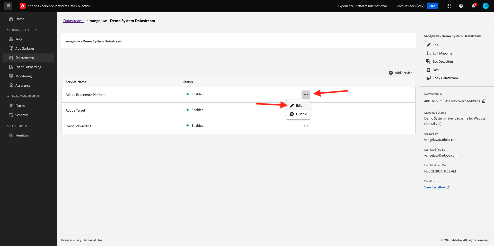

# 3.3.3Offer decisioning用のAdobe Experience Platform Data Collection Client プロパティと Web SDK設定を準備する

## 3.3.3.1 データストリームの更新

[&#x200B; はじめに &#x200B;](./../../../modules/gettingstarted/gettingstarted/ex2.md) で、独自の **データストリーム** を作成しました。 その後、`--aepUserLdap-- - Demo System Datastream` という名前を使用しました。

この演習では、**Offer decisioning** と連携するように **データストリーム** を設定する必要があります。

その場合は、[https://experience.adobe.com/#/data-collection/](https://experience.adobe.com/#/data-collection/) にアクセスしてください。 その後、これが表示されます。 **データストリーム** をクリックします。

画面の右上隅にあるサンドボックス名を選択します（`--aepSandboxName--` にする必要があります）。


**Datastream** を検索します。名前は `--aepUserLdap-- - Demo System Datastream` です。 **データストリーム** をクリックして開きます。


その後、これが表示されます。 「**Adobe Experience Platform**」の横にある「**...**」をクリックし、「**編集**」をクリックします。



**Offer decisioning** を有効にするには、**Offer decisioning** のチェックボックスをオンにします。 「**保存**」をクリックします。


これで、**データストリーム** が **Offer decisioning** で動作する準備ができました。


## 3.3.3.2 パーソナライズされたオファーをリクエストするようにAdobe Experience Platform データ収集クライアントプロパティを設定する

[https://experience.adobe.com/#/data-collection/](https://experience.adobe.com/#/data-collection/) の **Tags** に移動します。 `--aepUserLdap-- - Demo System (DD/MM/YYYY)` という名前のデータ収集プロパティを検索します。 Web 用データ収集クライアントプロパティを開きます。


プロパティで、「**ルール**」に移動してルール **ページビュー** を開きます。


クリックして、アクション **「ページビュー」エクスペリエンスイベントを送信** を開きます。


その後、これが表示されます。 「**Personalization**」の下には、「範囲 **のオプションが表示され** す。


エッジとAdobe Experience Platformに送信されるすべてのリクエストに対して、1 つ以上の **決定範囲** を提供できます。 **決定範囲** は、次の 2 つの要素の組み合わせです。

- 決定 ID
- プレースメント ID

最初に、これら 2 つの要素を見つけることができる場所を見てみましょう。

### 3.3.3.2.1 プレースメント ID の取得

プレースメント ID は、必要なアセットの場所とタイプを識別します。 例えば、CitiSignal web サイトのホームページのヒーロー画像は、Web – 画像のプレースメント ID に対応しています。

>[!NOTE]
>
>演習 2.3.5 の一部として、ホームページのヒーローの場所の画像を変更するAdobe Target エクスペリエンスのターゲット設定アクティビティを既に設定しました（スクリーンショットを参照）。 この演習では、スクリーンショットに示されているように、オファーをヒーロー画像の下の画像に表示します。


Web – 画像のプレースメント ID を見つけるには、[Adobe Experience Cloud](https://experience.adobe.com) に移動して、Adobe Journey Optimizerに移動します。 **Journey Optimizer** をクリックします。


Journey Optimizerの **ホーム** ビューにリダイレクトされます。 最初に、正しいサンドボックスを使用していることを確認します。 使用するサンドボックスは `--aepSandboxName--` です。 その後、サンドボックス `--aepSandboxName--` ージの **ホーム** ビューに移動します。


次に、コンポーネント / プレースメントに移動します。 **Web – 画像** プレースメントをクリックして、詳細を確認します。


上記の画像からわかるように、この例ではプレースメント ID は `dps:offer-placement:1a08a14ccfe533b6` です。 次の演習で必要になるので、Web – 画像のプレースメント ID を書き留めます。

### 3.3.3.2.2 オファーの決定 ID の取得

**オファー決定 ID** は、使用したいパーソナライズされたオファーとフォールバックオファーの組み合わせを識別します。 前の演習では、独自の決定を作成し、`--aepUserLdap-- - CitiSignal Decision` という名前を付けました。

オファーのオファー決定 ID を見つけるには、オフ `--aepUserLdap-- - CitiSignal Decision` /「決定」の順に移動します。 決定をクリックして選択します。名前は `--aepUserLdap-- - CitiSignal Decision` です。


上記の画像からわかるように、この例では決定 ID は `dps:offer-activity:1a08ba4b529b2fb2` です。 次の演習で必要になるので、決定 `--aepUserLdap-- - CitiSignal Decision` のオファー決定 ID を書き留めます。

**決定範囲** の作成に必要な 2 つの要素を取得したので、次の手順に進むことができます。次の手順では、決定範囲をエンコードします。

### 3.3.3.2.3 BASE64 エンコーディング

入力する必要がある **決定範囲** は、BASE64 でエンコードされた文字列です。 この BASE64 でエンコードされた文字列は、次に示すようにプレースメント ID と決定 ID の組み合わせです。

```json
{
  "xdm:activityId": "dps:offer-activity:1a08ba4b529b2fb2",
  "xdm:placementId": "dps:offer-placement:1a08a14ccfe533b6"
}
```

BASE64 でエンコードされた文字列をAdobe Experience Platformから取得できます。 「決定」に移動し、クリックして決定（`--aepUserLdap-- - CitiSignal Decision` という名前）を開きます。


`--aepUserLdap-- - CitiSignal Decision` を開くと、これが表示されます。 プレースメント Web – 画像を見つけて、「**コピー** ボタンをクリックします。 次に、「**エンコードされた決定範囲**」をクリックします。 **決定範囲** がクリップボードにコピーされました。


次に、Launch に戻り、アクション **AEP Web SDK - イベントを送信** に移動します。


エンコードした決定範囲を入力フィールドに貼り付けます。 **[!UICONTROL 変更を保持]** をクリックして、アクション **AEP Web SDK - イベントを送信** に変更を保存します。


次に、「**[!UICONTROL 保存]** をクリックします。


Adobe Experience Platform Data Collection で、**[!UICONTROL 公開フロー]** に移動し、**[!UICONTROL Main]** という名前の **開発ライブラリ** を開きます。 「**[!UICONTROL +変更されたリソースをすべて追加」をクリックし]** 「**[!UICONTROL 開発用に保存してビルド]**」をクリックします。 これで、変更内容がデモ Web サイトに公開されます。


**一般ページ** を読み込むたびに、例えばデモ Web サイトのホームページなど、Offer decisioningは該当するオファーが何であるかを評価し、表示するオファーの詳細を含む応答を Web サイトに返します。 Web サイトにオファーを表示するには、追加の設定が必要です。次の手順でこれを行います。

## 3.3.3.3 パーソナライズされたオファーを受信して適用するようにAdobe Experience Platform データ収集クライアントプロパティを設定する

[https://experience.adobe.com/#/data-collection/](https://experience.adobe.com/#/data-collection/) の **[!UICONTROL プロパティ]** に移動します。 `--aepUserLdap-- - Demo System (DD/MM/YYYY)` という名前のデータ収集プロパティを検索します。 Web のデータ収集プロパティを開きます。


そのプロパティで、「ルール **に移動** ます。 ルール **オファーを表示（Offer decisioning）** を検索して開きます。


その後、これが表示されます。 アクション **ページにオファーを表示** を開きます。


**[!UICONTROL 編集画面を開く]** をクリックします


エディターに以下のコードを貼り付けて、コードを上書きします。

```javascript
if (!Array.isArray(event.decisions)) {
  console.log("No personalization decisions");
  return;
}

console.log("Received response from Offer Decisioning", event.decisions);

event.decisions.forEach(function (payload) {
  payload.items.forEach(function (item) {
    console.log("Offer", item.data.deliveryURL);

    if (!item.data || item.data?.deliveryURL==null) {
      return;
    }
    console.log("item.data.deliveryURL", item.data.deliveryURL)
    //document.querySelector(".TopRibbon").innerHTML = item.data.content;
    document.querySelector("#SpectrumProvider > div.App > div > div.Page.home > main > div:nth-child(2)").innerHTML = "";
    document.querySelector("#SpectrumProvider > div.App > div > div.Page.home > main > div:nth-child(2) > img").style.backgroundRepeat="no-repeat";
    document.querySelector("#SpectrumProvider > div.App > div > div.Page.home > main > div:nth-child(2) > img").style.backgroundPosition="center center";
    document.querySelector("#SpectrumProvider > div.App > div > div.Page.home > main > div:nth-child(2) > img").style.backgroundSize = "contain";
  });
});
```

17 行目は、Offer decisioningから返される画像を web サイトに適用します。 「**[!UICONTROL 保存]**」をクリックします。


「**[!UICONTROL 変更を保存]**」をクリックします。


次に、「**[!UICONTROL 保存]** をクリックします。


Adobe Experience Platform Data Collection で、**[!UICONTROL 公開フロー]** に移動し、**[!UICONTROL Main]** という名前の **開発ライブラリ** を開きます。 「**[!UICONTROL +変更されたリソースをすべて追加」をクリックし]** 「**[!UICONTROL 開発用に保存してビルド]**」をクリックします。 これで、変更内容がデモ Web サイトに公開されます。


この変更により、Adobe Experience Platform Data Collection のこのルールは、Web SDK応答の一部であるOffer decisioningからの応答をリッスンするようになりました。応答を受信すると、オファーの画像がホームページに表示されます。

デモ Web サイトを見ると、この画像が今すぐ置き換えられることがわかります。 デフォルトの CitiSignal web サイト画像の代わりに、次のようなオファーが表示されるようになりました。 この場合は、フォールバックオファーが表示されます。


これで、2 種類のパーソナライゼーションが設定されました。

- 1.演習 2.3.5 のAdobe Targetを使用したエクスペリエンスのターゲット設定アクティビティ
- データ収集プロパティを使用した 1 つのOffer decisioningの実装

次の演習では、Adobe Journey Optimizerで作成したオファーと決定を、Adobe Target エクスペリエンスのターゲット設定アクティビティと組み合わせる方法を説明します。

次の手順：[3.3.4 Adobe TargetとOffer decisioningを組み合わせる &#x200B;](./ex4.md)

[モジュール 3.3 に戻る](./offer-decisioning.md)

[すべてのモジュールに戻る](./../../../overview.md)
