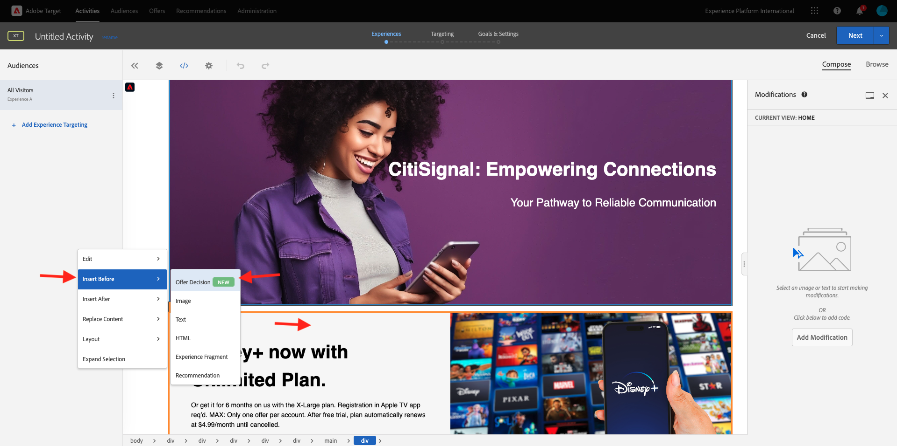

# 3.3.4 Adobe TargetとOffer decisioningの組み合わせ

## 3.3.4.1 デモプロジェクトの共有可能なリンクを収集する

デモ Web サイトプロジェクトをAdobe Targetに読み込むには、まず、Adobe Targetでデモ Web サイトプロジェクトを読み込むための特別なリンクを収集する必要があります。

その場合は、[https://builder.adobedemo.com/projects](https://builder.adobedemo.com/projects) にアクセスしてください。 Adobe IDでログインすると、このが表示されます。 Web サイトプロジェクトをクリックして開きます。

この画面が表示されます。 「**共有**」をクリックします。

**リンクを生成** をクリックし、リンクをクリップボードにコピーします。

[https://bitly.com](https://bitly.com) に移動し、コピーしたリンクを貼り付けて、[**短縮**] をクリックします。 これで、次のような短縮リンクが表示されます。`https://bit.ly/3JxN7aG` そのリンクは、次の演習で必要になります。

## 3.3.4.2 収集

次に、[https://experiencecloud.adobe.com/](https://experiencecloud.adobe.com/) にアクセスして、Adobe Experience Cloud ホームページに移動します。 **ターゲット** をクリックします。

**Adobe Target** のホームページには、既存のすべてのアクティビティが表示されます。

「**+ アクティビティを作成**」をクリックして、新しいアクティビティを作成します。

**エクスペリエンスのターゲット設定** を選択します。

次に、「**ビジュアル**」を選択し、「アクティビティ URL を入力 **フィールドに短縮リンクを貼り付け** す。 「**次へ**」をクリックします。

デモ Web サイトプロジェクトが Visual Experience Composer に読み込まれるのが確認できます。

**参照** モードに移動し、cookie の同意ポップアップで **すべて許可** をクリックします。

テキスト **おすすめカテゴリ** を含む領域をクリックします。 「**前に挿入**」をクリックし、「**オファーの決定**」を選択します。

このポップアップが表示されます。 サンドボックス `--aepSandboxId--` を選択し、プレースメントを選択します **Web – 画像**。

次に、決定 `--demoProfileLdap-- - Luma Decision` を選択します。 「**保存**」をクリックします。

その後、これが表示されます。 追加のテンプレートルール **URL****contains****your-project-name** を確認します。 **保存** をクリックします。

その後、これが表示されます。 「**次へ**」をクリックします。

オファーの名前を入力します。使用する名前：`--demoProfileLdap-- - XT with Offers (VEC)`。 「**次へ**」をクリックします。

その後、これが表示されます。 示されているように、**目標指標** を定義します。 **保存して閉じる** をクリックします。

オファーが作成され、公開されます。

オファーが公開されたら、有効にできます。

次の手順：[3.3.5 メールと SMS で決定を使用する ](./ex5.md)

[モジュール 3.3 に戻る](./offer-decisioning.md)

[すべてのモジュールに戻る](./../../../overview.md)
