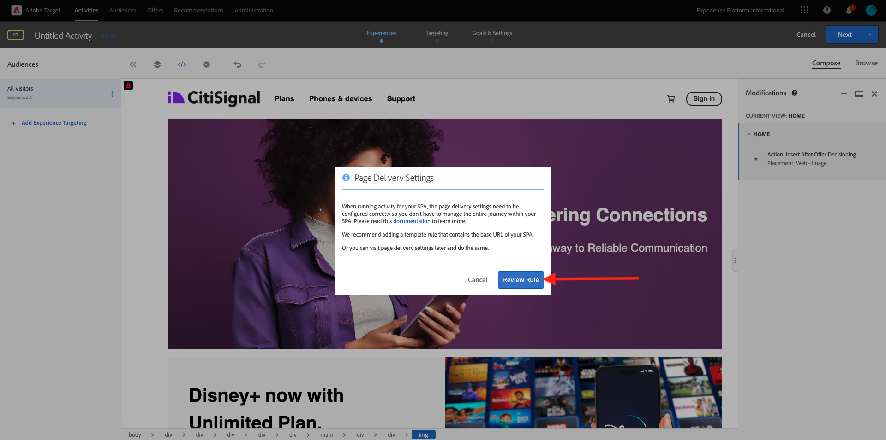

# 3.3.4 Adobe TargetとOffer decisioningの組み合わせ

## 3.3.4.1 デモプロジェクトの共有可能なリンクを収集する

デモ Web サイトプロジェクトをAdobe Targetに読み込むには、まず、Adobe Targetでデモ Web サイトプロジェクトを読み込むための特別なリンクを収集する必要があります。

その場合は、[https://dsn.adobe.com/projects](https://builder.adobedemo.com/projects) にアクセスしてください。 Adobe IDでログインすると、このが表示されます。 Web サイトプロジェクトをクリックして開きます。

この画面が表示されます。 **共有** に移動します。 **リンクを生成** をクリックし、リンクをクリップボードにコピーします。

[https://bitly.com](https://bitly.com) に移動し、コピーしたリンクを貼り付けて、[**リンクを作成**] をクリックします。

これで、次のような短縮リンクが表示されます。`https://adobe.ly/3PpGcFk` そのリンクは、次の演習で必要になります。

## 3.3.4.2 収集

次に、[https://experiencecloud.adobe.com/](https://experiencecloud.adobe.com/) にアクセスして、Adobe Experience Cloud ホームページに移動します。 **ターゲット** をクリックします。

**Adobe Target** のホームページには、既存のすべてのアクティビティが表示されます。 **アクティビティを作成** をクリックし、「**エクスペリエンスのターゲット設定**」をクリックします。

次に、「**ビジュアル**」を選択し、「アクティビティ URL を入力 **フィールドに短縮リンクを貼り付け** す。 「**作成**」をクリックします。

デモ Web サイトプロジェクトが Visual Experience Composer に読み込まれるのが確認できます。

>[!NOTE]
>
>Web サイトが正しく読み込まれない場合は、Chrome Web ストアからChrome拡張機能 **Adobe Target VEC Helper** をインストールして有効にし、もう一度試してください。

Disney+ オファーを保持する領域をクリックします。 必ず完全な **コンテナ** を選択します。 「**前に挿入**」をクリックし、「**オファーの決定**」を選択します。

このポップアップが表示されます。 サンドボックス `--aepSandboxName--` を選択し、プレースメントを選択します **Web – 画像**。

次に、決定 `--aepUserLdap-- - CitiSignal Decision` を選択します。 「**保存**」をクリックします。

その後、これが表示されます。 **ルールを確認** をクリックします。

追加のテンプレートルール **URL**&#x200B;**contains**&#x200B;**your-project-name** を確認します。 「**保存**」をクリックします。

その後、これが表示されます。 「**次へ**」をクリックします。

オファーの名前を入力します。使用する名前：`--aepUserLdap-- - XT with Offers (VEC)`。 「**次へ**」をクリックします。

その後、これが表示されます。 示されているように、**目標指標** を定義します。 **保存して閉じる** をクリックします。

オファーが作成され、公開されます。 オファーが公開されたら、アクティブ化できます。

次の手順：[3.3.5 メールと SMS で決定を使用する ](./ex5.md)

[モジュール 3.3 に戻る](./offer-decisioning.md)

[すべてのモジュールに戻る](./../../../overview.md)
