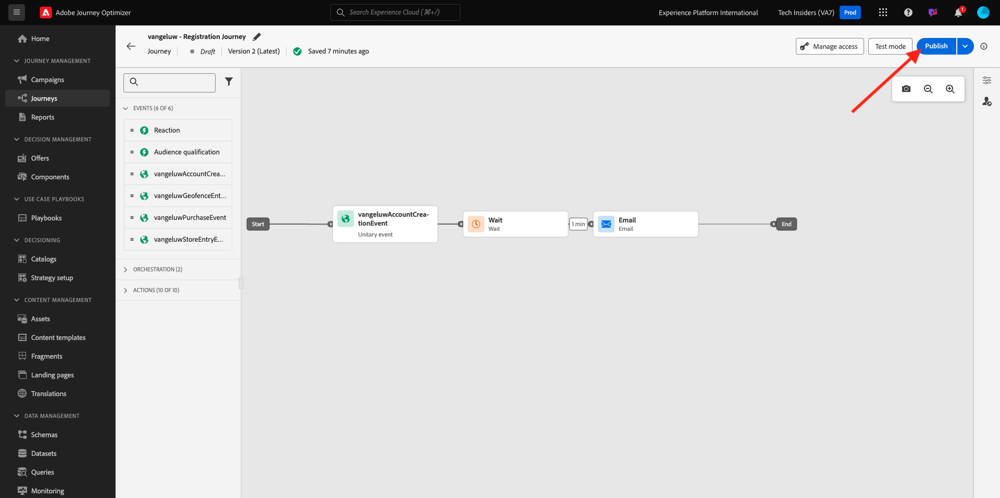
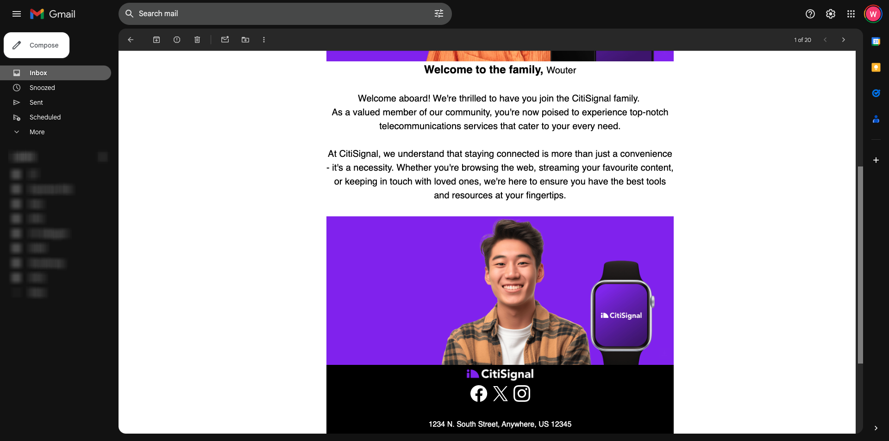

# 3.3.5 メールでの決定の使用

この演習では、決定を使用してメールと SMS の配信をパーソナライズします。

**ジャーニー** に移動します。 演習 7.2 で作成した `--demoProfileLdap-- - Account Creation Journey` という名前のジャーニーを見つけます。 ジャーニーをクリックして開きます。

その後、これが表示されます。 **新しいバージョンを作成** をクリックします。

**新しいバージョンを作成** をクリックします。

**メール** アクションをクリックし、**コンテンツを編集** をクリックします。

その後、メッセージダッシュボードが表示されます。 **メールDesigner** をクリックします。

その後、これが表示されます。

その後、これが表示されます。 新しい **1:1 列** 構造コンポーネントをキャンバスにドラッグします。

メニューの **コンテンツコンポーネント** に移動します。 **オファーの決定** コンポーネントを選択し、次に示すように、このコンポーネントをメールのコンテンツオファープレースホルダーにドラッグ&amp;ドロップします。 次に、「**追加** をクリックします。

メールに含めるプレースメントのタイプを選択します。 **プレースメント** ドロップダウンメニューで **メール – 画像** を選択し、決定 `--demoProfileLdap-- - Luma Decision` を選択します。 「**追加**」をクリックします。

これで、すべてのパーソナライズされたオファーとフォールバックオファーが電子メールデザイナー内で視覚化されて表示されるようになります。 **コンテンツをシミュレート** をクリックして、実際の顧客プロファイルでメールメッセージをプレビューします。

まず、プレビューに使用するプロファイルを特定します。 **メール** 名前空間を選択し、デモ Web サイトで作成した顧客プロファイルのメールアドレスを入力します。 次に、「**プレビュー**」をクリックします。

メールが表示され、オファーが正しく表示されたら、「**閉じる**」ボタンをクリックします。

最後に、「**保存** をクリックします。

ここで、矢印をクリックして前の画面に戻ります。

その後、これが表示されます。 左上隅の矢印をクリックして、ジャーニーに戻ります。

**OK** をクリックして **メール** アクションを閉じます。

**Publish** をクリックして、更新されたジャーニーを公開します。

「**Publish**」を再度クリックして、確定します。

メッセージが公開されました。

デモ Web サイトで新しいアカウントを作成すると、このメールが届きます。

この演習は完了しました。

次の手順：[3.3.6 API を使用して決定をテストする ](./ex6.md)

[モジュール 3.3 に戻る](./offer-decisioning.md)

[すべてのモジュールに戻る](./../../../overview.md)
