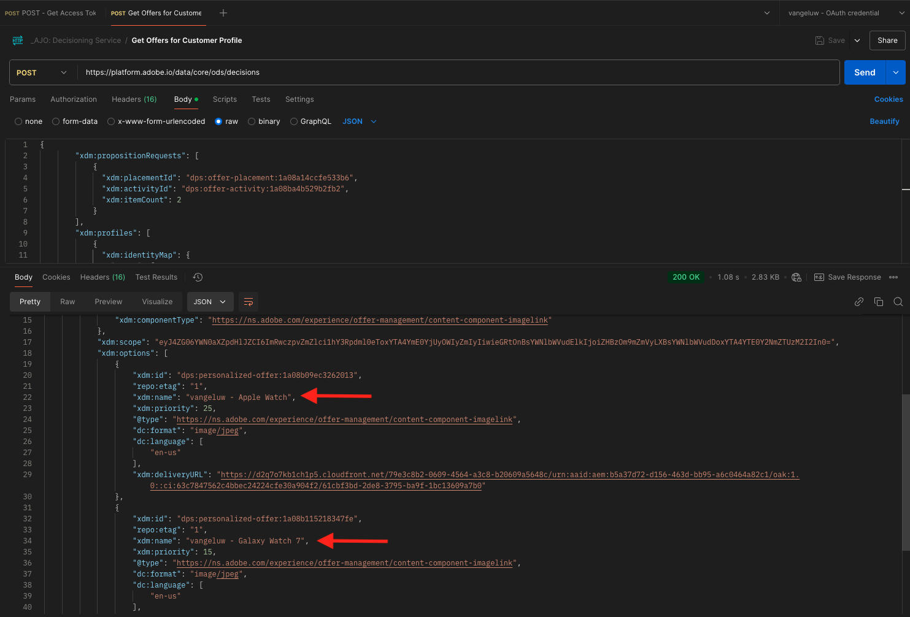

# 3.3.6 API を使用して決定をテストする

## 3.3.6.1 Postmanを使用してOffer decisioningAPI を操作する

>[!IMPORTANT]
>
>Adobe社員の方は、こちらの説明に従って [PostBuster](./../../../postbuster.md) を使用してください。

[&#x200B; このOffer decisioning用Postman コレクション &#x200B;](./../../../assets/postman/postman_offer-decisioning.zip) をデスクトップにダウンロードして解凍します。 すると、次のようになります。

これで、デスクトップ上に次のファイルが作成されました。

- `_AJO- Decisioning Service.postman_collection.json`

[&#x200B; 演習 2.1.3 - Adobe I/Oに対するPostman認証 &#x200B;](./../../../modules/rtcdp-b2c/module2.1/ex3.md) では、Postmanをインストールしました。 この演習では、Postmanを再度使用する必要があります。

Postmanを開き、ファイル `_AJO- Decisioning Service.postman_collection.json` を読み込みます。 このコレクションをPostmanで使用できるようになります。

これで、API を使用してPostmanとの対話を開始するためにAdobe Experience Platformで必要なすべてが揃いました。

以下の API を使用する前に、演習 2.1.3 で設定したコレクション **Adobe IO - OAuth** を使用して再認証してください。

### 3.3.6.2 顧客プロファイルのオファーの取得

クリックしてリクエスト **を開きます。POST – 顧客プロファイルのオファーを取得**。 最初に更新するのは、**x-sandbox-name** の **Header** 変数です。 `--aepSandboxName--` に設定してください。

このリクエストでは、多数のフィールドを更新する必要があります。 **本文** に移動します。

- **xdm:placementId**
- **xdm:activityId**
- **xdm:id**
- **xdm:itemCount** （choice の値に変更します）

フィールド **xdm:activityId** に入力する必要があります。 これは、以下に示すように、Adobe Experience Platform UI で取得できます。

フィールド **[!UICONTROL xdm:placementId]** に入力する必要があります。 これは、以下に示すように、Adobe Experience Platform UI で取得できます。 次の例では、プレースメントの placementId を確認できます **[!UICONTROL Web – 画像]**。

**xdm:id** フィールドに、オファーをリクエストする顧客プロファイルのメールアドレスを入力します。 すべての値を必要に応じて設定したら、「**[!UICONTROL 送信]**」をクリックします。

最後に、パーソナライズされたオファーの種類と、この顧客に表示する必要のあるアセットの結果を確認します。 この例では、2 つの項目がリクエストされ、ご覧のように、2 つのパーソナライズされたオファーが返されました。 Galaxy Watch のオファー 1 件と、Apple Watch 7 のオファー 1 件。

これで、この演習が完了しました。

次の手順：[&#x200B; 概要とメリット &#x200B;](./summary.md)

[モジュール 3.3 に戻る](./offer-decisioning.md)

[すべてのモジュールに戻る](./../../../overview.md)
