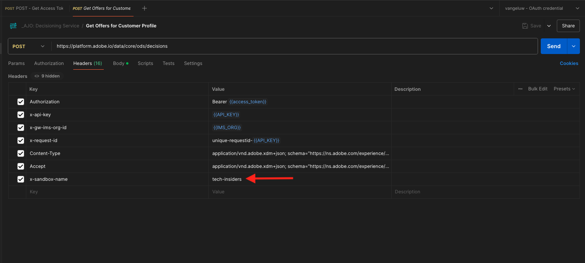

# 3.3.6 API を使用して決定をテストする

## 3.3.6.1 Postmanを使用してOffer decisioningAPI を操作する

[ このOffer decisioning用Postman コレクション ](./../../../assets/postman/postman_offer-decisioning.zip) をデスクトップにダウンロードして解凍します。 すると、次のようになります。

これで、デスクトップ上に次のファイルが作成されました。

- [!UICONTROL _Module 14- Decisioning Service.postman_collection.json]

[ 演習 2.1.3 - Adobe I/Oに対するPostman認証 ](./../../../modules/rtcdp-b2c/module2.1/ex3.md) では、Postmanをインストールしました。 この演習では、Postmanを再度使用する必要があります。

Postmanを開きます。 **[!UICONTROL インポート]** をクリックします。

**[!UICONTROL ファイルをアップロード]** をクリックします。

ファイル **[!UICONTROL _Module 14- Decisioning Service.postman_collection.json を選択し]** 「**[!UICONTROL 開く]**」をクリックします。

このコレクションをPostmanで使用できるようになります。

これで、API を使用してPostmanとの対話を開始するためにAdobe Experience Platformで必要なすべてが揃いました。

### 3.3.6.1.1 リストコンテナ

クリックしてリクエスト **[!UICONTROL GET - リストコンテナ]** を開きます。

**[!UICONTROL Params]** の下に、次の項目が表示されます。

- プロパティ：`_instance.parentName==aepenablementfy22`

このパラメーターで **[!UICONTROL aepenablementfy22]** は、Adobe Experience Platformで使用されるサンドボックスの名前です。 使用する必要があるサンドボックスは `--aepSandboxId--` です。 テキスト **[!UICONTROL aepenablementfy22]** を `--aepSandboxId--` で置き換えます。

サンドボックス名を置き換えたら、「**[!UICONTROL 送信]**」をクリックします。

これは応答で、指定したサンドボックスのオファーコンテナが表示されます。 以下に示すように **[!UICONTROL container instanceId]** をコピーして、コンピューター上のテキストファイルに書き留めてください。 次の演習では、この **[!UICONTROL container instanceId]** を使用する必要があります。

### 3.3.6.1.2 リストプレースメント

クリックしてリクエスト **[!UICONTROL GET - リストのプレースメント]** を開きます。 「**[!UICONTROL 送信]**」をクリックします。

これで、オファーコンテナに使用可能なすべてのプレースメントが表示されます。 表示されているプレースメントは、[ 演習 3.3.1.3](./ex1.md) で示すように、Adobe Experience Platform UI で定義されました。

### 3.3.6.1.3 リスト決定ルール

クリックしてリクエスト **[!UICONTROL GET - リストの決定ルール]** を開きます。 「**[!UICONTROL 送信]**」をクリックします。

応答には、[ 演習 3.3.1.4](./ex1.md) で示すように、Adobe Experience Platform UI で定義した決定ルールが表示されます。

### 3.3.6.1.4 パーソナライズされたオファーのリスト

クリックしてリクエスト **[!UICONTROL GET - パーソナライズされたオファーのリスト]** を開きます。 「**[!UICONTROL 送信]**」をクリックします。

応答には、[ 演習 3.3.2.1](./ex2.md) のAdobe Experience Platform UI で定義したパーソナライズされたオファーが表示されます。

### 3.3.6.1.5 フォールバックオファーのリスト

クリックしてリクエスト **[!UICONTROL GET - フォールバックオファーのリスト]** を開きます。 「**[!UICONTROL 送信]**」をクリックします。

応答には、[ 演習 3.3.2.2](./ex2.md) のAdobe Experience Platform UI で定義したフォールバックオファーが表示されます。

### 3.3.6.1.6 リストコレクション

クリックしてリクエスト **[!UICONTROL 「GET - コレクションのリスト」を開き]** す。

応答には、[ 演習 3.3.2.3](./ex2.md) のAdobe Experience Platform UI で定義したコレクションが表示されます。

### 3.3.6.1.7 顧客プロファイルの詳細なオファーの取得

クリックしてリクエスト **[!UICONTROL を開きます。POST – 顧客プロファイルの詳細オファーを取得]**。 このリクエストは前のリクエストと似ていますが、実際には、画像 URL、テキストなどの詳細を返します。

このリクエストでは、同様の要件を持つ前の演習と同様に、**[!UICONTROL xdm:placementId]** と **[!UICONTROL xdm:activityId]** の値を指定して、顧客の特定のオファー詳細を取得する必要があります。

フィールド **[!UICONTROL xdm:activityId]** に入力する必要があります。 これは、以下に示すように、Adobe Experience Platform UI で取得できます。

フィールド **[!UICONTROL xdm:placementId]** に入力する必要があります。 これは、以下に示すように、Adobe Experience Platform UI で取得できます。 次の例では、プレースメントの placementId を確認できます **[!UICONTROL Web – 画像]**。

**[!UICONTROL 本文]** に移動し、オファーをリクエストする顧客のメールアドレスを入力します。 「**[!UICONTROL 送信]**」をクリックします。

最後に、パーソナライズされたオファーの種類と、この顧客に表示する必要のあるアセットの結果を確認します。

これで、この演習が完了しました。

次の手順：[ 概要とメリット ](./summary.md)

[モジュール 3.3 に戻る](./offer-decisioning.md)

[すべてのモジュールに戻る](./../../../overview.md)
