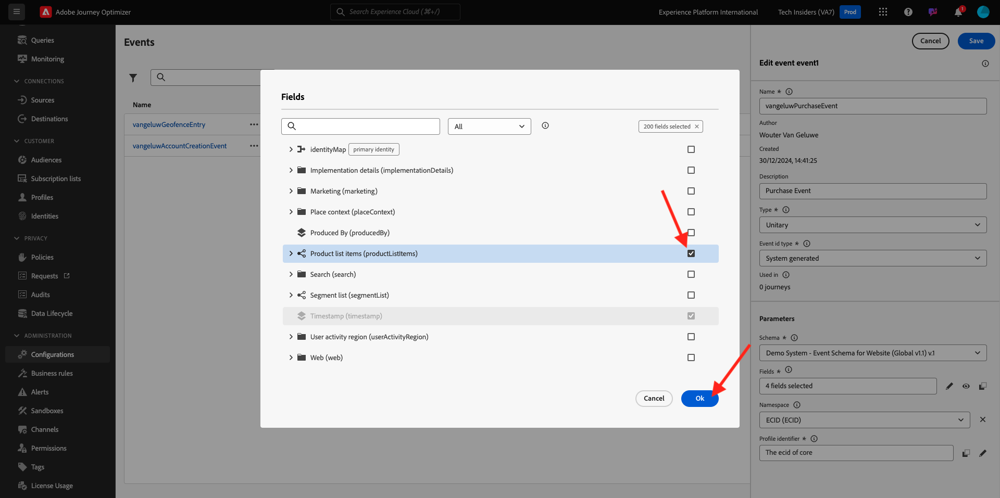
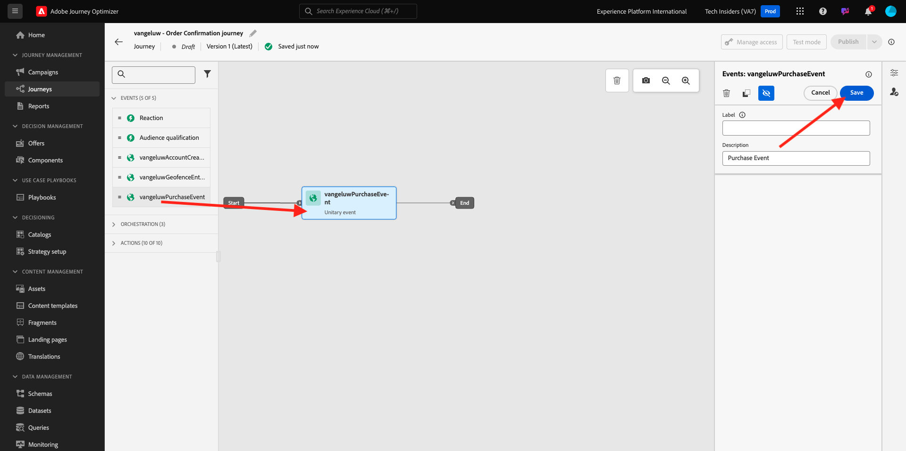
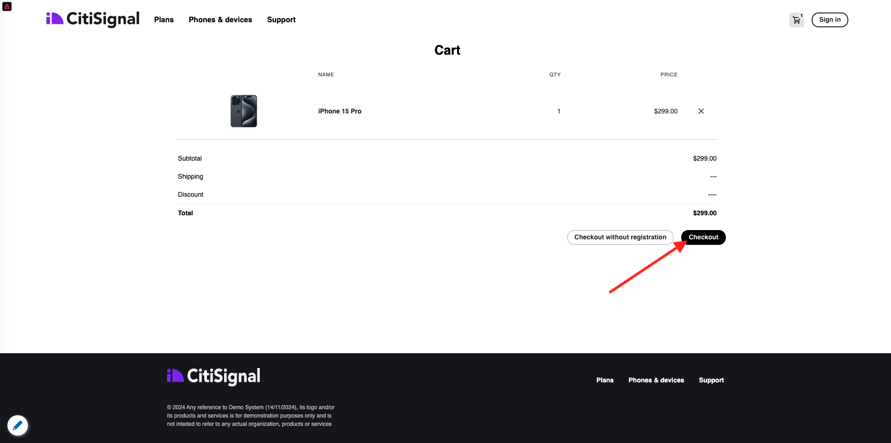
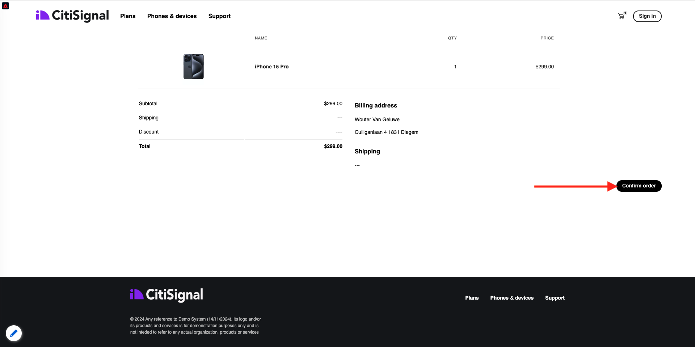

# 3.4.1 トリガーベースのジャーニーの設定 – 注文の確認

[Adobe Experience Cloud](https://experience.adobe.com) に移動して、Adobe Journey Optimizerにログインします。 **Journey Optimizer** をクリックします。


Journey Optimizerの **ホーム** ビューにリダイレクトされます。 最初に、正しいサンドボックスを使用していることを確認します。 使用するサンドボックスは `--aepSandboxName--` です。 その後、サンドボックス `--aepSandboxName--` ージの **ホーム** ビューに移動します。


## 3.4.1.1 イベントの作成

メニューで、「設定 **に移動し、「** イベント **の下の** 管理 **をクリックし** す。


**イベント** 画面には、次のようなビューが表示されます。 **イベントを作成** をクリックします。


空のイベント設定が表示されます。

まず、イベントに `--aepUserLdap--PurchaseEvent` のような名前を付け、`Purchase Event` のような説明を追加します。

**タイプ** の場合、「**単一**」を選択します。
「**イベント ID タイプ**」で、「**システム生成**」を選択します。


次に、スキーマを選択します。 この演習では、スキーマを準備しました。 スキーマ `Demo System - Event Schema for Website (Global v1.1) v.1` を使用してください。

スキーマを選択すると、「**ペイロード**」セクションで多数のフィールドが選択されます。 **編集/鉛筆** アイコンをクリックして、このイベントにフィールドを追加します。


このポップアップが表示されます。 このイベントがトリガーされたときに追加のデータにアクセスするには、追加のチェックボックスをオンにする必要があります。


まず、行 `--aepTenantId--` のチェックボックスをオンにします。


次に、下にスクロールして、行 `commerce` のチェックボックスをオンにします。


次に、下にスクロールして、行 `productListItems` のチェックボックスをオンにします。 「**OK**」をクリックします。



次に、追加のフィールドがイベントに追加されたことがわかります。 「**保存**」をクリックします。


その後、新しいイベントが保存され、利用可能なイベントのリストにイベントが表示されます。

イベントを再度クリックすると、**イベントを編集** 画面が再度開きます。
「**ペイロード**」フィールドに再度ポインタを合わせると、3 つのアイコンが再び表示されます。 **ペイロードを表示** アイコンをクリックします。


これで、期待されるペイロードの例が表示されます。 イベントには一意のオーケストレーション eventID があり、`_experience.campaign.orchestration.eventID` が表示されるまでペイロードを下にスクロールすると見つかります。


イベント ID は、次の手順で作成するジャーニーをトリガーにするためにAdobe Journey Optimizerに送信する必要があるものです。 この eventID は、次の手順の 1 つで必要になるので、書き留めておきます。
`"eventID": "1c8148a8ab1993537d0ba4e6ac293dd4f2a88d80b2ca7be6293c3b28d4ff5ae6"`

**OK** をクリックし、続いて **キャンセル** をクリックします。

イベントが設定され、使用する準備が整いました。

## 3.4.1.2 ジャーニーの作成

メニューで、**ジャーニーに移動し** 「**ジャーニーを作成**」をクリックします。


その後、これが表示されます。 ジャーニーに名前を付けます。 `--aepUserLdap-- - Order Confirmation journey`.を使用します。「**保存**」をクリックします。


まず、ジャーニーの出発点としてイベントを追加する必要があります。 イベント `--aepUserLdap--PurchaseEvent` を検索して、キャンバスにドラッグ&amp;ドロップします。 「**保存**」をクリックします。



次に、**アクション** で **メール** アクションを検索してキャンバスに追加します。


**カテゴリ** を **マーケティング** に設定し、メールを送信できるメールサーフェスを選択します。 この場合、選択するメールサーフェスは **メール** です。 **メールのクリック数** と **メールの開封数** のチェックボックスが両方とも有効になっていることを確認します。


次の手順では、メッセージを作成します。 それには、「**コンテンツを編集** をクリックします。


これが表示されます。 **件名** テキストフィールドをクリックします。


テキストエリアで **ご注文いただきありがとうございます** と書き始めて、**Personalization** アイコンをクリックします。


件名がまだ完了していません。 次に、`profile.person.name.firstName` に保存されている「名 **フィールドのパーソナライゼーショントークンを取り込む必要が** ります。 左側のメニューで、下にスクロールして **Person**/**Full name**/**First name** フィールドを見つけ、**+** アイコンをクリックして、パーソナライゼーショントークンを件名行に追加します。 「**保存**」をクリックします。


その後、ここに戻ります。 **メール本文を編集** をクリックして、メールのコンテンツを作成します。


次の画面で、「**ゼロからデザイン**」をクリックします。


左側のメニューには、メールの構造（行と列）を定義するために使用できる構造コンポーネントがあります。

**1:1 列** をキャンバスに 8 回ドラッグ&amp;ドロップします。これにより、次のことが得られます。


左側のメニューで、**フラグメント** に移動します。 先ほど [ 演習 3.1.2.1](./../module3.1/ex2.md) で作成したヘッダーを、キャンバスの最初のコンポーネントにドラッグします。 先ほど [ 演習 3.1.2.2](./../module3.1/ex2.md) で作成したフッターをキャンバスの最後のコンポーネントにドラッグします。


左側のメニューで「**+**」アイコンをクリックします。 **コンテンツ** に移動して、キャンバスへのコンテンツの追加を開始します。


**コンテンツ** に移動し、2 行目にある **画像** コンポーネントをドラッグ&amp;ドロップします。 **参照** をクリックします。


フォルダー **citi-signal-images** を開き、クリックして画像 **citisignal-preparing.png** を選択し、**選択** をクリックします。


**スタイル** で、幅を **40%** に変更します。


次に、**コンテンツ** に移動し、**テキスト** コンポーネントを 3 行目にドラッグ&amp;ドロップします。


そのコンポーネントのデフォルトのテキストを選択します **ここにテキストを入力してください。を** び出して、次のテキストに置き換えます。

```javascript
You’re one step closer!

Hi 

We've received your order details!

We will also send you a separate email containing your VAT Invoice.

We'll be back in touch with you as soon as we've finished packing your package. Please read carefully the Order Information detailed below.
```


テキスト **Hi** の隣にカーソルを置き、「**Personalizationを追加**」をクリックします。


**ユーザー**/**フルネーム**/**名** フィールドに移動し、「**+**」アイコンをクリックして、パーソナライゼーショントークンを件名行に追加します。 「**保存**」をクリックします。


次の画面が表示されます。


次に、**コンテンツ** に移動し、**テキスト** コンポーネントを 4 行目にドラッグ&amp;ドロップします。


そのコンポーネントのデフォルトのテキストを選択します **ここにテキストを入力してください。を** び出して、次のテキストに置き換えます。

`Order Information`

フォントサイズを **26px** に変更し、テキストをこのセルの中央に配置します。 すると、次のようになります。


次に、「**コンテンツ** に移動し、**HTML** コンポーネントを 5 行目にドラッグ&amp;ドロップします。 HTMLコンポーネントをクリックしてから、「**ソースコードを表示**」をクリックします。


**HTMLを編集** ポップアップで、次のHTMLを貼り付けます。

```<table><tbody><tr><td><b>Items purchased</b></td><td></td><td><b>Quantity</b></td><td><b>Subtotal</b></td></tr><tr><td colspan="4" width="500"><hr></td></tr></tbody></table>```

「**保存**」をクリックします。


これで完了です。 「**保存**」をクリックして、進行状況を保存します。


**コンテンツ** に移動し、6 行目にある **HTML** コンポーネントをドラッグ&amp;ドロップします。 HTMLコンポーネントをクリックしてから、「**ソースコードを表示**」をクリックします。


**HTMLを編集** ポップアップで、次のHTMLを貼り付けます。

```{{#each xxx as |item|}}<table width="500"><tbody><tr><td></td><td><table><tbody><tr><td><b>{{item.name}}</b><br>{{item.--aepTenantId--.core.subCategory}}<br><b>{{item.priceTotal}}</b><br>&nbsp;<br>Article no: {{item.SKU}}</td></tr></tbody></table></td><td>{{item.quantity}}</td><td><b>{{item.priceTotal}}</b></td></tr></tbody></table>{{/each}}```

すると、次のようになります。


**xxx** を、ジャーニーをトリガーするイベントの一部である productListItems オブジェクトへの参照で置き換える必要があります。


まず、HTMLコードで **xxx** を削除します。


左側のメニューで、「コンテキスト属性 **をクリックし** す。 このコンテキストは、ジャーニーからメッセージに渡されます。

その後、これが表示されます。 **Journey Orchestration** の横の矢印をクリックすると、より深くドリルできます。


**イベント** の横の矢印をクリックすると、より深くドリルできます。


`--aepUserLdap--PurchaseEvent` の横の矢印をクリックすると、ドリルの深さが表示されます。


**productListItems** の横の矢印をクリックすると、より深くドリルできます。


**名前** の横にある「**+**」アイコンをクリックして、キャンバスに追加します。 これで完了です。 以下のスクリーンショットに示すように **.name** を選択する必要があり、**.name** を削除する必要があります。


これで完了です。 「**保存**」をクリックします。


これで、メールDesignerに戻ります。 「**保存**」をクリックして、進行状況を保存します。


次に、「**コンテンツ** に移動し、**HTML** コンポーネントを 7 行目にドラッグ&amp;ドロップします。 HTMLコンポーネントをクリックしてから、「**ソースコードを表示**」をクリックします。


**HTMLを編集** ポップアップで、次のHTMLを貼り付けます。

```<table><tbody><tr><td><b>Subtotal</b><br>Delivery charge (included)</td><td align="right"><b>xxx</b><br><b>5</b></td></tr><tr><td colspan="2" width="500"><hr></td></tr><tr><td><b>Total including VAT</b></td><td align="right"><b>xxx</b></td></tr></tbody></table>```

このHTMLコードでは、**xxx** の参照が 2 つあります。 各 **xxx** を、ジャーニーをトリガーするイベントの一部である productListItems オブジェクトへの参照で置き換える必要があります。


まず、HTMLコードの最初の **xxx** を削除します。


左側のメニューで、「コンテキスト属性 **をクリックし** す。
**Journey Orchestration** の横の矢印をクリックすると、より深くドリルできます。


**イベント** の横の矢印をクリックすると、より深くドリルできます。


`--aepUserLdap--PurchaseEvent` の横の矢印をクリックすると、ドリルの深さが表示されます。


**Commerce** の横の矢印をクリックすると、より深くドリルできます。


**順序** の横の矢印をクリックすると、より深くドリルできます。


**価格合計** の横にある「**+**」アイコンをクリックすると、キャンバスに追加できます。


これで完了です。 次に、HTMLコードの 2 番目の **xxx** を削除します。


**価格合計** の横にある「**+**」アイコンをもう一度クリックして、キャンバスに追加します。
また、**Order** オブジェクト内からキャンバスに **Currency** フィールドを追加することもできます（こちらを参照）。
完了したら、「**保存** をクリックして変更を保存します。


その後、メールDesignerに戻ります。 もう一度 **保存** をクリックします。


メッセージダッシュボードに戻るには、左上隅の件名テキストの横にある **矢印** をクリックします。


左上隅の矢印をクリックして、ジャーニーに戻ります。


「**保存**」をクリックして、メールアクションを閉じます。


**Publish** をクリックして、ジャーニーを公開します。


もう一度 **0}Publish} をクリックします。**


これで、ジャーニーが公開されました。


## 3.4.1.5 Adobe Experience Platform Data Collection クライアントプロパティを更新する

[Adobe Experience Platform Data Collection に移動し ](https://experience.adobe.com/launch/) 「**Tags**」を選択します。

これは、以前に表示したAdobe Experience Platform データ収集のプロパティページです。


**はじめに** で、デモシステムは 2 つのクライアントプロパティを作成しました。1 つは Web サイト用、もう 1 つはモバイルアプリ用です。 **[!UICONTROL 検索]** ボックスで `--aepUserLdap--` を検索して見つけます。 クリックして **Web** プロパティを開きます。


**データ要素** に移動します。 データ要素 **XDM – 購入** を検索して開きます。


その後、これが表示されます。 **_experience.campaign.orchestration.eventID フィールドに移動し** ここに eventID を入力します。 ここで入力する eventID は、演習 3.4.1.1 の一部として作成した eventID です。**保存** または **ライブラリに保存** をクリックします。


プロパティで変更を保存し、開発ライブラリを更新して変更を公開します。


これで変更がデプロイされ、テストできます。

## 3.4.1.6 デモ Web サイトを使用して注文確認メールをテストします。

デモ Web サイトで製品を購入して、更新されたジャーニーをテストします。

[https://dsn.adobe.com](https://dsn.adobe.com) に移動します。 Adobe IDでログインすると、このが表示されます。 Web サイトプロジェクトで「。..**」** いう 3 つのドットをクリックし、「**実行**」をクリックして開きます。


その後、デモ Web サイトが開きます。 URL を選択してクリップボードにコピーします。


新しい匿名ブラウザーウィンドウを開きます。


前の手順でコピーしたデモ Web サイトの URL を貼り付けます。 その後、Adobe IDを使用してログインするように求められます。


アカウントタイプを選択し、ログインプロセスを完了します。


次に、匿名ブラウザーウィンドウに web サイトが読み込まれます。 演習ごとに、新しい匿名ブラウザーウィンドウを使用して、デモ Web サイトの URL を読み込む必要があります。


現在は不明なこの顧客のプライマリ ID として **0} ユーザー ID} を持つプロファイルビューアパネルとリアルタイムExperience Cloudプロファイルをご覧ください。**


登録/ログインページに移動します。 **アカウントを作成** をクリックします。


詳細を入力して **登録** をクリックすると、前のページにリダイレクトされます。


カートに商品を追加


**買い物かご** ページに移動します。 **チェックアウト** をクリックします。



次に、フィールドを検証し、必要に応じて入力します。 **続行** をクリックします。


**注文を確認** をクリックします。



ご注文を確定しました。


その後、数秒以内に注文確認メールが届きます。


この演習は完了しました。

次の手順：[3.4.2 バッチベースのニュースレタージャーニーを設定する ](./ex2.md)

[モジュール 3.4 に戻る](./journeyoptimizer.md)

[すべてのモジュールに戻る](../../../overview.md)
