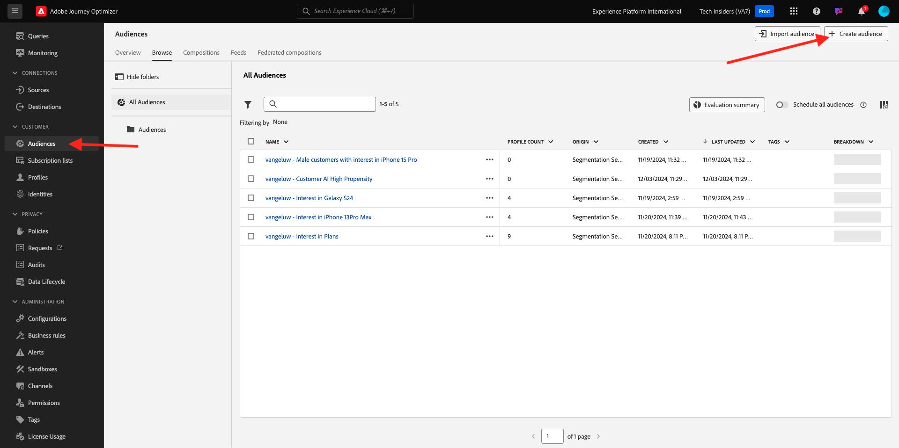
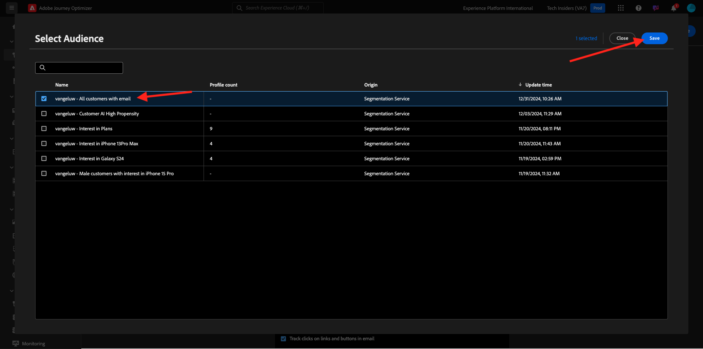
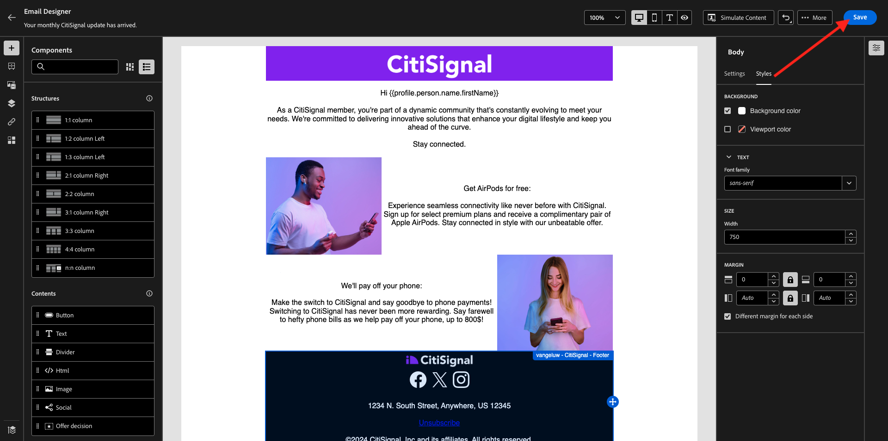
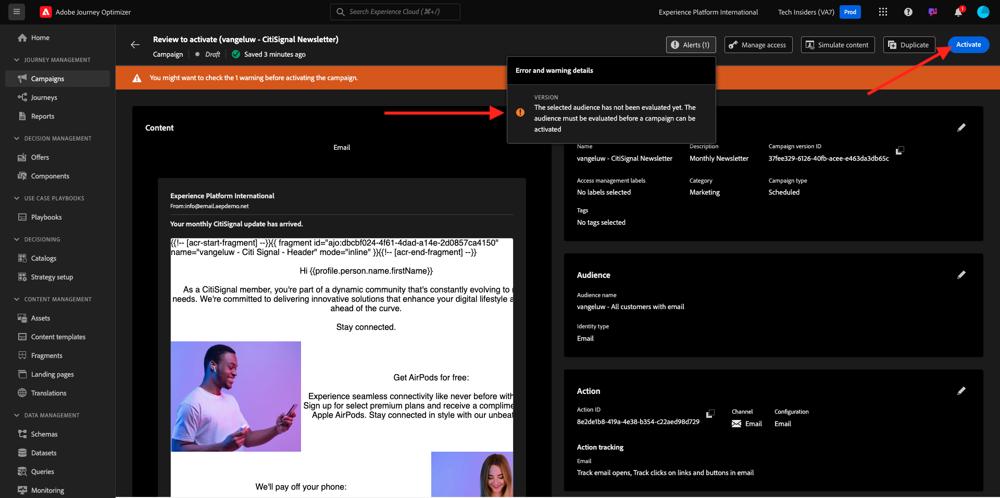

# 3.4.2 キャンペーンの設定

[Adobe Experience Cloud](https://experience.adobe.com) に移動して、Adobe Journey Optimizerにログインします。 **Journey Optimizer** をクリックします。


Journey Optimizerの **ホーム** ビューにリダイレクトされます。 最初に、正しいサンドボックスを使用していることを確認します。 使用するサンドボックスは `--aepSandboxName--` です。 その後、サンドボックス `--aepSandboxName--` ージの **ホーム** ビューに移動します。


## 3.4.2.1 オーディエンスの作成

キャンペーンを作成する前に、キャンペーンを受信するオーディエンスを定義する必要があります。 オーディエンスを作成するには、左側のメニューで **オーディエンス** に移動します。 以前に作成したすべてのオーディエンスがそこに表示されます。

「**+ オーディエンスを作成**」をクリックします。



「**ルールを作成**」を選択し、「**作成**」をクリックします。


**XDM 個人プロファイル /個人メール / アドレス** フィールドを選択し、キャンバスに追加します。 ルール条件を **存在** に設定します。

共有トレーニング環境の他のユーザーにメールが送信されないようにするために、**名が次と等しい – 名 –** などのフィルターを追加することもできます。

オーディエンスの名前を `--aepUserLdap-- - All customers with email` に設定し、「**Publish**」をクリックします。


オーディエンスが公開され、キャンペーンで使用できるようになりました。

## 3.4.2.2 ニュースレターキャンペーンの作成

次に、キャンペーンを作成します。 前の演習のイベントベースのジャーニーは、受信エクスペリエンスイベントやオーディエンスの入口または出口に依存して 1 人の特定顧客のジャーニーをトリガーにするのとは異なり、キャンペーンは、ニュースレター、1 回限りのプロモーション、一般的な情報などの一意のコンテンツで 1 回、またはインスタンスの誕生日キャンペーンやリマインダーなどの定期的に送信される同様のコンテンツで、オーディエンス全体をターゲットにします。

メニューで、「**キャンペーン**」に移動し、「**キャンペーンを作成**」をクリックします。


**スケジュール型 – マーケティング** を選択し、「**作成**」をクリックします。


キャンペーンの作成画面で、以下を設定します。

- **名前**:`--aepUserLdap-- - CitiSignal Newsletter`。
- **説明**：月刊ニュースレター
- **ID タイプ**：メールに変更

**オーディエンスを選択** をクリックします。


**オーディエンス** には、前の手順で作成したオーディエンス（`--aepUserLdap-- - All customers with email`）を選択します。 「**保存**」をクリックします。



**アクション** については、「**メール**」を選択し、既存の **メール設定** を選択します。 コンテンツは数分で編集できます。


**スケジュール** には、「**特定の日時に** を選択し、選択する時刻を設定します。


これで、メールメッセージ自体の作成を開始できます。 少し上にスクロールし、**コンテンツを編集** をクリックします。


その後、これが表示されます。 **件名** には、`Your monthly CitiSignal update has arrived.` を使用します。 次に、「**メール本文を編集**」をクリックします。


「**ゼロからデザイン**」を選択します。


その後、これが表示されます。 左側のメニューには、メールの構造（行と列）を定義するために使用できる構造コンポーネントがあります。

キャンバス上で **1:1 列** を 3 回、左に 1:2 列を 1 回、右に 2:1 列を 1 回ドラッグ&amp;ドロップすると、次の構造になります。


左側のメニューで、**フラグメント** に移動します。 先ほど [ 演習 3.1.2.1](./../module3.1/ex2.md) で作成したヘッダーを、キャンバスの最初のコンポーネントにドラッグします。 先ほど [ 演習 3.1.2.2](./../module3.1/ex2.md) で作成したフッターをキャンバスの最後のコンポーネントにドラッグします。


左側のメニューで「**+**」アイコンをクリックします。 **コンテンツ** に移動して、キャンバスへのコンテンツの追加を開始します。


**テキスト** コンポーネントを 2 行目にドラッグ&amp;ドロップします。


そのコンポーネントのデフォルトのテキストを選択します **ここにテキストを入力してください。を** して、次のテキストに置き換えます。 整列を **中央整列** に変更します。

```javascript
Hi {{profile.person.name.firstName}}

As a CitiSignal member, you're part of a dynamic community that's constantly evolving to meet your needs. We're committed to delivering innovative solutions that enhance your digital lifestyle and keep you ahead of the curve.

Stay connected.
```


**画像** コンポーネントを 3 行目と 4 行目にドラッグ&amp;ドロップします。 3 行目の **参照** をクリックします。


フォルダー **citi-signal-images** を開き、画像 **Offer_AirPods.jpg** をクリックして選択し、**選択** をクリックします。


4 行目の画像プレースホルダーにある **参照** をクリックします。


フォルダー **citi-signal-images** を開き、画像 **Offer_Phone.jpg** をクリックして選択し、「**選択**」をクリックします。


**テキスト** コンポーネントを 3 行目と 4 行目にドラッグ&amp;ドロップします。


3 行目のコンポーネントでデフォルトのテキストを選択します **ここにテキストを入力してください。を** して、次のテキストに置き換えます。

```javascript
Get AirPods for free:

Experience seamless connectivity like never before with CitiSignal. Sign up for select premium plans and receive a complimentary pair of Apple AirPods. Stay connected in style with our unbeatable offer.
```

4 行目のコンポーネントでデフォルトのテキストを選択します **ここにテキストを入力してください。を** して、次のテキストに置き換えます。

```javascript
We'll pay off your phone:

Make the switch to CitiSignal and say goodbye to phone payments! Switching to CitiSignal has never been more rewarding. Say farewell to hefty phone bills as we help pay off your phone, up to 800$!
```


これで、基本的なニュースレターのメールの準備が整いました。 「**保存**」をクリックします。



キャンペーンダッシュボードに戻るには、左上隅の件名行のテキストの横にある **矢印** をクリックします。


**アクティブ化するレビュー** をクリックします。


その後、このエラーが発生する場合があります。 その場合は、オーディエンスが評価されるまで最大 24 時間待ってから、もう一度キャンペーンをアクティブ化する必要がある可能性があります。 また、後で実行するようにキャンペーンのスケジュールを更新する必要がある場合もあります。

**アクティブ化** をクリックします。



アクティブ化すると、キャンペーンを実行するようにスケジュールされます。


これで、キャンペーンがアクティブ化されました。ニュースレターのメールメッセージは、スケジュールで定義したとおりに送信されます。キャンペーンは、最後のメールが送信されると停止します。

また、前に作成したデモプロファイルに使用したメールアドレスにもメールが届きます。


この演習は完了しました。

次の手順：[3.4.3 メールメッセージでセグメントベースのパーソナライゼーションを適用する ](./ex3.md)

[モジュール 3.4 に戻る](./journeyoptimizer.md)

[すべてのモジュールに戻る](../../../overview.md)
