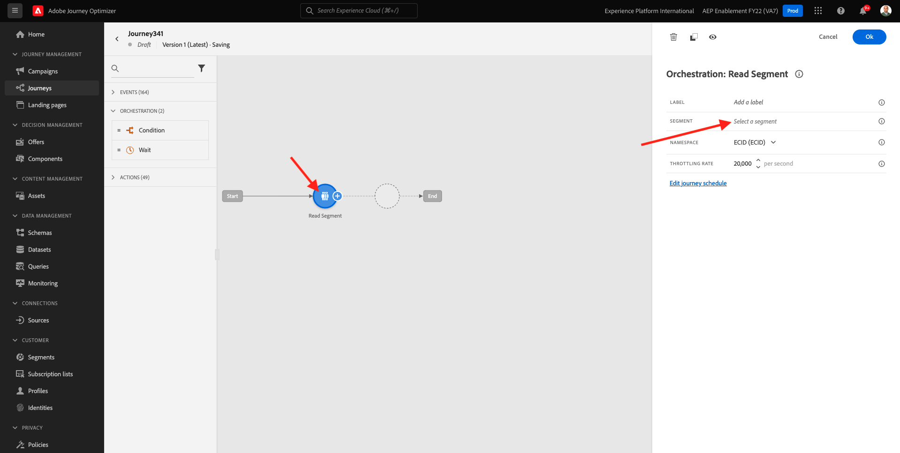
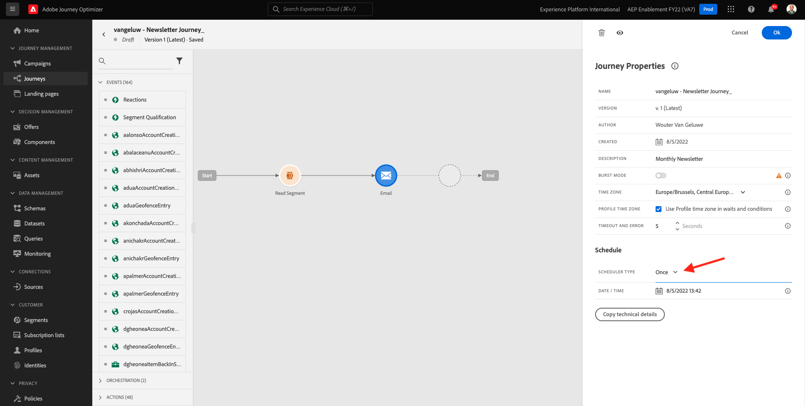

# 3.4.2 バッチベースのニュースレタージャーニーの設定

[Adobe Experience Cloud](https://experience.adobe.com) に移動して、Adobe Journey Optimizerにログインします。 **Journey Optimizer** をクリックします。

Journey Optimizerの **ホーム** ビューにリダイレクトされます。 最初に、正しいサンドボックスを使用していることを確認します。 使用するサンドボックスは `--aepSandboxName--` です。 サンドボックスを切り替えるには、「**実稼動製品（VA7）」をクリックし** リストからサンドボックスを選択します。 この例では、サンドボックスの名前は **AEP イネーブルメント FY22** です。 その後、サンドボックス `--aepSandboxName--` ージの **ホーム** ビューに移動します。

## 3.4.2.1 ニュースレタージャーニーの作成

ここでは、バッチベースのジャーニーを作成します。 前の演習のイベントベースのジャーニーは、受信するエクスペリエンスイベントやオーディエンスのエントリまたは離脱に依存して 1 人の顧客のジャーニーをトリガーするのとは異なり、バッチベースのジャーニーは、ニュースレター、1 回限りのプロモーション、一般的な情報などの一意のコンテンツで 1 回、またはインスタンスの誕生日キャンペーンやリマインダーなどの定期的に送信される同様のコンテンツで 1 回オーディエンス全体をターゲットにします。

メニューで、**ジャーニーに移動し** 「**ジャーニーを作成**」をクリックします。

右側に、ジャーニーの名前と説明を指定する必要があるフォームが表示されます。 次の値を入力します。

- **名前**:`--aepUserLdap-- - Newsletter Journey`。 例：**vangeluw - ニュースレタージャーニー**。
- **説明**：月刊ニュースレター

「**OK**」をクリックします。

**オーケストレーション** の下の **オーディエンスを読み取り** をキャンバスにドラッグ&amp;ドロップします。 つまり、公開が完了すると、オーディエンス全体を取得してジャーニーを開始し、ジャーニーとメッセージのターゲットオーディエンスになります。 **オーディエンスを選択** をクリックします。

**オーディエンスを選択** ポップアップで、LDAP を検索し、[ モジュール 2.3 - Real-time CDP - オーディエンスを作成してアクションを実行 ](./../../../modules/rtcdp-b2c/module2.3/real-time-cdp-build-a-segment-take-action.md) する `--aepUserLdap-- - Interest in Galaxy S24` という名前のオーディエンスを選択します。 「**保存**」をクリックします。

「**OK**」をクリックします。

左側のメニューで、「**アクション**」セクションを見つけ、**メール** アクションをキャンバスにドラッグ&amp;ドロップします。

**カテゴリ** を **マーケティング** に設定し、メールを送信できるメールサーフェスを選択します。 この場合、選択するメールサーフェスは **メール** です。 **メールのクリック数** と **メールの開封数** のチェックボックスが両方とも有効になっていることを確認します。

次の手順では、メッセージを作成します。 それには、「**コンテンツを編集** をクリックします。

これが表示されます。 **件名** テキストフィールドをクリックします。

件名行に次のテキストを入力します：`Luma Newsletter - your monthly update has arrived.` 「**保存**」をクリックします。

その後、ここに戻ります。 「**メールDesigner**」をクリックして、メールコンテンツの作成を開始します。

その後、これが表示されます。 **HTMLを読み込み** をクリックします。

ポップアップ画面で、メールのHTMLファイルをドラッグ&amp;ドロップする必要があります。 HTMLテンプレートは [ こちら ](./../../../assets/html/ajo-newsletter.html.zip) で確認できます。 HTMLテンプレートが含まれている zip ファイルをローカルマシンにダウンロードし、デスクトップに解凍します。

ファイル **ajo-newsletter.html** をドラッグ&amp;ドロップし、Journey Optimizerにアップロードします。 **インポート** をクリックします。

このメールコンテンツには、想定されるすべてのパーソナライゼーション、画像およびテキストが含まれているため、準備が整いました。 オファーのプレースホルダーのみが空のままになります。

次のエラーメッセージが表示されることがあります。**アセットを取得しようとしたときにエラーが発生しました**。 これはメール内の画像にリンクされています。

このエラーが発生した場合は、画像を選択して「**画像を編集**」ボタンをクリックします。

「**Assets Essentials**」をクリックしてAEM Assets Essentials ライブラリに戻ります。

このポップアップが表示されます。 フォルダー **enablement-assets** に移動して、画像 **luma-newsletterContent.png** を選択します。 「**選択**」をクリックします。

これで、基本的なニュースレターのメールの準備が整いました。 「**保存**」をクリックします。

メッセージダッシュボードに戻るには、左上隅の件名テキストの横にある **矢印** をクリックします。

左上隅の矢印をクリックして、ジャーニーに戻ります。

「**OK**」をクリックして、メールアクションを閉じます。

これで、ニュースレタージャーニーを公開する準備が整いました。 その前に、「**スケジュール**」セクションに注目してください。このセクションでは、このジャーニーを 1 回限りのキャンペーンから繰り返しキャンペーンに切り替えることができます。 **スケジュール** ボタンをクリックします。

その後、これが表示されます。 **1 回** を選択します。

ジャーニーをテストできるよう、次の 1 時間以内の日時を選択します。 「**OK**」をクリックします。

>[!NOTE]
>
>メッセージの送信日時は 1 時間以上である必要があります。

「**公開**」をクリックします。

もう一度 **0}Publish} をクリックします。**

これで、基本的なニュースレタージャーニーが公開されました。 ニュースレターのメールメッセージは、スケジュールで定義したとおりに送信されます。ジャーニーは、最後のメールが送信されると停止します。

この演習は完了しました。

次の手順：[3.4.3 メールメッセージにパーソナライゼーションを適用する ](./ex3.md)

[モジュール 3.4 に戻る](./journeyoptimizer.md)

[すべてのモジュールに戻る](../../../overview.md)
