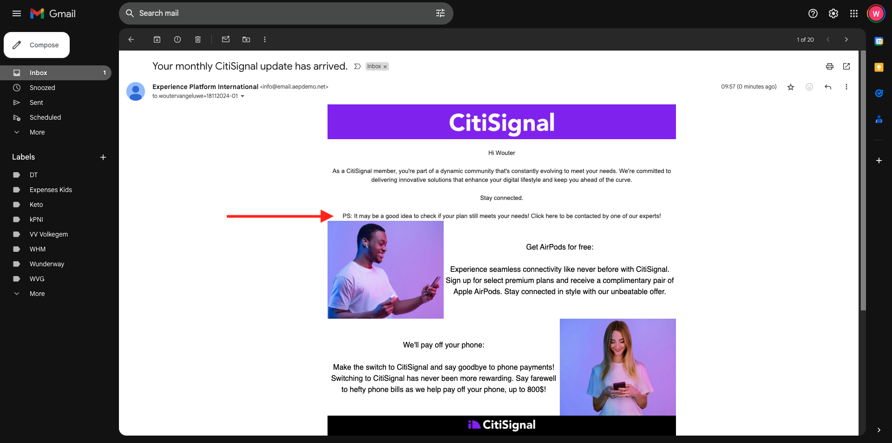

# 3.4.3 メールメッセージでのパーソナライゼーションの適用

[Adobe Experience Cloud](https://experience.adobe.com) に移動して、Adobe Experience Cloudにログインします。 **Adobe Journey Optimizer** をクリックします。

Journey Optimizerの **ホーム** ビューにリダイレクトされます。 続行する前に、**サンドボックス** を選択する必要があります。 選択するサンドボックスの名前は ``--aepTenantId--`` です。 これを行うには、画面上部の青い線のテキスト **[!UICONTROL 実稼動製品]** をクリックします。

## 3.4.3.1 セグメントベースのパーソナライゼーション

この演習では、セグメントメンバーシップに基づいてパーソナライズされたテキストを使用して、ニュースレターのメールメッセージを改善します。

**ジャーニー** に移動します。 前の演習で作成したニュースレタージャーニーを見つけます。 `--demoProfileLdap-- - Newsletter` を検索します。 ジャーニーをクリックして開きます。

その後、これが表示されます。 「**複製**」をクリックします。

「**複製**」をクリックします。

**メール** アクションを選択し、「**コンテンツを編集**」をクリックします。

**メールDesigner** をクリックします。

その後、これが表示されます。

**コンテンツコンポーネント** を開き、**テキスト** コンポーネントを現在のニュースレターコンテンツの下にドラッグします。

デフォルトのテキスト全体を選択して削除します。 次に、ツールバーの「**パーソナライゼーションを追加**」ボタンをクリックします。

次の画面が表示されます。

左側のメニューで、「**セグメントメンバーシップ**」をクリックします。

>[!NOTE]
>
>このリストでセグメントが見つからない場合は、少し下にスクロールして、セグメント ID を手動で取得する方法を確認します。

セグメント `Luma - Women's Category Interest` を選択し、「**+**」アイコンをクリックします。次のようになります。

その後、最初の行をそのままにし、行 2 と 3 をこのコードに置き換える必要があります。

``
    Psssst... a private sale in the women category will launch soon, we will keep you posted

    Thanks for taking the time to read our newsletter. Here is a 10% promo code to use on the website: READER10

``

すると、次のようになります。

「**検証**」をクリックして、コードが正しいことを確認します。 「**保存**」をクリックします。

右上隅の **保存** ボタンをクリックして、このメッセージを保存できます。 次に、「**コンテンツをシミュレート**」をクリックします。

このチュートリアルの一部として作成したプロファイルの 1 つを選択し、「**プレビュー**」をクリックします。 その後、設定の結果が表示されます。

その後、これが表示されます。 次に、「**閉じる** をクリックします。

メッセージダッシュボードに戻るには、左上隅の件名テキストの横にある **矢印** をクリックします。

左上隅の矢印をクリックして、ジャーニーに戻ります。

「**OK**」をクリックして、メールアクションを閉じます。

**スケジュール** を **1 回** に変更し、**日付/時刻** を定義します。 「**OK**」をクリックします。

>[!NOTE]
>
>メッセージの送信日時は 1 時間以上である必要があります。

ジャーニーの「**Publish**」ボタンをクリックします。

ポップアップウィンドウで、「**Publish**」をもう一度クリックします。

これで、基本的なニュースレタージャーニーが公開されました。 ニュースレターのメールメッセージはスケジュールに基づいて送信され、最後のメールが送信されるとジャーニーは停止します。

この演習は完了しました。

次の手順：[3.4.4 iOSのプッシュ通知を設定して使用する ](./ex4.md)

[モジュール 3.4 に戻る](./journeyoptimizer.md)

[すべてのモジュールに戻る](../../../overview.md)
