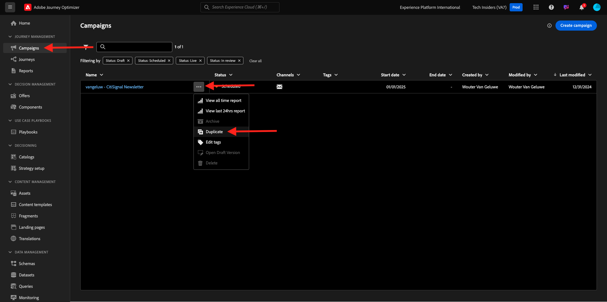
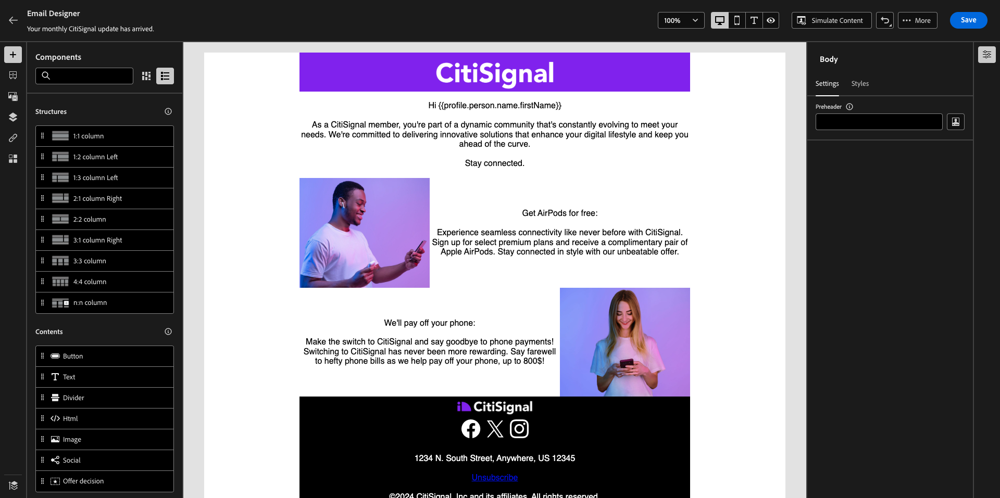

# 3.4.3 メールメッセージでのセグメントベースのパーソナライゼーションの適用

[Adobe Experience Cloud](https://experience.adobe.com) に移動して、Adobe Experience Cloudにログインします。 **Adobe Journey Optimizer** をクリックします。

Journey Optimizerの **ホーム** ビューにリダイレクトされます。 続行する前に、**サンドボックス** を選択する必要があります。 選択するサンドボックスの名前は ``--aepTenantId--`` です。

## 3.4.3.1 セグメントベースのパーソナライゼーション

この演習では、前の演習で作成したニュースレターのメールメッセージを、セグメントメンバーシップに基づいてパーソナライズされたテキストで改善します。

**キャンペーン** に移動します。 前の演習で作成したニュースレタージャーニーを見つけます。 `--aepUserLdap-- - CitiSignal Newsletter` を検索します。 3 つのドット **...** を右クリックし、「**複製**」をクリックします。

その後、これが表示されます。 **タイトル**:`--aepUserLdap-- - CitiSignal Newsletter (SBP)` に使用します。 「**複製**」をクリックします。

複製したキャンペーンをクリックして開きます。

**編集** をクリックして、コンテンツを変更します。

**メール本文を編集** をクリックします。

その後、これが表示されます。

**コンテンツコンポーネント** を開き、**1:1 列** を AirPods オファーの上にドラッグします。

**テキスト** コンポーネントを 1:1 列にドラッグ&amp;ドロップします。

デフォルトのテキスト全体を選択して削除します。 次に、ツールバーの「**パーソナライゼーションを追加**」ボタンをクリックします。

その後、これが表示されます。 左側のメニューで、「**オーディエンス**」をクリックします。

セグメント `--aepUserLdap-- - Interest in Plans` を選択し、「**+**」アイコンをクリックしてキャンバスに追加します。

その後、最初の行をそのままにし、行 2 と 3 をこのコードに置き換える必要があります。

``
    PS: It may be a good idea to check if your plan still meets your needs! Click here to be contacted by one of our experts!

    PS: Thanks for taking the time to read our newsletter. Here is a 10% promo code to use on the website: NEWSLETTER10

``

これで完了です。 「**保存**」をクリックします。

テキストの整列を **中央揃え** に変更します。

右上隅の **保存** ボタンをクリックして、このメッセージを保存できます。 次に、左上隅の件名行のテキストの横にある **矢印** をクリックします。

**アクティブ化するレビュー** をクリックします。

**アクティブ化** をクリックします。

これで、セグメントベースのパーソナライゼーションを使用したニュースレターが公開されました。 ニュースレターのメールメッセージはスケジュールに基づいて送信され、最後のメールが送信されるとジャーニーは停止します。

使用されたセグメントに適合すると、次の内容がメールで表示されます。

この演習は完了しました。

次の手順：[3.4.4 iOSのプッシュ通知を設定して使用する ](./ex4.md)

[モジュール 3.4 に戻る](./journeyoptimizer.md)

[すべてのモジュールに戻る](../../../overview.md)
