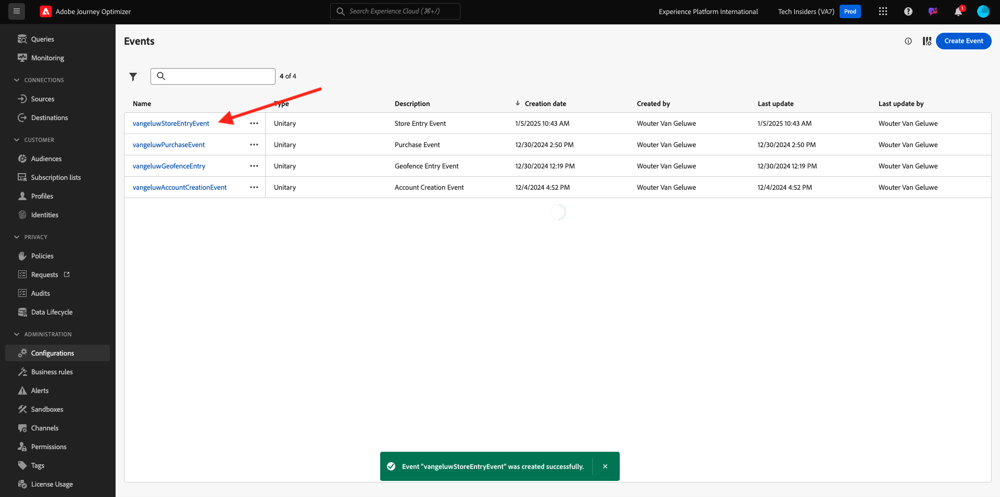
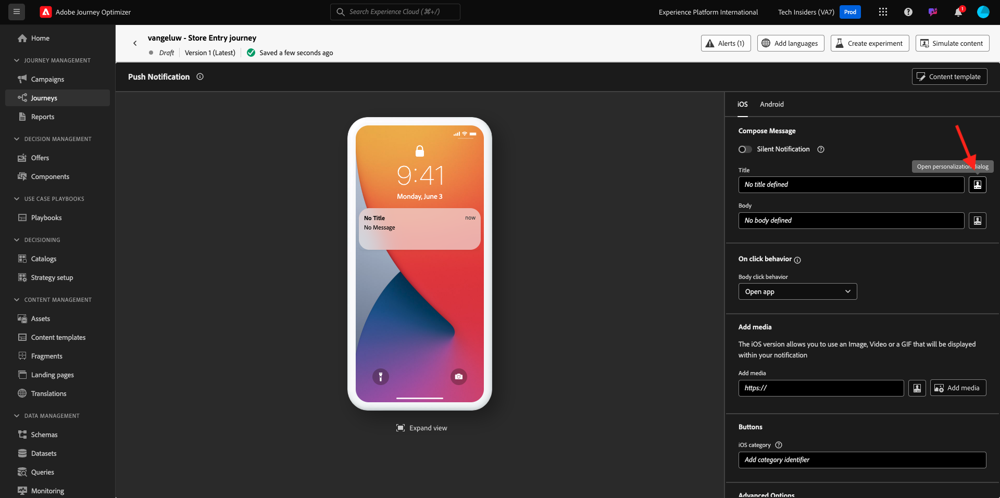

# 3.4.4 iOS用のプッシュ通知の設定と使用

Adobe Journey Optimizerでプッシュ通知を使用するには、確認して知っておくべき設定がいくつかあります。

検証するすべての設定を次に示します。

- Adobe Experience Platformのデータセットとスキーマ
- モバイル用データストリーム
- モバイルのデータ収集プロパティ
- プッシュ証明書のアプリサーフェス
- AEP Assuranceを使用したプッシュ設定のテスト

1 つずつ見ていきましょう。

[Adobe Experience Cloud](https://experience.adobe.com) に移動して、Adobe Journey Optimizerにログインします。 **Journey Optimizer** をクリックします。

Journey Optimizerの **ホーム** ビューにリダイレクトされます。 最初に、正しいサンドボックスを使用していることを確認します。 使用するサンドボックスは `--aepSandboxName--` です。 その後、サンドボックス `--aepSandboxName--` ージの **ホーム** ビューに移動します。

## 3.4.4.1 プッシュデータセット

Adobe Journey Optimizerは、データセットを使用して、モバイルデバイスからのプッシュトークンや、プッシュメッセージとのインタラクション（送信済みメッセージ、開封されたメッセージなど）をAdobe Journey Optimizerのデータセットに保存します。

これらのデータセットは、画面左側のメニューにある **[!UICONTROL データセット]** に移動すると見つかります。 システムデータセットを表示するには、フィルターアイコンをクリックします。

「**システムデータセットを表示** オプションを有効にして、**AJO** を検索します。 プッシュ通知に使用するデータセットが表示されます。

## 3.4.4.2 モバイル用データストリーム

[https://experience.adobe.com/#/data-collection/](https://experience.adobe.com/#/data-collection/) に移動します。

左側のメニューで、**[!UICONTROL データストリーム]** に移動し、[&#x200B; はじめに &#x200B;](./../../../modules/gettingstarted/gettingstarted/ex2.md) で作成したデータストリームを検索します。名前は `--aepUserLdap-- - Demo System Datastream (Mobile)` です。 クリックして開きます。

**2&rbrace;Adobe Experience Platform** サービスの「編集 **をクリックします。**

次に、定義したデータストリーム設定と、どのデータセットイベントおよびプロファイル属性に保存されるかを確認します。

また、まだ有効になっていない場合は、次のオプションを有効にする必要があります。

- **Offer Decisioning**
- **パーソナライゼーションの宛先**
- **Adobe Journey Optimizer**

「**保存**」をクリックします。

## 3.4.4.3 モバイルのデータ収集プロパティを確認する

[https://experience.adobe.com/#/data-collection/](https://experience.adobe.com/#/data-collection/) に移動します。 [&#x200B; はじめに &#x200B;](./../../../modules/gettingstarted/gettingstarted/ex1.md) の一部として、2 つのデータ収集プロパティが作成されました。
これらのデータ収集クライアントプロパティは、既に以前のモジュールの一部として使用しています。

クリックして、モバイルのデータ収集プロパティを開きます。

データ収集プロパティで、「**拡張機能**」に移動します。 次に、モバイルアプリに必要な様々な拡張機能が表示されます。 クリックして、拡張機能 **Adobe Experience Platform Edge Network** を開きます。

その後、モバイルのデータストリームがここにリンクされていることがわかります。 次に、「**キャンセル**」をクリックして、拡張機能の概要に戻ります。

その後、ここに戻ってきます。 **AEP Assurance** の拡張機能が表示されます。 AEP Assuranceは、モバイルアプリでデータを収集したりエクスペリエンスを提供したりする方法を検査、配達確認、シミュレートおよび検証するのに役立ちます。 AEP Assuranceとプロジェクト Griffon について詳しくは、[https://aep-sdks.gitbook.io/docs/beta/project-griffon](https://aep-sdks.gitbook.io/docs/beta/project-griffon) を参照してください。

次に、「**設定**」をクリックして、拡張機能 **2&rbrace;Adobe Journey Optimizer&rbrace; を開きます。**

プッシュイベントをトラッキングするデータセットがリンクされている場所がわかります。

データ収集プロパティを変更する必要はありません。

## 3.4.4.4 アプリサーフェスの設定の確認

[https://experience.adobe.com/#/data-collection/](https://experience.adobe.com/#/data-collection/) に移動します。 左側のメニューで **アプリサーフェス** に移動し、「DX Demo App APNS **のアプリサーフェスを開き** す。

iOSとAndroid用に設定されたアプリサーフェスが表示されます。

## 3.4.4.5 AEP Assuranceを使用したプッシュ通知の設定のテスト。

アプリがインストールされると、デバイスのホーム画面に表示されます。 アイコンをクリックして、アプリを開きます。

アプリを初めて使用する場合は、Adobe IDを使用してログインするように求められます。 ログインプロセスを完了します。

ログインすると、通知を送信する権限を要求する通知が表示されます。 チュートリアルの一部として通知を送信するので、「**許可**」をクリックします。

その後、アプリのホームページが表示されます。 **設定** に移動します。

設定では、現在 **公開プロジェクト** がアプリに読み込まれていることがわかります。 **カスタムプロジェクト** をクリックします。

これで、カスタムプロジェクトを読み込めるようになりました。 QR コードをクリックして、プロジェクトを簡単に読み込みます。

**はじめに** の節を実行すると、次の結果が得られます。 クリックして、作成された **モバイル小売プロジェクト** を開きます。

誤ってブラウザーウィンドウを閉じてしまった場合や、今後のデモまたはイネーブルメントセッションの際には、[https://dsn.adobe.com/projects](https://dsn.adobe.com/projects) にアクセスして web サイトプロジェクトにアクセスすることもできます。 Adobe IDでログインすると、このが表示されます。 モバイルアプリプロジェクトをクリックして開きます。

次に、「**実行** をクリックします。

QR コードを含むこのポップアップが表示されます。 モバイルアプリ内からこの QR コードをスキャンします。

プロジェクト ID がアプリに表示されたら、「**保存**」をクリックします。

次に、アプリで **ホーム** に戻ります。 これで、アプリを使用する準備が整いました。

ここでは、QR コードをスキャンして、モバイルデバイスを AEP Assurance セッションに接続する必要があります。

AEP Assurance セッションを開始するには、[https://experience.adobe.com/#/data-collection/](https://experience.adobe.com/#/data-collection/) に移動します。 左側のメニューで **0&rbrace;Assurance&rbrace; をクリックします。**&#x200B;次に、「**セッションを作成**」をクリックします。

「**開始**」をクリックします。

次の値を入力します。

- セッション名：`--aepUserLdap-- - push debugging` を使用して、ldap を ldap に置き換えます
- ベース URL：使用 `dxdemo://default`

「**次へ**」をクリックします。

画面に QR コードが表示されるので、iOS デバイスでスキャンする必要があります。

モバイルデバイスでカメラアプリを開き、AEP Assuranceに表示される QR コードをスキャンします。

PIN コードを入力するように求めるポップアップ画面が表示されます。 AEP Assurance画面から PIN コードをコピーし、「**接続**」をクリックします。

その後、これが表示されます。

Assuranceでは、デバイサーがAssurance セッションにアクセスすることがわかります。 「**完了**」をクリックします。

**プッシュデバッグ** に移動します。

>[!NOTE]
>
>左側のメニューに **プッシュデバッグ** が見つからない場合は、画面の左下にある **設定** をクリックし、メニューに **プッシュデバッグ** を追加します。

このようなものが表示されます。

説明：

- 最初の列 **クライアント** には、iOS デバイスで使用可能な識別子が表示されます。 ECID とプッシュトークンが表示されます。
- 2 番目の列には、演習 **3.4.5.4 Launch でのアプリ設定の作成** の一部として設定された **App Store資格情報と設定** が表示されます。
- 2 番目の列には、**プロファイル** 情報と、プッシュトークンが格納されているプラットフォーム（APNS または APNSSandbox）に関する追加情報が表示されます。 「**Inspect プロファイル**」ボタンをクリックすると、Adobe Experience Platformに移動し、完全なリアルタイム顧客プロファイルが表示されます。

プッシュ設定をテストするには、「**テストプッシュ設定を送信** ボタンに移動します。 「**テストプッシュ通知を送信**」をクリックします

**プッシュ通知を送信** ボタンをクリックしたときに **DX デモ** アプリが開いていないことを確認する必要があります。 アプリが開いている場合、プッシュ通知はバックグラウンドで受信され、表示されない可能性があります。

次に、このようなプッシュ通知がモバイルデバイスに表示されます。

プッシュ通知を受け取った場合は、設定が正しく、正常に機能しており、実際のジャーニーを作成して、Journey Optimizerからプッシュメッセージを送信できるようになりました。

## 3.4.4.6 新しいイベントの作成

**Journey Optimizer** に移動します。 左側のメニューで、**設定** に移動し、**イベント** の下の **管理** をクリックします。

**イベント** 画面には、次のようなビューが表示されます。 **イベントを作成** をクリックします。

空のイベント設定が表示されます。
まず、イベントに `--aepUserLdap--StoreEntryEvent` のような名前を付け、説明を `Store Entry Event` に設定します。
次に「**イベントタイプ** の選択です。 **単一** を選択します。
次に、「**イベント ID タイプ** の選択です。 「**システム生成**」を選択します。

次に、スキーマを選択します。 この演習では、スキーマを準備しました。 スキーマ `Demo System - Event Schema for Mobile App (Global v1.1) v.1` を使用してください。

スキーマを選択すると、「**ペイロード**」セクションで多数のフィールドが選択されます。 これで、イベントが完全に設定されました。

「**保存**」をクリックします。

これで、イベントが設定され、保存されました。 イベントを再度クリックすると、**イベントを編集** 画面が再度開きます。

**ペイロード** フィールドにマウスポインターを置き、**ペイロードを表示** アイコンをクリックします。

これで、期待されるペイロードの例が表示されます。

イベントには一意のオーケストレーション eventID があり、`_experience.campaign.orchestration.eventID` が表示されるまでペイロードを下にスクロールすると見つかります。

イベント ID は、次の手順で作成するジャーニーをトリガーにするためにAdobe Experience Platformに送信する必要があるものです。 次の手順で必要になるので、この eventID を書き留めます。
`"eventID": "89acd341ec2b7d1130c9a73535029debf2ac35f486bc99236b1a5091d6f4bc68"`

**OK** をクリックし、続いて **キャンセル** をクリックします。

## 3.4.4.7 ジャーニーの作成

メニューで、**ジャーニーに移動し** 「**ジャーニーを作成**」をクリックします。

その後、これが表示されます。 ジャーニーに名前を付けます。 `--aepUserLdap-- - Store Entry journey`.を使用します。「**保存**」をクリックします。

まず、ジャーニーの出発点としてイベントを追加する必要があります。 イベント `--aepUserLdap--StoreEntryEvent` を検索して、キャンバスにドラッグ&amp;ドロップします。 「**保存**」をクリックします。

次に、**アクション** で **プッシュ** アクションを検索します。 **プッシュ** アクションをキャンバスにドラッグ&amp;ドロップします。

**カテゴリ** を **マーケティング** に設定し、プッシュ通知の送信を可能にするプッシュサーフェスを選択します。 この場合、選択するメールサーフェスは **プッシュ - iOS - Android** です。

>[!NOTE]
>
>前に説明したように、**アプリサーフェス** を使用しているJourney Optimizer内にチャネルが存在する必要があります。

次の手順では、メッセージを作成します。 それには、「**コンテンツを編集** をクリックします。

その後、これが表示されます。 **タイトル** フィールドの **パーソナライズ機能** アイコンをクリックします。

その後、これが表示されます。 リアルタイム顧客プロファイルから任意のプロファイル属性を直接選択できるようになりました。

フィールド **名** を検索し、フィールド **名** の横にある **+** アイコンをクリックします。 次に、名のパーソナライゼーショントークンが追加されています：**{{profile.person.name.firstName}}**。

次に、テキスト **を追加します。**{{profile.person.name.firstName}}**の後ろに** る。

「**保存**」をクリックします。

あなたはこれを手に入れました。 **本文** フィールドの **パーソナライズ機能** アイコンをクリックします。

このテキストを入力してください **今日ご購入いただくと、10% の割引が適用されます。** 保存 **をクリック** ます。

これで完了です。 左上隅の矢印をクリックして、ジャーニーに戻ります。

「**保存**」をクリックして、プッシュアクションを閉じます。

「**公開**」をクリックします。

もう一度 **0&rbrace;Publish&rbrace; をクリックします。**

これで、ジャーニーが公開されました。

## 3.4.4.8 ジャーニーのテストとプッシュメッセージ

DX Demo 2.0 モバイルアプリケーションで、**設定** 画面に移動します。 **ストアエントリ** ボタンをクリックします。

>[!NOTE]
>
>「**ストアエントリ**」ボタンは現在実装中です。 アプリにはまだ表示されません。

**ストアエントリ** アイコンをクリックした後、必ずアプリを直ちに閉じてください。閉じないと、プッシュメッセージは表示されません。

数秒後に、メッセージが表示されます。

この演習は完了しました。

次の手順：[&#x200B; 概要とメリット &#x200B;](./summary.md)

[モジュール 3.4 に戻る](./journeyoptimizer.md)

[すべてのモジュールに戻る](../../../overview.md)
