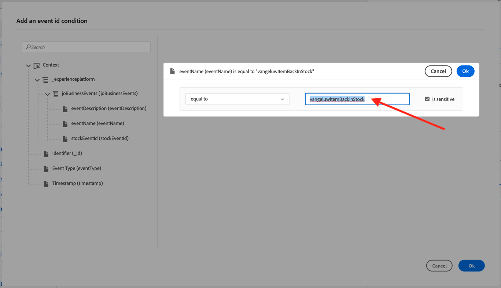

# 3.4.5 ビジネスイベントジャーニーの作成

[Adobe Experience Cloud](https://experience.adobe.com) に移動して、Adobe Journey Optimizerにログインします。 **Journey Optimizer** をクリックします。


Journey Optimizerの **ホーム** ビューにリダイレクトされます。 最初に、正しいサンドボックスを使用していることを確認します。 使用するサンドボックスは `--aepSandboxName--` です。 サンドボックスを切り替えるには、「**実稼動製品（VA7）」をクリックし** リストからサンドボックスを選択します。 この例では、サンドボックスの名前は **AEP イネーブルメント FY22** です。 その後、サンドボックス `--aepSandboxName--` ージの **ホーム** ビューに移動します。


## 3.4.5.1 ビジネスイベントの作成

左側のメニューで、「**設定**」をクリックします。 **イベント** カード内の **管理** ボタンをクリックします。


ビジネスイベントは、Journey Optimizer内で作成できる新しいタイプのイベントです。 以前のモジュールで作成した **単一** イベントとは異なり、ビジネスイベントは顧客ではなく、組織によってトリガーされます。 次に、ビジネスイベントを作成します。

**イベントを作成** をクリックします。


イベント作成フォームに次の値を入力します。

- **名前**:`--aepUserLdap--ItemBackInStock`。 例：**vangeluwItemBackInStock**
- **説明**：このイベントは、製品が再入荷したときにトリガーされます
- **タイプ**：ドロップダウンで「**ビジネス**」を選択します


スキーマの場合、「**デモシステム - JO ビジネスイベントのイベントスキーマ （グローバル v1.1） v.1**」を選択します。 次に、ユースケースに必要なスキーマ内のフィールドを選択する必要があります。


次の手順に従います。

**1 フィールドが選択されている** と表示されているフィールドの **鉛筆** アイコンをクリックします。


スキーマ内の使用可能なすべてのフィールドを選択し、「**OK**」をクリックします。


条件の場合：このスキーマのどのレコードがビジネスイベントをトリガーするかを指定する必要があります。

次の手順に従います。

フィールド上の「**条件を追加**」と表示されている **鉛筆** アイコンをクリックします。


左側で、`--aepTenantId--` オブジェクトを展開し、オブジェクト **joBusinessEvents** を展開して、フィールド **eventName** をキャンバスにドラッグ&amp;ドロップします。


「**eventName**」フィールドに次の値を入力します。`--aepUserLdap--ItemBackInStock` 例：vangeluwItemBackInStock。
「**OK**」をクリックします。



「**OK**」をクリックします。


最後に、イベント作成フォームは次のようになります。 「**保存**」をクリックして、ビジネスイベントを保存します。


## 3.4.5.2 ビジネスイベントジャーニーの作成

このビジネスイベントとメッセージをジャーニー内で活用できるようになりました。 **ジャーニー** に移動します。 **ジャーニーを作成** をクリックします。


右側に、ジャーニーの名前と説明を指定する必要があるフォームが表示されます。 次の値を入力します。

- **名前**:`--aepUserLdap-- - Item back in stock journey`。 例：vangeluw - Item back in stock journey
- **説明**：このジャーニーは、アイテムが再入荷すると、関心を示した訪問者に SMS を送信します。

「**OK**」をクリックします。


左側のメニューの **イベント** で、LDAP を検索します。 以前に作成したビジネスイベント `--aepUserLdap--ItemBackInStock` が表示されます。 このイベントはジャーニーの開始点になるので、キャンバスにドラッグ&amp;ドロップします。


ご覧のように、**セグメントを読み取り** アクティビティが自動的にキャンバスに追加されました。 これは、ビジネスイベントが、特定のセグメントを読み取るためのトリガーをジャーニーに送信するだけで、そのジャーニーのプロファイルのリストが取得されるからです。

**セグメントを読み取り** アクティビティをクリックします。
**セグメントを読み取り** 設定では、発生したビジネスイベントを通知するセグメントを選択する必要があります。 「**セグメントを選択**」フィールドをクリックします。


**セグメントを選択** ポップアップで、LDAP を検索し、[ モジュール 2.3 - Real-time CDP - セグメントを作成してアクションを実行 ](./../../../modules/rtcdp-b2c/module2.3/real-time-cdp-build-a-segment-take-action.md) という名前のセグメントを選択し `--aepUserLdap-- - Interest in PROTEUS FITNESS JACKSHIRT` す。 例：vangeluw - Interest in PROTEUS FITNESS JACKSHIRT。 「**保存**」をクリックします。


次に、「**OK**」をクリックします。


次の手順では、このジャーニーで実行するアクションをドラッグ&amp;ドロップします。 アクション **SMS** を選択し、追加した条件の後にドラッグ&amp;ドロップします。


**カテゴリ** を **マーケティング** に設定し、SMS を送信できる SMS サーフェスを選択します。 この場合、選択するメールサーフェスは **SMS** です。


次の手順では、メッセージを作成します。 それには、「**コンテンツを編集** をクリックします。


メッセージダッシュボードが表示され、SMS のテキストを設定できます。 **メッセージを作成** エリアをクリックして、メッセージを作成します。


次のテキストを入力します：`Hi {{profile.person.name.firstName}}, the Proteus Fitness Jackshirt is back in stock at Luma.`。 「**保存**」をクリックします。


メッセージダッシュボードに戻るには、左上隅の件名テキストの横にある **矢印** をクリックします。


完了した SMS アクションが表示されます。 「**OK**」をクリックします。


これで、ジャーニーを公開する準備が整いました。 「**公開**」をクリックします。


もう一度 **0}Publish} をクリックします。**


ジャーニーが公開され、テストできるようになりました。


## 3.4.5.3 ビジネスイベントジャーニーのテスト

Postmanを使用して、**デモシステム - JO Business Events （Global v1.1） v.1 のイベントスキーマ** に対して新しいイベントを取り込み、商品の再入荷をシミュレートします。

左側のメニューで **ソース** をクリックし、「**アカウント**」タブをクリックします。


「**アカウント**」タブには、**Journey Optimizer Business Events** という名前のアカウントがあります。 クリックして開きます。


このアカウントにはデータフローが 1 つしかありません。データフロー名をクリックして選択します。


右側のメニューで **スキーマペイロードをコピー** をクリックします。 このオプションは、**curl** コマンド全体をコピーして、**デモシステム - JO ビジネスイベントのイベントスキーマ （グローバル v1.1） v.1** に対するレコードをクリップボードに挿入します。


Curl コマンドをテキストエディター内に貼り付け


このリクエストを詳しく見てみましょう。

- POSTリクエストは DCS インレット ID に送信されます
- リクエストでは、スキーマ、データセット、組織 ID が参照されます。
- 最後に、データセット内に作成するデータを表す xdmEntity ノードが含まれます。

次の `xdmEntity` 行を置き換える必要があります…

```json
"xdmEntity": {
  "_experienceplatform": {
    "joBusinessEvents": {
      "eventDescription": "string",
      "eventName": "string",
      "stockEventId": "string"
    }
  },
  "_id": "/uri-reference",
  "eventType": "advertising.completes",
  "timestamp": "2018-11-12T20:20:39+00:00"
}
```

...この行で、必ず eventName フィールド（ジャーニーをトリガーにするためにビジネスイベントで指定した条件を表す）を `--aepUserLdap--ItemBackInStock` と指定するように確認します。

```json
"xdmEntity": {
  "_experienceplatform": {
    "joBusinessEvents": {
      "eventDescription": "Product Proteus Fitness Jackshirt is back in stock",
      "eventName": "--aepUserLdap--ItemBackInStock",
      "stockEventId": "1"
    }
  },
  "_id": "/uri-reference",
  "eventType": "productBackInStock",
  "timestamp": "2021-04-19T15:25:39+00:00"
}
```

更新された **curl** コマンドは次のようになります。


すべてを選択し、クリップボードにコピーします。

Postmanを開きます。 Postmanの左側で、「**読み込み**」をクリックします。


「**生のテキスト**」タブを選択し、以前にここにコピーしたコマンドを貼り付けます。 「**続行**」をクリックします。


**インポート** をクリックします。


Postmanは、**curl** コマンドを、トリガー準備が整った REST コマンドに自動変換しました。**Send** ボタンを押して、データセット内のそのレコードの作成をリクエストするだけです。


リクエストが正常に受信されたことを確認します。 Postman で **200 OK** ステータスを探します。


SMS が携帯電話に届くまでに数分かかる場合があります。 そうでない場合、**Proteus Fitness Jackshirt への関心** セグメントには、正しい携帯電話を持つプロファイルが含まれていない可能性があります。 その場合は、Luma の web サイトにアクセスし、**Proteus Fitness Jackshirt** 製品にアクセスして、正しい携帯電話番号を入力していることを確認しながら登録します。


これで、この演習は完了です。

次の手順：[ 概要とメリット ](./summary.md)

[モジュール 3.4 に戻る](./journeyoptimizer.md)

[すべてのモジュールに戻る](../../../overview.md)
