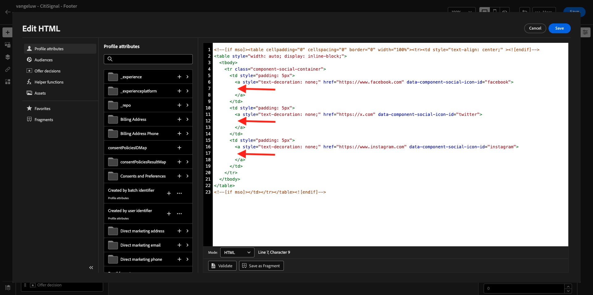
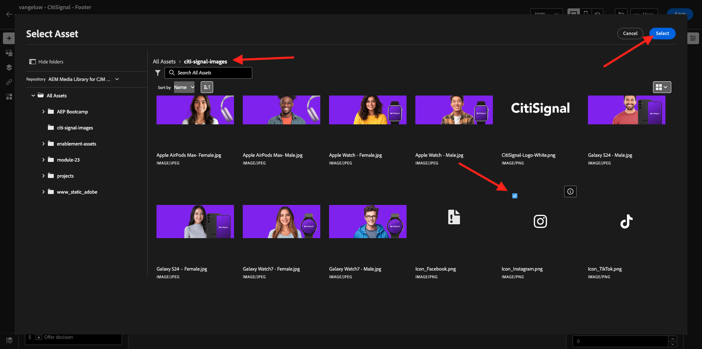
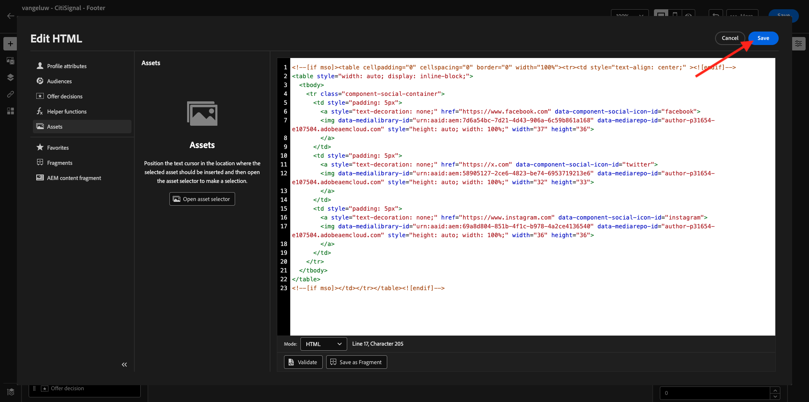
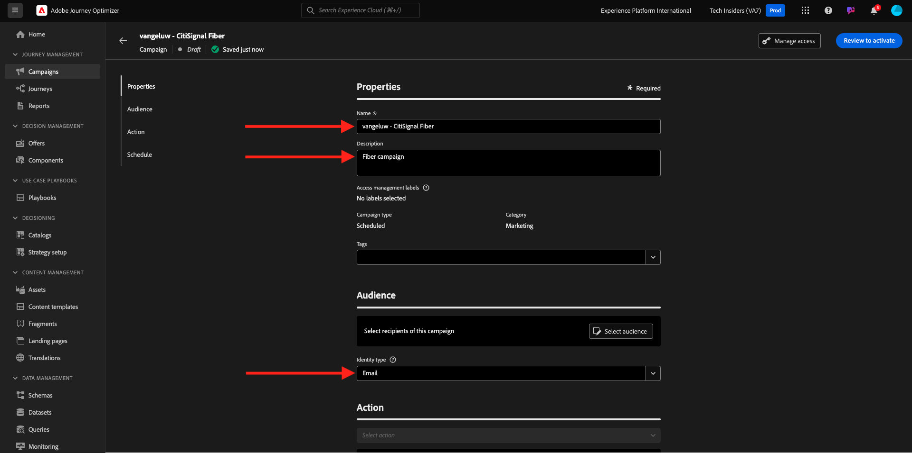
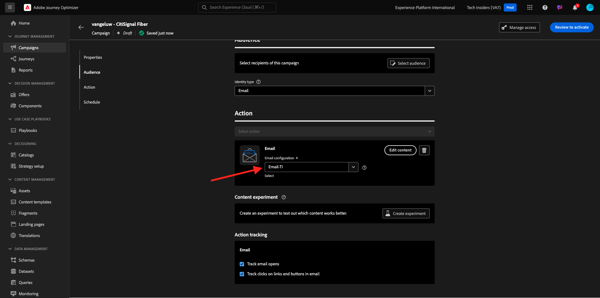
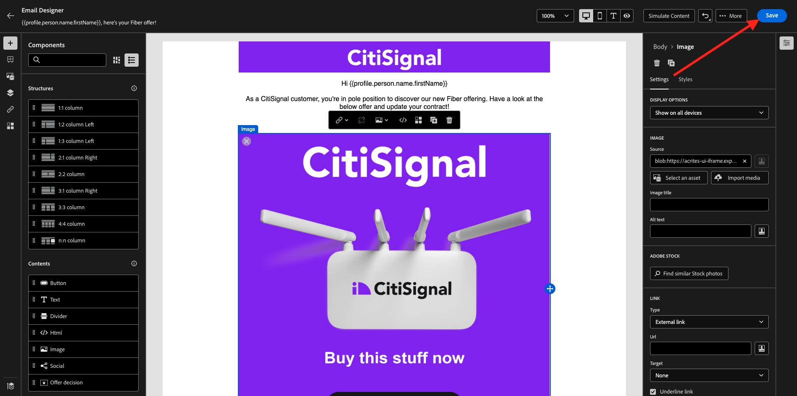

# 3.5.2 キャンペーンの作成

[https://experience.adobe.com/](https://experience.adobe.com/) に移動します。 **Journey Optimizer** をクリックします。


Journey Optimizerの **ホーム** ビューにリダイレクトされます。 最初に、正しいサンドボックスを使用していることを確認します。 使用するサンドボックスは `--aepSandboxName--` です。


>[!NOTE]
>
>演習 [ 演習 3.1.2.1](./../module3.1/ex2.md) および [ 演習 3.1.2.2](./../module3.1/ex2.md) の一部として既にヘッダーとフッターのフラグメントを作成している場合は、演習 3.5.2.3 のファイバーの作成キャンペーンに進んでください。 ヘッダーフラグメントとフッターフラグメントを再度作成しないでください。

## 3.5.2.1 ヘッダーフラグメントを作成する

左側のメニューで、「**フラグメント**」をクリックします。 フラグメントは、Journey Optimizer内の再利用可能なコンポーネントで、重複を回避し、メールメッセージのヘッダーやフッターの変更など、すべてのメッセージに影響を与える将来の変更を容易にします。

**フラグメントを作成** をクリックします。


`--aepUserLdap-- - CitiSignal - Header` という名前を入力し、**タイプ：ビジュアルフラグメント** を選択します。 「**作成**」をクリックします。


その後、これが表示されます。 左側のメニューには、メールの構造（行と列）を定義するために使用できる構造コンポーネントがあります。

メニューからキャンバスに **1:1 列** をドラッグ&amp;ドロップします。 これがロゴ画像のプレースホルダーになります。


次に、コンテンツコンポーネントを使用して、これらのブロック内にコンテンツを追加できます。 **画像** コンポーネントを最初の行の最初のセルにドラッグ&amp;ドロップします。 **参照** をクリックします。


ポップアップが開き、AEM Assets Media Libraryが表示されます。 フォルダー **citi-signal-images** に移動し、画像 **CitiSignal-Logo-White.png** をクリックして選択し、**選択** をクリックします。

>[!NOTE]
>
>AEM Assetsライブラリに Citi Signal 画像が表示されない場合は、[ こちら ](../../../assets/ajo/CitiSignal-images.zip) で見つけることができます。 デスクトップにダウンロードし、フォルダー **citi-signal-images** を作成し、そのフォルダー内のすべての画像をアップロードします。


その後、これが表示されます。 画像は白で、まだ表示されていません。 画像を正しく表示するための背景色を定義する必要があります。 **スタイル** をクリックし、「**背景色** ボックスをクリックします。


ポップアップで、**16 進数** カラーコードを **#8821F4** に変更し、「**100%**」フィールドをクリックしてフォーカスを変更します。 次に、画像に適用された新しい色を確認します。


今のイメージも少し大きいです。 **幅** スイッチャーを **40%** にスライドして幅を変更します。


これで、ヘッダーフラグメントの準備が整いました。 「**保存**」をクリックし、矢印をクリックして前の画面に戻ります。


フラグメントを使用するには、公開する必要があります。 「**公開**」をクリックします。


数分後、フラグメントのステータスが **ライブ** に変更されたことがわかります。
次に、メールメッセージのフッター用に新しいフラグメントを作成する必要があります。 **フラグメントを作成** をクリックします。


## 3.5.2.2 フッターフラグメントの作成

**フラグメントを作成** をクリックします。


`--aepUserLdap-- - CitiSignal - Footer` という名前を入力し、**タイプ：ビジュアルフラグメント** を選択します。 「**作成**」をクリックします。


その後、これが表示されます。 左側のメニューには、メールの構造（行と列）を定義するために使用できる構造コンポーネントがあります。

メニューからキャンバスに **1:1 列** をドラッグ&amp;ドロップします。 これがフッターコンテンツのプレースホルダーになります。


次に、コンテンツコンポーネントを使用して、これらのブロック内にコンテンツを追加できます。 **HTML** コンポーネントを最初の行の最初のセルにドラッグ&amp;ドロップします。 コンポーネントをクリックして選択し、「**&lt;/>**」アイコンをクリックしてHTMLソースコードを編集します。


その後、これが表示されます。


以下のHTMLコードフラグメントをコピーして、Journey Optimizerの **HTMLを編集** ウィンドウに貼り付けます。

```html
<!--[if mso]><table cellpadding="0" cellspacing="0" border="0" width="100%"><tr><td style="text-align: center;" ><![endif]-->
<table style="width: auto; display: inline-block;">
  <tbody>
    <tr class="component-social-container">
      <td style="padding: 5px">
        <a style="text-decoration: none;" href="https://www.facebook.com" data-component-social-icon-id="facebook">
        
        </a>
      </td>
      <td style="padding: 5px">
        <a style="text-decoration: none;" href="https://x.com" data-component-social-icon-id="twitter">
        
        </a>
      </td>
      <td style="padding: 5px">
        <a style="text-decoration: none;" href="https://www.instagram.com" data-component-social-icon-id="instagram">
         
        </a>
      </td>
    </tr>
  </tbody>
</table>
<!--[if mso]></td></tr></table><![endif]-->
```

これで完了です。 7、12、17 行目で、AEM Assets ライブラリのアセットを使用して画像ファイルを挿入する必要があります。



カーソルが 7 行目にあることを確認し、左側のメニューで **Assets** をクリックします。 **アセットセレクターを開く** をクリックして、画像を選択します。


フォルダー **citi-signal-images** を開き、クリックして画像 **Icon_Facebook.png** を選択します。 「**選択**」をクリックします。


カーソルが 12 行目にあることを確認し、**アセットセレクターを開く** をクリックして画像を選択します。


フォルダー **citi-signal-images** を開き、クリックして画像 **Icon_X.png** を選択します。 「**選択**」をクリックします。


カーソルが 17 行目にあることを確認し、**アセットセレクターを開く** をクリックして画像を選択します。


フォルダー **citi-signal-images** を開き、クリックして画像 **Icon_Instagram.png** を選択します。 「**選択**」をクリックします。



その後、これが表示されます。 「**保存**」をクリックします。



その後、エディターに戻ります。 背景と画像ファイルがすべて白になっているため、アイコンはまだ表示されません。 背景色を変更するには、「**スタイル**」に移動し、「**背景色**」チェックボックスをクリックします。


**16 進数** のカラーコードを **#000000** に変更します。


中央揃えに変更します。


フッターに他の部分を追加しましょう。 **画像** コンポーネントを、作成したHTMLコンポーネントの上にドラッグ&amp;ドロップします。 **参照** をクリックします。


をクリックして画像ファイル **`CitiSignal_Footer_Logo.png`** を選択し、**選択** をクリックします。


「**スタイル**」に移動し、「**背景色**」チェックボックスをクリックして、もう一度黒に変更します。 **16 進数** のカラーコードを **#000000** に変更します。


幅を **20%** に変更し、線形が中央揃えに設定されていることを確認します。


次に、**テキスト** コンポーネントを、作成したHTMLコンポーネントの下にドラッグ&amp;ドロップします。 **参照** をクリックします。


プレースホルダーテキストを置き換えて、以下のテキストをコピー&amp;ペーストします。

```
1234 N. South Street, Anywhere, US 12345

Unsubscribe

©2024 CitiSignal, Inc and its affiliates. All rights reserved.
```

中央揃えにする **テキストの配置** を設定します。


**フォントカラー** を白、**#FFFFFF** に変更します。


**背景色** を黒、**#000000** に変更します。


フッターでテキスト **登録解除** を選択し、メニューバーの **リンク** アイコンをクリックします。 **タイプ** を **外部オプトアウト/購読解除** に設定し、URL を **https://aepdemo.net/unsubscribe.html** に設定します（購読解除リンクの空白の URL を持つことはできません）。


これで完了です。 これで、フッターの準備が整いました。 「**保存**」をクリックし、矢印をクリックして前のページに戻ります。


**Publish** をクリックしてフッターを公開し、メールで使用できるようにします。


数分後、フッターのステータスが **ライブ** に変更されます。


## 3.5.2.3 ファイバキャンペーンの作成

次に、キャンペーンを作成します。 前の演習のイベントベースのジャーニーは、受信エクスペリエンスイベントやオーディエンスの入口または出口に依存して 1 人の特定顧客のジャーニーをトリガーにするのとは異なり、キャンペーンは、ニュースレター、1 回限りのプロモーション、一般的な情報などの一意のコンテンツで 1 回、またはインスタンスの誕生日キャンペーンやリマインダーなどの定期的に送信される同様のコンテンツで、オーディエンス全体をターゲットにします。

メニューで、「**キャンペーン**」に移動し、「**キャンペーンを作成**」をクリックします。


**スケジュール型 – マーケティング** を選択し、「**作成**」をクリックします。


キャンペーンの作成画面で、以下を設定します。

- **名前**:`--aepUserLdap-- - CitiSignal Fiber`。
- **説明**：ファイバーキャンペーン
- **ID タイプ**：メールに変更



**アクション** までスクロールします。 **アクション** については、「**メール**」を選択します。


次に、既存の **メール設定** を選択します。 コンテンツは数分で編集できます。



**オーディエンス** までスクロールします。 **オーディエンスを選択** をクリックします。


**オーディエンス** については、[1.3.3 フェデレーション構成の作成 ](./../../datacollection/module1.3/ex3.md) で作成したオーディエンス（「`--aepUserLdap-- - CitiSignal Eligible for Fiber`」という名前）を選択します。 「**保存**」をクリックします。


**スケジュール** までスクロールします。 **スケジュール** には、「**特定の日時に** を選択し、選択する時刻を設定します。


これで、メールメッセージ自体の作成を開始できます。 上にスクロールし、「**コンテンツを編集**」をクリックします。


その後、これが表示されます。 **件名** には、次を使用します。

```
{{profile.person.name.firstName}}, here's your Fiber offer!
```

次に、「**メール本文を編集**」をクリックします。


「**ゼロからデザイン**」を選択します。


その後、これが表示されます。 左側のメニューには、メールの構造（行と列）を定義するために使用できる構造コンポーネントがあります。

キャンバス上で **1:1 列** を 4 回ドラッグ&amp;ドロップします。これにより、次の構造が得られます。


左側のメニューで、**フラグメント** に移動します。 先ほど作成したヘッダーをキャンバスの最初のコンポーネントにドラッグします。 先ほど作成したフッターをキャンバスの最後のコンポーネントにドラッグします。


左側のメニューで「**+**」アイコンをクリックします。 **コンテンツ** に移動して、キャンバスへのコンテンツの追加を開始します。


**テキスト** コンポーネントを 2 行目にドラッグ&amp;ドロップします。


そのコンポーネントのデフォルトのテキストを選択します **ここにテキストを入力してください。を** して、次のテキストに置き換えます。 整列を **中央整列** に変更します。

```javascript
Hi {{profile.person.name.firstName}}

As a CitiSignal customer, you're in pole position to discover our new Fiber offering. Have a look at the below offer and update your contract!

Stay connected.
```


**画像** コンポーネントを 3 行目にドラッグ&amp;ドロップします。 **参照** をクリックします。


以前のモジュールの一部として作成したAEM Assets リポジトリを選択します。 そのリポジトリの名前は `--aepUserLdap-- - Citi Signal dev` にする必要があります。 クリックして、フォルダー `--aepUserLdap-- - Workfront Assets` を開きます。


画像 **2048 x 2048_buynow.png** をクリックして選択し、「**選択**」をクリックします。


これで、基本的なニュースレターのメールの準備が整いました。 「**保存**」をクリックします。



キャンペーンダッシュボードに戻るには、左上隅の件名行のテキストの横にある **矢印** をクリックします。


**アクティブ化するレビュー** をクリックします。


その後、このエラーが発生する場合があります。 その場合は、オーディエンスが評価されるまで最大 24 時間待ってから、もう一度キャンペーンをアクティブ化する必要がある可能性があります。 また、後で実行するようにキャンペーンのスケジュールを更新する必要がある場合もあります。


**アクティブ化** をクリックします。


アクティブ化すると、キャンペーンが実行されるようにスケジュールされます。


この演習は完了しました。

## 次の手順

[3.5.3 メールへの言語の追加 ](./ex3.md)

[ モジュール 3.5](./ajotranslationsvcs.md){target="_blank"} に戻ります。

[ すべてのモジュール ](./../../../overview.md){target="_blank"} に戻る
