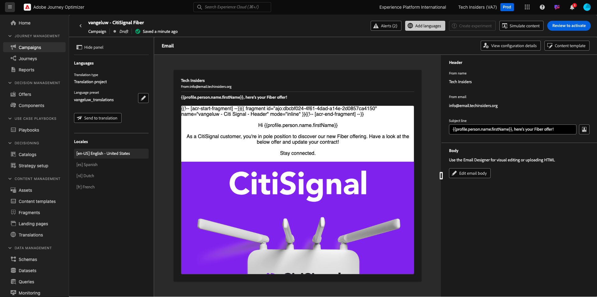

# 3.5.3 メールへの言語の追加

[https://experience.adobe.com/](https://experience.adobe.com/) に移動します。 **Journey Optimizer** をクリックします。

Journey Optimizerの **ホーム** ビューにリダイレクトされます。 最初に、正しいサンドボックスを使用していることを確認します。 使用するサンドボックスは `--aepSandboxName--` です。

**キャンペーン** に移動し、クリックして、作成したキャンペーンを開きます。

**キャンペーンを変更** をクリックします。

「**変更**」をクリックします。

**メール** アクションまでスクロールダウンし、「**コンテンツを編集**」をクリックします。

**言語を追加** をクリックします。

`--aepUserLdap--_translations` という名前の **言語設定** を選択します。 「**選択**」をクリックします。

この画像が表示されます。 **翻訳に送信** をクリックします。

次のようなメッセージが表示されます。 **翻訳に送信** ワークフローが開始されました。完了するまでに数分かかります。
ステータスが **翻訳中** に変わります。

数分後、翻訳ワークフローのステータスが **翻訳完了** に変わります。

**`[es] Spanish`** 翻訳をクリックします。 その後、更新されたテキストがメールのプレビューと **件名** に表示されます。
必要な場合は、「件名 **フィールドで直接翻訳を確認し** 更新できます。

**メール本文を編集** をクリックして、メール内の翻訳を確認します。

翻訳をレビューする必要がある場合は、テキストを手動で変更できます。

左上隅の件名テキストの横にある **矢印** をクリックして、キャンペーンの概要に戻ります。

その後、あなたはここに戻るべきです。 このキャンペーンを再びアクティブ化する必要はありません。

左上隅の **矢印** をクリックして、キャンペーンに戻ります。

キャンペーンが **停止** 状態であることを確認してください。

これで、この演習が完了しました。

## 次の手順

[ 概要とメリット ](./summary.md) に移動します。

[ モジュール 3.5](./ajotranslationsvcs.md){target="_blank"} に戻ります。

[ すべてのモジュール ](./../../../overview.md){target="_blank"} に戻る
