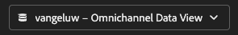
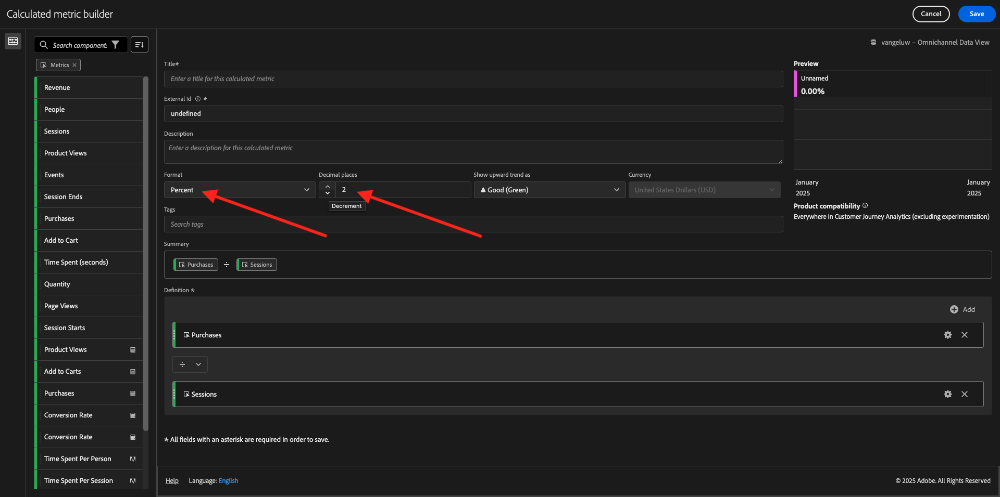

# 4.1.4 Analysis Workspaceでのデータ準備

## 目標

- CJA でのAnalysis Workspace UI について
- Analysis Workspaceのデータ準備の概念を理解する
- データ計算の実行方法を学ぶ

## 4.1.4.1 CJA のAnalysis Workspace UI

Analysis Workspaceでは、1 つの Analytics レポートに特有の制限がすべて取り除かれます。 カスタム分析プロジェクトを作成するための堅牢で柔軟なキャンバスを提供します。 任意の数のデータテーブル、ビジュアライゼーションおよびコンポーネント（ディメンション、指標、セグメントおよび時間精度）をプロジェクトにドラッグ&amp;ドロップします。 分類およびセグメントを即座に作成し、分析のコホートを作成し、アラートを作成し、セグメントを比較し、フローおよびフォールアウト分析を行い、ビジネス内の任意のユーザーと共有するためのレポートをキュレーションおよびスケジュールします。

Customer Journey Analyticsにより、このソリューションが Platform データの上に置かれます。 この 4 分間の概要ビデオを視聴することを強くお勧めします。

>[!VIDEO](https://video.tv.adobe.com/v/35109?quality=12&learn=on)

これまでAnalysis Workspaceを使用したことがない場合は、このビデオを視聴することを強くお勧めします。

>[!VIDEO](https://video.tv.adobe.com/v/26266?quality=12&learn=on)

### プロジェクトの作成

次に、最初の CJA プロジェクトを作成します。 CJA 内の「プロジェクト」タブに移動します。
**新規作成** をクリックします。

その後、これが表示されます。 「**空のプロジェクト**」を選択し、「**作成**」をクリックします。

その後、空のプロジェクトが表示されます。

最初に、画面の右上隅で正しいデータビューを選択してください。 この例では、選択するデータビューは `vangeluwe - Omnichannel Data View` です。

次に、プロジェクトを保存し、名前を付けます。 次のコマンドを使用して保存できます。

| OS | ショートカット |
| ----------------- |-------------| 
| Windows | コントロール + S |
| Mac | Command + S |

次のポップアップが表示されます。

次の命名規則を使用してください。

| 名前 | 説明 |
| ----------------- |-------------| 
| `--demoProfileLdap-- - Omnichannel Analysis` | `--demoProfileLdap-- - Omnichannel Analysis` |

次に、「**保存** をクリックします。

## 4.1.4.2 計算指標

データビューのすべてのコンポーネントは整理していますが、ビジネスユーザーが分析を開始する準備を整えるために、一部のコンポーネントを調整する必要があります。 また、分析中に計算指標を作成して、インサイトの結果をさらに深く把握できます。

例として、データビューで定義した **購入** 指標/イベントを使用して **コンバージョン率** を計算して作成します。

### コンバージョン率

計算指標ビルダーを開きます。 「**+**」をクリックして、Analysis Workspaceで最初の計算指標を作成します。

**計算指標ビルダー** が表示されます。

左側のメニューの指標のリストで **購入** を見つけます。 **指標** で **すべて表示** をクリックします

次に、**購入** 指標を計算指標の定義にドラッグ&amp;ドロップします。

通常、コンバージョン率は **コンバージョン / セッション** を意味します。 計算指標の定義キャンバスでも同じ計算を行います。 **セッション** 指標を見つけて、**購入** イベントの下の定義ビルダーにドラッグ&amp;ドロップします。

除算演算子が自動的に選択されます。

コンバージョン率は通常、パーセンテージで表されます。 そのため、形式をパーセンテージに変更し、2 桁の小数も選択します。

最後に、計算指標の名前と説明を変更します。

| タイトル | 説明 |
| ----------------- |-------------| 
| コンバージョン率 | コンバージョン率 |

画面には次のようになります。

計算指標を **保存** することを忘れないでください。

## 4.1.4.3 計算Dimension：フィルター（セグメント化）と日付範囲

### フィルター：計算Dimension

計算は、指標のみに使用するためのものではありません。 分析を始める前に、いくつかの **計算Dimension** を作成するのも興味深いです。 これは基本的に、Adobe Analyticsに戻ると **セグメント** を意味していました。 Customer Journey Analyticsでは、これらのセグメントは **フィルター** と呼ばれます。

フィルターを作成すると、ビジネスユーザーは、いくつかの有用な計算ディメンションを使用して分析を開始できます。 これにより、一部のタスクが自動化され、導入の部分も支援されます。 次に例を示します。

1. 所有メディア、有料メディア、
2. 新規訪問と再訪問
3. 放棄された買い物かごを持つ顧客

これらのフィルターは、分析部分の前または実行中に作成できます（次の演習で行います）。

### 日付範囲：計算されたDimension

時間Dimensionは、別のタイプの計算ディメンションです。 既に作成されているものもありますが、データ準備段階で独自のカスタム時間Dimensionを作成する機能もあります。

これらの計算時間のDimensionは、アナリストやビジネスユーザーが重要な日付を思い出し、それらを使用してレポート時間をフィルタリングおよび変更するのに役立ちます。 分析を行う際に頭に浮かぶ典型的な質問や疑問：

- 去年のブラックフライデーはいつでしたか。 21 日から 29 日？
- 12 月のテレビキャンペーンはいつ行われましたか？
- 2018 年のサマーセールはいつからいつまで行われたのですか？ 2019 年と比較したい。 ところで、2019 年の正確な日を知っていますか。

これで、CJA Analysis Workspaceを使用したデータ準備演習が完了しました。

次の手順：Customer Journey Analyticsを使用した [4.1.5 ビジュアライゼーション ](./ex5.md)

[モジュール 4.1 に戻る](./customer-journey-analytics-build-a-dashboard.md)

[すべてのモジュールに戻る](./../../../overview.md)
