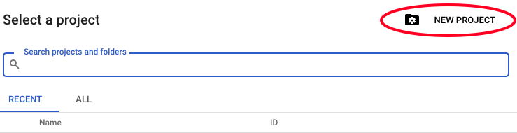
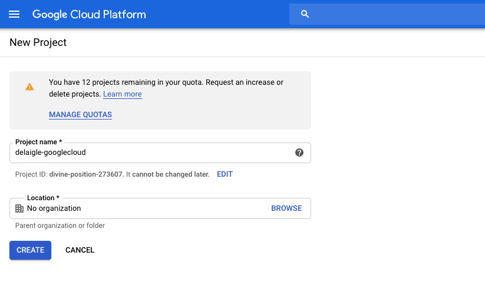

# 4.2.1 Google Cloud Platform アカウントの作成

## 目標

- Google Cloud Platform アカウントの作成
- Google Cloud Platform コンソールの理解
- BigQuery プロジェクトの作成と準備

## 4.2.1.1 Google BigQuery をAdobe Experience Platformに接続してGoogle Analyticsデータを取得する理由

Google Cloud Platform （GCP）は、Googleが提供するパブリッククラウドコンピューティングサービスのスイートです。 Google Cloud Platform には、Google ハードウェア上で実行される、コンピューティング、ストレージ、アプリケーション開発用のホストされたサービスが幅広く含まれています。

BigQuery は、これらのサービスの 1 つであり、常にGoogle Analytics360 に含まれています。 Google Analyticsデータは、データを直接取得しようとする場合に、頻繁にサンプリングされます（API など）。 そのため、Googleには BigQuery が含まれており、サンプルされていないデータを取得できるため、企業は SQL を使用してアドバンス分析を実行でき、GCP の機能を活用できます。

Google Analyticsデータは、バッチメカニズムを使用して BigQuery に毎日読み込まれます。 したがって、この GCP/BigQuery 統合をリアルタイムパーソナライゼーションおよびアクティベーションのユースケースに使用することは意味がありません。

ブランドがGoogle Analyticsデータに基づいてリアルタイムパーソナライゼーションのユースケースを提供したい場合、Google Tag Manager を使用して web サイト上でそのデータを収集し、リアルタイムでAdobe Experience Platformにストリーミングできます。

GCP/BigQuery Source コネクタは、以下の目的で使用する必要があります。

- web サイト上のすべての顧客行動を追跡し、そのデータをAdobe Experience Platformに読み込むことで、リアルタイムのアクティベーションを必要としない分析、データサイエンス、パーソナライゼーションのユースケースを実現します。
- Google Analyticsの履歴データをAdobe Experience Platformに読み込む（分析およびデータサイエンスのユースケース用）

## 4.2.1.2 Google アカウントの作成

Google Cloud Platform アカウントを取得するには、Google アカウントが必要です。

## 4.2.1.3 Google Cloud Platform アカウントのアクティブ化

Google アカウントが用意できたので、Google Cloud Platform 環境を作成できます。 その場合は、[https://console.cloud.google.com/](https://console.cloud.google.com/) にアクセスしてください。

次のページで、利用条件に同意します。

次に、「**プロジェクトを選択**」をクリックします。

**新規プロジェクト** をクリックします。

この命名規則に従ってプロジェクトに名前を付けます。

| 条約 | 例 |
| ----------------- |-------------| 
| `--aepUserLdap---googlecloud` | デライグル・グーグルクラウド |

「**作成**」をクリックします。

画面の右上に表示される通知で、作成が完了したことが示されるまで待ちます。 次に、「**プロジェクトを表示**」をクリックします。

次に、画面上部の検索バーに移動し、「**BigQuery**」と入力します。 最初の結果を選択します。

その後、BigQuery コンソールにリダイレクトされ、ポップアップメッセージが表示されます。

**「完了」をクリックします**。

このモジュールの目標は、Google AnalyticsデータをAdobe Experience Platformに取り込むことです。 これを行うには、まずGoogle Analyticsデータセットにダミーデータが必要です。

左側のメニューで **データを追加** をクリックし、次に **公開データセットを調査** をクリックします。

次のウィンドウが表示されます。

検索バーに検索語句「**Google Analyticsサンプル**」を入力し、最初の結果を選択します。

次の画面に、データセットの説明が表示されます。 **データセットを表示** をクリックします。

その後、BigQuery にリダイレクトされ、この **bigquery-public-data** データセットが **エクスプローラー** に表示されます。

**エクスプローラー** には、多数のテーブルが表示されます。 自由に探索してください。 `google_analytics_sample` に移動します。

クリックしてテーブル `ga_sessions` を開きます。

次の演習に進む前に、次の内容をコンピュータ上の別のテキスト ファイルに書き留めてください。

| 資格情報 | 名前付け | 例 |
| ----------------- |-------------| -------------|
| プロジェクト名 | `--aepUserLdap---googlecloud` | vangeluw-googlecloud |
| プロジェクト ID | random | composed-task-306413 |

上部のメニューバーで **プロジェクト名** をクリックすると、プロジェクト名とプロジェクト ID を確認できます。

プロジェクト ID が右側に表示されます。

演習 12.2 に進むと、Google Analyticsデータに対してクエリを実行して手を汚すことができます。

次の手順：[4.2.2 BigQuery で最初のクエリを作成する ](./ex2.md)

[モジュール 4.2 に戻る](./customer-journey-analytics-bigquery-gcp.md)

[すべてのモジュールに戻る](./../../../overview.md)
