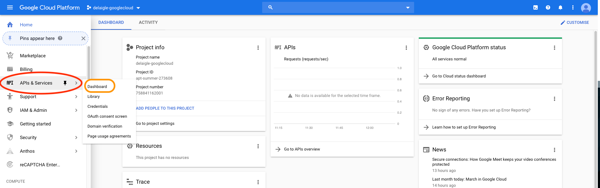
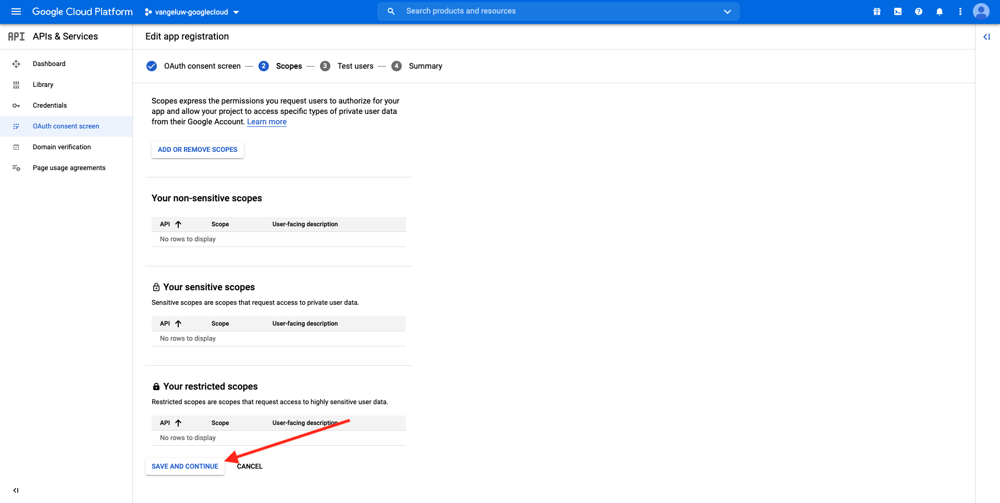
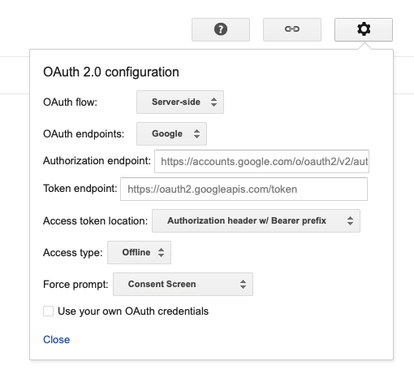
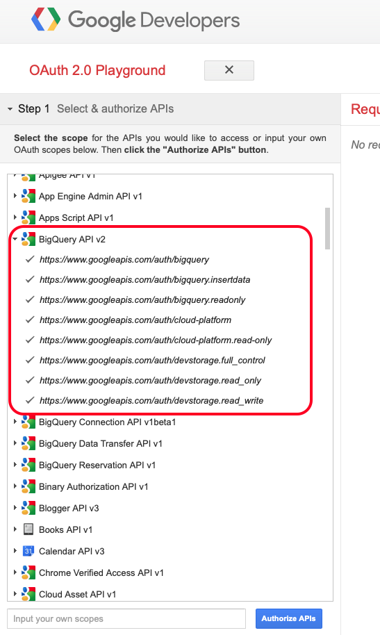
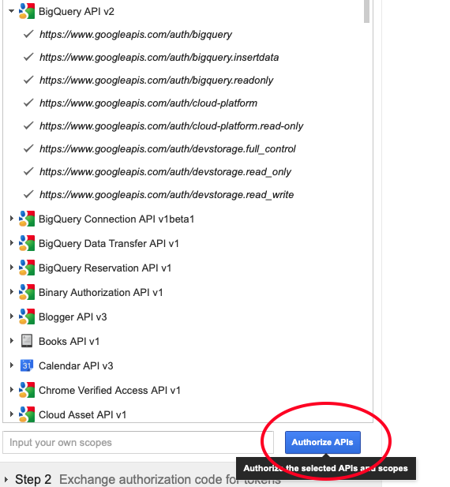

# 4.2.3 GCP および BigQuery のAdobe Experience Platformへの接続

## 目標

- Google Cloud Platform 内の API とサービスについて
- Google API のテストに関する OAuth Playground の理解
- Adobe Experience Platformで最初の BigQuery 接続を作成

## コンテキスト

Adobe Experience Platformには、BigQuery データセットをAdobe Experience Platformに取り込むのに役立つ **ソース** 内のコネクタが用意されています。 このデータコネクタは、Google BigQuery API に基づいています。 したがって、Adobe Experience Platformから API 呼び出しを受け取るには、Google Cloud Platform と BigQuery 環境を適切に準備することが重要です。

Adobe Experience Platformで BigQuery Source コネクタを設定するには、次の 4 つの値が必要です。

- プロジェクト
- clientId
- clientSecret
- refreshToken

現時点では、最初のプロジェクト ID が **プロジェクト ID** のみです。 この **プロジェクト ID** 値は、演習 12.1 で BigQuery プロジェクトを作成したときにGoogleによって生成されたランダム ID です。

プロジェクト ID を区切られたテキスト ファイルにコピーしてください。

| 資格情報 | 名前付け | 例 |
| ----------------- |-------------| -------------|
| プロジェクト ID | random | composed-task-306413 |

上部のメニューバーで **プロジェクト名** をクリックすると、いつでもプロジェクト ID を確認できます。

プロジェクト ID が右側に表示されます。

この演習では、他の 3 つの必須フィールドを取得する方法を説明します。

- clientId
- clientSecret
- refreshToken

## 4.2.3.1 Google Cloud API およびサービス

開始するには、Google Cloud Platform のホームページに戻ります。 これを行うには、画面の左上隅にあるロゴをクリックするだけです。

ホームページで、左側のメニューに移動して「**API とサービス**」をクリックし、「**ダッシュボード**」をクリックします。

**API とサービス** ホームページが表示されます。

このページでは、様々なGoogle API 接続の使用状況を確認できます。 Adobe Experience Platformが BigQuery から読み取れるように API 接続を設定するには、次の手順に従う必要があります。

- まず、今後の認証を有効にするために、OAuth 同意画面を作成する必要があります。 Googleのセキュリティ上の理由から、プログラムによるアクセスを許可する前に、人間が最初の認証を行う必要もあります。
- 次に、BigQuery コネクタへの API 認証とアクセスに使用される API 資格情報（clientId と clientSecret）が必要です。

## 4.2.3.2 OAuth 同意画面

まず、OAuth 同意画面を作成します。 **API とサービス** ホームページの左側のメニューで、「**OAuth 同意画面**」をクリックします。

次の画面が表示されます。

ユーザータイプを選択します **外部**。 次に、「**作成**」をクリックします。

**OAuth 同意画面の設定** ウィンドウが表示されます。

ここで行うことは、同意画面の名前を **アプリケーション名** フィールドに入力し、**ユーザーサポートメール** を選択することです。 アプリケーション名には、次の命名規則を使用します。

| 名前付け | 例 |
| ----------------- |-------------| 
| `--aepUserLdap-- - AEP BigQuery Connector` | vangeluw - AEP BigQuery コネクタ |

次に、**開発者の連絡先情報** が表示されるまで下にスクロールし、メールアドレスを入力します。

**保存して続行** をクリックします。

その後、これが表示されます。 **保存して続行** をクリックします。

その後、これが表示されます。 **保存して続行** をクリックします。

その後、これが表示されます。 「**ダッシュボードに戻る**」をクリックします。

その後、これが表示されます。 **PUBLISH アプリ** をクリックします。

**確認** をクリックします。

その後、これが表示されます。

次の手順で、API の設定を完了し、API 資格情報を取得します。

## 4.2.3.3 Google API 資格情報：クライアントの秘密鍵およびクライアント ID

左側のメニューで、「**資格情報**」をクリックします。 次の画面が表示されます。

「**+資格情報を作成**」ボタンをクリックします。

3 つのオプションが表示されます。 **OAuth クライアント ID** をクリックします。

次の画面で、「**Web アプリケーション**」を選択します。

いくつかの新しいフィールドがポップアップ表示されます。 次に、OAuth クライアント ID の **名前** を入力し、**承認済みリダイレクト URI** も入力する必要があります。

次の命名規則に従います。

| フィールド | 値 | 例 |
| ----------------- |-------------| -------------| 
| 名前 | ldap - AEP BigQuery コネクタ | vangeluw - Platform BigQuery コネクタ |
| 認証済みリダイレクト URI | https://developers.google.com/oauthplayground | https://developers.google.com/oauthplayground |

「**承認済みリダイレクト URI**」フィールドは、後で RefreshToken を取得するために必要になるので、非常に重要なフィールドです。Adobe Experience Platformで BigQuery Source コネクタの設定を完了するために必要です。

続行する前に、URL を入力した後に **Enter** ボタンを物理的にプッシュして、値を **承認済みリダイレクト URI** フィールドに保存する必要があります。 **Enter** ボタンをクリックしない場合は、後の段階で **OAuth 2.0 Playground** で問題が発生します。

次に、「作成 **をクリックし** す。

これで、クライアント ID とクライアントシークレットが表示されます。

この 2 つのフィールドをコピーして、デスクトップ上のテキストファイルに貼り付けてください。 これらの資格情報には後でいつでもアクセスできますが、BigQuery プロジェクト ID の横のテキストファイルに保存すると簡単です。

Adobe Experience Platformでの BigQuery Source コネクタの設定の概要は、次の値が既に使用可能であることです。

| BigQuery コネクタ資格情報 | 値 |
| ----------------- |-------------| 
| プロジェクト ID | 自分のプロジェクト ID （例：:composed-task-306413） |
| clientid | yourclientid |
| clientsecret | yourclientsecret |

**refreshToken** が見つかりません。 セキュリティ上の理由から、refreshToken は必須です。 API の世界では、トークンは通常、24 時間ごとに期限切れになります。 そのため、セキュリティトークンを 24 時間ごとに更新して、Source コネクタのセットアップがGoogle Cloud Platform と BigQuery に引き続き接続できるようにする **refreshToken** が必要です。

## 4.2.3.4 BigQuery API と refreshToken

refreshToken を取得してGoogle Cloud Platform API にアクセスする方法は多数あります。 例えば、Postmanを使用する場合などです。
ただし、Googleは、**OAuth 2.0 Playground** と呼ばれるツールを使用して、API でのテストと再生が容易なものを構築しました。

**OAuth 2.0 Playground** にアクセスするには、[https://developers.google.com/oauthplayground](https://developers.google.com/oauthplayground) に移動します。

**OAuth 2.0 Playground** ホームページが表示されます。

画面の右上にある **歯車** アイコンをクリックします。

設定が上の画像と同じであることを確認します。

設定を再確認して、100% 確認します。

完了したら、「独自の OAuth 認証情報を使用 **のチェックボックスをオンにします**

2 つのフィールドが表示され、その値が表示されます。

このテーブルの次のフィールドに入力してください。

| Playground API 設定 | Google API 資格情報 |
| ----------------- |-------------| 
| OAuth クライアント ID | 独自のクライアント ID （デスクトップ上のテキストファイル内） |
| OAuth クライアント秘密鍵 | 独自のクライアントシークレット（デスクトップ上のテキストファイル内） |

デスクトップ上に作成したテキストファイルから **クライアント ID** と **クライアントシークレット** をコピーします。

資格情報を入力したら、「閉じる **をクリックしてください**

左側のメニューに、使用可能なすべてのGoogle API が表示されます。 **BigQuery API v2** を検索します。

次に、次の画像に示すように範囲を選択します。

選択すると、「**API を認証**」という青いボタンが表示されます。 クリックします。

GCP および BigQuery の設定に使用したGoogle アカウントを選択します。

**このアプリは検証されていません** という大きな警告が表示される場合があります。 これは、Platform BigQuery コネクタがまだ正式にレビューされていないので、Googleが本格的なアプリかどうかを知らないために発生しています。 この通知は無視してください。

**詳細** をクリックします。

次に、「**ldap - AEP BigQuery Connector に移動（安全ではありません）**」をクリックします。

作成した OAuth 同意画面にリダイレクトされます。

2 要素認証（2FA）を使用している場合は、送信された確認コードを入力します。

Googleに、8 つの異なる **権限** プロンプトが表示されます。 8 つの権限リクエストすべてで「**許可**」をクリックします。 （これは、API がプログラム的なリクエストを許可する前に、実際の人間が一度従って確認する必要がある手順です）

繰り返しますが、**8 種類のポップアップウィンドウ** は表示されません。すべてのウィンドウで **許可** をクリックする必要があります。

8 件の権限リクエストの後、この概要が表示されます。 「**許可**」をクリックして、プロセスを終了します。

最後の **許可** クリックが完了すると、OAuth 2.0 プレイグラウンドに戻され、次の情報が表示されます。

「**トークンの認証コードの交換**」をクリックします。

数秒後、**手順 2 - トークンの認証コードの交換** ビューが自動的に閉じ、**手順 3 - API へのリクエストの設定** が表示されます。

**手順 2 トークンの認証コードの交換** に戻る必要があるので、もう一度 **手順 2 トークンの認証コードの交換** をクリックして **更新トークン** を視覚化します。

**更新トークン** が表示されます。

**更新トークン** をコピーして、デスクトップ上のテキストファイルに、他の BigQuery Source コネクタ資格情報と共に貼り付けます。

| BigQuery Source コネクタの資格情報 | 値 |
| ----------------- |-------------| 
| プロジェクト ID | 独自のランダムプロジェクト ID （例：: apt-summer-273608） |
| clientid | yourclientid |
| clientsecret | yourclientsecret |
| refreshtoken | yourrefreshtoken |

次に、Adobe Experience PlatformでSource コネクタを設定します。

## 4.2.3.5 - Platform を独自の BigQuery テーブルと接続する

URL:[https://experience.adobe.com/platform](https://experience.adobe.com/platform) に移動して、Adobe Experience Platformにログインします。

ログインすると、Adobe Experience Platformのホームページが表示されます。

続行する前に、**サンドボックス** を選択する必要があります。 選択するサンドボックスの名前は ``--aepSandboxName--`` です。 これを行うには、画面上部の青い線のテキスト **[!UICONTROL 実稼動製品]** をクリックします。 適切なサンドボックスを選択すると、画面が変更され、専用のサンドボックスが表示されます。

左側のメニューで、「ソース」に移動します。 その後、**Sources** ホームページが表示されます。 **ソース** メニューで、「**データベース**」をクリックします。 **Google BigQuery** カードをクリックします。 次に、「**設定** または **+設定** をクリックします。

新しい接続を作成する必要があります。

**新規アカウント** をクリックします。 次に、GCP と BigQuery での設定に基づいて、以下のすべてのフィールドに入力する必要があります。

まず、接続に名前を付けます。

次の命名規則を使用してください。

| BigQuery コネクタ資格情報 | 値 | 例 |
| ----------------- |-------------| -------------| 
| アカウント名 | `--aepUserLdap-- - BigQuery Connection` | vangeluw - BigQuery 接続 |
| 説明 | `--aepUserLdap-- - BigQuery Connection` | vangeluw - BigQuery 接続 |

次のような情報が表示されます。

次に、デスクトップ上のテキストファイルに保存した GCP および BigQuery API **アカウント認証** の詳細を入力します。

| BigQuery コネクタ資格情報 | 値 |
| ----------------- |-------------| 
| プロジェクト ID | 独自のランダムプロジェクト ID （例：: apt-summer-273608） |
| clientId | ... |
| clientSecret | ... |
| refreshToken | ... |

**アカウント認証** の詳細は、次のようになります。

これらすべてのフィールドに入力したら、「**ソースに接続**」をクリックします。

**アカウント認証** の詳細が正しく入力されていた場合、**接続済み** の確認が表示され、接続が正しく動作していることを示す視覚的な確認が表示されます。

これで接続が作成されたので、「**次へ**」をクリックしてください。

演習 12.2 で作成した BigQuery データセットが表示されます。

よくやった！ 次の演習では、このテーブルからデータを読み込み、Adobe Experience Platformのスキーマとデータセットにマッピングします。

次の手順：[4.2.4 BigQuery からAdobe Experience Platformへのデータの読み込み ](./ex4.md)

[モジュール 4.2 に戻る](./customer-journey-analytics-bigquery-gcp.md)

[すべてのモジュールに戻る](./../../../overview.md)
