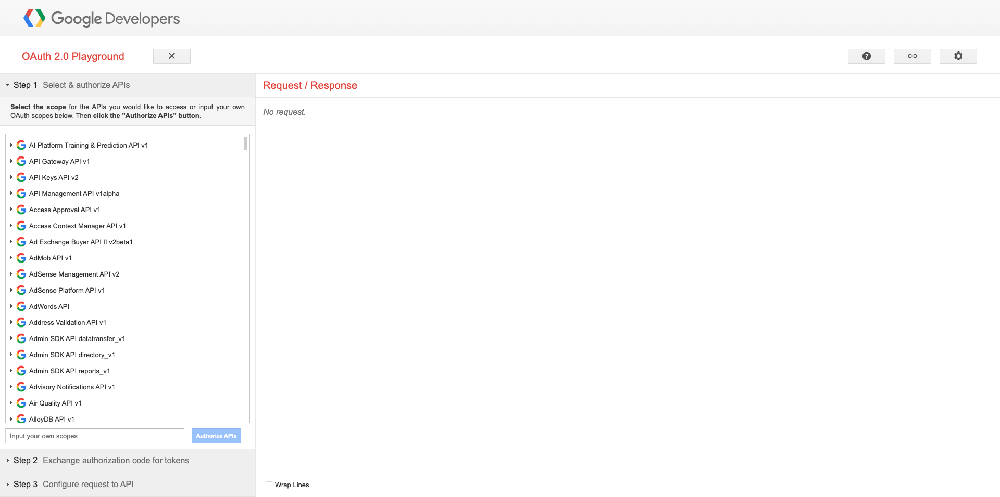
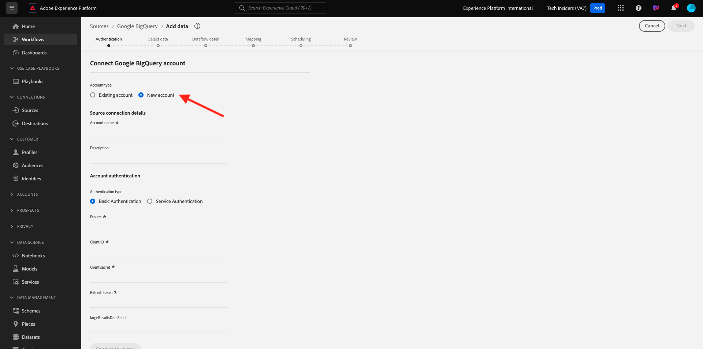

# 4.2.3 GCP および BigQuery のAdobe Experience Platformへの接続

## 目標

- Google Cloud Platform 内の API とサービスについて
- Google API のテストに関する OAuth Playground の理解
- Adobe Experience Platformで最初の BigQuery 接続を作成

## コンテキスト

Adobe Experience Platformには、BigQuery データセットをAdobe Experience Platformに取り込むのに役立つ **ソース** 内のコネクタが用意されています。 このデータコネクタは、Google BigQuery API に基づいています。 したがって、Adobe Experience Platformから API 呼び出しを受け取るには、Google Cloud Platform と BigQuery 環境を適切に準備することが重要です。

Adobe Experience Platformで BigQuery Source コネクタを設定するには、次の 4 つの値が必要です。

- プロジェクト
- clientId
- clientSecret
- refreshToken

現時点では、最初のプロジェクト ID が **プロジェクト ID** のみです。 この **プロジェクト ID** 値は、演習 12.1 で BigQuery プロジェクトを作成したときにGoogleによって生成されたランダム ID です。

プロジェクト ID を区切られたテキスト ファイルにコピーしてください。

| 資格情報 | 名前付け | 例 |
| ----------------- |-------------| -------------|
| プロジェクト ID | random | possible-bee-447102-h3 |

上部のメニューバーで **プロジェクト名** をクリックすると、いつでもプロジェクト ID を確認できます。

プロジェクト ID が右側に表示されます。

この演習では、他の 3 つの必須フィールドを取得する方法を説明します。

- clientId
- clientSecret
- refreshToken

## 4.2.3.1 Google Auth Platform

開始するには、Google Cloud Platform のホームページに戻ります。 これを行うには、画面の左上隅にあるロゴをクリックするだけです。

ホームページに移動したら、検索バーで **0&rbrace;Google Auth Platform&rbrace; を検索します。**&#x200B;最初の結果をクリックして開きます。

**Google Auth Platform** ホームページが表示されます。 「**GET開始**」をクリックします。

**アプリ名** には、次を使用します。

| 名前付け | 例 |
| ----------------- |-------------| 
| `--aepUserLdap-- - AEP BigQuery Connector` | vangeluw - AEP BigQuery コネクタ |

**ユーザーサポートメール** フィールドにメールアドレスを選択します。

**次へ** をクリックします。

**外部** を選択し、「**次へ**」をクリックします。

メールアドレスを入力し、「**次へ**」をクリックします。

チェックボックスをオンにして **続行** をクリックします。 次に、「**作成**」をクリックします。

## 4.2.3.2 OAuth クライアントの作成

「**OAUTH クライアントを作成**」をクリックします。

その後、これが表示されます。

**Web アプリケーション** を選択します。

いくつかの新しいフィールドがポップアップ表示されます。 次に、OAuth クライアント ID の **名前** を入力し、**承認済みリダイレクト URI** も入力する必要があります。

**名前** フィールドには、次を使用します。

| フィールド | 値 | 例 |
| ----------------- |-------------| -------------| 
| 名前 | ldap - AEP BigQuery コネクタ | vangeluw - Platform BigQuery コネクタ |

**承認済みのリダイレクト URI** の下の「**+ URI を追加**」をクリックします。 以下の新しい URI を追加します。

| フィールド | 値 |
| ----------------- |-------------| 
| 認証済みリダイレクト URI | https://developers.google.com/oauthplayground |

「**承認済みリダイレクト URI**」フィールドは、後で RefreshToken を取得するために必要になるので、非常に重要なフィールドです。Adobe Experience Platformで BigQuery Source コネクタの設定を完了するために必要です。

「**作成**」をクリックします。

これで、OAuth クライアント ID が作成されました。 クリックすると、クライアント ID とクライアント秘密鍵が表示されます。

「クライアント ID」と「クライアント秘密鍵」の値が表示されます。

この 2 つのフィールドをコピーして、デスクトップ上のテキストファイルに貼り付けてください。 これらの資格情報には後でいつでもアクセスできますが、BigQuery プロジェクト ID の横のテキストファイルに保存すると簡単です。

Adobe Experience Platformでの BigQuery Source コネクタの設定の概要は、次の値が既に使用可能であることです。

| BigQuery コネクタ資格情報 | 値 |
| ----------------- |-------------| 
| プロジェクト ID | 自分のプロジェクト ID （例：: possible-bee-447102-h3） |
| clientid | yourclientid |
| clientsecret | yourclientsecret |

次に、OAuth アプリを公開する必要があります。 **オーディエンス** に移動し、**PUBLISH アプリ** をクリックします。

**確認** をクリックします。

**refreshToken** が見つかりません。 セキュリティ上の理由から、refreshToken は必須です。 API の世界では、トークンは通常、24 時間ごとに期限切れになります。 そのため、セキュリティトークンを 24 時間ごとに更新して、Source コネクタのセットアップがGoogle Cloud Platform と BigQuery に引き続き接続できるようにする **refreshToken** が必要です。

## 4.2.3.3 BigQuery API と refreshToken

refreshToken を取得してGoogle Cloud Platform API にアクセスする方法は多数あります。 例えば、Postmanを使用する場合などです。
ただし、Googleは、**OAuth 2.0 Playground** と呼ばれるツールを使用して、API でのテストと再生が容易なものを構築しました。

**OAuth 2.0 Playground** にアクセスするには、[https://developers.google.com/oauthplayground](https://developers.google.com/oauthplayground) に移動します。

**OAuth 2.0 Playground** ホームページが表示されます。

画面の右上にある **歯車** アイコンをクリックします。 設定が上の画像と同じであることを確認します。

「**独自の OAuth 認証情報を使用**」チェックボックスをオンにします。

2 つのフィールドが表示されます。

このテーブルの次のフィールドに入力してください。

| Playground API 設定 | Google API 資格情報 |
| ----------------- |-------------| 
| OAuth クライアント ID | 独自のクライアント ID （デスクトップ上のテキストファイル内） |
| OAuth クライアント秘密鍵 | 独自のクライアントシークレット（デスクトップ上のテキストファイル内） |

資格情報を入力したら、「**閉じる**」をクリックしてください。

左側のメニューに、使用可能なすべてのGoogle API が表示されます。 **BigQuery API v2** を検索し、クリックして開きます。

次に、下図に示すように範囲を選択します。 使用可能な各 API をクリックする必要があります。選択した各 API にチェックマークが表示されます。

次に、「**API を認証**」をクリックします。

GCP および BigQuery の設定に使用したメールアドレスをクリックします。

その後、**このアプリは検証されていません** という大きな警告が表示されます。 これは、Platform BigQuery コネクタがまだ正式にレビューされていないので、Googleが本格的なアプリかどうかを知らないために発生しています。

**詳細** をクリックします。

次に、「**移動 – aepUserLdap— - AEP BigQuery コネクタ（安全でない）**」をクリックします。

その後、アクセスするためのセキュリティプロンプトが表示されます。 **すべてを選択** をクリックします。

下にスクロールして、「**続行**」をクリックします。

OAuth 2.0 プレイグラウンドに送り返され、これが表示されます。 「**トークンの認証コードの交換**」をクリックします。

数秒後、**手順 2 - トークンの認証コードの交換** ビューが自動的に閉じ、**手順 3 - API へのリクエストの設定** が表示されます。

**手順 2 トークンの認証コードの交換** に戻る必要があるので、もう一度 **手順 2 トークンの認証コードの交換** をクリックして **更新トークン** を視覚化します。

**更新トークン** が表示されます。

**更新トークン** をコピーして、デスクトップ上のテキストファイルに、他の BigQuery Source コネクタ資格情報と共に貼り付けます。

| BigQuery Source コネクタの資格情報 | 値 |
| ----------------- |-------------| 
| プロジェクト ID | 独自のランダムプロジェクト ID （例：: apt-summer-273608） |
| clientid | yourclientid |
| clientsecret | yourclientsecret |
| refreshtoken | yourrefreshtoken |

次に、Adobe Experience PlatformでSource コネクタを設定します。

## 4.2.3.5 - Platform を独自の BigQuery テーブルと接続する

URL:[https://experience.adobe.com/platform](https://experience.adobe.com/platform) に移動して、Adobe Experience Platformにログインします。

ログインすると、Adobe Experience Platformのホームページが表示されます。

続行する前に、**サンドボックス** を選択する必要があります。 選択するサンドボックスの名前は ``--aepSandboxName--`` です。 適切なサンドボックスを選択すると、画面が変更され、専用のサンドボックスが表示されます。

左側のメニューで、「ソース」に移動します。 その後、**Sources** ホームページが表示されます。 **ソース** メニューで、「**データベース**」をクリックします。 **Google BigQuery** カードをクリックします。 次に、「設定 **をクリックし** す。

新しい接続を作成する必要があります。

**新規アカウント** をクリックします。 次に、GCP と BigQuery での設定に基づいて、以下のすべてのフィールドに入力する必要があります。

まず、接続に名前を付けます。

次の命名規則を使用してください。

| BigQuery コネクタ資格情報 | 値 | 例 |
| ----------------- |-------------| -------------| 
| アカウント名 | `--aepUserLdap-- - BigQuery Connection` | vangeluw - BigQuery 接続 |
| 説明 | `--aepUserLdap-- - BigQuery Connection` | vangeluw - BigQuery 接続 |

すると、次のようになります。

次に、デスクトップ上のテキストファイルに保存した GCP および BigQuery API **アカウント認証** の詳細を入力します。

| BigQuery コネクタ資格情報 | 値 |
| ----------------- |-------------| 
| プロジェクト ID | 独自のランダムプロジェクト ID （例：: possible-bee-447102-h3） |
| clientId | ... |
| clientSecret | ... |
| refreshToken | ... |

**アカウント認証** の詳細は、次のようになります。 **ソースに接続** をクリックします。

**アカウント認証** の詳細が正しく入力されていた場合、**接続済み** の確認が表示され、接続が正しく動作していることを示す視覚的な確認が表示されます。 「**次へ**」をクリックします。

前の演習で作成した BigQuery データセットが表示されます。

よくやった！ 次の演習では、このテーブルからデータを読み込み、Adobe Experience Platformのスキーマとデータセットにマッピングします。

次の手順：[4.2.4 BigQuery からAdobe Experience Platformへのデータの読み込み ](./ex4.md)

[モジュール 4.2 に戻る](./customer-journey-analytics-bigquery-gcp.md)

[すべてのモジュールに戻る](./../../../overview.md)
