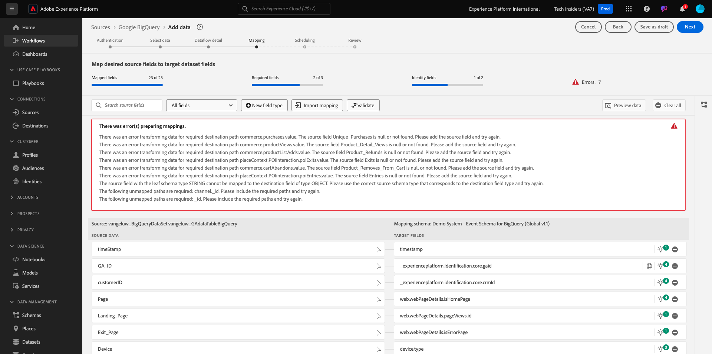

# 4.2.4 BigQuery からAdobe Experience Platformへのデータのロード

## 目標

- BigQuery データの XDM スキーマへのマッピング
- BigQuery データのAdobe Experience Platformへの読み込み
- BigQuery Source コネクタ UI の理解

## 事前準備

演習 12.3 を終了すると、Adobe Experience Platformでこのページを開くことができます。

**開いている場合は、演習 12.4.1 に進みます。**

**開いていない場合は、[Adobe Experience Platform](https://experience.adobe.com/platform/home) に移動してください。**

左側のメニューで、「ソース」に移動します。 その後、**Sources** ホームページが表示されます。 **ソース** メニューで、「**データベース**」をクリックします。

**Google BigQuery** Source コネクタを選択し、「**+設定**」をクリックします。

Google BigQuery アカウント選択画面が表示されます。

アカウントを選択して、「**次へ**」をクリックします。

**データを追加** ビューが表示されます。

## 4.2.4.1 BigQuery テーブルの選択

**データを追加** ビューで、BigQuery データセットを選択します。

BigQuery でGoogle Analyticsデータのサンプルデータプレビューを確認できるようになりました。

「**次へ**」をクリックします。

## 4.2.4.2 XDM マッピング

次の項目が表示されます。

次に、新しいデータセットを作成するか、既存のデータセットを選択して、Google Analyticsデータをに読み込む必要があります。 この演習では、データセットとスキーマは既に作成されています。 新しいスキーマやデータセットを作成する必要はありません。

**既存のデータセット** を選択します。 ドロップダウンメニューを開いて、データセットを選択します。 `Demo System - Event Dataset for BigQuery (Global v1.1)` という名前のデータセットを検索して選択します。 「**次へ**」をクリックします。

下にスクロールします。 次に、Google Analytics/BigQuery から各 **0}Source フィールド } を、フィールドごとに XDM** ターゲットフィールド **にマッピングする必要があります。**

この演習では、以下のマッピングテーブルを使用します。

| ソースフィールド | ターゲットフィールド |
| ----------------- |-------------| 
| **_id** | _id |
| **_id** | チャネル。_id |
| timeStamp | タイムスタンプ |
| GA_ID | ``--aepTenantId--``.identification.core.gaid |
| customerID | ``--aepTenantId--``.identification.core.loyaltyId |
| ページ | web.webPageDetails.name |
| デバイス | device.type |
| ブラウザー | environment.browserDetails.vendor |
| MarketingChannel | marketing.trackingCode |
| TrafficSource | channel.typeAtSource |
| TrafficMedium | channel.mediaType |
| TransactionID | commerce.order.payments.transactionID |
| Ecommerce_Action_Type | eventType |
| ページビュー | web.webPageDetails.pageViews.value |
| Unique_Purchases | commerce.purchases.value |
| Product_Detail_Views | commerce.productViews.value |
| Adds_To_Cart | commerce.productListAdds.value |
| Product_Removes_From_Cart | commerce.productListRemovals.value |
| 製品チェックアウト | commerce.checkouts.value |

上記のマッピングをコピーしてAdobe Experience Platform UI に貼り付けた後、入力ミスや先頭/末尾のスペースが原因でエラーが表示されないかどうかを確認してください。

これで、次のような **マッピング** が作成されました。

ソースフィールド **GA_ID** および **customerID** は、この XDM スキーマの識別子にマッピングされます。 これにより、Google Analyticsデータ（web/アプリの行動データ）を、ロイヤルティデータやコールセンターデータなどの他のデータセットでエンリッチメントできます。

「**次へ**」をクリックします。

## 4.2.4.3 接続とデータ取り込みスケジュール

「**スケジュール**」タブが表示されます。

「**スケジュール**」タブでは、この **マッピング** とデータのデータ取り込みプロセスの頻度を定義できます。

Google BigQuery でデモデータを使用していますが、これは更新されないので、この演習でスケジュールを設定する実際の必要はありません。 何かを選択する必要があり、無駄なデータ取り込みプロセスの数が多くなりすぎないようにするには、次のように頻度を設定する必要があります。

- 頻度：**週**
- 間隔：**200**

**重要**:**バックフィル** スイッチを必ずアクティブにしてください。

最後に、**delta** フィールドを定義する必要があります。

**delta** フィールドは、接続をスケジュールし、BigQuery データセットに取り込まれる新しい行のみをアップロードするために使用されます。 差分フィールドは通常、タイムスタンプ列です。 したがって、今後スケジュールされたデータ取り込みでは、新しい、より新しいタイムスタンプを持つ行のみが取り込まれます。

差分フィールドとして **timeStamp** を選択します。

あなたはこれを手に入れました。

「**次へ**」をクリックします。

## 4.2.4.4 接続の確認と開始

**データセットフローの詳細** ビューで。 接続に名前を付ける必要があります。これは、後で見つけるのに役立ちます。

次の命名規則を使用してください。

| フィールド | 名前付け | 例 |
| ----------------- |-------------| -------------|
| データセットフロー名 | DataFlow - ldap - BigQuery Website Interaction | データフロー – vangeluw - BigQuery Web サイトインタラクション |
| 説明 | DataFlow - ldap - BigQuery Website Interaction | データフロー – vangeluw - BigQuery Web サイトインタラクション |

「**次へ**」をクリックします。

これで、接続の詳細な概要が表示されます。 続行する前に、すべてが正しいことを確認してください。XDM マッピングなどの一部の設定は、後で変更できなくなりました。

「**完了**」をクリックします。

接続の設定には時間がかかる場合があるので、次のように表示されても心配はいりません。

接続を作成すると、次の画面が表示されます。

次の演習では、Customer Journey Analyticsを使用して、Google Analyticsデータの上に強力なビジュアライゼーションを作成します。

次の手順：[4.2.5Customer Journey Analyticsを使用してGoogle Analyticsデータを分析する ](./ex5.md)

[モジュール 4.2 に戻る](./customer-journey-analytics-bigquery-gcp.md)

[すべてのモジュールに戻る](./../../../overview.md)
