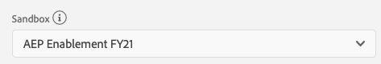
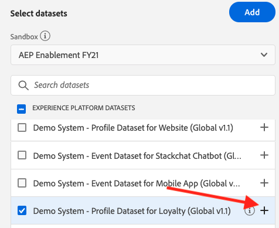
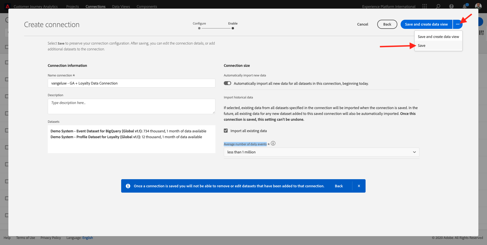
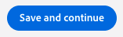
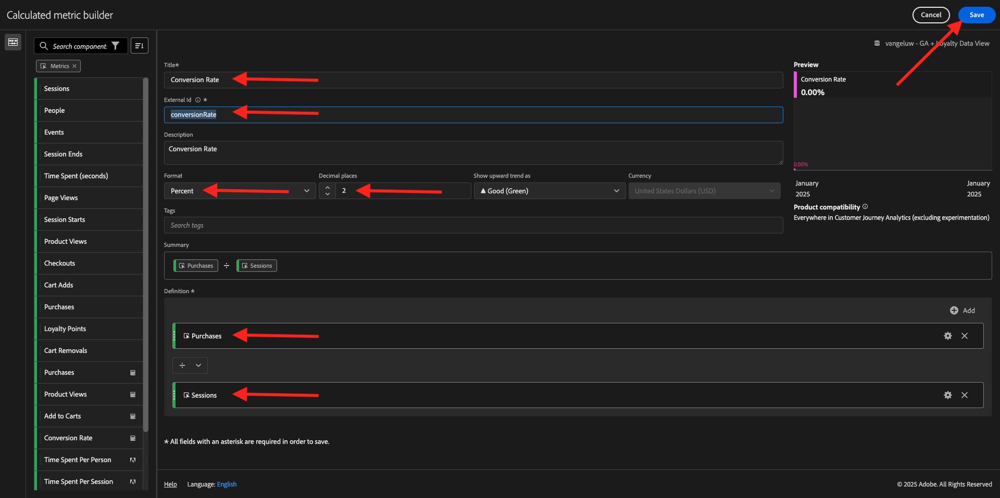
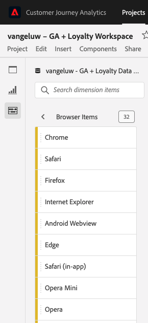
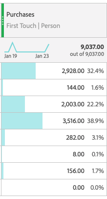
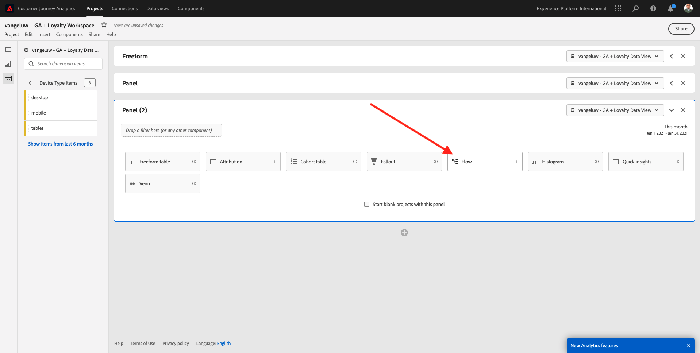
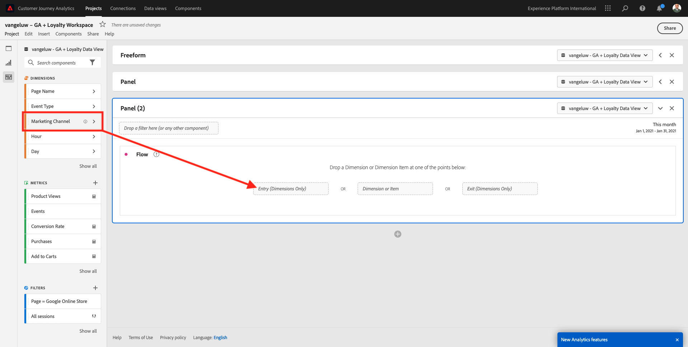
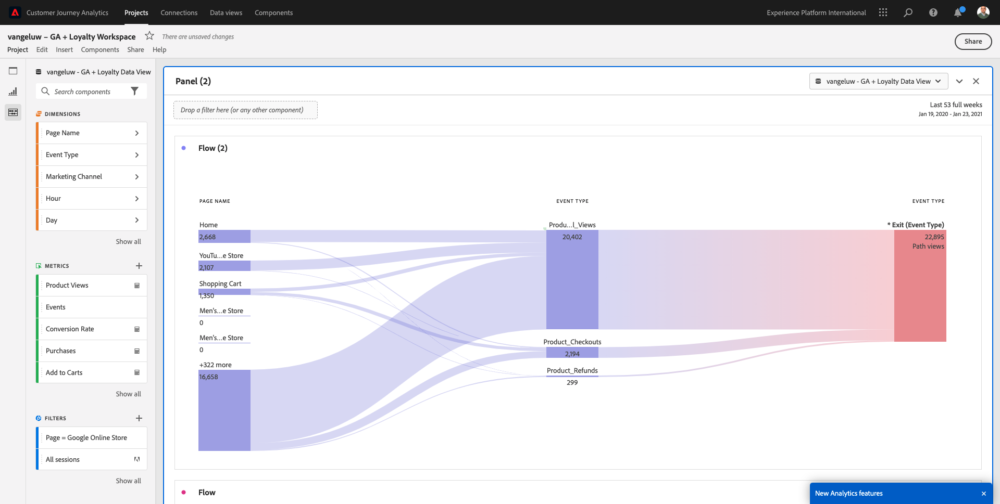

# 4.2.5 Customer Journey Analyticsを使用したGoogle Analyticsデータの分析

## 目標

- BigQuery データセットをCustomer Journey Analytics（CJA）に接続
- ロイヤルティデータでGoogle Analyticsを接続して結合します。
- CJA UI の理解

## 4.2.5.1 接続の作成

[analytics.adobe.com](https://analytics.adobe.com) に移動して、Customer Journey Analyticsにアクセスします。

Customer Journey Analyticsホームページで、「**連携**」に移動します。

ここでは、CJA と Platform の間で行われたすべての異なる接続を確認できます。 これらの接続の目標は、Adobe Analyticsのレポートスイートと同じです。 ただし、データの収集は完全に異なります。 すべてのデータは、Adobe Experience Platform データセットから取得されます。

**新しい接続を作成** をクリックします。

その後、**接続を作成** UI が表示されます。

まず、使用する正しいサンドボックスを選択する必要があります。 サンドボックスメニューで、`--aepSandboxId--` すサンドボックスを選択します。 この例では、使用するサンドボックスは **AEP イネーブルメント FY21** です。

サンドボックスを選択すると、使用可能なデータセットが更新されます。

左側のメニューに、使用可能なすべてのAdobe Experience Platform データセットが表示されます。 データセット `Demo System - Event Dataset for BigQuery (Global v1.1)` を検索します。 「**+**」をクリックして、この接続にデータセットを追加します。

追加すると、接続内のデータセットが表示されます。

ここで、「ユーザー ID **を選択する必要があ** ます。 ユーザー ID として **loyaltyId** が選択されていることを確認してください。

これで、別のAdobe Experience Platform データセットを使用してGoogle Analyticsの web サイトインタラクションデータを強化します。

データセット `Demo System - Profile Dataset for Loyalty (Global v1.1)` データセットを検索し、この接続に追加します。

次の画面が表示されます。

両方のデータセットを結合するには、同じタイプの ID を含む **ユーザー ID** を選択する必要があります。 データセット `Demo System - Profile Dataset for Loyalty (Global v1.1)` では、**loyaltyId** を人物 ID として使用します。このデータセットには、`Demo System - Event Dataset for BigQuery (Global v1.1)` と同じタイプの ID が含まれており、**loyaltyId** も人物 ID として使用しています。

「**次へ**」をクリックします。

次の画面が表示されます。

ここでは、接続に名前を付ける必要があります。

命名規則 `ldap - GA + Loyalty Data Connection` を使用してください。

例：`vangeluw - GA + Loyalty Data Connection`

終了する前に、**今日から、この接続のすべてのデータセットについて、すべての新しいデータを自動的に読み込む」をアクティブ化してください。以下の画像のように** します。

これにより、Adobe Experience Platformから CJA へのデータフローが 60 分ごとに開始されますが、大量のデータがある場合は最大 24 時間かかることがあります。

履歴データもバックフィルする必要があるので、「**すべての既存データをインポート**」のチェックボックスをオンにして、「**毎日のイベントの平均数** で **100 万未満** を選択します。

**接続** を作成した後、CJA でデータを使用できるようになるまで数時間かかる場合があります。

「**保存**」をクリックして、次の演習に進みます。

使用可能な接続のリストに接続が表示されます。

## 4.2.5.2 データビューの作成

接続が完了したら、影響を与えるビジュアライゼーションに進むことができます。 Adobe Analyticsと CJA の違いは、ビジュアライゼーションの前にデータをクリーンアップして準備するために、CJA にデータビューが必要である点です。

データビューは、Adobe Analyticsの仮想レポートスイートの概念に似ています。コンテキスト対応の訪問の定義、フィルタリングおよびコンポーネントの呼び出し方法を定義します。

接続ごとに少なくとも 1 つのデータビューが必要です。 ただし、一部のユースケースでは、異なるチームに異なるインサイトを与えるために、同じ接続に対して複数のデータビューを持つことが素晴らしいことです。

会社をデータ駆動型にしたい場合は、各チームでのデータの表示方法を調整する必要があります。 次に例を示します。

- UX デザインチーム専用の UX 指標
- デジタル分析チームが 1 か国語しか話せるように、Google Analyticsの KPI と指標にはCustomer Journey Analyticsと同じ名前を使用します。
- 1 つのマーケットのみ、1 つのブランド、またはモバイルデバイスのみのインスタンスデータを表示するようにフィルタリングされたデータビュー。

**接続** 画面で、作成した接続の前にあるチェックボックスをオンにします。

次に、「**データビューを作成**」をクリックします。

**データビューを作成** ワークフローにリダイレクトされます。

これで、データビューの基本的な定義を設定できます。 タイムゾーン、セッションタイムアウト、データビューフィルタリング（Adobe Analyticsの仮想レポートスイートに似たセグメント化部分）などがあります。

前の演習で作成した **接続** が既に選択されています。 接続名は `ldap - GA + Loyalty Data Connection` です。

次に、データビューに次の命名規則に従った名前を付けます：`ldap - GA + Loyalty Data View`。

説明に同じ値を入力します：`ldap - GA + Loyalty Data View`。

分析またはビジュアライゼーションを行う前に、すべてのフィールド、ディメンション、指標とそのアトリビューション設定を含むデータビューを作成する必要があります。

| フィールド | 命名規則 | 例 |
| ----------------- |-------------|-------------|  
| 名前の接続 | ldap - GA + ロイヤルティデータビュー | vangeluw - GA + ロイヤルティデータビュー |
| 説明 | ldap - GA + ロイヤルティデータビュー | vangeluw - GA + ロイヤルティデータビュー |

**保存して続行** をクリックします。

データビューにコンポーネントを追加できるようになりました。 ご覧のように、一部の指標およびディメンションは自動的に追加されます。

データビューに次のコンポーネントを追加します。

| コンポーネント名 | コンポーネントタイプ | コンポーネントパス |
| -----------------|-----------------|-----------------|
| レベル | ディメンション | _experienceplatform.loyaltyDetails.level |
| ポイント | 指標 | _experienceplatform.loyaltyDetails.points |
| commerce.checkouts.value | 指標 | commerce.checkouts.value |
| commerce.productListRemovals.value | 指標 | commerce.productListRemovals.value |
| commerce.productListAdds | 指標 | commerce.productListAdds |
| commerce.productViews.value | 指標 | commerce.productViews.value |
| commerce.purchases.value | 指標 | commerce.purchases.value |
| web.webPageDetails.pageViews | 指標 | web.webPageDetails.pageViews |
| トランザクション ID | ディメンション | commerce.order.payments.transactionID |
| channel.mediaType | ディメンション | channel.mediaType |
| channel.typeAtSource | ディメンション | channel.typeAtSource |
| トラッキングコード | ディメンション | marketing.trackingCode |
| gaid | ディメンション | _experienceplatform.identification.core.gaid |
| web.webPageDetails.name | ディメンション | web.webPageDetails.name |
| イベントタイプ | ディメンション | eventType |
| ベンダー | ディメンション | environment.browserDetails.vendor |
| 識別子 | ディメンション | _id |
| タイムスタンプ | ディメンション | タイムスタンプ |
| タイプ | ディメンション | device.type |
| loyaltyId | ディメンション | _experienceplatform.identification.core.loyaltyId |

すると、次のようになります。

次に、上記の指標およびディメンションのわかりやすい名前を変更し、分析を作成する際に簡単に使用できるようにする必要があります。 それには、指標またはディメンションを選択し、次の画像に示すように **名前** フィールドを更新します。

| コンポーネントの元の名前 | 表示名 |
| -----------------|-----------------|
| レベル | ロイヤルティレベル |
| ポイント | ロイヤルティポイント |
| commerce.checkouts.value | チェックアウト |
| commerce.productListRemovals.value | 買い物かごからの削除 |
| commerce.productListAdds | 買い物かご追加 |
| commerce.productViews.value | 製品表示 |
| commerce.purchases.value | 購入 |
| web.webPageDetails.pageViews | ページビュー数 |
| channel.mediaType | トラフィックMedium |
| channel.typeAtSource | Traffic Source |
| トラッキングコード | マーケティングチャネル |
| gaid | GOOGLE ANALYTICSID |
| 名前 | ページタイトル |
| ベンダー | ブラウザー |
| タイプ | Device Type |
| loyaltyId | ロイヤルティ ID |

次のようなメッセージが表示されます。

次に、**アトリビューション設定** を変更して、これらのコンポーネントの一部についてユーザーおよびセッションのコンテキストを変更する必要があります。

以下のコンポーネントの **アトリビューション設定** を変更してください。

| コンポーネント |
| -----------------|
| Traffic Source |
| マーケティングチャネル |
| ブラウザー |
| トラフィックMedium |
| Device Type |
| GOOGLE ANALYTICSID |
| ロイヤルティ ID |
| ロイヤルティレベル |
| ロイヤルティポイント |

それには、コンポーネントを選択し、**カスタム属性モデルを使用** をクリックして、**モデル** を **ラストタッチ** に、**有効期限** を **人物（レポートウィンドウ）** に設定します。 上記のすべてのコンポーネントに対してこれを繰り返します。

前述のすべてのコンポーネントのアトリビューション設定を変更したら、次の表示が表示されます。

これで、データビューが設定されました。 「**保存**」をクリックします。

これで、Adobe Analytics Analysis Workspace内でGoogle Analyticsデータを分析する準備が整いました。 次の演習に移りましょう。

## 4.2.5.3 プロジェクトの作成

Customer Journey Analyticsーで、**プロジェクト** に移動します。

次の画面が表示されます。

**新規プロジェクトを作成** をクリックしてプロジェクトを作成します。

これで、空のプロジェクトが作成されました。

まず、プロジェクトを保存し、名前を付けます。 次のコマンドを使用して保存できます。

| OS | ショートカット |
| ----------------- |-------------| 
| Windows | コントロール + S |
| Mac | Command + S |

次のポップアップが表示されます。

次の命名規則を使用してください。

| 名前 | 説明 |
| ----------------- |-------------| 
| ldap - GA + ロイヤルティWorkspace | ldap - GA + ロイヤルティWorkspace |

次に、「**プロジェクトを保存**」をクリックします。

次に、画面の右上隅で正しいデータビューを選択していることを確認します。 これは、前の演習で作成した、命名規則 `ldap - GA + Loyalty Data View` のデータビューです。 この例では、選択するデータビューは `ldap - GA + Loyalty Data View` です。

### 12.5.3.1 フリーフォームテーブル

フリーフォームテーブルは、Excel 内でピボットテーブルとして機能します（多かれ少なかれ）。 左側のバーから何かを選択し、フリーフォームにドラッグ&amp;ドロップすると、テーブルレポートが得られます。

フリーフォームテーブルはほぼ無制限です。 何でも（ほぼ）実行できますが、Google Analyticsと比較すると非常に価値があります（このツールにはいくつかの分析制限があるので）。 これは、Google Analyticsデータを別の分析ツールに読み込む理由の 1 つです。

SQL、BigQuery を使用する必要がある例と、Google AnalyticsUI やGoogle Data Studio 内では実行できない簡単な質問に回答する時間がある例を 2 つ示します。

- マーケティングチャネルで分割された Safari ブラウザーからチェックアウトに到着するユーザーは何人ですか？ チェックアウト指標が Safari ブラウザーでフィルタリングされていることを確認してください。 チェックアウト列の上に変数 Browser = Safari をドラッグ&amp;ドロップしました。

- アナリストの場合、ソーシャルマーケティングチャネルのコンバージョンは低いことがわかります。 ラストタッチアトリビューションをデフォルトとして使用していますが、ファーストタッチはどうですか？ 任意の指標の上にマウスポインターを置くと、指標設定が表示されます。 ここで、必要なアトリビューションモデルを選択できます。 アトリビューションは、（データスタジオではなく） GA でスタンドアロンアクティビティとして実行できますが、アトリビューション分析に関連しない他の指標やディメンションを同じテーブル内に含めることはできません。

CJA のAnalysis Workspaceを使用して、この質問やいくつかの質問に答えましょう。

まず、パネルの右側で適切な日付範囲（**過去 53 週間**）を選択します。

次に、「**適用**」をクリックして日付範囲を適用します。 次の演習では、この手順を覚えておいてください。

>[!NOTE]
>
>**データ接続** と **データビュー** を作成したばかりの場合は、数時間待つ必要がある可能性があります。 大量のデータレコードがある場合、CJA は履歴データをバックフィルするためにある程度の時間を必要とします。

いくつかのディメンションと指標をドラッグ&amp;ドロップして、マーケティングチャネルを分析します。 まず、ディメンション **マーケティングチャネル** を使用し、**フリーフォームテーブル** のキャンバスにドラッグ&amp;ドロップします。 （指標メニューに指標がすぐには表示されない場合は、「**すべて表示**」をクリックします）

次の画面が表示されます。

次に、フリーフォームテーブルに指標を追加する必要があります。 次の指標を追加する必要があります：**人物**、**セッション**、**製品表示**、**チェックアウト**、**購入**、**コンバージョン率** （計算指標）。

その前に、計算指標 **コンバージョン率** を作成する必要があります。 それには、指標の横の「**+**」アイコンをクリックします。

計算指標の名前として **コンバージョン率** を使用します。 次に、指標 **購入** および **セッション** をキャンバスにドラッグします。 **形式** を **パーセント** に、**小数点以下の桁数** を **2** に設定します。 最後に、「**保存** をクリックします。

次に、これらの指標をすべて **フリーフォームテーブル** で使用するには、1 つずつ **フリーフォームテーブル** にドラッグ&amp;ドロップします。 以下の例を参照してください。

最終的に、次のようなテーブルになります。

前述のように、**フリーフォームテーブル** は、詳細な分析を実行するために必要な自由を提供します。 例えば、他のDimensionを選択して、テーブル内の特定の指標を分類できます。

例えば、ディメンションに移動し、「**ブラウザー**」変数を検索して選択します。

次に、このDimensionで使用可能な値の概要を確認できます。

Dimension **Safari** を選択し、指標の上にドラッグ&amp;ドロップします（例：**チェックアウト**。 次の画面が表示されます。

Safari を使用してチェックアウトページに到着するユーザーの数（マーケティングチャネルで分割）

次に、アトリビューションの質問に答えます。

テーブルで **購入** 指標を見つけます。

指標の上にマウスポインターを置くと、**設定** アイコンが表示されます。 クリックします。

コンテキストメニューが表示されます。 **デフォルト以外の属性モデル** のチェックボックスをオンにします。

表示されるポップアップで、アトリビューションモデルとルックバックウィンドウ（SQL で達成するのはかなり複雑）を簡単に変更できます。

アトリビューションモデルとして **ファーストタッチ** を選択します。

ルックバックウィンドウの **ユーザー** を選択します。

次に、「**適用** をクリックします。

これで、その特定の指標のアトリビューションモデルがファーストタッチになったことがわかります。

変数、セグメント、ディメンション、日付範囲のタイプに制限なく、必要なだけ分類を実行できます。

さらに特別なのは、Adobe Experience Platformのデータセットを結合して、Google Analyticsのデジタル行動データを強化する機能です。 例えば、オフライン、コールセンター、ロイヤルティ、CRM データなどです。

この機能を紹介するために、オフラインデータとオンラインデータを組み合わせた最初の分類を設定します。 ディメンション **ロイヤルティレベル** を選択し、任意の **マーケティングチャネル** （例：**オーガニック検索** にドラッグ&amp;ドロップします。

次に、**オーガニック検索** を使用して、**ロイヤルティレベル** である **ブロンズ** でサイトにアクセスした顧客が使用している **デバイスタイプ** を分析します。 Dimension **デバイスタイプ** を取得し、**ブロンズ** にドラッグ&amp;ドロップします。 次の画面が表示されます。

最初の分類にロイヤルティレベルが使用されていることがわかります。 このディメンションは、BigQuery コネクタに使用したデータセットとは異なるデータセットと異なるスキーマから取得されます。 ユーザー ID **ロイヤルティ ID** （デモシステム - BigQuery のイベントスキーマ（グローバル v1.1））と **ロイヤルティ ID** （デモシステム – ロイヤルティのプロファイルスキーマ（グローバル v1.1））が一致します。 そのため、Google Analyticsのエクスペリエンスイベントとロイヤルティスキーマのプロファイルデータを組み合わせることができます。

行をセグメントや特定の日付範囲で分割し続けて（特定のテレビキャンペーンを反映するために）、Customer Journey Analyticsに質問し、外出先で回答を得ることができます。

SQL とサードパーティのビジュアライゼーションツールを使用して同じ結果を得るのは、非常に困難です。 特に、質問をしたり、その場で答えを得ようとしたりする場合。 Customer Journey Analyticsにはこの課題はなく、データアナリストはデータを柔軟かつリアルタイムでクエリできます。

## 4.2.5.3.2 ファネル分析またはフォールアウト分析

ファネルは、カスタマージャーニーの主な手順を理解するための優れたメカニズムです。 これらの手順は、オフラインインタラクション（コールセンターからなど）からも実行でき、同じファネル内でデジタルタッチポイントと組み合わせることができます。

Customer Journey Analyticsを使用すると、その他の様々な操作を実行できます。 モジュール 13 を思い出していただければ、右クリックして次の操作を行うことができます。

- フォールアウトステップ後のユーザーの移動先を分析します
- ファネルの任意のポイントからセグメントを作成
- 折れ線グラフのビジュアライゼーションの任意のステージでトレンドを確認

もう 1 つできることがわかりますか。今月のカスタマージャーニーは先月に対してどのようにファネルされていますか？ モバイルとデスクトップのどちらを使用するべきですか？

以下に、2 つのパネルを作成します。

- ファネル分析（1 月）
- ファネル分析（2 月）

ファネルを異なる期間（1 月と 2 月）にデバイスタイプで分割して比較していることがわかります。

このタイプのGoogle Analyticsは、分析 UI 内では使用できないか、非常に制限されています。 したがって、CJA は、Google Analyticsによって取り込まれるデータに大きな価値を再び付加します。

初めてのフォールアウトビジュアライゼーションの作成 現在のパネルを閉じて、新しいパネルから開始してください。

パネルの右側を見て、矢印をクリックしてパネルを閉じます。

次に、**+** をクリックして新しいパネルを作成します。

次に、**フォールアウト** ビジュアライゼーションを選択します。

アナリストとして、メインの e コマースファネルに何が起こっているのかを理解したい場合を考えてみましょう。ホーム /内部検索/製品の詳細/ チェックアウト /購入。

まず、ファネルにいくつかの新しい手順を追加します。 それには、**ページ名** ディメンションを開きます。

次に、訪問したすべての使用可能なページが表示されます。

**ホーム** を最初の手順にドラッグ&amp;ドロップします。

2 番目の手順として、**検索結果を保存** を使用します

次に、e コマースアクションを追加する必要があります。 Dimensionで、Dimension **イベントタイプ** ディメンションを検索します。 をクリックして、ディメンションを開きます。

**Product_Detail_Views** を選択し、次の手順にドラッグ&amp;ドロップします。

**Product_Checkouts** を選択し、次の手順にドラッグ&amp;ドロップします。

フォールアウトビジュアライゼーションのサイズを変更します。

これで、フォールアウトビジュアライゼーションの準備が整いました。

インサイトの分析とドキュメント化を開始するには、常に **テキスト** ビジュアライゼーションを使用することをお勧めします。 **テキスト** ビジュアライゼーションを追加するには、左側のメニューの **グラフ** アイコンをクリックして、使用可能なすべてのビジュアライゼーションを表示します。 次に、**テキスト** ビジュアライゼーションをキャンバスにドラッグ&amp;ドロップします。 次の画像のようにサイズを変更して移動します。

再度、ダッシュボードに合わせてサイズを変更します。

フォールアウトビジュアライゼーションでは、分類も可能です。 **デバイスタイプ** ディメンションを開いて使用し、値の一部を 1 つずつビジュアライゼーションにドラッグ&amp;ドロップします。

最終的に、より高度なビジュアライゼーションが得られます。

Customer Journey Analyticsを使用すると、その他の様々な操作を実行できます。 フォールアウト内の任意の場所を右クリックすると、次の操作を実行できます。

- フォールアウトステップからのユーザーの移動先を分析します
- ファネルの任意のポイントからセグメントを作成
- 折れ線グラフのビジュアライゼーションの任意のステップのトレンド
- ファネルを様々な期間と視覚的に比較します。

例えば、フォールアウトの任意のステップを右クリックすると、これらの分析オプションの一部が表示されます。

## 4.2.5.3.3 フロー分析とビジュアライゼーション

Google Analyticsを使用して詳細なフロー分析を行う場合は、SQL を使用してデータを抽出し、ビジュアライゼーション部分にサードパーティのソリューションを使用する必要があります。 Customer Journey Analyticsがそれを助けます。

この手順では、次の質問に答えるためにフロー分析を設定します。特定のランディングページが現れる前に、主に貢献するチャネルは何か。  2 回のドラッグ&amp;ドロップと 1 回のクリックで、アナリストは、マーケティングチャネルの 2 回の最後のタッチで、ランディングページに向かうユーザーのフローを発見できます。

Customer Journey Analyticsが回答に役立つその他の質問：

- 特定のランディングページの前のチャネルの主な組み合わせは何ですか？
- Product_Checkout に到着したユーザーがセッションを終了する理由は何ですか？ 前のステップは何でしたか？

これらの質問に答えるために、空のパネルから始めましょう。 現在のパネルを閉じて、**+** をクリックします。

次に、**フロー** ビジュアライゼーションを選択します。

次に、マルチパスのマーケティングチャネルフロー分析を設定します。 **マーケティングチャネル** ディメンションを **入口Dimension** 領域にドラッグ&amp;ドロップします。

これで、最初のエントリパスが表示されます。

ドリル・ダウンする最初のパスをクリックします。

これで、次のパス（マーケティングチャネル）が表示されます。

3 回目のドリルダウンを行いましょう。 新しいパス内の最初のオプション **リファラル** をクリックします。

次のようなビジュアライゼーションが表示されます。

物事を複雑にしよう。 2 つのマーケティングパスの後のランディングページを分析するとします。 これを行うには、セカンダリディメンションを使用して最後のパスを変更します。 **ページ名** ディメンションを見つけて、次のようにドラッグ&amp;ドロップします。

次の項目が表示されます。

別のフロー分析を行いましょう。 今度は、特定の出口の後に何が起こったかを分析します。 他の分析ソリューションでは、SQL/ETL と、サードパーティのビジュアライゼーションツールを使用して同じことを実現する必要があります。

新しい **フロービジュアライゼーション** をパネルに取り込みます。

すると、次のようになります。

Dimension **イベントタイプ** を見つけて、**終了ディメンション** 領域にドラッグ&amp;ドロップします。

これで、どの **イベントタイプ** パスがお客様を出口に導いたかを確認できます。

チェックアウトアクションからの終了前に何が起こったかを調査しましょう。 **Product_Checkouts** パスをクリックします。

インサイトに富まないデータを含む新しいアクションパスが表示されます。

さらに分析しましょう。 Dimension **ページ名** を検索し、新しく生成されたパスにドラッグ&amp;ドロップします。

これで、高度なフロー分析が数分で完了しました。 異なるパスをクリックすると、これらのパスが出口から前のステップにどのように接続するかを確認できます。

これで、ファネルを分析し、デジタルだけでなくオフラインタッチポイント全体での顧客の行動の道筋を探るための強力なキットが得られました。

忘れずに変更を保存してください。

## 4.2.5.4 プロジェクトの共有

>[!IMPORTANT]
>
>以下のコンテンツは参考情報として提供されています。他のユーザーとプロジェクトを共有する必要は **ありません**。

お知らせ – このプロジェクトを同僚と共有して、共同作業したり、ビジネス上の質問を一緒に分析したりできます。

次の手順：[ 概要とメリット ](./summary.md)

[モジュール 4.2 に戻る](./customer-journey-analytics-bigquery-gcp.md)

[すべてのモジュールに戻る](./../../../overview.md)
