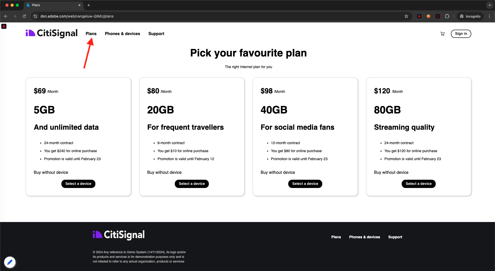

# 1.1.4 クライアント側のウェブデータ収集

## 1.1.4.1 リクエスト内のデータを検証する

### Adobe Experience Platform Debuggerのインストール

Experience Platformデバッガーは、Chromeおよび Firefox ブラウザーで使用できる拡張機能で、web ページに実装されたAdobeテクノロジーを確認するのに役立ちます。 使用するブラウザーのバージョンをダウンロードします。

- [Firefox 拡張機能 ](https://addons.mozilla.org/ja/firefox/addon/adobe-experience-platform-dbg/)

- [Chrome拡張機能 ](https://chrome.google.com/webstore/detail/adobe-experience-platform/bfnnokhpnncpkdmbokanobigaccjkpob)

初めて Debugger を使用する場合は（以前のAdobe Experience Cloud Debugger とは異なります）、次の 5 分間の概要ビデオをご覧ください。

>[!VIDEO](https://video.tv.adobe.com/v/32156?quality=12&learn=on)

デモ Web サイトを匿名モードで読み込むため、Experience Platformデバッガーも匿名モードで使用できるようにする必要があります。 これを行うには、ブラウザーで **chrome://extensions** に移動し、Experience Platformデバッガー拡張機能を開きます。

次の 2 つの設定が有効になっていることを確認します。

- 開発者モード
- 匿名モードで許可

### デモ Web サイトを開きます。

[https://builder.adobedemo.com/projects](https://builder.adobedemo.com/projects) に移動します。 Adobe IDでログインすると、このが表示されます。 Web サイトプロジェクトをクリックして開きます。

**Screens** ページで、「**実行** をクリックします。

その後、デモ Web サイトが開きます。 URL を選択してクリップボードにコピーします。

新しい匿名ブラウザーウィンドウを開きます。

前の手順でコピーしたデモ Web サイトの URL を貼り付けます。 その後、Adobe IDを使用してログインするように求められます。

アカウントタイプを選択し、ログインプロセスを完了します。

次に、匿名ブラウザーウィンドウに web サイトが読み込まれます。 デモごとに、新しい匿名ブラウザーウィンドウを使用して、デモ Web サイトの URL を読み込む必要があります。

### Experience Platformデバッガーを使用して、Edgeに送信される呼び出しを確認します

デモ Web サイトが開いていることを確認し、Experience Platformデバッガー拡張機能アイコンをクリックします。

デバッガーが開き、Adobe Experience Platform Data Collection プロパティで作成した実装の詳細が表示されます。 編集中の拡張機能とルールをデバッグしていることを忘れないでください。

右上の **[!UICONTROL ログイン]** ボタンをクリックして認証します。 Adobe Experience Platform Data Collection インターフェイスで既にブラウザータブを開いている場合、認証手順は自動的に行われ、ユーザー名とパスワードを再度入力する必要はありません。

デモ Web サイトでリロードボタンを押して、デバッガーをその特定のタブに接続します。

上の図のように、デバッガーが **[!UICONTROL ホームに接続]** されていることを確認し、**[!UICONTROL lock]** アイコンをクリックして、デバッガーをデモ Web サイトにロックします。 そうしないと、デバッガーが切り替わり続けて、フォーカスされているブラウザータブの実装の詳細が表示されるので、混乱が生じるおそれがあります。

次に、デモ Web サイトの任意のページ（例：**Men** カテゴリページ）に移動します。

左側のナビゲーションで **[!UICONTROL Experience PlatformWeb SDK]** をクリックして、**[!UICONTROL ネットワークリクエスト]** を表示します。

各リクエストには **[!UICONTROL events]** 行が含まれます。

クリックして **[!UICONTROL events]** 行を開きます。 **web.webpagedetails.pageViews** イベントと、**Web SDK ExperienceEvent XDM** 形式に準拠するその他の標準変数を確認する方法に注意してください。

このようなリクエストの詳細は、「ネットワーク」タブにも表示されます。 **インタラクション** を使用してリクエストをフィルタリングし、Web SDK から送信されるリクエストを特定します。 XDM ペイロードのすべての詳細については、リクエストペイロードヘッダーを参照してください。

次の手順：[1.1.5 Adobe AnalyticsとAdobe Audience Managerを実装する ](./ex5.md)

[モジュール 1.1 に戻る](./data-ingestion-launch-web-sdk.md)

[すべてのモジュールに戻る](./../../../overview.md)
