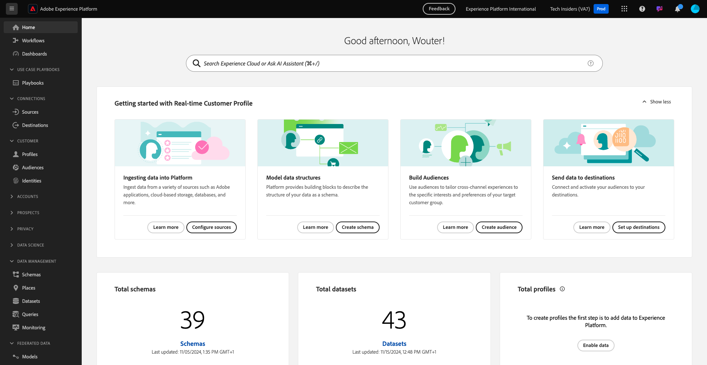

# 1.1.7 Adobe Experience Platformにおける XDM スキーマの要件

Web SDK と alloy.js でデータをAdobe Experience Platformに取り込めるようにするには、特定の XDM Mixin をAdobe Experience Platformの XDM スキーマに含める必要があります。

[https://experience.adobe.com/platform](https://experience.adobe.com/platform) に移動し、ログインします。

ログイン後、画面上部の青い線のテキスト **Production Prod** をクリックして、適切なサンドボックスを選択します。 サンドボックス `--aepSandboxName--` を選択します。

サンドボックスを選択すると、画面が変更され、サンドボックスに移動します。

左側のメニューで **スキーマ** に移動し、**デモシステム - Web サイトのイベントスキーマ（グローバル v1.1）** スキーマを開きます。

そのスキーマに、フィールドグループ **AEP Web SDK ExperienceEvent Mixin** が追加されていることがわかります。 このフィールドグループは、最低限必要なフィールドをすべてスキーマに追加します。 Web SDK で使用されるAdobe Experience Platformのすべてのエクスペリエンスイベントスキーマは、常にそのフィールドグループがスキーマの一部である必要があります。

[ モジュール 1.2](./../module1.2/data-ingestion.md) では、スキーマにフィールドグループを追加する方法を説明します。

次の手順：[ 概要とメリット ](./summary.md)

[モジュール 1.1 に戻る](./data-ingestion-launch-web-sdk.md)

[すべてのモジュールに戻る](./../../../overview.md)
