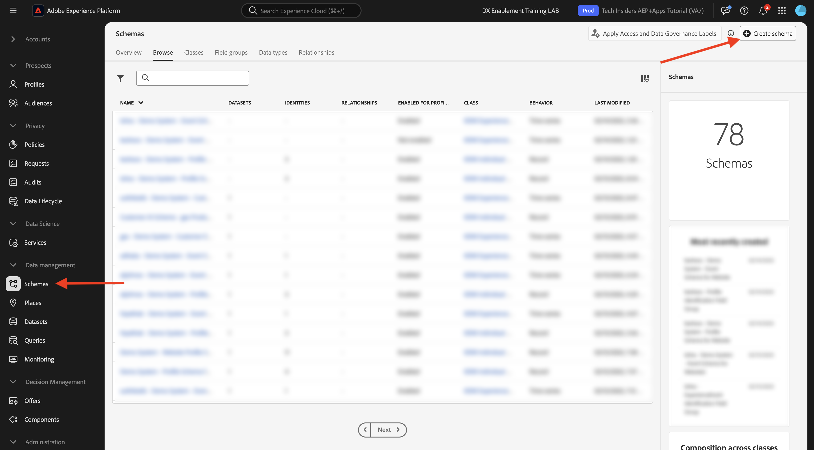
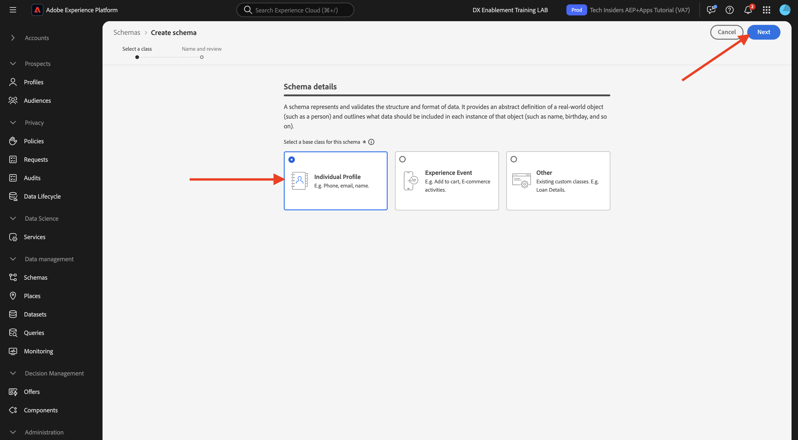
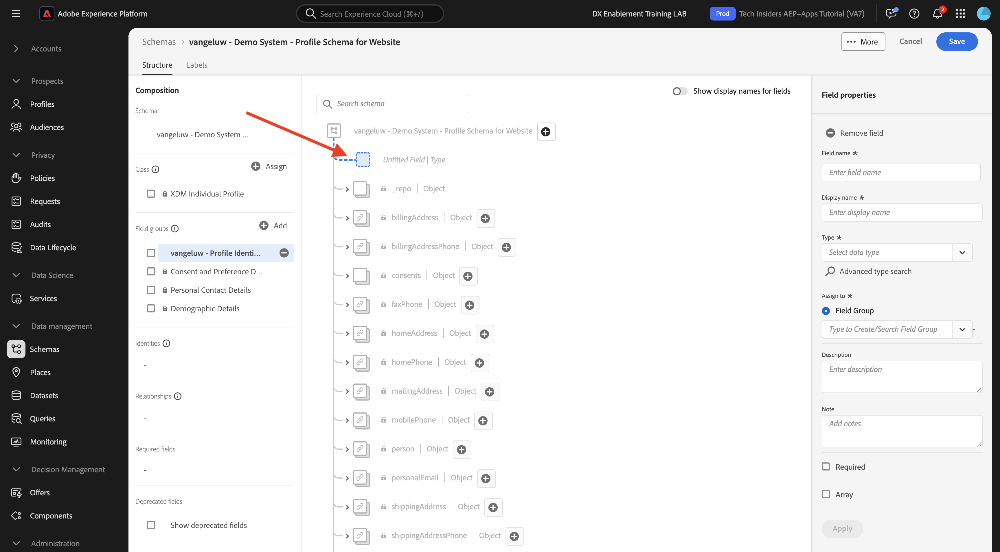
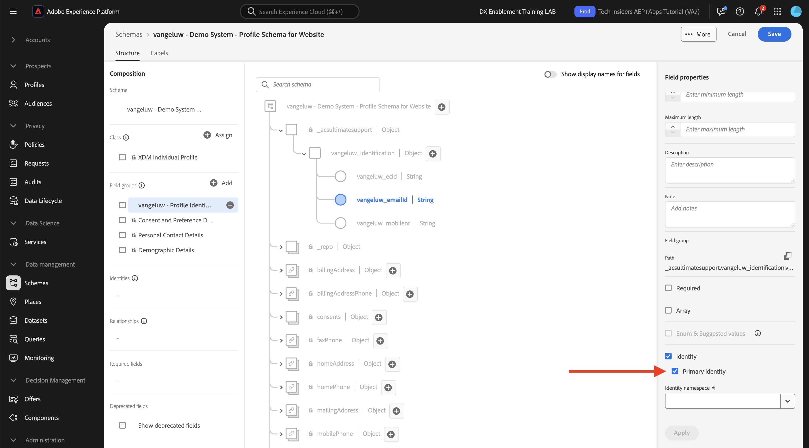
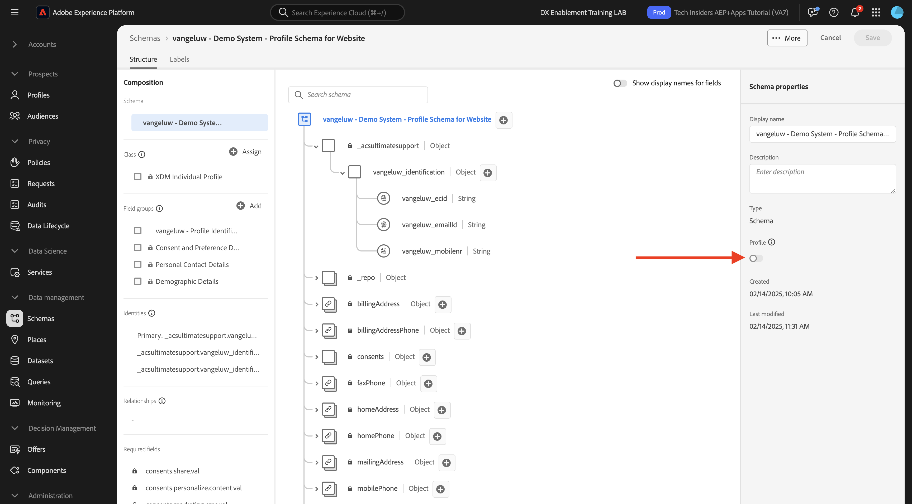
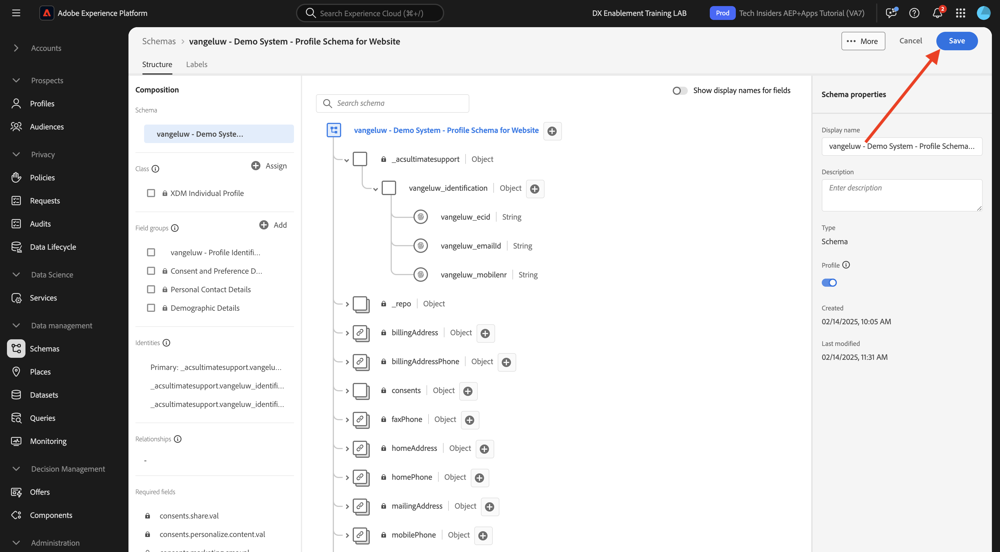
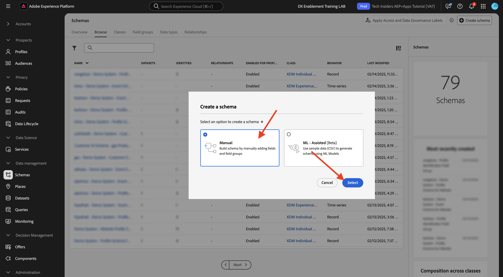

# 1.2.2 スキーマの設定と識別子の設定

この演習では、プロファイル情報と顧客行動を分類するために必要な XDM スキーマの設定を確認します。 また、すべての XDM スキーマで、顧客関連のすべての情報をリンクするためのプライマリ識別子が定義されていることがわかります。

## ストーリー

XDM スキーマの設定と識別子の定義を開始する前に、以下を行おうとしていることのビジネスコンテキストについて考える必要があります。

- データが必要
- データを顧客にリンクする
- プログレッシブなリアルタイム顧客プロファイルを作成する場合

取り込むデータには、次の 2 種類があります。

- この顧客は誰ですか？
- この顧客の業務内容

ただし、「この顧客は誰か **という質問があります。** れは多くの答えを持つ非常にオープンな質問です。 組織がこの質問に対する回答を確認したい場合は、名、姓、住所などのデモグラフィック情報を探しています。 また、メールアドレスや携帯電話番号などの連絡先情報についても同様です。 また、言語にリンクされた情報の場合は、オプトイン/オプトアウト、さらにはプロファイル画像についても説明します。 最後に、実際に知っておく必要があるのは、組織が使用する様々なシステムでこの顧客をどのように識別するかです。

「この顧客は何をしますか **という質問も同じです。**。これは、多くの回答を含む非常にオープンな質問です。 組織がこの質問に対する回答を確認したい場合は、顧客がオンラインおよびオフラインのプロパティのいずれかと行ったやり取りを探します。 訪問されたページまたは製品はどれですか？ この顧客は買い物かごに製品を追加しましたか、または商品を購入しましたか？ Web サイトの参照に使用したデバイスとブラウザーは何ですか？ お客様はどのような情報を求めていますか？また、どのようにそれを使用して、この顧客に快適なエクスペリエンスを設定および提供できますか？ 最後に、実際に知っておく必要があるのは、組織が使用する様々なシステムで、この顧客をどのように識別するかです。

## この顧客は誰か

**この顧客は誰か？組織の** 定は、ログイン/登録ページから行います。

スキーマの観点からは、これを **クラス** と見なします。 質問：**この顧客は誰ですか？** は、クラス **[!UICONTROL XDM 個人プロファイル]** で定義するものです。

そのため、XDM スキーマを作成して、「この顧客は誰か **という回答を取り込むようにします。ま**、まず、クラス **[!UICONTROL XDM 個人プロファイル]** を参照する 1 つのスキーマを作成して定義する必要があります。

その質問にどのような回答を提供できるかを指定するには、[!UICONTROL &#x200B; フィールドグループ &#x200B;] を定義する必要があります。 [!UICONTROL &#x200B; フィールドグループ &#x200B;] はプロファイルクラスの拡張機能で、非常に特殊な設定があります。 例えば、名、姓、性別、誕生日などのデモグラフィック情報は、[!UICONTROL &#x200B; フィールドグループ &#x200B;]:**[!UICONTROL デモグラフィックの詳細]** の一部です。

次に、この顧客を特定する方法を決定する必要があります。 組織の場合、既知の顧客の主な識別子は、メールアドレスなどの特定の顧客 ID である可能性があります。 しかし、技術的には、携帯電話番号を使用するなど、組織で顧客を識別する他の方法があります。
このラボでは、メールアドレスをプライマリ識別子、電話番号をセカンダリ識別子として定義します。

最後に、データが取得されたチャネルを区別することが重要です。 この例では、Web サイトの登録について説明し、定義する必要があるスキーマは、登録データが取得された **場所** を反映する必要があります。 チャネルは、どのデータを取り込むかに影響を与える重要な役割も果たします。 そのため、収集されるチャネル、プライマリ識別子、データのタイプのすべての組み合わせに対してスキーマのを定義することがベストプラクティスです。

上記に基づいて、Adobe Experience Platformでスキーマのが作成されました。

URL:[https://experience.adobe.com/platform](https://experience.adobe.com/platform) に移動して、Adobe Experience Platformにログインします。

ログインすると、Adobe Experience Platformのホームページが表示されます。

続行する前に、**サンドボックス** を選択する必要があります。 選択するサンドボックスの名前は ``--aepSandboxName--`` です。 適切なサンドボックスを選択すると、画面が変更され、専用のサンドボックスが表示されます。

Adobe Experience Platformで、画面の左側のメニューにある **[!UICONTROL スキーマ]** をクリックします。 使用可能な [!UICONTROL &#x200B; スキーマ &#x200B;] のリストが表示されます。 新しいスキーマを作成してください。 新しいスキーマを作成するには、「**[!UICONTROL + スキーマを作成]**」をクリックします。

「**手動**」を選択し、「**選択**」をクリックします。

次に、「**個人プロファイル**」を選択し、「**次へ**」をクリックします。

スキーマの名前を `--aepUserLdap-- - Demo System - Profile Schema for Website` のように入力します。 「**完了**」をクリックします。

これで、新しいスキーマが作成されました。

次に、質問に対する回答 **この顧客は誰か）を定義する必要があります。次のよ** になります。
このラボの導入では、顧客を定義するために次の属性が必要であることに注意しました。

- デモグラフィック情報（名、姓、住所など）
- 連絡先情報（自宅住所、メールアドレス、携帯電話番号など）
- 言語にリンクされた他の情報、オプトイン/オプトアウト、さらにはプロファイル画像。
- プライマリの顧客識別子

その情報をスキーマの一部にするには、スキーマに次の [!UICONTROL &#x200B; フィールドグループ &#x200B;] を追加する必要があります。

- 人口統計の詳細（人口統計情報）
- 個人の連絡先の詳細（連絡先情報）
- 同意と環境設定の詳細（その他の情報）
- 組織のカスタムプロファイル ID フィールドグループ（プライマリとセカンダリの ID）

**フィールドグループ** の下にある「**+追加**」ボタンをクリックします。

**[!UICONTROL フィールドグループを追加]** 画面で、[!UICONTROL &#x200B; フィールドグループ &#x200B;]&#x200B;**[!UICONTROL デモグラフィックの詳細]**、**[!UICONTROL 個人の連絡先の詳細]**、**[!UICONTROL 同意と環境設定の詳細]** を選択します。

「**[!UICONTROL フィールドグループを追加]**」ボタンをクリックして、[!UICONTROL &#x200B; フィールドグループ &#x200B;] をスキーマに追加します。

次の機能を使用できるようになります。

次に、データ収集に使用される [!UICONTROL &#x200B; 識別子 &#x200B;] を取得するために、新しい **[!UICONTROL フィールドグループ]** が必要です。 前の演習で見たように、識別子の概念があります。 収集されたすべてのデータはこの ID にリンクされるので、プライマリ ID は最も重要です。

次に、独自のカスタム [!UICONTROL &#x200B; フィールドグループ &#x200B;] を作成するので、独自の組織の要件を満たすために [!UICONTROL XDM スキーマ &#x200B;] を拡張します。

**フィールドグループ** の下の「**+追加**」をクリックして、[!UICONTROL &#x200B; フィールドグループ &#x200B;] の追加を開始します。

既存の [!UICONTROL &#x200B; フィールドグループ &#x200B;] を再利用する代わりに、独自の [!UICONTROL &#x200B; フィールドグループ &#x200B;] を作成できるようになりました。 それには、「**[!UICONTROL 新しいフィールドグループを作成]**」を選択します。

次に、新しい **[!UICONTROL フィールドグループ]** に **[!UICONTROL 表示名]** と [!UICONTROL &#x200B; 説明 &#x200B;] を入力する必要があります。

スキーマの名前として、次を使用します。
`--aepUserLdap-- - Profile Identification Field Group`

「**[!UICONTROL フィールドグループを追加]**」ボタンをクリックして、新しく作成した [!UICONTROL &#x200B; フィールドグループ &#x200B;] をスキーマに追加します。

これで、このスキーマ構造が用意されました。

新しい [!UICONTROL &#x200B; フィールドグループ &#x200B;] はまだ空なので、その [!UICONTROL &#x200B; フィールドグループ &#x200B;] にフィールドを追加する必要があります。
[!UICONTROL &#x200B; フィールドグループ &#x200B;] リストで、カスタムの [!UICONTROL &#x200B; フィールドグループ &#x200B;] をクリックします。

これで、多数の新しいボタンが表示されます。

スキーマの最上位レベルで、「**[!UICONTROL + フィールドを追加]**」ボタンをクリックします。

「**[!UICONTROL + フィールドを追加]**」ボタンをクリックすると、スキーマに新しい名称未設定フィールドが表示されます。

次のオブジェクト定義を使用して、この新しいフィールドの情報を入力する必要があります。

- フィールド名: **`--aepUserLdap--_identification`**
- 表示名：**`--aepUserLdap--_identification`**
- タイプ：**[!UICONTROL オブジェクト]**
- フィールドグループ：**`--aepUserLdap-- - Profile Identification Field Group`**

「**適用**」をクリックします。

スキーマにカスタム **[!UICONTROL オブジェクト]** を表す新しいオブジェクトがスキーマに表示され、Adobe Experience Platform テナント ID にちなんで名前が付けられます。 Adobe Experience Platform テナント ID は `--aepTenantId--` で、すべての AEP インスタンスに対して一意です。

次に、そのテナントの下に、作成したばかりの **identification** オブジェクトに、3 つの新しいフィールドオブジェクトを追加します。 これらの 3 つのフィールドのいずれか 1 つのみを追加するには、それぞれのフィールドの **id** の下にある **+ アイコン** をクリックします。

以下の情報を使用して、これら 3 つの新しいフィールドを **[!UICONTROL identification]** オブジェクトの下に作成します。

- ecid:
   - フィールド名: **`--aepUserLdap--_ecid`**
   - 表示名：**`--aepUserLdap--ecid`**
   - タイプ：**[!UICONTROL String]**
   - フィールドグループ：**`--aepUserLdap-- - Profile Identification Field Group`**

- emailId
   - フィールド名: **`--aepUserLdap--_emailId`**
   - 表示名：**`--aepUserLdap--_emailId`**
   - タイプ：**[!UICONTROL String]**
   - フィールドグループ：**`--aepUserLdap-- - Profile Identification Field Group`**

- モバイル
   - フィールド名: **`--aepUserLdap--_mobilenr`**
   - 表示名：**`--aepUserLdap--_mobilenr`**
   - タイプ：**[!UICONTROL String]**
   - フィールドグループ：**`--aepUserLdap-- - Profile Identification Field Group`**

これは、最初のフィールド設定の後の各フィールドに対する外観です。

- `--aepUserLdap--_mobilenr`

フィールドを保存するには、「**[!UICONTROL 適用]**」ボタンが表示されるまで **[!UICONTROL フィールドプロパティ]** を下にスクロールします。 「**[!UICONTROL 適用]** ボタンをクリックします。

- `--aepUserLdap--_ecid`

必ず下にスクロールして、「適用 **をクリックし** ください。

- `--aepUserLdap--_emailId`

必ず下にスクロールして、「適用 **をクリックし** ください。

各フィールドはタイプ **[!UICONTROL 文字列]** として定義され、これらのフィールドを **[!UICONTROL ID]** として設定します。 このスキーマでは、顧客は常にメールアドレスで識別されると想定しています。つまり、「**[!UICONTROL emailId]**」フィールドを **[!UICONTROL プライマリ]** 識別子として設定し、その他のフィールドを通常の識別子として設定する必要があります。

3 つのフィールドは、**[!UICONTROL ID]** フィールドとして定義する必要があります。

これらのフィールドを **[!UICONTROL ID]** フィールドとして定義するには、次の手順に従います。

- フィールド **`--aepUserLdap--_emailId`** を選択します。
- 右側のフィールドプロパティで、下にスクロールして **[!UICONTROL ID]** を表示します。 **[!UICONTROL ID]** のチェックボックスをオンにします。

- 次に、**[!UICONTROL プライマリ ID]** のチェックボックスをオンにします。

- 最後に、**[!UICONTROL 名前空間]** のリストから名前空間 **[!UICONTROL メール]** を選択します。 名前空間は、Adobe Experience Platformの ID グラフで、名前空間内の ID を分類し、それらの名前空間間の関係を定義するために使用されます。 「**[!UICONTROL 適用]**」をクリックして変更を保存します。

次に、**`--aepUserLdap--_ecid`** と **`--aepUserLdap--_mobilenr`** の他のフィールドを標準識別子として定義する必要があります。

フィールド **`--aepUserLdap--_ecid`** を選択します。 右側のフィールドプロパティで、下にスクロールして **[!UICONTROL ID]** を表示します。 **[!UICONTROL ID]** のチェックボックスをオンにします。
次に、**[!UICONTROL 名前空間]** リストから名前空間 **[!UICONTROL ECID]** を選択します。
「**[!UICONTROL 適用]**」をクリックして変更を保存します。

フィールド **`--aepUserLdap--_mobilenr`** を選択します。 右側のフィールドプロパティで、下にスクロールして **[!UICONTROL ID]** を表示します。 **[!UICONTROL ID]** のチェックボックスをオンにします。
**[!UICONTROL 名前空間]** リストから名前空間 **[!UICONTROL 電話]** を選択します。
「**[!UICONTROL 適用]**」をクリックして変更を保存します。

**[!UICONTROL identification]** オブジェクトは次のようになります。3 つの id フィールドには、識別子として定義されたことを示す **[!UICONTROL フィンガープリント]** アイコンも表示されます。

「**[!UICONTROL 保存]**」をクリックして変更を保存します。

最後に、**[!UICONTROL Profile]** にリンクさせるスキーマをアクティブ化します。
プロファイルのスキーマを有効にすると、このスキーマに対してAdobe Experience Platformに送信されるすべてのデータがリアルタイム顧客プロファイル環境に含まれます。これにより、すべてのデータをリアルタイムでクエリ、セグメント化、アクティベーションに使用できるようになります。

それには、スキーマの名前を選択します。

スキーマの右のタブで、現在アクティブでない **[!UICONTROL プロファイル切り替え]** をクリックします。

[!UICONTROL &#x200B; プロファイル &#x200B;] スイッチをクリックしてアクティブ化します。

**[!UICONTROL 有効にする]** をクリックして、このスキーマをプロファイルに対して有効にします。

これで、スキーマが [!UICONTROL &#x200B; リアルタイム顧客プロファイル &#x200B;] の一部として設定されました。 「**[!UICONTROL 保存]**」をクリックしてスキーマを保存します。

## この顧客の業務内容

質問に対する回答のキャプチャ **この顧客が行うこと組織のア** ット設定は、例えば、製品ページの製品表示を通じて行われます。

スキーマの観点からは、これを **[!UICONTROL クラス]** と見なします。 質問：**この顧客の業務内容** は、クラス **[!UICONTROL ExperienceEvent]** で定義したものです。

そのため、[!UICONTROL XDM スキーマ &#x200B;] を作成して、**この顧客は何をしますか？ま**、まず、クラス **[!UICONTROL ExperienceEvent]** を参照する 1 つのスキーマを作成して定義する必要があります。

その質問にどのような回答を提供できるかを指定するには、[!UICONTROL &#x200B; フィールドグループ &#x200B;] を定義する必要があります。 [!UICONTROL &#x200B; フィールドグループ &#x200B;] は、[!UICONTROL ExperienceEvent] クラスの拡張機能で、非常に特殊な設定を持ちます。 例えば、顧客が閲覧したり買い物かごに追加したりした商品の種類に関する情報は、[!UICONTROL &#x200B; フィールドグループ &#x200B;]&#x200B;**Commerceの詳細** に含まれています。

次に、この顧客の行動をどのように特定するかを組織で決定する必要があります。 Web サイトでのインタラクションについて話しているので、組織が顧客を知っている可能性がありますが、未知の匿名の訪問者が Web サイトでアクティブである可能性も同様に高くなります。 したがって、メールアドレスのような識別子は使用できません。 この場合、組織では、[!UICONTROL Experience Cloud ID （ECID） &#x200B;] をプライマリ識別情報として使用することになるでしょう。

最後に、データが取得されたチャネルを区別することが重要です。 ここでは、Web サイトのインタラクションについて説明します。定義する必要があるスキーマは、インタラクションデータがキャプチャされた **場所** を反映する必要があります。 チャネルは、どのデータを取り込むかに影響を与える重要な役割も果たします。 そのため、収集されるチャネル、プライマリ識別子、データのタイプのすべての組み合わせに対してスキーマのを定義することがベストプラクティスです。

上記に基づいて、Adobe Experience Platformでスキーマを設定する必要があります。

ログインすると、Adobe Experience Platformのホームページが表示されます。

続行する前に、**[!UICONTROL サンドボックス]** を選択する必要があります。 選択する [!UICONTROL &#x200B; サンドボックス &#x200B;] の名前は ``--aepSandboxName--`` です。 適切なサンドボックスを選択すると、画面が変更され、専用のサンドボックスが表示されます。

Adobe Experience Platformで、画面の左側のメニューにある **[!UICONTROL スキーマ]** をクリックし、**参照** に移動します。 新しいスキーマを作成してください。 新しいスキーマを作成するには、**[!UICONTROL + スキーマを作成]** ボタンをクリックします。

「**手動**」を選択し、「**選択**」をクリックします。

**エクスペリエンスイベント** を選択し、「**次へ**」をクリックします。

`--aepUserLdap-- - Demo System - Event Schema for Website` のようにスキーマの名前を入力します。 「**完了**」をクリックします。

新しいスキーマが作成され、それに対して収集するデータを設定できます。

次に、質問に対する回答 **この顧客は何をしますか？次のよ** になります。
このラボの導入では、顧客の業務内容を定義するために次の属性が必要であることに注意しました。

- 訪問されたページまたは製品はどれですか？
- この顧客は買い物かごに製品を追加しましたか、または商品を購入しましたか？
- Web サイトの参照に使用したデバイスとブラウザーは何ですか？
- お客様はどのような情報を求めていますか？また、どのようにそれを使用して、この顧客に快適なエクスペリエンスを設定および提供できますか？
- プライマリの顧客識別子

その情報をスキーマの一部にするには、スキーマに次の [!UICONTROL &#x200B; フィールドグループ &#x200B;] を追加する必要があります。

- AEP Web SDK ExperienceEvent
- 組織のカスタムプロファイル ID[!UICONTROL &#x200B; フィールドグループ &#x200B;]

**フィールドグループ** の下の「**+追加**」をクリックします。

**[!UICONTROL フィールドグループを追加]** 画面で、「[!UICONTROL &#x200B; フィールドグループ &#x200B;]」 **[!UICONTROL AEP Web SDK ExperienceEvent]** を選択します。 「**[!UICONTROL フィールドグループを追加]**」をクリックします。

すると、次のようになります。

次に、新しい [!UICONTROL &#x200B; フィールドグループ &#x200B;] を作成して、データ収集に使用する **[!UICONTROL 識別子]** を取得する必要があります。

次に、独自のカスタム [!UICONTROL &#x200B; フィールドグループ &#x200B;] を作成するので、独自の組織の要件を満たすために [!UICONTROL XDM スキーマ &#x200B;] を拡張します。

[!UICONTROL &#x200B; フィールドグループ &#x200B;] は [!UICONTROL &#x200B; クラス &#x200B;] にリンクされているので、前に作成した [!UICONTROL &#x200B; フィールドグループ &#x200B;] を単に再利用することはできません。

「**[!UICONTROL +追加]**」ボタンをクリックして、[!UICONTROL &#x200B; フィールドグループ &#x200B;] の追加を開始します。

既存の [!UICONTROL &#x200B; フィールドグループ &#x200B;] を再利用する代わりに、独自の [!UICONTROL &#x200B; フィールドグループ &#x200B;] を作成できるようになりました。 **[!UICONTROL 新しいフィールドグループを作成]** を選択し、次のようにフィールドグループの名前を入力します。`--aepUserLdap-- - ExperienceEvent Identification Field Group`
「**フィールドグループを追加**」をクリックします

これで、この [!UICONTROL &#x200B; スキーマ &#x200B;] 構造が用意できました。

新しい [!UICONTROL &#x200B; フィールドグループ &#x200B;] はまだ空なので、そのフィールドグループにフィールドを追加する必要があります。
[!UICONTROL &#x200B; フィールドグループ &#x200B;] リストで、カスタムの [!UICONTROL &#x200B; フィールドグループ &#x200B;] をクリックします。

これで、多数の新しいボタンが表示されます。

スキーマの最上位レベルで、スキーマ – 名前の横にある「**[!UICONTROL +]**」ボタンをクリックします。

**+** ボタンをクリックすると、スキーマに新しい名称未設定フィールドが表示されます。

新しいフィールドを定義する場合に使用します。

- フィールド名: **`--aepUserLdap--_identification`**
- 表示名：**`--aepUserLdap--_identification`**
- タイプ：**[!UICONTROL オブジェクト]**
- フィールドグループ：`--aepUserLdap-- - ExperienceEvent Identification Field Group`

「**適用**」をクリックします。

これで、Adobe Experience Platform テナント ID の下に新しいフィールドが作成されました。 Adobe Experience Platform テナント ID は `--aepTenantId--` です。

次に、**[!UICONTROL identification]** オブジェクトの下に新しいフィールドを 1 つ追加します。

**[!UICONTROL id]** オブジェクトの横にある「**[!UICONTROL +]**」ボタンをクリックして、新しいフィールドを作成します。

ECID フィールドは型 **[!UICONTROL 文字列]** として定義され、このフィールドを **[!UICONTROL ID]** として設定します。 スキーマ **[!UICONTROL デモシステム - Web サイトのイベントスキーマ]** の場合、顧客は常に [!UICONTROL ECID] で識別されると想定します。つまり、「**[!UICONTROL ECID]**」フィールドを **プライマリ** 識別子として設定する必要があります

これで、空のフィールドが作成されました。 示されているように、上記のフィールドを設定する必要があります。

- ecid:

   - フィールド名: **`--aepUserLdap--_ecidweb`**
   - 表示名：**`--aepUserLdap--_ecidweb`**
   - タイプ：**[!UICONTROL String]**
   - フィールドグループ：`--aepUserLdap-- - ExperienceEvent Identification Field Group`

`--aepUserLdap--_ecidweb` フィールドは、最初のフィールド設定の後にどのように表示されるかを次に示します。

下にスクロールして、「**[!UICONTROL 適用]**」をクリックします。

これで新しいフィールドが作成されましたが、このフィールドはまだ **[!UICONTROL ID]** フィールドとして定義されていません。

これらのフィールドを **[!UICONTROL ID]** フィールドとして定義するには、フィールド **`--aepUserLdap--_ecidweb`** を選択します。
右側のフィールドプロパティで、下にスクロールして **[!UICONTROL ID]** を表示します。 **[!UICONTROL ID]** のチェックボックスをオンにし、**[!UICONTROL プライマリ ID]** のチェックボックスをオンにします。
**[!UICONTROL 名前空間]** リストから名前空間 **[!UICONTROL ECID]** を選択します。

「**[!UICONTROL 適用]**」をクリックして変更を保存します。

**[!UICONTROL identification]** オブジェクトは次のようになります。ecid-field には、識別子として定義されたことを示す **フィンガープリント** アイコンも表示されます。
「**[!UICONTROL 保存]**」をクリックして変更を保存します。

最終的にこのスキーマに対してデータを取り込む場合、一部のフィールドは必須であることに注意することが重要です。
例えば、**[!UICONTROL _id]** および **[!UICONTROL timestamp]** フィールドは必須フィールドであり、ExperienceEvent クラスによって課される要件です。

- _id には、特定のデータ取り込みの一意の id を含める必要があります
- タイムスタンプは、このヒットのタイムスタンプである必要があります。形式は **`"YYYY-MM-DDTHH:MM:SSSZ"`** です。例：**`"2024-11-18T07:20:000Z"`**

これで、スキーマを定義し、既存および新しく作成した [!UICONTROL &#x200B; フィールドグループ &#x200B;] をリンクし、識別子を定義しました。

最後に、**[!UICONTROL Profile]** にリンクさせるスキーマをアクティブ化します。
[!UICONTROL &#x200B; プロファイル &#x200B;] に対してスキーマを有効にすると、このスキーマに対してAdobe Experience Platformに送信されるすべてのデータがリアルタイム顧客プロファイルの一部になり、すべてのデータをリアルタイムでクエリ、セグメント化、アクティベーションに使用できるようになります。

それには、スキーマの名前をクリックします。

スキーマの右側のタブに、現在アクティブでない **[!UICONTROL プロファイル &#x200B;] 切り替え** が表示されます。 [!UICONTROL &#x200B; プロファイル &#x200B;] - スイッチをクリックして有効にします。

このメッセージが表示されます。 **[!UICONTROL 有効にする]** をクリックして、このスキーマをプロファイルに対して有効にします。

これで、スキーマがリアルタイム顧客プロファイルの一部として設定されました。

「**[!UICONTROL 保存]**」をクリックしてスキーマを保存します。

これで、リアルタイム顧客プロファイルで使用するためにアクティブ化されたスキーマの構築が完了しました。

次の演習では、データセットを見てみましょう。

次の手順：[1.2.3 データセットの設定 &#x200B;](./ex3.md)

[モジュール 1.2 に戻る](./data-ingestion.md)

[すべてのモジュールに戻る](../../../overview.md)
