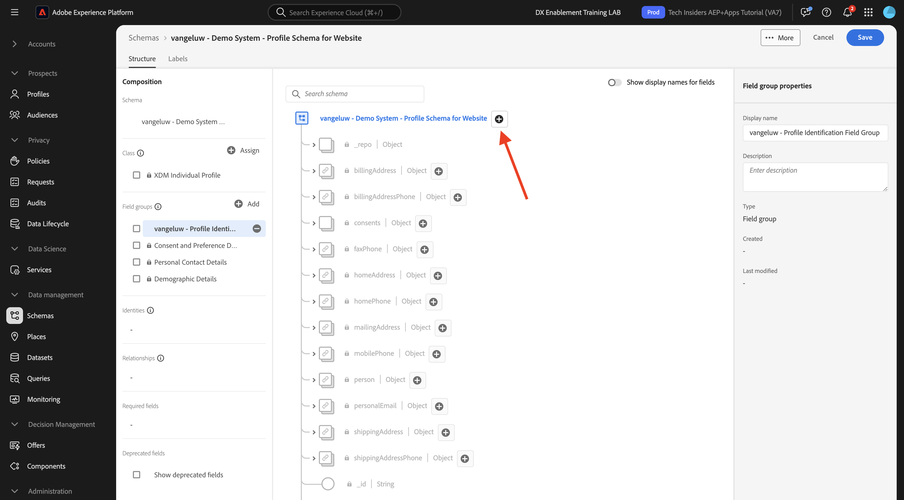
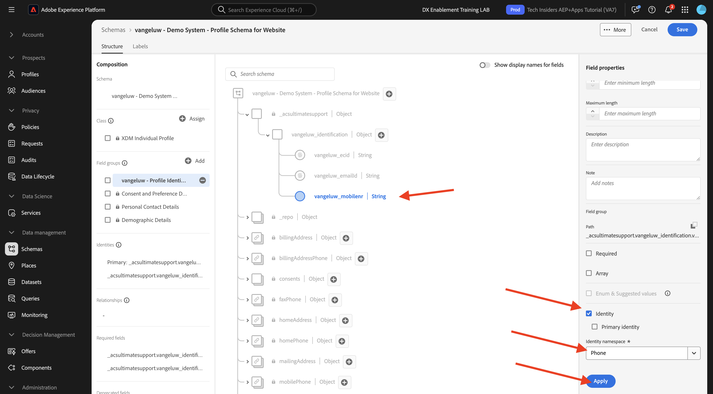
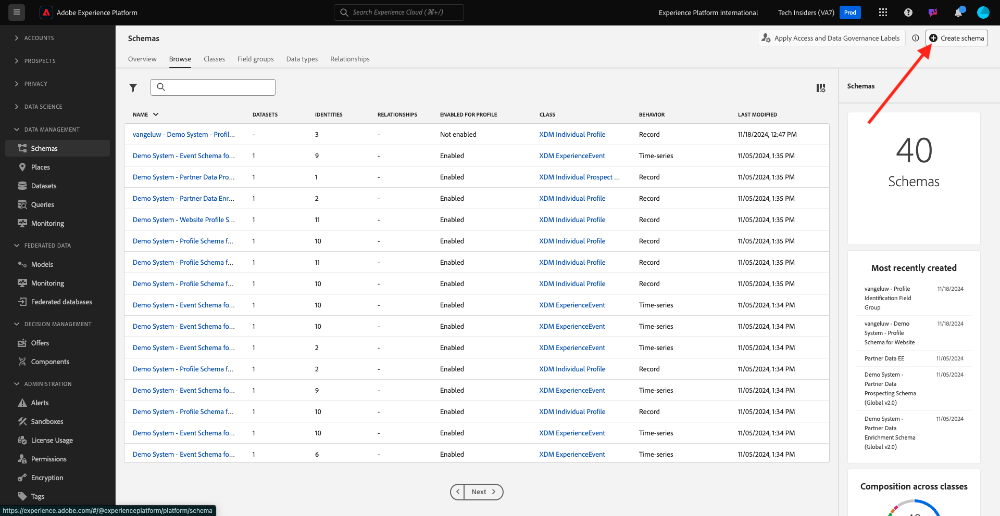

# 1.2.2 スキーマの設定と識別子の設定

この演習では、プロファイル情報と顧客行動を分類するために必要な XDM スキーマを設定します。 また、すべての XDM スキーマで、すべての情報をリンクするプライマリ識別子を設定する必要があります。

## ストーリー

XDM スキーマの設定とプライマリID の設定を開始する前に、以下を行おうとしている作業のビジネスコンテキストについて考える必要があります。

- データが必要
- データを顧客にリンクする
- プログレッシブなリアルタイム顧客プロファイルを作成する場合

取り込むデータには、次の 2 種類があります。

- この顧客は誰ですか？
- この顧客の業務内容

ただし、「この顧客は誰か **という質問があります。** れは多くの答えを持つ非常にオープンな質問です。 あなたの会社がこの質問に答えを見たいとき、あなたは名前、姓、住所のような人口統計情報を探しています。 また、メールアドレスや携帯電話番号などの連絡先情報についても同様です。 また、言語にリンクされた情報の場合は、オプトイン/オプトアウト、さらにはプロファイル画像についても説明します。 最後に、実際に知っておく必要があるのは、会社が使用する様々なシステムで、この顧客をどのように識別するかです。

「この顧客は何をしますか **という質問も同じです。**。これは、多くの回答を含む非常にオープンな質問です。 会社がこの質問に対する回答を確認したい場合は、顧客がオンラインおよびオフラインのプロパティのいずれかと行ったやり取りを探します。 訪問されたページまたは製品はどれですか？ この顧客は買い物かごに製品を追加しましたか、または商品を購入しましたか？ Web サイトの参照に使用したデバイスとブラウザーは何ですか？ お客様はどのような情報を求めていますか？また、どのようにそれを使用して、この顧客に快適なエクスペリエンスを設定および提供できますか？ 最後に、実際に知っておく必要があるのは、会社が使用する様々なシステムで、この顧客をどのように識別するかです。

## 1.2.1.1 – この顧客とは

**この顧客は誰か？あなたの会社の** は、ログイン/登録ページを通じて行われます。

スキーマの観点からは、これを **クラス** と見なします。 質問：**この顧客は誰ですか？** は、クラス **[!UICONTROL XDM 個人プロファイル]** で定義するものです。

そのため、XDM スキーマを作成して、「この顧客は誰か **という回答を取り込むようにします。ま**、まず、クラス **[!UICONTROL XDM 個人プロファイル]** を参照する 1 つのスキーマを作成して定義する必要があります。

その質問にどのような回答を提供できるかを指定するには、[!UICONTROL  フィールドグループ ] を定義する必要があります。 [!UICONTROL  フィールドグループ ] はプロファイルクラスの拡張機能で、非常に特殊な設定があります。 例えば、名、姓、性別、誕生日などのデモグラフィック情報は、[!UICONTROL  フィールドグループ ]:**[!UICONTROL デモグラフィックの詳細]** の一部です。

第二に、あなたの会社はこの顧客を識別する方法を決定する必要があります。 会社の場合、既知の顧客のメイン識別子は、メールアドレスなどの特定の顧客 ID である可能性があります。 しかし、技術的には、携帯電話番号を使用するなど、会社の顧客を識別する他の方法があります。
このラボでは、メールアドレスをプライマリ識別子、電話番号をセカンダリ識別子として定義します。

最後に、データが取得されたチャネルを区別することが重要です。 この例では、Web サイトの登録について説明し、定義する必要があるスキーマは、登録データが取得された **場所** を反映する必要があります。 チャネルは、どのデータを取り込むかに影響を与える重要な役割も果たします。 そのため、収集されるチャネル、プライマリ識別子、データのタイプのすべての組み合わせに対してスキーマのを定義することがベストプラクティスです。

上記に基づいて、Adobe Experience Platformでスキーマを設定する必要があります。

URL:[https://experience.adobe.com/platform](https://experience.adobe.com/platform) に移動して、Adobe Experience Platformにログインします。

ログインすると、Adobe Experience Platformのホームページが表示されます。

続行する前に、**サンドボックス** を選択する必要があります。 選択するサンドボックスの名前は ``--module2sandbox--`` です。 これを行うには、画面上部の青い線のテキスト **[!UICONTROL 実稼動製品]** をクリックします。 適切なサンドボックスを選択すると、画面が変更され、専用のサンドボックスが表示されます。

Adobe Experience Platformで、画面の左側のメニューにある **[!UICONTROL スキーマ]** をクリックします。 使用可能な [!UICONTROL  スキーマ ] のリストが表示されます。

新しいスキーマを作成してください。 新しいスキーマを作成するには、「**[!UICONTROL + スキーマを作成」ボタンをクリックし]** 「**[!UICONTROL XDM 個人プロファイル]**」を選択します。

「**[!UICONTROL + スキーマを作成]**」ボタンをクリックすると、新しいスキーマが作成され、**フィールドグループ** を選択または作成するよう求められます。

次に、質問に対する回答 **この顧客は誰か）を定義する必要があります。次のよ** になります。
このラボの導入では、顧客を定義するために次の属性が必要であることに注意しました。

- デモグラフィック情報（名、姓、住所など）
- 連絡先情報（自宅住所、メールアドレス、携帯電話番号など）
- 言語にリンクされた他の情報、オプトイン/オプトアウト、さらにはプロファイル画像。
- プライマリの顧客識別子

その情報をスキーマの一部にするには、スキーマに次の [!UICONTROL  フィールドグループ ] を追加する必要があります。

- 人口統計の詳細（人口統計情報）
- 個人の連絡先の詳細（連絡先情報）
- 環境設定の詳細（その他の情報）
- 会社のカスタムプロファイル ID フィールドグループ（プライマリとセカンダリの ID）

**[!UICONTROL フィールドグループを追加]** 画面で、[!UICONTROL  フィールドグループ ]**[!UICONTROL デモグラフィックの詳細]**、**[!UICONTROL 個人の連絡先の詳細]**、**[!UICONTROL 環境設定の詳細]** を選択します。

「**[!UICONTROL フィールドグループを追加]**」ボタンをクリックして、[!UICONTROL  フィールドグループ ] をスキーマに追加します。

次の機能を使用できるようになります。

次に、データ収集に使用される [!UICONTROL  識別子 ] を取得するために、新しい **[!UICONTROL フィールドグループ]** が必要です。 前の演習で見たように、プライマリとセカンダリの識別情報という概念があります。 収集されたすべてのデータはこの ID にリンクされるので、プライマリ ID は最も重要です。

次に、独自のカスタム [!UICONTROL  フィールドグループ ] を作成するので、自社の要件を満たすために [!UICONTROL XDM スキーマ ] を拡張します。

「**[!UICONTROL +追加]**」ボタンをクリックして、[!UICONTROL  フィールドグループ ] の追加を開始します。

既存の [!UICONTROL  フィールドグループ ] を再利用する代わりに、独自の [!UICONTROL  フィールドグループ ] を作成できるようになりました。 それには、「**[!UICONTROL 新しいフィールドグループを作成]**」を選択します。

次に、新しい **[!UICONTROL フィールドグループ]** に **[!UICONTROL 表示名]** と [!UICONTROL  説明 ] を入力する必要があります。

スキーマの名前として、次を使用します。
`--aepUserLdap-- - Profile Identification Field Group`

例えば、ldap **[!UICONTROL vangeluw]** の場合、次はスキーマの名前である必要があります。

**[!UICONTROL vangeluw - プロファイル識別フィールドグループ]**

次のような情報が表示されます。

「**[!UICONTROL フィールドグループを追加]**」ボタンをクリックして、新しく作成した [!UICONTROL  フィールドグループ ] をスキーマに追加します。

これで、このスキーマ構造が整いました。

新しい [!UICONTROL  フィールドグループ ] はまだ空なので、その [!UICONTROL  フィールドグループ ] にフィールドを追加する必要があります。
[!UICONTROL  フィールドグループ ] リストで、カスタムの [!UICONTROL  フィールドグループ ] をクリックします。

これで、多数の新しいボタンが表示されます。

スキーマの最上位レベルで、「**[!UICONTROL + フィールドを追加]**」ボタンをクリックします。

「**[!UICONTROL + フィールドを追加]**」ボタンをクリックすると、スキーマに新しい **[!UICONTROL オブジェクト]** が表示されます。 このオブジェクトは、スキーマ内のカスタム **[!UICONTROL オブジェクト]** を表し、Adobe Experience Platform テナント ID に従って名前が付けられます。 Adobe Experience Platform テナント ID は `--aepTenantId--` です。

次に、そのテナントの下に新しいオブジェクトを追加します。 それには、tenant-object の下のフィールド **[!UICONTROL 新しいフィールド]** をクリックします。

次のオブジェクト定義を使用します。

- フィールド名：**[!UICONTROL identification]**
- 表示名：**[!UICONTROL identification]**
- タイプ：**[!UICONTROL オブジェクト]**

「**[!UICONTROL 適用]**」をクリックして変更を保存します。

「**[!UICONTROL 適用]**」をクリックすると、**[!UICONTROL ID]** オブジェクトがスキーマに表示されます。

次に、**[!UICONTROL identification]** オブジェクトの下に 3 つの新しいフィールドを追加します。

- ecid:
   - フィールド名：**[!UICONTROL ecid]**
   - 表示名：**[!UICONTROL ecid]**
   - タイプ：**[!UICONTROL String]**

- emailId
   - フィールド名：**[!UICONTROL emailId]**
   - 表示名：**[!UICONTROL emailId]**
   - タイプ：**[!UICONTROL String]**

- モバイル
   - フィールド名：**[!UICONTROL mobilenr]**
   - 表示名：**[!UICONTROL mobilenr]**
   - タイプ：**[!UICONTROL String]**

各フィールドはタイプ **[!UICONTROL 文字列]** として定義され、これらのフィールドは **[!UICONTROL ID]** として設定します。 スキーマ **[!UICONTROL Web サイト登録スキーマ]** の場合、顧客は常にメールアドレスで識別されると想定します。つまり、「emailId **[!UICONTROL フィールドを**[!UICONTROL  プライマリ ]**識別子として、他のフィールドを****セカンダリ]** 識別子として設定する必要があります。

フィールドを追加するには、**[!UICONTROL identification]** オブジェクトの横にある **[!UICONTROL +]** ボタンをクリックします。

これで、空のフィールドが作成されました。 上記の 3 つのフィールドを以下のように設定する必要があります。

これは、最初のフィールド設定の後の各フィールドに対する外観です。

**[!UICONTROL ID]** オブジェクトの横にある「**[!UICONTROL +]**」ボタンをクリックして、新しいフィールドを作成し、示されているフィールドに入力します。

- ecid

フィールドを保存するには、「**[!UICONTROL 適用]**」ボタンが表示されるまで **[!UICONTROL フィールドプロパティ]** を下にスクロールします。 「**[!UICONTROL 適用]** ボタンをクリックします。

**[!UICONTROL ID]** オブジェクトの横にある「**[!UICONTROL +]**」ボタンをクリックして、新しいフィールドを作成し、示されているフィールドに入力します。

- emailId

フィールドを保存するには、「**[!UICONTROL 適用]**」ボタンが表示されるまで **[!UICONTROL フィールドプロパティ]** を下にスクロールします。 「**[!UICONTROL 適用]** ボタンをクリックします。

**[!UICONTROL ID]** オブジェクトの横にある「**[!UICONTROL +]**」ボタンをクリックして、新しいフィールドを作成し、示されているフィールドに入力します。

- モバイル

フィールドを保存するには、「**[!UICONTROL 適用]**」ボタンが表示されるまで **[!UICONTROL フィールドプロパティ]** を下にスクロールします。 「**[!UICONTROL 適用]** ボタンをクリックします。

これで 3 つのフィールドが作成されましたが、これらのフィールドはまだ **[!UICONTROL ID]** フィールドとして定義されていません。

これらのフィールドを **[!UICONTROL ID]** フィールドとして定義するには、次の手順に従います。

- フィールド **[!UICONTROL emailId]** を選択します。
- 右側のフィールドプロパティで、下にスクロールして **[!UICONTROL ID]** を表示します。 **[!UICONTROL ID]** のチェックボックスをオンにします。

  

- 次に、**[!UICONTROL プライマリ ID]** のチェックボックスをオンにします。

  

- 最後に、**[!UICONTROL 名前空間]** のリストから名前空間 **[!UICONTROL メール]** を選択します。 名前空間は、Adobe Experience Platformの ID グラフで、名前空間内の ID を分類し、それらの名前空間間の関係を定義するために使用されます。

  

- 最後に、「**[!UICONTROL 適用]**」をクリックして変更を保存します。

  

次に、**[!UICONTROL ecid]** と **[!UICONTROL mobilenr]** の他のフィールドをセカンダリ識別子として定義する必要があります。

- フィールド **[!UICONTROL ecid]** を選択します。
- 右側のフィールドプロパティで、下にスクロールして **[!UICONTROL ID]** を表示します。 **[!UICONTROL ID]** のチェックボックスをオンにします。

  

- 次に、**[!UICONTROL 名前空間]** リストから名前空間 **[!UICONTROL ECID]** を選択します。 [!UICONTROL  名前空間 ] は、Adobe Experience Platformの ID グラフで名前空間内の ID を分類し、名前空間間の関係を定義するために使用されます。

  

- 「**[!UICONTROL 適用]**」をクリックして変更を保存します。

  

- フィールド **[!UICONTROL mobilenr]** を選択します。
- 右側のフィールドプロパティで、下にスクロールして **[!UICONTROL ID]** を表示します。 **[!UICONTROL ID]** のチェックボックスをオンにします。

  

- 必ず **[!UICONTROL 名前空間]** のリストから名前空間 **[!UICONTROL Phone]** を選択します。 名前空間は、Adobe Experience Platformの ID グラフで、名前空間内の ID を分類し、それらの名前空間間の関係を定義するために使用されます。

  

- 「**[!UICONTROL 適用]**」をクリックして変更を保存します。

  

**[!UICONTROL identification]** オブジェクトは次のようになります。3 つの id フィールドには、識別子として定義されたことを示す **[!UICONTROL フィンガープリント]** アイコンも表示されます。

次に、スキーマに名前を付けます。 フィールド **名称未設定スキーマ** を選択します。

スキーマの名前として、次を使用します。

`--aepUserLdap-- - Demo System - Profile Schema for Website`

**[!UICONTROL ldap]** を特定の ldap に置き換えます。 例えば、ldap **[!UICONTROL vangeluw]** の場合、次はスキーマの名前である必要があります。

**[!UICONTROL vangeluw - デモシステム - Web サイトのプロファイルスキーマ]**

次のような情報が表示されます。

これで、スキーマを定義し、既存および新しく作成した [!UICONTROL  フィールドグループ ] をリンクし、識別子を定義しました。

「**[!UICONTROL 保存]**」をクリックして変更を保存します。

最後に、**[!UICONTROL Profile]** にリンクさせるスキーマをアクティブ化します。
プロファイルのスキーマを有効にすると、このスキーマに対してAdobe Experience Platformに送信されるすべてのデータがリアルタイム顧客プロファイル環境に含まれます。これにより、すべてのデータをリアルタイムでクエリ、セグメント化、アクティベーションに使用できるようになります。

これを行うには、スキーマの名前を選択します。

スキーマの右側のタブに、現在アクティブでない **[!UICONTROL プロファイル切り替え]** が表示されます。

[!UICONTROL  プロファイル ] スイッチをクリックしてアクティブ化します。

次のメッセージが表示されます。

**[!UICONTROL 有効にする]** をクリックして、このスキーマをプロファイルに対して有効にします。

これで、スキーマが [!UICONTROL  リアルタイム顧客プロファイル ] の一部として設定されました。

最後に、「**[!UICONTROL 保存]**」をクリックしてスキーマを保存します。

### 1.2.1.2 – この顧客の業務内容

質問に対する回答のキャプチャ **この顧客が行うこと会社の** は、例えば、製品ページの製品表示を通じて行われます。

スキーマの観点からは、これを **[!UICONTROL クラス]** と見なします。 質問：**この顧客の業務内容** は、クラス **[!UICONTROL ExperienceEvent]** で定義したものです。

そのため、[!UICONTROL XDM スキーマ ] を作成して、**この顧客は何をしますか？ま**、まず、クラス **[!UICONTROL ExperienceEvent]** を参照する 1 つのスキーマを作成して定義する必要があります。

その質問にどのような回答を提供できるかを指定するには、[!UICONTROL  フィールドグループ ] を定義する必要があります。 [!UICONTROL  フィールドグループ ] は、[!UICONTROL ExperienceEvent] クラスの拡張機能で、非常に具体的な設定を持っています。 例えば、顧客が閲覧したり買い物かごに追加したりした商品の種類に関する情報は、[!UICONTROL  フィールドグループ ]**Commerceの詳細** に含まれています。

次に、この顧客の行動を特定する方法を決定する必要があります。 Web サイトでのインタラクションについて話しているので、会社が顧客を知っている可能性がありますが、未知の匿名の訪問者が Web サイトでアクティブになっている可能性もあります。 したがって、メールアドレスのような識別子は使用できません。 この場合、会社は [!UICONTROL Experience CloudID （ECID） ] をプライマリ ID として使用することになるでしょう。

最後に、データが取得されたチャネルを区別することが重要です。 ここでは、Web サイトのインタラクションについて説明します。定義する必要があるスキーマは、インタラクションデータがキャプチャされた **場所** を反映する必要があります。 チャネルは、どのデータを取り込むかに影響を与える重要な役割も果たします。 そのため、収集されるチャネル、プライマリ識別子、データのタイプのすべての組み合わせに対してスキーマのを定義することがベストプラクティスです。

上記に基づいて、Adobe Experience Platformでスキーマを設定する必要があります。

ログインすると、Adobe Experience Platformのホームページが表示されます。

続行する前に、**[!UICONTROL サンドボックス]** を選択する必要があります。 選択する [!UICONTROL  サンドボックス ] の名前は ``--module2sandbox--`` です。 これを行うには、画面上部の青い線のテキスト **[!UICONTROL 実稼動製品]** をクリックします。 適切なサンドボックスを選択すると、画面が変更され、専用のサンドボックスが表示されます。

Adobe Experience Platformで、画面の左側のメニューにある **[!UICONTROL スキーマ]** をクリックします。

[!UICONTROL  スキーマ ] には、既存のスキーマがすべて表示されます。

新しいスキーマを作成してください。 新しいスキーマを作成するには、「**[!UICONTROL + スキーマを作成」ボタンをクリックし]** 「**[!UICONTROL XDM ExperienceEvent]**」を選択します。

「**[!UICONTROL + スキーマを作成]**」ボタンをクリックすると、新しいスキーマが作成され、**フィールドグループ** を選択または作成するよう求められます。

次に、質問に対する回答 **この顧客は何をしますか？次のよ** になります。
このラボの導入では、顧客の業務内容を定義するために次の属性が必要であることに注意しました。

- 訪問されたページまたは製品はどれですか？
- この顧客は買い物かごに製品を追加しましたか、または商品を購入しましたか？
- Web サイトの参照に使用したデバイスとブラウザーは何ですか？
- お客様はどのような情報を求めていますか？また、どのようにそれを使用して、この顧客に快適なエクスペリエンスを設定および提供できますか？
- プライマリの顧客識別子

その情報をスキーマの一部にするには、スキーマに次の [!UICONTROL  フィールドグループ ] を追加する必要があります。

- Web の詳細
- コマースの詳細
- 環境の詳細
- 会社のカスタムプロファイル ID[!UICONTROL  フィールドグループ ] （プライマリ識別子とセカンダリ識別子）

**[!UICONTROL フィールドグループを追加]** 画面で、[!UICONTROL  フィールドグループ ]**[!UICONTROL Web の詳細]**、**[!UICONTROL Commerceの詳細]** および **[!UICONTROL 環境の詳細]** を選択します。

「**[!UICONTROL フィールドグループを追加]**」ボタンをクリックして、フィールドグループをスキーマに追加します。

すると、次のようになります。

次に、新しい [!UICONTROL  フィールドグループ ] を作成して、データ収集に使用する **[!UICONTROL 識別子]** を取得する必要があります。 前の演習で見たように、プライマリとセカンダリの識別情報という概念があります。 収集されたすべてのデータはこの ID にリンクされるので、プライマリ ID は最も重要です。

次に、独自のカスタム [!UICONTROL  フィールドグループ ] を作成するので、自社の要件を満たすために [!UICONTROL XDM スキーマ ] を拡張します。

[!UICONTROL  フィールドグループ ] は [!UICONTROL  クラス ] にリンクされているので、前に作成した [!UICONTROL  フィールドグループ ] を単に再利用することはできません。

「**[!UICONTROL +追加]**」ボタンをクリックして、[!UICONTROL  フィールドグループ ] の追加を開始します。

既存の [!UICONTROL  フィールドグループ ] を再利用する代わりに、独自の [!UICONTROL  フィールドグループ ] を作成できるようになりました。 それには、「**[!UICONTROL 新しいフィールドグループを作成]**」を選択します。

次に、新しいフィールドグループに **[!UICONTROL 表示名]** と **[!UICONTROL 説明]** を入力する必要があります。

フィールドグループの名前として、次を使用します。

`--aepUserLdap-- - ExperienceEvent Identification Field Group`

例えば、ldap **[!UICONTROL vangeluw]** の場合、次はスキーマの名前である必要があります。

**[!UICONTROL vangeluw - ExperienceEvent Identification フィールドグループ]**

次のような情報が表示されます。

「**[!UICONTROL フィールドグループを追加]**」ボタンをクリックして、新しく作成した [!UICONTROL  フィールドグループ ] をスキーマに追加します。

これで、この [!UICONTROL  スキーマ ] 構造が用意できました。

新しい [!UICONTROL  フィールドグループ ] はまだ空なので、そのフィールドグループにフィールドを追加する必要があります。
[!UICONTROL  フィールドグループ ] リストで、カスタムの [!UICONTROL  フィールドグループ ] をクリックします。

これで、多数の新しいボタンが表示されます。

スキーマの最上位レベルで、スキーマ – 名前の横にある「**[!UICONTROL +]**」ボタンをクリックします。

「**[!UICONTROL +]**」ボタンをクリックすると、スキーマに新しい **[!UICONTROL オブジェクト]** が表示されます。 このオブジェクトは、[!UICONTROL  スキーマ ] 内のカスタム **[!UICONTROL オブジェクト]** を表し、Adobe Experience Platform テナント ID に従って名前が付けられています。 Adobe Experience Platform テナント ID は `--aepTenantId--` です。

次に、そのテナントの下に新しいオブジェクトを追加します。 それには、tenant-object の下のフィールド **[!UICONTROL 新しいフィールド]** をクリックします。

次のオブジェクト定義を使用します。

- フィールド名：**[!UICONTROL identification]**
- 表示名：**[!UICONTROL identification]**
- タイプ：**[!UICONTROL オブジェクト]**

下にスクロールして、「**[!UICONTROL 適用]**」をクリックして変更を保存します。

「**[!UICONTROL 適用]**」をクリックすると、**[!UICONTROL ID]** オブジェクトがスキーマに表示されます。

次に、**[!UICONTROL identification]** オブジェクトの下に新しいフィールドを 1 つ追加します。

**[!UICONTROL id]** オブジェクトの横にある「**[!UICONTROL +]**」ボタンをクリックして、新しいフィールドを作成します。

ECID フィールドは型 **[!UICONTROL 文字列]** として定義され、このフィールドを **[!UICONTROL ID]** として設定します。 スキーマ **[!UICONTROL デモシステム - Web サイトのイベントスキーマ]** の場合、顧客は常に [!UICONTROL ECID] で識別されると想定します。つまり、「**[!UICONTROL ECID]**」フィールドを **プライマリ** 識別子として設定する必要があります

これで、空のフィールドが作成されました。 示されているように、上記のフィールドを設定する必要があります。

- ecid:

   - フィールド名：**[!UICONTROL ecid]**
   - 表示名：**[!UICONTROL ecid]**
   - タイプ：**[!UICONTROL String]**

[!UICONTROL ecid]-field は、最初のフィールド設定の後に次のように表示されます。

下にスクロールして、「**[!UICONTROL 適用]**」をクリックします。

これで新しいフィールドが作成されましたが、このフィールドはまだ **[!UICONTROL ID]** フィールドとして定義されていません。

これらのフィールドを **[!UICONTROL ID]** フィールドとして定義するには、次の手順に従います。

- フィールド **[!UICONTROL ecid]** を選択します。
- 右側のフィールドプロパティで、下にスクロールして **[!UICONTROL ID]** を表示します。 **[!UICONTROL ID]** のチェックボックスをオンにします。

- 次に、**[!UICONTROL プライマリ ID]** のチェックボックスをオンにします。

- 最後に、**[!UICONTROL 名前空間]** リストから名前空間 **[!UICONTROL ECID]** を選択します。 [!UICONTROL  名前空間 ] は、Adobe Experience Platformの [!UICONTROL ID グラフ ] で、名前空間の ID を分類し、それらの名前空間間の関係を定義するために使用されます。

  

- 最後に、「**[!UICONTROL 適用]**」をクリックして変更を保存します。

  

**[!UICONTROL identification]** オブジェクトは次のようになります。ecid-field には、識別子として定義されたことを示す **フィンガープリント** アイコンも表示されます。

次に、スキーマに名前を付けます。 フィールド **名称未設定スキーマ** を選択します。

スキーマの名前として、次を使用します。
`--aepUserLdap-- - Demo System - Event Schema for Website`

例えば、ldap **[!UICONTROL vangeluw]** の場合、次はスキーマの名前である必要があります。

**[!UICONTROL vangeluw - デモシステム - Web サイトのイベントスキーマ]**

次のような情報が表示されます。

「**[!UICONTROL 保存]**」をクリックして変更を保存します。

最終的にこのスキーマに対してデータを取り込む場合、一部のフィールドは必須であることに注意することが重要です。
例えば、「**[!UICONTROL _id]**」フィールドと「**[!UICONTROL timestamp]**」フィールドは必須フィールドです。

- _id には、特定のデータ取り込みの一意の id を含める必要があります
- タイムスタンプは、このヒットのタイムスタンプである必要があります。形式は **[!UICONTROL &quot;YYYY-MM-DDTHH:MM:SSSZ&quot;]** です（例：**[!UICONTROL &quot;2019-04-08T07:20:000Z&quot;]**）

これで、スキーマを定義し、既存および新しく作成した [!UICONTROL  フィールドグループ ] をリンクし、識別子を定義しました。

最後に、**[!UICONTROL Profile]** にリンクさせるスキーマをアクティブ化します。
[!UICONTROL  プロファイル ] に対してスキーマを有効にすると、このスキーマに対してAdobe Experience Platformに送信されるすべてのデータがリアルタイム顧客プロファイルの一部になり、すべてのデータをリアルタイムでクエリ、セグメント化、アクティベーションに使用できるようになります。

これを行うには、スキーマの名前を選択します。

スキーマの右側のタブに、現在アクティブでない **[!UICONTROL プロファイル ] 切り替え** が表示されます。

[!UICONTROL  プロファイル ] スイッチをクリックしてアクティブ化します。

次のメッセージが表示されます。

**[!UICONTROL 有効にする]** をクリックして、このスキーマをプロファイルに対して有効にします。

これで、スキーマがリアルタイム顧客プロファイルの一部として設定されました。

最後に、「**[!UICONTROL 保存]**」をクリックしてスキーマを保存します。

これで、リアルタイム顧客プロファイルで使用するためにアクティブ化されたスキーマの構築が完了しました。

次の演習では、データセットを見てみましょう。

次の手順：[1.2.3 データセットの設定 ](./ex3.md)

[モジュール 1.2 に戻る](./data-ingestion.md)

[すべてのモジュールに戻る](../../../overview.md)
