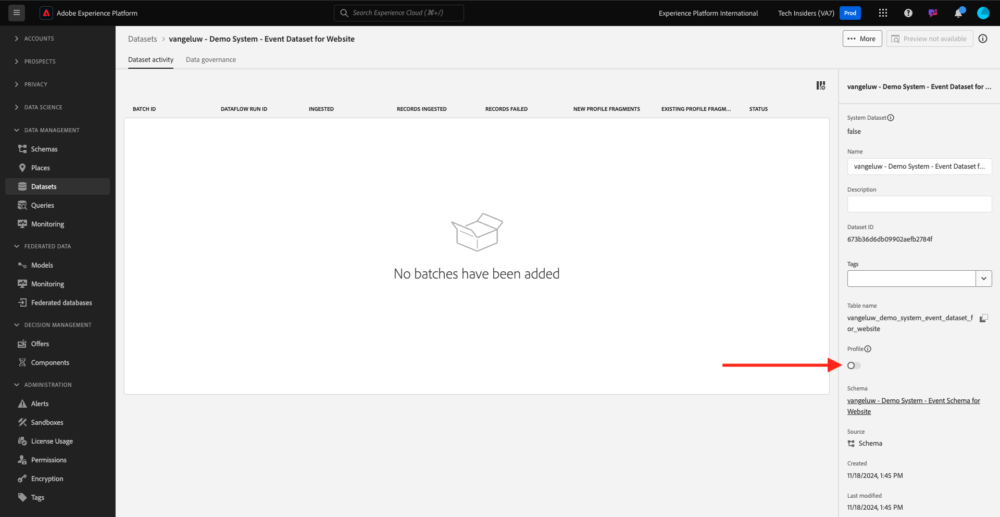

# 1.2.3 データセットの設定

この演習では、プロファイル情報と顧客の行動を取得および保存するデータセットを設定します。 この手順で作成するすべてのデータセットで、前の手順で作成したスキーマのいずれかを使用します。

## コンテキスト

質問に対する答えを定義した後 **この顧客は誰ですか？** と **この顧客の業務内容次**、その情報を使用するバケットを作成して、Adobe Experience Platformに送信されたデータを受け取り、検証する必要があります。

## データセットの作成

次に、2 つのデータセットを作成する必要があります。

- 1 つのデータセット：**この顧客は誰か？** – 質問。
- **この顧客は何をしますか？」という回答を返す情報をキャプチャする 1 つのデータセット** – 質問。

URL:[https://experience.adobe.com/platform](https://experience.adobe.com/platform) に移動して、Adobe Experience Platformにログインします。

ログインすると、Adobe Experience Platformのホームページが表示されます。

続行する前に、**[!UICONTROL サンドボックス]** を選択する必要があります。 選択するサンドボックスの名前は ``--aepSandboxName--`` です。 適切な [!UICONTROL &#x200B; サンドボックス &#x200B;] を選択すると、画面が変更され、専用の [!UICONTROL &#x200B; サンドボックス &#x200B;] が表示されます。

Adobe Experience Platformで、画面左側のメニューにある **[!UICONTROL データセット]** をクリックします。  次の画面が表示されます。

まず、web サイトの登録情報を取り込むデータセットを作成します。

新規データセットを作成する必要があります。 新しいデータセットを作成するには、「**[!UICONTROL + データセットを作成]**」ボタンをクリックします。

前の手順で定義したスキーマからデータセットを定義する必要があります。 **[!UICONTROL スキーマからデータセットを作成]** - オプションをクリックします。

次の画面では、1、`--aepUserLdap-- - Demo System - Profile Schema for Website` で作成したスキーマを選択する必要があります。

「**次へ**」をクリックします。

データセットに名前を付けましょう。

データセットの名前として、次を使用します。

`--aepUserLdap-- - Demo System - Profile Dataset for Website`

「**完了**」をクリックします。

次の項目が表示されます。

[!UICONTROL &#x200B; データセット &#x200B;] 概要に戻ります。 作成したデータセットが概要にポップアップ表示されます。

次に、web サイトのインタラクションを取り込むための 2 つ目のデータセットを設定します。

「**[!UICONTROL + データセットを作成]**」をクリックします。

前の手順で定義したスキーマからデータセットを定義する必要があります。 **[!UICONTROL スキーマからデータセットを作成]** - オプションをクリックします。

次の画面で、以前に作成したスキーマを選択する必要があります `--aepUserLdap-- - Demo System - Event Schema for Website`。

「**次へ**」をクリックします。

データセットに名前を付けましょう。

データセットの名前として、次を使用します。

`--aepUserLdap-- - Demo System - Event Dataset for Website`

「**完了**」をクリックします。

次の画面が表示されます。

[!UICONTROL &#x200B; データセット &#x200B;] 概要画面に戻ります。

次に、データセットをAdobe Experience Platformのリアルタイム顧客プロファイルの一部として使用できるようにする必要があります。

データセット `--aepUserLdap-- - Demo System - Profile Dataset for Website` をクリックして開きます。

画面の右側にある [!UICONTROL &#x200B; プロファイル &#x200B;] 切り替えアイコンを見つけます。
[!UICONTROL &#x200B; プロファイル &#x200B;] 切り替えスイッチをクリックして、このデータセットを [!UICONTROL &#x200B; プロファイル &#x200B;] に対して有効にします。

**[!UICONTROL 有効にする]** をクリックします。

これで、データセットが [!UICONTROL &#x200B; プロファイル &#x200B;] に対して有効になりました。

データセットの概要に戻り、Web サイトのデータセット `--aepUserLdap-- - Demo System - Event Dataset` をクリックして開きます。

画面の右側にある [!UICONTROL &#x200B; プロファイル &#x200B;] 切り替えアイコンを見つけます。 [!UICONTROL &#x200B; プロファイル &#x200B;] 切り替えスイッチをクリックして [!UICONTROL &#x200B; プロファイル &#x200B;] を有効にします。

**[!UICONTROL 有効にする]** をクリックします。

これで、データセットが [!UICONTROL &#x200B; プロファイル &#x200B;] に対して有効になりました。

次の手順：[1.2.4 オフラインソースからのデータ取り込み &#x200B;](./ex4.md)

[モジュール 1.2 に戻る](./data-ingestion.md)

[すべてのモジュールに戻る](../../../overview.md)
