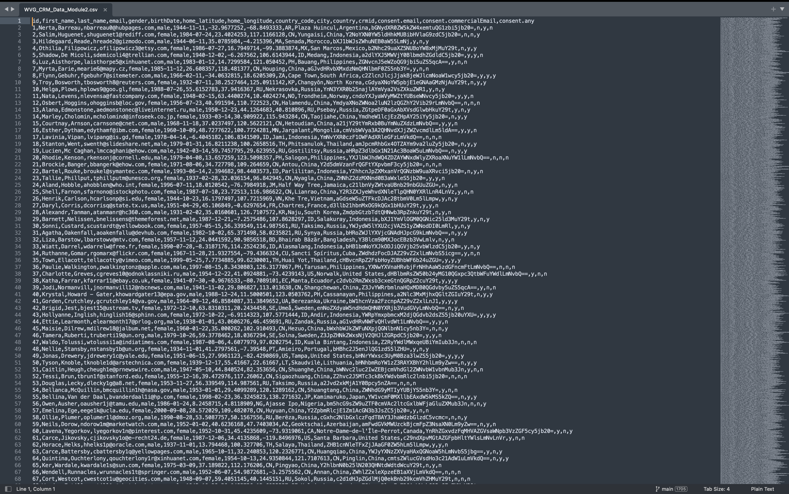
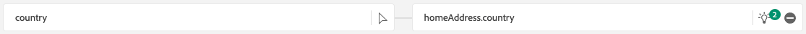
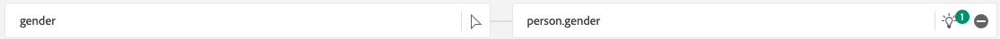

# 1.2.4 オフラインソースからのデータ取り込み

この演習の目標は、Platform で CRM データなどの外部データをオンボーディングすることです。

## 学習内容

- テストデータの生成方法を説明します
- CSV の取り込み方法を学ぶ
- ワークフローを介したデータ取り込みに web UI を使用する方法を説明します
- Experience Platformのデータガバナンス機能について

## リソース

- Mockaroo UI: [https://www.mockaroo.com/](https://www.mockaroo.com/)
- Experience PlatformUI: [https://experience.adobe.com/platform/](https://experience.adobe.com/platform/)

## タスク

- デモ日を含む CSV ファイルを作成します。 使用可能なワークフローを使用して、Adobe Experience Platformに CSV ファイルを取り込みます。
- Adobe Experience Platformのデータガバナンスオプションについて

## 1.2.4.1 データジェネレーターツールを使用して CRM データセットを作成する

そのためには、1,000 個の CRM データのサンプルラインが必要です。

[https://www.mockaroo.com/12674210](https://www.mockaroo.com/12674210) に移動して、Mockaroo テンプレートを開きます。

テンプレートには、次のフィールドがあります。

- ID
- first_name
- last_name
- メール
- 性別
- birthdate
- home_latitude
- home_経度
- country_code
- 都市
- 国

これらのフィールドはすべて、Platform に適合するデータを生成するように定義されています。

CSV ファイルを生成するには、「**[!UICONTROL データをダウンロード]**」ボタンをクリックします。このボタンをクリックすると、1000 行のデモデータを含む CSV ファイルが得られます。

Microsoft Excel で CSV ファイルを開き、その内容を視覚化します。

CSV ファイルの準備が整ったら、XDM に対するマッピングに進むことができます。

### 1.2.4.2 Adobe Experience Platformでの CRM オンボーディングデータセットの確認

[Adobe Experience Platform](https://experience.adobe.com/platform) を開き、**[!UICONTROL データセット]** に移動します。

続行する前に、**[!UICONTROL サンドボックス]** を選択する必要があります。 選択するサンドボックスの名前は ``--module2sandbox--`` です。 これを行うには、画面上部の青い線のテキスト **[!UICONTROL 実稼動製品]** をクリックします。 適切な [!UICONTROL  サンドボックス ] を選択すると、画面が変更され、専用の [!UICONTROL  サンドボックス ] が表示されます。

Adobe Experience Platformで、画面左側のメニューにある **[!UICONTROL データセット]** をクリックします。

このイネーブルメントに基づいて、共有データセットを使用します。 共有データセットは既に作成されており、**[!UICONTROL デモシステム - CRM 用プロファイルデータセット （グローバル v1.1）]** と呼ばれています。

データセット **[!UICONTROL デモシステム - CRM 用プロファイルデータセット（グローバル v1.1）]** を開きます。

概要画面には、3 つの主な情報が表示されます。

まず、[!UICONTROL  データセットアクティビティ ] ダッシュボードには、データセット内の CRM レコードの合計数と、取り込んだバッチとそのステータスが表示されます

次に、ページを下にスクロールすると、いつデータのバッチが取り込まれたか、オンボードされたレコードの数、およびバッチが正常にオンボードされたかどうかを確認できます。 **[!UICONTROL バッチ ID]** は特定のバッチジョブの識別子で、**[!UICONTROL バッチ ID]** は重要です。特定のバッチが正常にオンボードされなかった理由のトラブルシューティングに使用できるからです。

最後に、「[!UICONTROL  データセット情報 ]」タブには、[!UICONTROL  データセット ID] （トラブルシューティングの観点からは重要）、データセットの名前、データセットがプロファイルに対して有効になっているかどうかなど、重要な情報が表示されます。

ここで最も重要な設定は、データセットとスキーマの間のリンクです。 スキーマは、取得できるデータとそのデータの外観を定義します。

この例では、**[!UICONTROL Demo System - Profile Schema for CRM （Global v1.1）]** を使用しています。このスキーマは、**[!UICONTROL Profile]** クラスにマッピングされ、フィールドグループとも呼ばれる拡張機能を実装しています。

スキーマの名前をクリックすると、[!UICONTROL  スキーマ ] の概要が表示されます。このスキーマに対してアクティブ化されたすべてのフィールドが表示されます。

すべてのスキーマには、カスタムのプライマリ記述子を定義する必要があります。 CRM データセットの場合、スキーマによって、フィールド **[!UICONTROL crmId]** がプライマリ識別子である必要があると定義されています。 スキーマを作成して [!UICONTROL  リアルタイム顧客プロファイル ] にリンクする場合は、プライマリ記述子を参照するカスタム [!UICONTROL  フィールドグループ ] を定義する必要があります。

上のスクリーンショットでは、記述子が `--aepTenantId--.identification.core.crmId` にあり、**[!UICONTROL Demo System - CRMID]** の [!UICONTROL  名前空間 ] にリンクされた [!UICONTROL プライマリ ID] として設定されていることがわかります。

すべてのスキーマなど、「リアルタイム顧客プロファイル [!UICONTROL  で使用する必要があるすべてのデータセットには ]1 つの [!UICONTROL プライマリID] が必要です。 この [!UICONTROL プライマリID] は、そのデータセット内の顧客に対する、ブランドによるユーザー ID です。 CRM データセットの場合はメールアドレスまたは CRM ID であり、コールセンターデータセットの場合は顧客の携帯電話番号である可能性があります。

各データセットに対して個別の固有スキーマを作成し、各データセットの記述子を特別に設定して、ブランドで使用される現在のソリューションの動作方法に一致させることをお勧めします。

### 1.2.4.3 ワークフローを使用して CSV ファイルを XDM スキーマにマッピングする

この目標は、Platform に CRM データをオンボーディングすることです。 Platform で取り込まれるすべてのデータは、特定の XDM スキーマにマッピングする必要があります。 現在、片側に 1000 行の CSV データセットと、反対側にスキーマにリンクされたデータセットがあります。 そのデータセットに CSV ファイルを読み込むには、マッピングを行う必要があります。 このマッピングの演習を容易にするために、Adobe Experience Platformで **[!UICONTROL ワークフロー]** を使用できます。

ここで使用する [!UICONTROL  ワークフロー ] は、[!UICONTROL  データ取り込み ]**メニューの**[!UICONTROL  CSV を XDM スキーマにマッピング [!UICONTROL  という名前の ] ワークフロー ] です。

「**[!UICONTROL CSV を XDM スキーマにマッピング]**」ボタンをクリックします。 「**[!UICONTROL 起動]**」をクリックしてプロセスを開始します。

次の画面で、ファイルを取り込むデータセットを選択する必要があります。 既存のデータセットを選択するか、新しいデータセットを作成するかを選択できます。 この演習では、既存のデータセットを再利用します。以下に示すように **[!UICONTROL デモシステム - CRM 用プロファイルデータセット （グローバル v1.1）]** を選択し、他の設定はデフォルトのままにします。

「**[!UICONTROL 次へ]**」をクリックして、次の手順に進みます。

CSV ファイルをドラッグ&amp;ドロップするか、「**[!UICONTROL 参照]** をクリックしてコンピューター上でデスクトップに移動し、CSV ファイルを選択します。

CSV ファイルを選択すると、すぐにアップロードされ、ファイルのプレビューが数秒以内に表示されます。

「**[!UICONTROL 次へ]**」をクリックして、次の手順に進みます。 ファイルが完全に処理されるまでに数秒かかる場合があります。

次に、CSV 列ヘッダーを **[!UICONTROL デモシステム - CRM 用プロファイルデータセット]** の XDM プロパティにマッピングする必要があります。

Adobe Experience Platformは、[!UICONTROL Source属性を [!UICONTROL  ターゲットスキーマフィールド ] にリンクすることにより、既にいくつかの提案を行ってい ] す。

[!UICONTROL  スキーママッピング ] の場合、Adobe Experience Platformは既にフィールドをリンクしようとしています。 ただし、マッピングのすべての提案が正しいわけではありません。 ここで、**ターゲットフィールドを受け入れる** 1 つずつ」必要があります。

#### birthdate

Source スキーマフィールド **birthDate** は、ターゲットフィールド **person.birthDate** にリンクする必要があります。

#### 都市

Source スキーマフィールド **市区町村** は、ターゲットフィールド **homeAddress.city** にリンクする必要があります。

#### 国

Source スキーマフィールド **国** は、ターゲットフィールド **homeAddress.country** にリンクする必要があります。

#### country_code

Source スキーマフィールド **country_code** は、ターゲットフィールド **homeAddress.countryCode** にリンクする必要があります。

#### メール

Source スキーマフィールド **email** は、ターゲットフィールド **personalEmail.address** にリンクする必要があります。

#### crmid

Crmid**Source スキーマフィールドは**ターゲットフィールド **`--aepTenantId--`.identification.core.crmId** にリンクする必要があります。

#### first_name

Source スキーマフィールド **first_name** は、ターゲットフィールド **person.name.firstName** にリンクする必要があります。

#### 性別

Source スキーマフィールド **gender** は、ターゲットフィールド **person.gender** にリンクする必要があります。

#### home_latitude

Source スキーマフィールド **home_latitude** は、ターゲットフィールド **homeAddress._schema.latitude**.

#### home_経度

Source スキーマフィールド **home_longitude** は、ターゲットフィールド **homeAddress._schema.longitude**.

#### ID

Source スキーマフィールド **id** は、ターゲットフィールド **_id** にリンクする必要があります。

#### last_name

Source スキーマフィールド **last_name** は、ターゲットフィールド **person.name.lastName** にリンクする必要があります。

これで、次のようになります。

**[!UICONTROL 終了]** ボタンをクリックして、ワークフローを終了します。

「**[!UICONTROL 完了]**」をクリックすると、**データフロー** の概要が表示されます。数分後、画面を更新して、ワークフローが正常に完了したかどうかを確認できます。 **ターゲットデータセット名** をクリックします。

その後、取り込みが処理されたデータセットが表示されます。

データセットには、たった今取り込まれた [!UICONTROL  バッチ ID] と、1,000 件のレコードが取り込まれたステータス **[!UICONTROL 成功]** が表示されます。

「**[!UICONTROL データセットをプレビュー]**」ボタンをクリックして、データセットの小さなサンプルのクイックビューを取得し、読み込まれたデータが正しいことを確認します。

データが読み込まれたら、データセットに対して正しいデータガバナンスアプローチを定義できます。

### 1.2.5.4 データセットへのデータガバナンスの追加

顧客データを取り込んだので、このデータセットが使用および書き出し制御のために適切に管理されていることを確認する必要があります。 「**[!UICONTROL データガバナンス]**」タブをクリックして、契約上のデータ、ID および機密データの 3 種類の制限を設定できることを確認します。

様々なラベルとその今後の適用方法について詳しくは、次のリンクのポリシーフレームワークを参照してください：[https://www.adobe.io/apis/experienceplatform/home/dule/duleservices.html](https://www.adobe.io/apis/experienceplatform/home/dule/duleservices.html)

データセット全体の ID データを制限します。 データセット名にポインタを合わせ、鉛筆アイコンをクリックして設定を編集します。

**[!UICONTROL ID データ]** に移動すると、「**[!UICONTROL I2]**」オプションがオンになっていることがわかります。これにより、このデータセット内のすべての情報が少なくとも間接的に個人を特定できると仮定します。

「**[!UICONTROL 変更を保存]**」をクリックして、**[!UICONTROL I2]** がデータセット内のすべてのデータフィールドに対して設定されていることを確認します。

個々のデータフィールドに対してこれらのフラグを設定することもできます。例えば、**[!UICONTROL firstName]** フィールドは、直接識別可能な情報の **[!UICONTROL I1]** レベルとして分類される可能性があります。

チェックボックスをオンにしてフィールド **[!UICONTROL firstName]** を選択し、画面の右上隅にある **[!UICONTROL ガバナンスラベルを編集]** をクリックします。

**[!UICONTROL ID データ]** に移動すると、「**[!UICONTROL I2]**」オプションが既にオンになっている（データセットから継承されている）ことがわかります。 field firstName もフィールド固有の設定を持ち、「**[!UICONTROL I1 – 直接識別可能なデータ]**」として設定されます。

これで、Adobe Experience Platformに CRM データを正常に取り込み、分類できました。

次の手順：[1.2.5 データランディングゾーン ](./ex5.md)

[モジュール 1.2 に戻る](./data-ingestion.md)

[すべてのモジュールに戻る](../../../overview.md)
