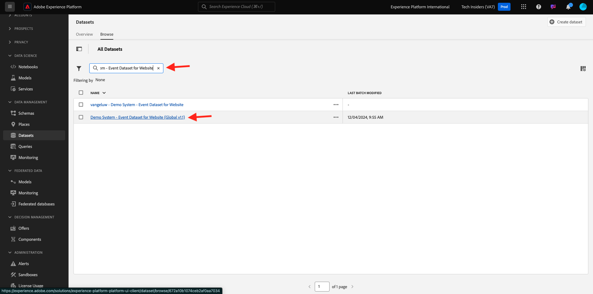
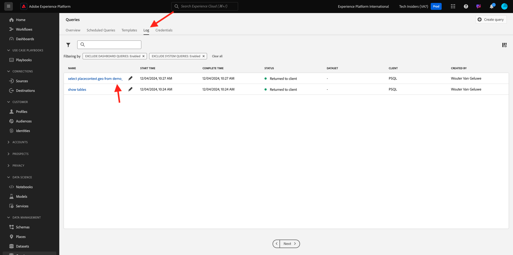

# 5.1.2 はじめに

## Adobe Experience Platform UI の理解

[Adobe Experience Platform](https://experience.adobe.com/platform) に移動します。 ログインすると、Adobe Experience Platformのホームページが表示されます。

続行する前に、**サンドボックス** を選択する必要があります。 選択するサンドボックスの名前は ``--aepSandboxName--`` です。 適切な [!UICONTROL  サンドボックス ] を選択すると、画面が変更され、専用の [!UICONTROL  サンドボックス ] が表示されます。

## プラットフォーム上のデータの調査

様々なチャネルからのデータの取り込みは、どのブランドにとっても難しい作業です。 この演習では、Citi Signal のお客様は、Citi Signal の Web サイトで Citi Signal とエンゲージしています。モバイルアプリでは、Citi Signal の POS システムで購入データが収集され、CRM とロイヤルティデータが保持されます。 Citi Signal は、Adobe AnalyticsとAdobeローンチを使用して、Web サイト、モバイルアプリ、POS システム全体でデータをキャプチャしているので、このデータはすでにAdobe Experience Platformに送られています。 まず、Adobe Experience Platformに既に存在する Citi Signal のすべてのデータを調べることから始めましょう。

左側のメニューの **データセット** に移動します。

Citi Signal はデータをAdobe Experience Platformにストリーミングする機能で、このデータは `Demo System - Event Dataset for Website (Global v1.1)` のデータセットで利用できます。 `Demo System - Event Dataset for Website` を検索します。

Citi Signal の Callcenter インタラクションデータは、`Demo System - Event Dataset for Call Center (Global v1.1)` データセットでキャプチャされます。 検索ボックスで `Demo System - Event Dataset for Call Center` データを検索します。 データセットの名前をクリックして開きます。

データセットをクリックすると、取り込まれたバッチや失敗したバッチなど、データセットアクティビティの概要が表示されます。 「**データセットをプレビュー**」をクリックして、データセットに保存されたデータのサンプル `Demo System - Event Dataset for Call Center (Global v1.1)` 表示します。

左側のパネルには、このデータセットのスキーマ構造が表示され、右側には、取り込まれたデータのサンプルが表示されます。

**閉じる** をクリックして、**データセットをプレビュー** ウィンドウを閉じます。

## クエリサービスの概要

クエリサービスにアクセスするには、左側のメニューで **クエリ** をクリックします。

**ログ** に移動すると、クエリリスト ページが表示されます。このページには、この組織で実行されたすべてのクエリのリストが表示されます。最新のクエリが上部に表示されます。

リストから任意の SQL クエリをクリックして、右側のパネルに表示される詳細を確認します。

ウィンドウをスクロールしてクエリ全体を表示するか、下で強調表示されているアイコンをクリックしてクエリ全体をメモ帳にコピーできます。 現在は、クエリをコピーする必要はありません。

実行されたクエリだけでなく、このユーザーインターフェイスではクエリから新しいデータセットを作成できます。 これらのデータセットは、Adobe Experience Platformのリアルタイム顧客プロファイルにリンクしたり、Adobe Experience Platform Data Science Workspaceの入力として使用したりできます。

## PSQL クライアントをクエリサービスに接続

クエリサービスは、PostgreSQL のドライバーを持つクライアントをサポートします。 ここでは、PSQL、コマンドラインインターフェイス、およびPower BIまたは Tableau を使用します。 PSQL に接続しましょう。

**資格情報** をクリックします。

以下の画面が表示されます。 画面には、クエリサービスへの認証用のサーバー情報と資格情報が表示されます。 ここでは、PSQL 用の接続コマンドを含む画面の右側を見ていきます。 コピーボタンをクリックして、コマンドをクリップボードにコピーします。

Windows の場合：Windows キーを押して cmd と入力し、コマンドプロンプトの結果をクリックしてコマンドラインを開きます。

macOSの場合：spotlight 検索を使用して terminal.app を開きます。

クエリサービス UI からコピーした connect コマンドを貼り付け、コマンドプロンプトウィンドウで enter キーを押します。

Windows:

MacOS:

これで、PSQL を使用してクエリサービスに接続しました。

次の演習では、このウィンドウとかなりの相互作用があります。 **PSQL コマンドラインインターフェイス** と呼びます。

これで、クエリの送信を開始する準備が整いました。

次の手順：[5.1.3 クエリサービスの使用 ](./ex3.md)

[モジュール 5.1 に戻る](./query-service.md)

[すべてのモジュールに戻る](../../../overview.md)
