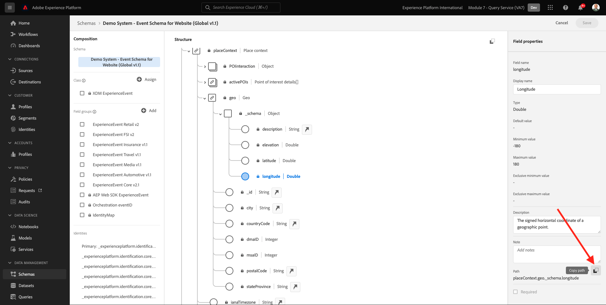

# 5.1.3 クエリサービスの使用

## 目的

- データセットの検索と調査
- クエリでエクスペリエンスデータモデルオブジェクトと属性に対処する方法を説明します

## コンテキスト

このページでは、PSQL を使用して使用可能なデータセットに関する情報を取得する方法、Experience Data Model （XDM）のクエリを記述する方法、およびクエリサービスとシティシグナルデータセットを使用して最初のシンプルなレポートクエリを記述する方法を説明します。

## 基本クエリ

このページでは、使用可能なデータセットに関する情報を取得する方法と、XDM データセットからクエリを使用してデータを適切に取得する方法について説明します。

1 の初めにAdobe Experience Platformで調べたすべてのデータセットは、SQL インターフェイスを使用してテーブルとしてアクセスすることもできます。 これらのテーブルを一覧表示するには、**show tables;** コマンドを使用します。

**PSQL コマンドラインインターフェイス** で **show tables;** を実行します。 （コマンドをセミコロンで終了することを忘れないでください）。

コマンド **show tables;** をコピーし、プロンプトで貼り付けます。


次の結果が表示されます。

```text
aepenablementfy21:all=> show tables;
                            name                            |        dataSetId         |                            dataSet                             | description | resolved 
------------------------------------------------------------+--------------------------+----------------------------------------------------------------+-------------+----------
 demo_system_event_dataset_for_call_center_global_v1_1      | 5fd1a9dea30603194baeea43 | Demo System - Event Dataset for Call Center (Global v1.1)      |             | false
 demo_system_event_dataset_for_mobile_app_global_v1_1       | 5fd1a9de250e4f194bec84cd | Demo System - Event Dataset for Mobile App (Global v1.1)       |             | false
 demo_system_event_dataset_for_voice_assistants_global_v1_1 | 5fd1a9de49ee76194b85f73c | Demo System - Event Dataset for Voice Assistants (Global v1.1) |             | false
 demo_system_event_dataset_for_website_global_v1_1          | 5fd1a9dee3224d194cdfe786 | Demo System - Event Dataset for Website (Global v1.1)          |             | false
 demo_system_profile_dataset_for_loyalty_global_v1_1        | 5fd1a9de250e4f194bec84cc | Demo System - Profile Dataset for Loyalty (Global v1.1)        |             | false
 demo_system_profile_dataset_for_ml_predictions_global_v1_1 | 5fd1a9de241f58194b0cb117 | Demo System - Profile Dataset for ML Predictions (Global v1.1) |             | false
 demo_system_profile_dataset_for_mobile_app_global_v1_1     | 5fd1a9deddf353194a2e00b7 | Demo System - Profile Dataset for Mobile App (Global v1.1)     |             | false
 demo_system_profile_dataset_for_website_global_v1_1        | 5fd1a9de42a61c194dd7b810 | Demo System - Profile Dataset for Website (Global v1.1)        |             | false
 journey_step_events                                        | 5fd1a7f30268c5194bbb7e5e | Journey Step Events                                            |             | false
```

コロンで、スペースバーを押して結果セットの次のページを表示するか、`q` と入力してコマンドプロンプトに戻します。

Platform のデータセットにはそれぞれ、対応するクエリサービステーブルがあります。 データセット UI を使用して、データセットのテーブルを見つけることができます。


`demo_system_event_dataset_for_website_global_v1_1` テーブルは、`Demo System - Event Schema for Website (Global v1.1)` データセットに対応するクエリサービス テーブルです。

製品の閲覧場所に関する情報をクエリするには、**geo** 情報を選択します。

以下のステートメントをコピーして、**PSQL コマンドラインインターフェイス** のプロンプトで貼り付け、Enter キーを押します。

```sql
select placecontext.geo
from   demo_system_event_dataset_for_website_global_v1_1
where  eventType = 'commerce.productViews'
and placecontext.geo.countryCode <> ''
limit 1;
```

クエリ結果では、エクスペリエンスデータモデル（XDM）の列は、スカラータイプだけでなく、複雑なタイプである可能性があることがわかります。 上記のクエリでは、**commerce.productViews** が発生した地域の場所を特定します。 **commerce.productViews** を識別するには、**を使用して XDM モデルをナビゲートする必要があります。** （ドット）表記。

```text
aepenablementfy21:all=> select placecontext.geo
aepenablementfy21:all-> from   demo_system_event_dataset_for_website_global_v1_1
aepenablementfy21:all-> where  eventType = 'commerce.productViews'
aepenablementfy21:all-> and placecontext.geo.countryCode <> ''
aepenablementfy21:all-> limit 1;
                  geo                   
----------------------------------------
 ("(57.4694803,-3.1269422)",Tullich,GB)
(1 row)
```

結果が 1 つの値ではなく、フラットなオブジェクトであることに注目してください。 **placecontext.geo** オブジェクトには、スキーマ、国、市区町村の 4 つの属性が含まれています。 また、オブジェクトが列として宣言されると、オブジェクト全体が文字列として返されます。 XDM スキーマは、使い慣れたものよりも複雑になる場合がありますが、非常に強力で、多くのソリューション、チャネル、ユースケースをサポートするように設計されています。

オブジェクトの個々のプロパティを選択するには、**を使用します。** （ドット）表記。

以下のステートメントをコピーして、**PSQL コマンドラインインターフェイス** のプロンプトで貼り付けます。

```sql
select placecontext.geo._schema.longitude
      ,placecontext.geo._schema.latitude
      ,placecontext.geo.city
      ,placecontext.geo.countryCode
from   demo_system_event_dataset_for_website_global_v1_1
where  eventType = 'commerce.productViews'
and placecontext.geo.countryCode <> ''
limit 1;
```

上記のクエリの結果は、次のようになります。
結果は、設定された単純な値になりました。

```text
aepenablementfy21:all=> select placecontext.geo._schema.longitude
aepenablementfy21:all->       ,placecontext.geo._schema.latitude
aepenablementfy21:all->       ,placecontext.geo.city
aepenablementfy21:all->       ,placecontext.geo.countryCode
aepenablementfy21:all-> from   demo_system_event_dataset_for_website_global_v1_1
aepenablementfy21:all-> where  eventType = 'commerce.productViews'
aepenablementfy21:all-> and placecontext.geo.countryCode <> ''
aepenablementfy21:all-> limit 1;
 longitude  |  latitude  |  city   | countrycode 
------------+------------+---------+-------------
 -3.1269422 | 57.4694803 | Tullich | GB
(1 row)
```

特定のプロパティへのパスを簡単に取得できる方法があるので、心配する必要はありません。 次のパートでは、その方法を説明します。

クエリを編集する必要があるので、まずエディターを開きます。

Windows の場合

Windows ツールバーの **検索** アイコンをクリックし、**検索** フィールドに **メモ帳** と入力して **メモ帳** をクリックします。


Macについて

[Brackets](https://github.com/adobe/brackets/releases/download/release-1.14/Brackets.Release.1.14.dmg) をインストールするか、インストールされていない場合は別のテキストエディターを選択して使用し、手順に従ってください。 インストール後、Mac スポットライト検索を使用して **Brackets** を検索し、開きます。

次のステートメントをメモ帳または角括弧にコピーします。

```sql
select your_attribute_path_here
from   demo_system_event_dataset_for_website_global_v1_1
where  eventType = 'commerce.productViews'
and placecontext.geo.countryCode <> ''
limit 1;
```

Adobe Experience Platform UI に戻るか（ブラウザーで開く必要があります）、[https://platform.adobe.com](https://platform.adobe.com) に移動します。

「**スキーマ**」を選択し、「**検索**」フィールドに `Demo System - Event Schema for Website (Global v1.1)` と入力して、リストから `Demo System - Event Schema for Website (Global v1.1) Schema` を選択します。


オブジェクトをクリックして、**デモシステム - web サイトのイベントスキーマ（グローバル v1.1）** の XDM モデルを調べます。 **placecontext**、**geo**、**schema** のツリーを展開します。 実際の属性 **経度** を選択すると、ハイライトされた赤いボックスに完全なパスが表示されます。 属性のパスをコピーするには、パスをコピーアイコンをクリックします。



メモ帳/角括弧に切り替え、最初の行から **your_attribute_path_here** を削除します。 最初の行の **選択** の後にカーソルを置き、ペーストします（Ctrl-V）。

変更した文をメモ帳や角括弧からコピーし、**PSQL コマンドラインインターフェイス** のプロンプトで貼り付けて、Enter キーを押します。

結果は次のようになります。

```text
aepenablementfy21:all=> select placeContext.geo._schema.longitude
aepenablementfy21:all-> from   demo_system_event_dataset_for_website_global_v1_1
aepenablementfy21:all-> where  eventType = 'commerce.productViews'
aepenablementfy21:all-> and placecontext.geo.countryCode <> ''
aepenablementfy21:all-> limit 1;
 longitude  
------------
 -3.1269422
```

次の手順：[5.1.4 クエリ、クエリ、クエリ…およびチャーン分析 ](./ex4.md)

[モジュール 5.1 に戻る](./query-service.md)

[すべてのモジュールに戻る](../../../overview.md)
