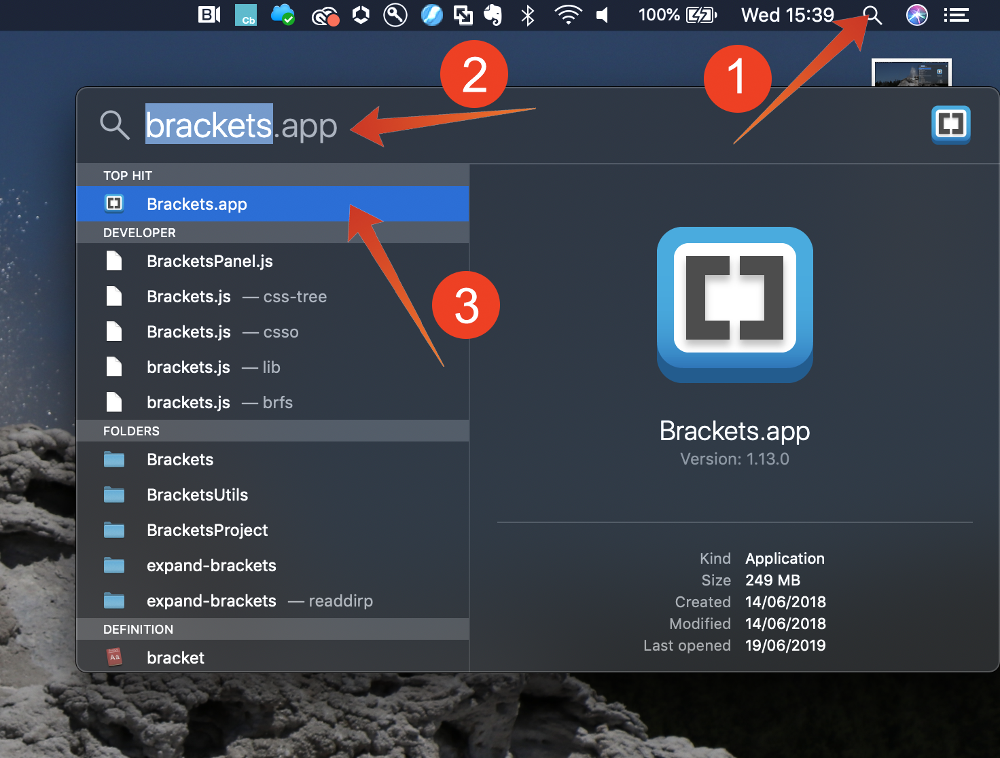

# 5.1.3 クエリ、クエリ、クエリ…およびチャーン分析

## 目的

* データ分析用のクエリの書き込み
* Adobe Experience Platformで利用可能なオンライン、コールセンター、ロイヤルティデータを組み合わせて SQL クエリを記述する
* Adobe定義関数について説明します

## コンテキスト

この演習では、製品ビュー、製品ファネル、チャーンなどを分析するクエリを記述します。

この章で示すすべてのクエリは、**PSQL コマンドラインインターフェイス** で実行されます。 **SQL** で示されたステートメントブロックをコピー（CTRL-C）し、**PSQL コマンドラインインターフェイス** に貼り付ける（CTRL-V）必要があります。 **クエリ結果** ブロックには、貼り付けた SQL ステートメントと、関連するクエリ結果が表示されます。

## 5.1.3.1 データ分析のための基本的なクエリの作成

### タイムスタンプ

Adobe Experience Platformで取り込まれたデータには、タイムスタンプが付けられます。 **timestamp** 属性を使用すると、データを経時的に分析できます。

1 日に表示される製品の数

**SQL**

```sql
select date_format( timestamp , 'yyyy-MM-dd') AS Day,
       count(*) AS productViews
from   demo_system_event_dataset_for_website_global_v1_1
where  --aepTenantId--.demoEnvironment.brandName IN ('Luma Telco', 'Citi Signal')
and eventType = 'commerce.productViews'
group by Day
limit 10;
```

上記の文をコピーして、**PSQL コマンドラインインターフェイス** で実行します。

**クエリ結果**

```text
aepenablementfy21:all=> select date_format( timestamp , 'yyyy-MM-dd') AS Day,
aepenablementfy21:all->        count(*) AS productViews
aepenablementfy21:all-> from   demo_system_event_dataset_for_website_global_v1_1
aepenablementfy21:all-> where  --aepTenantId--.demoEnvironment.brandName IN ('Luma Telco', 'Citi Signal')
aepenablementfy21:all-> and    eventType = 'commerce.productViews'
aepenablementfy21:all-> group by Day
aepenablementfy21:all-> limit 10;
    Day     | productViews 
------------+--------------
 2020-07-31 |         2297
(1 row)
```

### 閲覧された上位 5 製品

閲覧された上位 5 製品は何ですか？

#### SQL

```sql
select productListItems.name, count(*)
from   demo_system_event_dataset_for_website_global_v1_1
where  --aepTenantId--.demoEnvironment.brandName IN ('Luma Telco', 'Citi Signal')
and    eventType = 'commerce.productViews'
group  by productListItems.name
order  by 2 desc
limit 5;
```

上記の文をコピーして、**PSQL コマンドラインインターフェイス** で実行します。

**クエリ結果**

```text
aepenablementfy21:all=> select productListItems.name, count(*)
aepenablementfy21:all-> from   demo_system_event_dataset_for_website_global_v1_1
aepenablementfy21:all-> where  --aepTenantId--.demoEnvironment.brandName IN ('Luma Telco', 'Citi Signal')
aepenablementfy21:all-> and    eventType = 'commerce.productViews'
aepenablementfy21:all-> group  by productListItems.name
aepenablementfy21:all-> order  by 2 desc
aepenablementfy21:all-> limit 5;
                 name                  | count(1) 
---------------------------------------+----------
 Google Pixel XL 32GB Black Smartphone |      938
 SIM Only                              |      482
 Samsung Galaxy S8                     |      456
 Samsung Galaxy S7 32GB Black          |      421
(4 rows)
```

### 製品インタラクションファネル、表示から購入まで

**SQL**

```sql
select eventType, count(*)
from   demo_system_event_dataset_for_website_global_v1_1
where  --aepTenantId--.demoEnvironment.brandName IN ('Luma Telco', 'Citi Signal')
and    eventType is not null
and    eventType <> ''
group  by eventType;
```

上記の文をコピーして、**PSQL コマンドラインインターフェイス** で実行します。

**クエリ結果**

```text
aepenablementfy21:all=> select eventType, count(*)
aepenablementfy21:all-> from   demo_system_event_dataset_for_website_global_v1_1
aepenablementfy21:all-> where  --aepTenantId--.demoEnvironment.brandName IN ('Luma Telco', 'Citi Signal')
aepenablementfy21:all-> and    eventType is not null
aepenablementfy21:all-> and    eventType <> ''
aepenablementfy21:all-> group  by eventType;
          eventType           | count(1) 
------------------------------+----------
 commerce.productViews        |     2297
 commerce.productListAdds     |      494
 commerce.purchases           |      246
(3 rows)
```

### チャーンに至るリスクのある訪問者を特定します（訪問ページ => サービスのキャンセル）

**SQL**

```sql
select distinct --aepTenantId--.identification.core.ecid
from   demo_system_event_dataset_for_website_global_v1_1
where  --aepTenantId--.demoEnvironment.brandName IN ('Luma Telco', 'Citi Signal')
and    web.webPageDetails.name = 'Cancel Service'
group  by --aepTenantId--.identification.core.ecid
limit 10;
```

上記の文をコピーして、**PSQL コマンドラインインターフェイス** で実行します。

**クエリ結果**

```text
aepenablementfy21:all=> select distinct --aepTenantId--.identification.core.ecid
aepenablementfy21:all-> from   demo_system_event_dataset_for_website_global_v1_1
aepenablementfy21:all-> where  --aepTenantId--.demoEnvironment.brandName IN ('Luma Telco', 'Citi Signal')
aepenablementfy21:all-> and    web.webPageDetails.name = 'Cancel Service'
aepenablementfy21:all-> group  by --aepTenantId--.identification.core.ecid
aepenablementfy21:all-> limit 10;
               ecid               
----------------------------------
 67802232253493573025911610627278
 27147331741697745713411940873426
 19806347932758146991274525406147
 06339676267512351981624626408225
 23933440740775575701680766564499
 11860828134020790182705892056898
 04258863338643046907489131372300
 90257333076958492787834714105751
 66695181015407529430237951973742
 19103852558440070949457567094096
(10 rows)
```

次のクエリでは、「サービスのキャンセル」ページにアクセスしたお客様とその行動の完全なビューを取得するために、上記のクエリを拡張します。 Adobe定義関数を使用して、情報のセッション化、イベントのシーケンスとタイミングの特定を行う方法を説明します。 また、データセットを結合して、Microsoft データをさらに充実させ、分析のためのPower BIを準備します。

## 5.1.3.2 高度なクエリ

ビジネスロジックの大部分は、顧客のタッチポイントを収集し、時間ごとに並べ替える必要があります。 このサポートは、Spark SQL で窓関数の形式で提供されます。窓関数は標準 SQL の一部で、他の多くの SQL エンジンでサポートされています。

### Adobe定義関数

Adobeでは、標準 SQL 構文に一連の **Adobe定義関数** が追加され、エクスペリエンスデータをより深く理解できるようになりました。 次のクエリでは、これらの ADF 関数について説明します。 詳細と完全なリストについては、[ ドキュメント ](https://experienceleague.adobe.com/docs/experience-platform/query/sql/adobe-defined-functions.html) を参照してください。

### セッションの 3 番目のページとして「サービスをキャンセル」ページに到達する前に、サイト上でユーザーはどうしますか？

このクエリでは、最初の 2 つのAdobe定義関数 **SESS_TIMEOUT** と **NEXT** を確認します

> **SESS_TIMEOUT （）** は、Adobe Analyticsで見つかった訪問のグループ化を再現します。 時間ベースの同様のグループ化を実行しますが、カスタマイズ可能なパラメーターです。
>
> **NEXT （）** および **PREVIOUS （）** は、顧客がサイトを移動する方法を理解するのに役立ちます。

**SQL**

```sql
SELECT
  webPage,
  webPage_2,
  webPage_3,
  webPage_4,
  count(*) journeys
FROM
  (
      SELECT
        webPage,
        NEXT(webPage, 1, true)
          OVER(PARTITION BY ecid, session.num
                ORDER BY timestamp
                ROWS BETWEEN CURRENT ROW AND UNBOUNDED FOLLOWING).value
          AS webPage_2,
        NEXT(webPage, 2, true)
          OVER(PARTITION BY ecid, session.num
                ORDER BY timestamp
                ROWS BETWEEN CURRENT ROW AND UNBOUNDED FOLLOWING).value
          AS webPage_3,
        NEXT(webPage, 3, true)
           OVER(PARTITION BY ecid, session.num
                ORDER BY timestamp
                ROWS BETWEEN CURRENT ROW AND UNBOUNDED FOLLOWING).value
          AS webPage_4,
        session.depth AS SessionPageDepth
      FROM (
            select a.--aepTenantId--.identification.core.ecid as ecid,
                   a.timestamp,
                   web.webPageDetails.name as webPage,
                    SESS_TIMEOUT(timestamp, 60 * 30) 
                       OVER (PARTITION BY a.--aepTenantId--.identification.core.ecid 
                             ORDER BY timestamp 
                             ROWS BETWEEN UNBOUNDED PRECEDING AND CURRENT ROW) 
                  AS session
            from   demo_system_event_dataset_for_website_global_v1_1 a
            where  a.--aepTenantId--.identification.core.ecid in ( 
                select b.--aepTenantId--.identification.core.ecid
                from   demo_system_event_dataset_for_website_global_v1_1 b
                where  b.--aepTenantId--.demoEnvironment.brandName IN ('Luma Telco', 'Citi Signal')
                and    b.web.webPageDetails.name = 'Cancel Service'
            )
        )
)
WHERE SessionPageDepth=1
and   webpage_3 = 'Cancel Service'
GROUP BY webPage, webPage_2, webPage_3, webPage_4
ORDER BY journeys DESC
LIMIT 10;
```

上記の文をコピーして、**PSQL コマンドラインインターフェイス** で実行します。

**クエリ結果**

```text
                webPage                |               webPage_2               |   webPage_3    | webPage_4  | journeys 
---------------------------------------+---------------------------------------+----------------+------------+----------
 Citi Signal Sport                     | Google Pixel XL 32GB Black Smartphone | Cancel Service | Call Start |        2
 SIM Only                              | Citi Signal Shop                      | Cancel Service |            |        2
 SIM Only                              | Telco Home                            | Cancel Service |            |        2
 TV & Broadband Deals                  | Samsung Galaxy S7 32GB Black          | Cancel Service |            |        2
 Telco Home                            | Citi Signal Sport                     | Cancel Service | Call Start |        2
 Google Pixel XL 32GB Black Smartphone | Broadband Deals                       | Cancel Service |            |        2
 Broadband Deals                       | Samsung Galaxy S7 32GB Black          | Cancel Service |            |        2
 Broadband Deals                       | Samsung Galaxy S8                     | Cancel Service |            |        1
 Samsung Galaxy S8                     | Google Pixel XL 32GB Black Smartphone | Cancel Service |            |        1
 SIM Only                              | Google Pixel XL 32GB Black Smartphone | Cancel Service | Call Start |        1
(10 rows)
```

### 「サービスをキャンセル」ページにアクセスしてから、訪問者がコールセンターに電話するまでの時間はどれくらいですか？

この種の問い合わせに答えるには、Adobe定義の関数 **TIME_BETWEEN_NEXT_MATCH （）** を使用します。

> 前または次の一致関数間の時間は、特定のインシデントからの経過時間を測定する新しいディメンションを提供します。

**SQL**

```sql
select * from (
       select --aepTenantId--.identification.core.ecid as ecid,
              web.webPageDetails.name as webPage,
              TIME_BETWEEN_NEXT_MATCH(timestamp, web.webPageDetails.name='Call Start', 'seconds')
              OVER(PARTITION BY --aepTenantId--.identification.core.ecid
                  ORDER BY timestamp
                  ROWS BETWEEN CURRENT ROW AND UNBOUNDED FOLLOWING)
              AS contact_callcenter_after_seconds
       from   demo_system_event_dataset_for_website_global_v1_1
       where  --aepTenantId--.demoEnvironment.brandName IN ('Luma Telco', 'Citi Signal')
       and    web.webPageDetails.name in ('Cancel Service', 'Call Start')
) r
where r.webPage = 'Cancel Service'
limit 15;
```

上記の文をコピーして、**PSQL コマンドラインインターフェイス** で実行します。

**クエリ結果**

```text
               ecid               |    webPage     | contact_callcenter_after_seconds 
----------------------------------+----------------+----------------------------------
 00331886620679939148047665693117 | Cancel Service |                                 
 00626561600197295782131349716866 | Cancel Service |                                 
 00630470663554417679969244202779 | Cancel Service |                             -797
 00720875344152796154458668700428 | Cancel Service |                             -519
 00746064605049656090779523644276 | Cancel Service |                              -62
 00762093837616944422322357210965 | Cancel Service |                                 
 00767875779073091876070699689209 | Cancel Service |                                 
 00798691264980137616449378075855 | Cancel Service |                                 
 00869613691740150556826953447162 | Cancel Service |                             -129
 00943638725078228957873279219207 | Cancel Service |                             -750
 01167540466536077846425644389346 | Cancel Service |                                 
 01412448537869549016063764484810 | Cancel Service |                                 
 01419076946514450291741574452702 | Cancel Service |                             -482
 01533124771963987423015507880755 | Cancel Service |                                 
 01710651086750904478559809475925 | Cancel Service |                                 
(15 rows)
```

### そして、その連絡の結果は何ですか？

データセットを結合していることを説明します。この場合は、`demo_system_event_dataset_for_website_global_v1_1` を `demo_system_event_dataset_for_call_center_global_v1_1` と結合します。 コールセンターインタラクションの結果を把握するために、これを行います。

**SQL**

```sql
select distinct r.*,
       c.--aepTenantId--.interactionDetails.core.callCenterAgent.callFeeling,
       c.--aepTenantId--.interactionDetails.core.callCenterAgent.callTopic,
       c.--aepTenantId--.interactionDetails.core.callCenterAgent.callContractCancelled
from (
       select --aepTenantId--.identification.core.ecid ecid,
              web.webPageDetails.name as webPage,
              TIME_BETWEEN_NEXT_MATCH(timestamp, web.webPageDetails.name='Call Start', 'seconds')
              OVER(PARTITION BY --aepTenantId--.identification.core.ecid
                  ORDER BY timestamp
                  ROWS BETWEEN CURRENT ROW AND UNBOUNDED FOLLOWING)
              AS contact_callcenter_after_seconds
       from   demo_system_event_dataset_for_website_global_v1_1
       where  --aepTenantId--.demoEnvironment.brandName IN ('Luma Telco', 'Citi Signal')
       and    web.webPageDetails.name in ('Cancel Service', 'Call Start')
) r
, demo_system_event_dataset_for_call_center_global_v1_1 c
where r.ecid = c.--aepTenantId--.identification.core.ecid
and r.webPage = 'Cancel Service'
and c.--aepTenantId--.interactionDetails.core.callCenterAgent.callContractCancelled IN (true,false)
and c.--aepTenantId--.interactionDetails.core.callCenterAgent.callTopic IN ('contract', 'invoice','complaint','wifi')
limit 15;
```

上記の文をコピーして、**PSQL コマンドラインインターフェイス** で実行します。

**クエリ結果**

```text
               ecid               |    webPage     | contact_callcenter_after_seconds | callfeeling | calltopic | callcontractcancelled 
----------------------------------+----------------+----------------------------------+-------------+-----------+-----------------------
 65003638134805559755890758041032 | Cancel Service |                             -440 | negative    | contract  | true
 24197860921105808861772992106002 | Cancel Service |                             -109 | negative    | contract  | true
 96145097889556586310105454800766 | Cancel Service |                             -501 | neutral     | contract  | true
 18680613140217544548647790969994 | Cancel Service |                             -502 | negative    | contract  | true
 66121898576007921287545496624574 | Cancel Service |                             -546 | negative    | contract  | true
 35086866174626846547860375146326 | Cancel Service |                             -493 | negative    | contract  | false
 30502827193916828536733220567055 | Cancel Service |                             -924 | negative    | contract  | true
 85319114253582167371394801608573 | Cancel Service |                             -267 | positive    | contract  | true
 04258863338643046907489131372300 | Cancel Service |                             -588 | positive    | contract  | false
 23933440740775575701680766564499 | Cancel Service |                             -261 | neutral     | contract  | true
 17332005215125613039685855763735 | Cancel Service |                             -478 | neutral     | contract  | true
 02666934104296797891818818456669 | Cancel Service |                             -297 | positive    | contract  | true
 48158305927116134877913019413025 | Cancel Service |                              -47 | neutral     | contract  | false
 13294750130353985087337266864522 | Cancel Service |                              -71 | positive    | contract  | false
 69034679856689334967307492458080 | Cancel Service |                             -812 | negative    | contract  | true
(15 rows)
```

### これらの顧客のロイヤルティプロファイルとは何ですか？

このクエリでは、Adobe Experience Platformにオンボーディングしたロイヤルティデータを結合します。 これにより、ロイヤルティデータでチャーン分析を強化できます。

**SQL**

```sql
select r.*,
       c.--aepTenantId--.interactionDetails.core.callCenterAgent.callFeeling,
       c.--aepTenantId--.interactionDetails.core.callCenterAgent.callTopic,
       l.--aepTenantId--.loyaltyDetails.level,
       l.--aepTenantId--.identification.core.loyaltyId
from (
       select --aepTenantId--.identification.core.ecid ecid,
              web.webPageDetails.name as webPage,
              TIME_BETWEEN_NEXT_MATCH(timestamp, web.webPageDetails.name='Call Start', 'seconds')
              OVER(PARTITION BY --aepTenantId--.identification.core.ecid
                  ORDER BY timestamp
                  ROWS BETWEEN CURRENT ROW AND UNBOUNDED FOLLOWING)
              AS contact_callcenter_after_seconds
       from   demo_system_event_dataset_for_website_global_v1_1
       where  --aepTenantId--.demoEnvironment.brandName IN ('Luma Telco', 'Citi Signal')
       and    web.webPageDetails.name in ('Cancel Service', 'Call Start')
) r
, demo_system_event_dataset_for_call_center_global_v1_1 c
, demo_system_profile_dataset_for_loyalty_global_v1_1 l
where r.ecid = c.--aepTenantId--.identification.core.ecid
and r.webPage = 'Cancel Service'
and l.--aepTenantId--.identification.core.ecid = r.ecid
and c.--aepTenantId--.interactionDetails.core.callCenterAgent.callTopic IN ('contract', 'invoice','complaint','wifi','promo')
limit 15;
```

上記の文をコピーして、**PSQL コマンドラインインターフェイス** で実行します。

**クエリ結果**

```text
               ecid               |    webPage     | contact_callcenter_after_seconds | callfeeling | calltopic | level  | loyaltyid 
----------------------------------+----------------+----------------------------------+-------------+-----------+--------+-----------
 65003638134805559755890758041032 | Cancel Service |                             -440 | negative    | contract  | Gold   | 924854108
 65003638134805559755890758041032 | Cancel Service |                             -440 | negative    | contract  | Gold   | 924854108
 24197860921105808861772992106002 | Cancel Service |                             -109 | negative    | contract  | Bronze | 094259678
 24197860921105808861772992106002 | Cancel Service |                             -109 | negative    | contract  | Bronze | 094259678
 96145097889556586310105454800766 | Cancel Service |                             -501 | neutral     | contract  | Gold   | 644887358
 96145097889556586310105454800766 | Cancel Service |                             -501 | neutral     | contract  | Gold   | 644887358
 18680613140217544548647790969994 | Cancel Service |                             -502 | negative    | contract  | Gold   | 205300004
 18680613140217544548647790969994 | Cancel Service |                             -502 | negative    | contract  | Gold   | 205300004
 66121898576007921287545496624574 | Cancel Service |                             -546 | negative    | contract  | Bronze | 095728673
 66121898576007921287545496624574 | Cancel Service |                             -546 | negative    | contract  | Bronze | 095728673
 35086866174626846547860375146326 | Cancel Service |                             -493 | negative    | contract  | Bronze | 453145930
 35086866174626846547860375146326 | Cancel Service |                             -493 | negative    | contract  | Bronze | 453145930
 30502827193916828536733220567055 | Cancel Service |                             -924 | negative    | contract  | Gold   | 269406417
 30502827193916828536733220567055 | Cancel Service |                             -924 | negative    | contract  | Gold   | 269406417
 85319114253582167371394801608573 | Cancel Service |                             -267 | positive    | contract  | Bronze | 899276035
(15 rows)
```

### 彼らはどの地域から私たちを訪れますか。

顧客のチャーンに関する地理的インサイトを得るためにAdobe Experience Platformが取得した、経度、態度、市区町村、国コードなどの地理的情報を含めることができます。

**SQL**

```sql
       select distinct r.ecid,
              r.city,
              r.countrycode,
              r.lat as latitude,
              r.lon as longitude,
              r.contact_callcenter_after_seconds as seconds_to_contact_callcenter,
              c.--aepTenantId--.interactionDetails.core.callCenterAgent.callFeeling,
              c.--aepTenantId--.interactionDetails.core.callCenterAgent.callTopic,
              c.--aepTenantId--.interactionDetails.core.callCenterAgent.callContractCancelled,
              l.--aepTenantId--.loyaltyDetails.level,
              l.--aepTenantId--.identification.core.loyaltyId
       from (
              select --aepTenantId--.identification.core.ecid ecid,
                     placeContext.geo._schema.latitude lat,
                     placeContext.geo._schema.longitude lon,
                     placeContext.geo.city,
                     placeContext.geo.countryCode,
                     web.webPageDetails.name as webPage,
                     TIME_BETWEEN_NEXT_MATCH(timestamp, web.webPageDetails.name='Call Start', 'seconds')
                     OVER(PARTITION BY --aepTenantId--.identification.core.ecid
                         ORDER BY timestamp
                         ROWS BETWEEN CURRENT ROW AND UNBOUNDED FOLLOWING)
                     AS contact_callcenter_after_seconds
              from   demo_system_event_dataset_for_website_global_v1_1
              where  --aepTenantId--.demoEnvironment.brandName IN ('Luma Telco', 'Citi Signal')
              and    web.webPageDetails.name in ('Cancel Service', 'Call Start')
       ) r
       , demo_system_event_dataset_for_call_center_global_v1_1 c
       , demo_system_profile_dataset_for_loyalty_global_v1_1 l
       where r.ecid = c.--aepTenantId--.identification.core.ecid
       and r.webPage = 'Cancel Service'
       and l.--aepTenantId--.identification.core.ecid = r.ecid
       and c.--aepTenantId--.interactionDetails.core.callCenterAgent.callTopic IN ('contract', 'invoice','complaint','wifi','promo')
       limit 15;
```

上記の文をコピーして、**PSQL コマンドラインインターフェイス** で実行します。

**クエリ結果**

```text
               ecid               |   city    | countrycode |  latitude  | longitude  | seconds_to_contact_callcenter | callfeeling | calltopic | callcontractcancelled | level  | loyaltyid 
----------------------------------+-----------+-------------+------------+------------+-------------------------------+-------------+-----------+-----------------------+--------+-----------
 00630470663554417679969244202779 | Charlton  | GB          |   51.59119 |  -1.407848 |                          -797 | negative    | contract  | false                 | Bronze | 524483285
 00630470663554417679969244202779 | Charlton  | GB          |   51.59119 |  -1.407848 |                          -797 | negative    | contract  |                       | Bronze | 524483285
 00720875344152796154458668700428 | Ashley    | GB          | 51.4139633 | -2.2685462 |                          -519 | positive    | contract  | false                 | Silver | 860696333
 00720875344152796154458668700428 | Ashley    | GB          | 51.4139633 | -2.2685462 |                          -519 | positive    | contract  |                       | Silver | 860696333
 00746064605049656090779523644276 | Liverpool | GB          | 53.4913801 |  -2.867264 |                           -62 | positive    | contract  | true                  | Bronze | 072387270
 00746064605049656090779523644276 | Liverpool | GB          | 53.4913801 |  -2.867264 |                           -62 | positive    | contract  |                       | Bronze | 072387270
 00869613691740150556826953447162 | Langley   | GB          |  51.888151 |   -0.23924 |                          -129 | negative    | contract  | true                  | Bronze | 789347684
 00869613691740150556826953447162 | Langley   | GB          |  51.888151 |   -0.23924 |                          -129 | negative    | contract  |                       | Bronze | 789347684
 00943638725078228957873279219207 | Eaton     | GB          | 53.2945961 | -0.9335791 |                          -750 | positive    | contract  | false                 | Gold   | 033926162
 00943638725078228957873279219207 | Eaton     | GB          | 53.2945961 | -0.9335791 |                          -750 | positive    | contract  |                       | Gold   | 033926162
 01419076946514450291741574452702 | Tullich   | GB          | 57.4694803 | -3.1269422 |                          -482 | neutral     | contract  | false                 | Bronze | 105063634
 01419076946514450291741574452702 | Tullich   | GB          | 57.4694803 | -3.1269422 |                          -482 | neutral     | contract  |                       | Bronze | 105063634
 01738842540109643781526526573341 | Whitwell  | GB          | 54.3886617 |  -1.555363 |                          -562 | neutral     | contract  | false                 | Gold   | 791324509
 01738842540109643781526526573341 | Whitwell  | GB          | 54.3886617 |  -1.555363 |                          -562 | neutral     | contract  |                       | Gold   | 791324509
 02052460258994877317679083617975 | Edinburgh | GB          | 55.9309486 | -3.1859102 |                          -545 | neutral     | contract  | false                 | Gold   | 443477555
(15 rows)
```

## コールセンターインタラクション分析

上記のクエリでは、サービスキャンセルの場合にコールセンターに連絡することになった訪問者のみを調べました。 これをもう少し広く捉え、Wi-Fi、プロモ、請求書、苦情、契約など、コールセンターとのすべてのインタラクションを考慮に入れたいと考えています。

クエリを編集する必要があるので、最初にメモ帳や角括弧を開きましょう。

Windows の場合、Windows ツールバーの「search」 – icon （1）をクリックし、「search」フィールドに **notepad** と入力し（2）、「notepad」の結果を（3）クリックします。


Macについて



次のステートメントをメモ帳/角括弧にコピーします。

```sql
select /* enter your name */
       e.--aepTenantId--.identification.core.ecid as ecid,
       e.placeContext.geo.city as city,
       e.placeContext.geo._schema.latitude latitude,
       e.placeContext.geo._schema.longitude longitude,
       e.placeContext.geo.countryCode as countrycode,
       c.--aepTenantId--.interactionDetails.core.callCenterAgent.callFeeling as callFeeling,
       c.--aepTenantId--.interactionDetails.core.callCenterAgent.callTopic as callTopic,
       c.--aepTenantId--.interactionDetails.core.callCenterAgent.callContractCancelled as contractCancelled,
       l.--aepTenantId--.loyaltyDetails.level as loyaltystatus,
       l.--aepTenantId--.loyaltyDetails.points as loyaltypoints,
       l.--aepTenantId--.identification.core.loyaltyId as crmid
from   demo_system_event_dataset_for_website_global_v1_1 e
      ,demo_system_event_dataset_for_call_center_global_v1_1 c
      ,demo_system_profile_dataset_for_loyalty_global_v1_1 l
where  e.--aepTenantId--.demoEnvironment.brandName IN ('Luma Telco', 'Citi Signal')
and    e.web.webPageDetails.name in ('Cancel Service', 'Call Start')
and    e.--aepTenantId--.identification.core.ecid = c.--aepTenantId--.identification.core.ecid
and    l.--aepTenantId--.identification.core.ecid = e.--aepTenantId--.identification.core.ecid;
```

および置換

```text
enter your name
```

`/\*` と `\*/` は削除しないでください。 メモ帳で変更した文は次のようになります。


変更した文を **メモ帳** から **PSQL コマンドラインウィンドウにコピーし** Enter キーを押します。 PSQL コマンドラインウィンドウに次の結果が表示されます。

```text
aepenablementfy21:all=> 
aepenablementfy21:all=> select /* vangeluw */
aepenablementfy21:all->        e._experienceplatform.identification.core.ecid as ecid,
aepenablementfy21:all->        e.placeContext.geo.city as city,
aepenablementfy21:all->        e.placeContext.geo._schema.latitude latitude,
aepenablementfy21:all->        e.placeContext.geo._schema.longitude longitude,
aepenablementfy21:all->        e.placeContext.geo.countryCode as countrycode,
aepenablementfy21:all->        c._experienceplatform.interactionDetails.core.callCenterAgent.callFeeling as callFeeling,
aepenablementfy21:all->        c._experienceplatform.interactionDetails.core.callCenterAgent.callTopic as callTopic,
aepenablementfy21:all->        c._experienceplatform.interactionDetails.core.callCenterAgent.callContractCancelled as contractCancelled,
aepenablementfy21:all->        l._experienceplatform.loyaltyDetails.level as loyaltystatus,
aepenablementfy21:all->        l._experienceplatform.loyaltyDetails.points as loyaltypoints,
aepenablementfy21:all->        l._experienceplatform.identification.core.loyaltyId as crmid
aepenablementfy21:all-> from   demo_system_event_dataset_for_website_global_v1_1 e
aepenablementfy21:all->       ,demo_system_event_dataset_for_call_center_global_v1_1 c
aepenablementfy21:all->       ,demo_system_profile_dataset_for_loyalty_global_v1_1 l
aepenablementfy21:all-> where  e._experienceplatform.demoEnvironment.brandName IN ('Luma Telco', 'Citi Signal')
aepenablementfy21:all-> and    e.web.webPageDetails.name in ('Cancel Service', 'Call Start')
aepenablementfy21:all-> and    e._experienceplatform.identification.core.ecid = c._experienceplatform.identification.core.ecid
aepenablementfy21:all-> and    l._experienceplatform.identification.core.ecid = e._experienceplatform.identification.core.ecid;
               ecid               |    city    |  latitude  | longitude  | countrycode | callFeeling | callTopic | contractCancelled | loyaltystatus | loyaltypoints |   crmid   
----------------------------------+------------+------------+------------+-------------+-------------+-----------+-------------------+---------------+---------------+-----------
 33977405947573095768416894125891 | Tullich    | 57.4694803 | -3.1269422 | GB          | positive    | wifi      | false             | Bronze        |          73.0 | 904552921
 33977405947573095768416894125891 | Tullich    | 57.4694803 | -3.1269422 | GB          | positive    | wifi      | false             | Bronze        |          73.0 | 904552921
 33977405947573095768416894125891 | Tullich    | 57.4694803 | -3.1269422 | GB          | positive    | wifi      |                   | Bronze        |          73.0 | 904552921
 33977405947573095768416894125891 | Tullich    | 57.4694803 | -3.1269422 | GB          | positive    | wifi      |                   | Bronze        |          73.0 | 904552921
 67802232253493573025911610627278 | Linton     | 54.0542238 | -2.0215836 | GB          | none        | none      | false             | Silver        |         522.0 | 417981877
 67802232253493573025911610627278 | Linton     | 54.0542238 | -2.0215836 | GB          | none        | none      | false             | Silver        |         522.0 | 417981877
 67802232253493573025911610627278 | Linton     | 54.0542238 | -2.0215836 | GB          | none        | none      |                   | Silver        |         522.0 | 417981877
 67802232253493573025911610627278 | Linton     | 54.0542238 | -2.0215836 | GB          | none        | none      |                   | Silver        |         522.0 | 417981877
 27147331741697745713411940873426 | Langley    |  51.888151 |   -0.23924 | GB          | none        | none      | false             | Bronze        |         790.0 | 826545716
 27147331741697745713411940873426 | Langley    |  51.888151 |   -0.23924 | GB          | none        | none      | false             | Bronze        |         790.0 | 826545716
 27147331741697745713411940873426 | Langley    |  51.888151 |   -0.23924 | GB          | none        | none      |                   | Bronze        |         790.0 | 826545716
 27147331741697745713411940873426 | Langley    |  51.888151 |   -0.23924 | GB          | none        | none      |                   | Bronze        |         790.0 | 826545716
 19806347932758146991274525406147 | Edinburgh  | 55.9309486 | -3.1859102 | GB          | none        | none      | false             | Gold          |         981.0 | 412492571
 19806347932758146991274525406147 | Edinburgh  | 55.9309486 | -3.1859102 | GB          | none        | none      | false             | Gold          |         981.0 | 412492571
 19806347932758146991274525406147 | Edinburgh  | 55.9309486 | -3.1859102 | GB          | none        | none      |                   | Gold          |         981.0 | 412492571
 19806347932758146991274525406147 | Edinburgh  | 55.9309486 | -3.1859102 | GB          | none        | none      |                   | Gold          |         981.0 | 412492571
 06339676267512351981624626408225 | Edinburgh  | 55.9309486 | -3.1859102 | GB          | none        | none      | false             | Bronze        |         632.0 | 024761880
 06339676267512351981624626408225 | Edinburgh  | 55.9309486 | -3.1859102 | GB          | none        | none      | false             | Bronze        |         632.0 | 024761880
 06339676267512351981624626408225 | Edinburgh  | 55.9309486 | -3.1859102 | GB          | none        | none      |                   | Bronze        |         632.0 | 024761880
 06339676267512351981624626408225 | Edinburgh  | 55.9309486 | -3.1859102 | GB          | none        | none      |                   | Bronze        |         632.0 | 024761880
 23933440740775575701680766564499 | Whitwell   | 54.3886617 |  -1.555363 | GB          | neutral     | contract  | true              | Gold          |         853.0 | 696923821
 23933440740775575701680766564499 | Whitwell   | 54.3886617 |  -1.555363 | GB          | neutral     | contract  | true              | Gold          |         853.0 | 696923821
 23933440740775575701680766564499 | Whitwell   | 54.3886617 |  -1.555363 | GB          | neutral     | contract  |                   | Gold          |         853.0 | 696923821
 23933440740775575701680766564499 | Whitwell   | 54.3886617 |  -1.555363 | GB          | neutral     | contract  |                   | Gold          |         853.0 | 696923821
 11860828134020790182705892056898 | Norton     | 52.2679288 | -1.1202549 | GB          | none        | none      | false             | Gold          |         139.0 | 271933383
 11860828134020790182705892056898 | Norton     | 52.2679288 | -1.1202549 | GB          | none        | none      | false             | Gold          |         139.0 | 271933383
 11860828134020790182705892056898 | Norton     | 52.2679288 | -1.1202549 | GB          | none        | none      |                   | Gold          |         139.0 | 271933383
 11860828134020790182705892056898 | Norton     | 52.2679288 | -1.1202549 | GB          | none        | none      |                   | Gold          |         139.0 | 271933383
:
```

次に、クエリ（**create table as select** または **CTAS** とも呼ばれます）を、Microsoft Power BIで使用する新しいデータセットとして永続化します。

次の手順：[5.1.4 クエリからデータセットを生成する ](./ex4.md)

[モジュール 5.1 に戻る](./query-service.md)

[すべてのモジュールに戻る](../../../overview.md)
