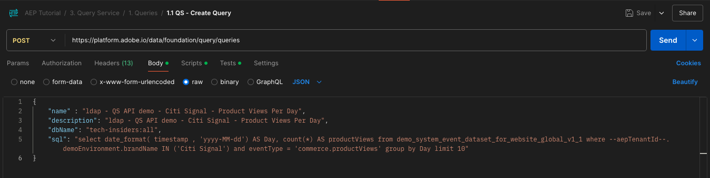

# 5.1.8 クエリサービス API

## 目的

- Query Service API を使用して、クエリテンプレートとクエリスケジュールを管理します

## コンテキスト

この演習では、API 呼び出しを実行して、Postman コレクションを使用してクエリテンプレートとクエリスケジュールを管理します。 クエリテンプレートを定義し、通常のクエリと CTAS クエリを実行します。 **CTAS** クエリ（create table as select クエリ）は、その結果セットを明示的なデータセットに保存します。 通常のクエリは暗黙的な（またはシステム生成の）データセットに保存されますが、通常は parquet ファイル形式で書き出されます。

## ドキュメント

- [Adobe Experience Platform Query Service ヘルプ ](https://experienceleague.adobe.com/docs/experience-platform/query/api/getting-started.html?lang=ja)
- [クエリサービス API](https://www.adobe.io/apis/experienceplatform/home/api-reference.html#!acpdr/swagger-specs/qs-api.yaml)

## クエリサービス API

Query Service API を使用すると、Adobe Experience Platform Data-Lake に対する非インタラクティブクエリを管理できます。

非インタラクティブは、クエリの実行リクエストに対して即座に応答しないことを意味します。 クエリが処理され、その結果セットは暗黙的または明示的（CTAS:create table as select）なデータセットに保存されます。

## サンプルクエリ

サンプルクエリとして、[4.3 - クエリ、クエリ、クエリ…およびチャーン分析にリストされた最初のクエリを使用し ](./ex3.md) す。

1 日に表示される製品の数

**SQL**

```sql
select date_format( timestamp , 'yyyy-MM-dd') AS Day,
       count(*) AS productViews
from   demo_system_event_dataset_for_website_global_v1_1
where  --aepTenantId--.demoEnvironment.brandName IN ('Citi Signal')
and eventType = 'commerce.productViews'
group by Day
limit 10;
```

## クエリ

>[!IMPORTANT]
>
>Adobe社員の方は、こちらの説明に従って [PostBuster](./../../../postbuster.md) を使用してください。

コンピューターでPostmanを開きます。 モジュール 2.1 の一部として、Postman環境を作成し、Postman コレクションをインポートしました。 まだ実行していない場合は、[ 演習 2.1.3](./../../../modules/rtcdp-b2c/module2.1/ex3.md) の手順に従います。

読み込んだPostman コレクションの一部として、フォルダー **3 が表示されます。 クエリサービス**. このフォルダーが表示されない場合は、[Postman コレクションを再度ダウンロードし ](./../../../assets/postman/postman_profile.zip)[ 演習 2.1.3](./../../../modules/rtcdp-b2c/module2.1/ex3.md) の指示に従って、Postmanでそのコレクションを再読み込みしてください。


>[!NOTE]
>
>現時点では、フォルダー **1 のみです。 クエリ** リクエストを含みます。 その他のリクエストは、レイヤーステージで追加されます。

そのフォルダーを開き、クエリ結果セットを実行、監視、ダウンロードするための Query Service API 呼び出しについて理解します。

次のペイロードを持つ [/query/queries] をPOST呼び出すと、クエリの実行がトリガーになります。

### クエリを作成

**1.1 QS - Create Query** という名前のリクエストをクリックし、**Headers** に移動します。 次の画面が表示されます。


このヘッダーフィールドに注目しましょう。

| キー | 値 |
| ----------- | ----------- |
| x-sandbox-name | `--aepSandboxName--` |

>[!NOTE]
>
>使用しているAdobe Experience Platform サンドボックスの名前を指定する必要があります。 ヘッダーフィールド **x-sandbox-name** は `--aepSandboxName--` にしてください。

このリクエストの **本文** セクションに移動します。 このリクエストの **本文** には、次の内容が表示されます。



```sql
{
    "name" : "ldap - QS API demo - Citi Signal - Product Views Per Day",
	"description": "ldap - QS API demo - Citi Signal - Product Views Per Day",
	"dbName": "--aepSandboxName--:all",
	"sql": "select date_format( timestamp , 'yyyy-MM-dd') AS Day, count(*) AS productViews from demo_system_event_dataset_for_website_global_v1_1 where --aepTenantId--.demoEnvironment.brandName IN ('Citi Signal') and eventType = 'commerce.productViews' group by Day limit 10"
}
```

注意：以下のリクエストの変数 **name** を更新してください。そのためには、**ldap** を特定の **—aepUserLdap—** に置き換えます。

具体的な **ldap** を追加すると、本文は次のようになります。

```json
{
    "name" : "vangeluw - QS API demo - Citi Signal - Product Views Per Day",
	"description": "vangeluw - QS API demo - Citi Signal - Product Views Per Day",
	"dbName": "tech-insiders:all",
	"sql": "select date_format( timestamp , 'yyyy-MM-dd') AS Day, count(*) AS productViews from demo_system_event_dataset_for_website_global_v1_1 where _experienceplatform.demoEnvironment.brandName IN ('Citi Signal') and eventType = 'commerce.productViews' group by Day limit 10"
}
```

>[!NOTE]
>
>上記の JSON 本文のキー **dbName** は、Adobe Experience Platform インスタンスで使用されるサンドボックスを参照します。 PROD サンドボックスを使用している場合は、dbName を **prod:all** にし、インスタンス **tech-insiders** などの別のサンドボックスを使用している場合は、dbName を **tech-insiders:all** にします。

次に、青い **送信** ボタンをクリックして、セグメントを作成し、その結果を表示します。


リクエストが成功した場合、POSTは次の応答を返します。

```json
{
    "isInsertInto": false,
    "request": {
        "dbName": "module7:all",
        "sql": "select date_format( timestamp , 'yyyy-MM-dd') AS Day, count(*) AS productViews from demo_system_event_dataset_for_website_global_v1_1 where _experienceplatform.demoEnvironment.brandName IN ('Luma Telco', 'Citi Signal') and eventType = 'commerce.productViews' group by Day limit 10",
        "name": "vangeluw - QS API demo - Citi Signal - Product Views Per Day",
        "description": "vangeluw - QS API demo - Citi Signal - Product Views Per Day"
    },
    "clientId": "5a143b5ae4aa4631a1f3b09cd051333f",
    "state": "SUBMITTED",
    "rowCount": 0,
    "errors": [],
    "isCTAS": false,
    "version": 1,
    "id": "8f0d7f25-f7aa-493b-9792-290f884a7e5b",
    "elapsedTime": 0,
    "updated": "2021-01-20T13:23:13.951Z",
    "client": "API",
    "userId": "A3392DB95FFF08EE0A495E87@techacct.adobe.com",
    "created": "2021-01-20T13:23:13.951Z",
    "_links": {
        "self": {
            "href": "https://platform-va7.adobe.io/data/foundation/query/queries/8f0d7f25-f7aa-493b-9792-290f884a7e5b",
            "method": "GET"
        },
        "soft_delete": {
            "href": "https://platform-va7.adobe.io/data/foundation/query/queries/8f0d7f25-f7aa-493b-9792-290f884a7e5b",
            "method": "PATCH",
            "body": "{ \"op\": \"soft_delete\"}"
        },
        "cancel": {
            "href": "https://platform-va7.adobe.io/data/foundation/query/queries/8f0d7f25-f7aa-493b-9792-290f884a7e5b",
            "method": "PATCH",
            "body": "{ \"op\": \"cancel\"}"
        }
    }
}
```

クエリの現在の **状態** は **送信済み** で、実行されると状態は **成功** になります。

また、Adobe Experience Platform UI を使用して送信済みクエリを参照し、[Adobe Experience Platform](https://experience.adobe.com/#/@experienceplatform/platform/home) を開き、**クエリ**、**ログ** に移動して、クエリを選択することもできます。


### クエリの取得

**1.2 QS - Get Queries** という名前のリクエストをクリックし、**Headers** に移動します。 次の画面が表示されます。


このヘッダーフィールドに注目しましょう。

| キー | 値 |
| ----------- | ----------- |
| x-sandbox-name | `--aepSandboxName--` |

>[!NOTE]
>
>使用しているAdobe Experience Platform サンドボックスの名前を指定する必要があります。 ヘッダーフィールド **x-sandbox-name** は `--aepSandboxName--` にしてください。

**パラメーター** に移動します。 次の画面が表示されます。


**orderby** パラメーターを使用すると、**created** プロパティに基づいて並べ替え順を指定できます。 「作成日」の前に **-&#39;** 記号があることに注意してください。つまり、クエリのリストが返される順序は、作成日を **降順** で使用します。 クエリはリストの一番上に表示されます。

次に、青い **送信** ボタンをクリックして、セグメントを作成し、その結果を表示します。


リクエストが成功すると、以下のような応答が返されます。 応答の **状態** には、**送信済み**、**処理中** または **成功** があります。 クエリが **成功** 状態になるまで、数分かかる場合があります。 **成功** 状態が表示されるまで、このリクエストの送信を複数回繰り返すことができます。

```json
{
    "queries": [
        {
            "isInsertInto": false,
            "sessionType": "HTTP_SESSION",
            "request": {
                "dbName": "tech-insiders:all",
                "sql": "select date_format( timestamp , 'yyyy-MM-dd') AS Day, count(*) AS productViews from demo_system_event_dataset_for_website_global_v1_1 where _experienceplatform.demoEnvironment.brandName IN ('Citi Signal') and eventType = 'commerce.productViews' group by Day limit 10",
                "name": "vangeluw - QS API demo - Citi Signal - Product Views Per Day",
                "description": "vangeluw - QS API demo - Citi Signal - Product Views Per Day"
            },
            "computeMetrics": null,
            "clientId": "b7d8a1fc396242889bb31dc83644e91d",
            "state": "IN_PROGRESS",
            "rowCount": 0,
            "isService": false,
            "errors": [],
            "isCTAS": false,
            "version": 1,
            "id": "a535234e-dc0c-42ea-bcad-eb09c5997d76",
            "elapsedTime": 8088,
            "updated": "2024-12-04T14:17:10.627Z",
            "client": "API",
            "effectiveSQL": "select date_format( timestamp , 'yyyy-MM-dd') AS Day, count(*) AS productViews from demo_system_event_dataset_for_website_global_v1_1 where _experienceplatform.demoEnvironment.brandName IN ('Citi Signal') and eventType = 'commerce.productViews' group by Day limit 10",
            "userId": "8CD31E54673C49EE0A495E05@techacct.adobe.com",
            "isParentLevel": true,
            "created": "2024-12-04T14:14:22.637Z",
                "version": 1,
    "_links": {
        "next": {
            "href": "https://platform-va7.adobe.io/data/foundation/query/queries?orderby=-created&start=2024-11-22T00:32:04.505Z"
        },
        "prev": {
            "href": "https://platform-va7.adobe.io/data/foundation/query/queries?orderby=-created&start=2024-12-04T14:14:22.637Z&isPrevLink=true"
        }
    }
}
```

状態が **成功** の場合は、次のリクエストに進んでください。

### クエリステータスを取得

**1.3 QS - Get Query Status** という名前のリクエストをクリックし、**Headers** に移動します。 次の画面が表示されます。


このヘッダーフィールドに注目しましょう。

| キー | 値 |
| ----------- | ----------- |
| x-sandbox-name | `--aepSandboxName--` |

>[!NOTE]
>
>使用しているAdobe Experience Platform サンドボックスの名前を指定する必要があります。 ヘッダーフィールド **x-sandbox-name** は `--aepSandboxName--` にしてください。

次に、青い **送信** ボタンをクリックして、セグメントを作成し、その結果を表示します。


リクエストが成功すると、以下のような応答が返されます。

```json
{
    "isInsertInto": false,
    "sessionType": "HTTP_SESSION",
    "request": {
        "dbName": "tech-insiders:all",
        "sql": "select date_format( timestamp , 'yyyy-MM-dd') AS Day, count(*) AS productViews from demo_system_event_dataset_for_website_global_v1_1 where _experienceplatform.demoEnvironment.brandName IN ('Citi Signal') and eventType = 'commerce.productViews' group by Day limit 10",
        "name": "vangeluw - QS API demo - Citi Signal - Product Views Per Day",
        "description": "vangeluw - QS API demo - Citi Signal - Product Views Per Day"
    },
    "computeMetrics": {
        "executorVMSeconds": 138,
        "clusterCpuSeconds": 3312,
        "clusterVMHours": 0.07666666805744171,
        "driverVMSeconds": 138,
        "clusterVMSeconds": 276
    },
    "clientId": "b7d8a1fc396242889bb31dc83644e91d",
    "state": "SUCCESS",
    "rowCount": 1,
    "isService": false,
    "errors": [],
    "isCTAS": false,
    "version": 1,
    "id": "a535234e-dc0c-42ea-bcad-eb09c5997d76",
    "elapsedTime": 199219,
    "updated": "2024-12-04T14:17:41.856Z",
    "client": "API",
    "effectiveSQL": "select date_format( timestamp , 'yyyy-MM-dd') AS Day, count(*) AS productViews from demo_system_event_dataset_for_website_global_v1_1 where _experienceplatform.demoEnvironment.brandName IN ('Citi Signal') and eventType = 'commerce.productViews' group by Day limit 10",
    "userId": "8CD31E54673C49EE0A495E05@techacct.adobe.com",
    "isParentLevel": true,
    "created": "2024-12-04T14:14:22.637Z",
    "_links": {
        "self": {
            "href": "https://platform-va7.adobe.io/data/foundation/query/queries/a535234e-dc0c-42ea-bcad-eb09c5997d76",
            "method": "GET"
        },
        "soft_delete": {
            "href": "https://platform-va7.adobe.io/data/foundation/query/queries/a535234e-dc0c-42ea-bcad-eb09c5997d76",
            "method": "PATCH",
            "body": "{ \"op\": \"soft_delete\"}"
        },
        "referenced_datasets": [
            {
                "id": "672a10b1074ceb2af0aa7034",
                "href": "https://platform-va7.adobe.io/data/foundation/catalog/dataSets/672a10b1074ceb2af0aa7034"
            }
        ]
    }
}
```

クエリが状態 **成功** に達すると、応答は、**rowCount** プロパティを介してクエリによって取得された行数も示します。 この例では、10 行がクエリによって返されます。 次の節で、10 行を取得する方法を見てみましょう。

### クエリ結果の取得

上記の **SUCCESS** 応答には、クエリ結果を保存する暗黙的なデータセットを指す **referenced_datasets** プロパティが含まれています。 結果にアクセスするには、結果の **href** または **id** プロパティを使用します。

**1.4 QS - Get Query Result** という名前のリクエストをクリックし、**Headers** に移動します。 次の画面が表示されます。


このヘッダーフィールドに注目しましょう。

| キー | 値 |
| ----------- | ----------- |
| x-sandbox-name | `--aepSandboxName--` |

>[!NOTE]
>
>使用しているAdobe Experience Platform サンドボックスの名前を指定する必要があります。 ヘッダーフィールド **x-sandbox-name** は `--aepSandboxName--` にしてください。

次に、青い **送信** ボタンをクリックして、セグメントを作成し、その結果を表示します。


このリクエストの応答は、データセットファイルを指します。

```json
{
    "672a10b1074ceb2af0aa7034": {
        "name": "Demo System - Event Dataset for Website (Global v1.1)",
        "description": "Demo System - Event Dataset for Website (Global v1.1)",
        "enableErrorDiagnostics": false,
        "tags": {
            "adobe/siphon/partition/definition": [
                "day(timestamp, _ACP_DATE)",
                "identity(_ACP_BATCHID)"
            ],
            "adobe/siphon/meta": [
                "acpBufferedFlag::false"
            ],
            "aep/siphon/partitions": [
                "_ACP_DATE",
                "_ACP_BATCHID"
            ],
            "acp_granular_plugin_validation_flags": [
                "identity:enabled",
                "profile:disabled"
            ],
            "adobe/pqs/table": [
                "demo_system_event_dataset_for_website_global_v1_1"
            ],
            "acp_granular_validation_flags": [
                "requiredFieldCheck:enabled"
            ],
            "aep/siphon/cleanup/trash/timestamp": [
                "1733302532212"
            ],
            "acp_validationContext": [
                "enabled"
            ],
            "adobe/siphon/table/format": [
                "delta"
            ],
            "unifiedProfile": [
                "enabled:true",
                "enabledAt:2024-11-05 12:33:59"
            ],
            "aep/siphon/cleanup/meta/timestamp": [
                "1733302532287"
            ],
            "unifiedIdentity": [
                "enabled:true"
            ]
        },
        "state": "ACTIVE",
        "imsOrg": "907075E95BF479EC0A495C73@AdobeOrg",
        "sandboxId": "79e3c8b2-0609-4564-a3c8-b20609a5648c",
        "extensions": {
            "adobe_lakeHouse": {
                "metrics": {
                    "storageSize": 810709,
                    "rowCount": 1141,
                    "asOf": 1732494676514
                }
            },
            "adobe_unifiedProfile": {}
        },
        "version": "1.0.21",
        "created": 1730810034023,
        "updated": 1733302532348,
        "createdClient": "d75039d36ca543c78612f7aac18e6c2b",
        "createdUser": "53FB1E5E66CDC87D0A495FC0@techacct.adobe.com",
        "updatedUser": "acp_foundation_dataTracker@AdobeID",
        "classification": {
            "dataBehavior": "time-series",
            "managedBy": "CUSTOMER"
        },
        "viewId": "672a10b2074ceb2af0aa7035",
        "fileDescription": {
            "format": "parquet"
        },
        "files": "@/dataSetFiles?dataSetId=672a10b1074ceb2af0aa7034",
        "schemaRef": {
            "id": "https://ns.adobe.com/experienceplatform/schemas/d9b88a044ad96154637965a97ed63c7b20bdf2ab3b4f642e",
            "contentType": "application/vnd.adobe.xed-full+json;version=1"
        }
    }
}
```

次の手順：[ 概要とメリット ](./summary.md)

[モジュール 5.1 に戻る](./query-service.md)

[すべてのモジュールに戻る](../../../overview.md)
