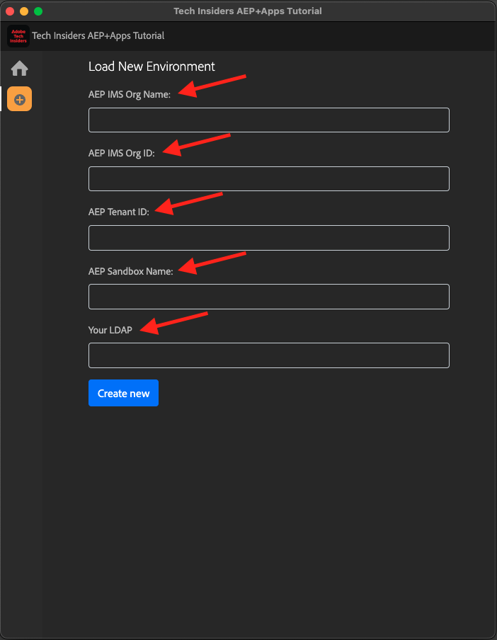

# 0.1Experience LeagueドキュメントのChrome拡張機能のインストール

## 0.1.1 Chrome拡張機能を作成した理由

このドキュメントは汎用化され、任意のAdobe Experience Platform インスタンスを使用して、誰でも簡単に再利用できるようになりました。
ドキュメントを再利用できるようにすることで、ドキュメントに **環境変数** が導入されました。つまり、ドキュメントには以下の **キー** があります。 すべてのキーは固有の変数であり、Chrome拡張機能によってその変数が変更されるので、チュートリアルページからコードとテキストを簡単にコピーして、チュートリアルの一部として使用する様々なユーザーインターフェイスに貼り付けることができます。

このような値の例については、以下を参照してください。 現在、これらの値はまだ使用できませんが、Chrome拡張機能をインストールしてアクティベートすると、これらの変数が「通常の」テキストに変わり、コピーして再利用できるようになります。

| 名前 | キー |
|:-------------:| :---------------:|
| AEP IMS 組織 ID | `--aepImsOrgId--` |
| AEP テナント ID | `--aepTenantId--` |
| DCS インレット ID | `--dcsInletId--` |
| デモプロファイル LDAP | `--demoProfileLdap--` |

例として、以下のスクリーンショットでは、`--aepTenantId--` への参照を確認できます。

拡張機能がインストールされると、同じテキストがインスタンス固有の値を反映して自動的に変更されます。

拡張機能を使用すると、次のことも可能になります。

- チュートリアルに新規登録

## 0.1.2 Chrome拡張機能のインストール

Chrome拡張機能をインストールするには、Chrome ブラウザーを開き、[https://chrome.google.com/webstore/detail/platform-learn-configurat/hhnbkfgioecmhimdhooigajdajplinfi/related?hl=en&amp;authuser=0](https://chrome.google.com/webstore/detail/platform-learn-configurat/hhnbkfgioecmhimdhooigajdajplinfi/related?hl=en&amp;authuser=0) に移動します。 その後、これが表示されます。

**Chromeに追加** をクリックします。

その後、これが表示されます。 **拡張機能を追加** をクリックします。

拡張機能がインストールされ、同様の通知が表示されます。

**拡張機能** メニューで「**パズルピース**」アイコンをクリックし、**Platform Learn – 設定** 拡張機能を拡張機能メニューにピン留めします。

## 0.1.2 Chrome拡張機能の設定

[https://experienceleague.adobe.com/docs/platform-learn/comprehensive-technical-tutorial-v22/overview.html?lang=enに移動し ](https://experienceleague.adobe.com/docs/platform-learn/comprehensive-technical-tutorial-v22/overview.html?lang=en) 拡張機能アイコンをクリックして開きます。

このポップアップが表示されます。 **+** アイコンをクリックします。

名前と、Adobe Experience Platform環境用に作成した設定 ID を入力します。 「**新規作成**」をクリックします。

>[!IMPORTANT]
>
>Adobeの従業員の場合：使用する設定 ID は、内部 Github リポジトリ（https://git.corp.adobe.com/vangeluw/platformenablement）で確認できます。
>
>Adobeのソリューションパートナーの場合は、ソリューションパートナーの担当者に問い合わせるか、**spphelp@adobe.com** に電子メールを送信してください。

拡張機能の左側のメニューに、イニシャルを含むアイコンが表示されます。 クリックします。 次に、**環境変数** と特定のAdobe Experience Platform インスタンス値のマッピングを確認します。 **設定をアクティベート** をクリックします。

設定をアクティベートすると、イニシャルの横に緑の点が表示されます。 これは、設定 ID がアクティブになったことを意味します。 また、多数の追加メニューオプションも表示されます。

これで、次の 2 つのオプションが用意されました。

- 既存の設定を使用したイネーブルメントの既存のユーザーである場合は、**0.1.3 既存のユーザー – ログイン** に移動します。
- このチュートリアルを初めて開始するユーザーの場合は、「**0.1.4 サインアップ」に移動し、「** 0.1.3 既存ユーザー – ログイン **」をスキップ** ます。

## 0.1.3 既存のユーザー – ログイン

>[!IMPORTANT]
>
>演習 **0.1.3 既存のユーザー – ログイン** は、このチュートリアルに以前に登録した既存のユーザーのみが機能します。

既存のユーザーがこのChrome拡張機能を初めて設定する場合は、左側のメニューにある紫色のアイコンをクリックします。 その後、これが表示されます。

必要に応じて値を入力します。

>[!IMPORTANT]
>
>**LDAP** は最も重要なフィールドです。このチュートリアルに初めて登録したときに使用したのと同じ LDAP を使用する必要があります。 これにより、進行状況が正常に読み込まれます。 LDAP が何かわからない場合は、メールアドレスを確認してください。 メールアドレスの@-symbol の前のテキストを LDAP として使用します。 メールアドレスが **techinsiders@adobe.com** の場合、ここで入力する LDAP は **vangeluw**）です。

「**OK**」をクリックします。

30 秒から 1 分後に画面が変わり、**ホーム** に戻ります。この画面には、次の内容が表示されます。

これでChrome拡張機能が設定され、すべてが正常に動作しているかどうかを確認できるようになりました。

## 0.1.4 新規ユーザー – サインアップ

>[!IMPORTANT]
>
>演習 **0.1.4 新規ユーザー – サインアップ** は、このチュートリアルを初めて開始する新規ユーザーを対象としています。

このチュートリアルに初めて新規登録する場合は、メニューの黄色のアイコンをクリックします。 その後、これが表示されます。

必要に応じてフィールドに入力します。 「**保存**」をクリックします。

>[!IMPORTANT]
>
>**LDAP** は最も重要なフィールドです。 LDAP が何かわからない場合は、メールアドレスを確認してください。 メールアドレスの@-symbol の前のテキストを LDAP として使用します。 メールアドレスが **techinsiders@adobe.com** の場合、ここで入力する LDAP は **vangeluw**）です。

30 秒から 1 分後に画面が変わり、**ホーム** に戻ります。この画面には、次の内容が表示されます。

これでChrome拡張機能が設定され、すべてが正常に動作しているかどうかを確認できるようになりました。

## 0.1.5 チュートリアルコンテンツの確認

テストとして、[ このページ ](https://experienceleague.adobe.com/docs/platform-learn/comprehensive-technical-tutorial-v22/module4/ex3.html?lang=en) に移動します。

これで、Chrome 拡張機能の設定 ID に基づいて、すべての **環境変数** が実際の値に置き換えられました。

これで、以下と同様の表示になります。ここでは、環境変数 `--aepTenantId--` は、実際のテナント ID （この場合は **_experienceplatform**）に置き換えられています。

次の手順：[0.2 デモシステムを使用する次に、Adobe Experience Platform Data Collection クライアントプロパティを設定し ](./ex2.md) す。

[モジュール 0 に戻る](./getting-started.md)

[すべてのモジュールに戻る](./../../../overview.md)
