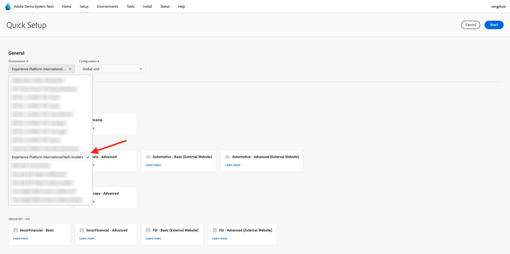

# 0.2 デモシステムを使用：次に、Adobe Experience Platform Data Collection クライアントプロパティを設定します

Adobe Experience Platformの包括的なテクニカルチュートリアルに新規登録すると、デモシステムにアクセスできる自動化されたプロセスが表示されるので、以下の設定にアクセスして実行できます。

デモシステムにアクセスしたら、次の手順に進みます。

[https://dashboard.adobedemo.com/](https://dashboard.adobedemo.com/) に移動します。 サンドボックスを選択し、「**クイックセットアップ**」をクリックします。

次の画面が表示されます。

**一般** - **環境** で、Adobe Experience Platform インスタンスとサンドボックス（この場合は）を選択します。

- **国際Experience Platform**
- **aepenablementfy22**
- 設定：「**Global v2.0**」を選択してください

次に、プリセット **イネーブルメントユーザー** を選択し、「開始 **をクリック** ます。

ポップアップで、データ収集プロパティの名前を入力します。 命名規則 **Demo System （DD/MM/YYYY）** を使用してください。 ヒント：LDAP は自動的に追加されます。自分で追加する必要はありません。

「**開始**」をクリックします。

次に、このポップアップが表示され、web サイトおよびモバイルアプリプロジェクトの作成中の進行状況と、データ収集プロパティが表示されます。

クイックセットアッププロセスが完了すると、次のことができるようになります。

- 1 Luma デモブランドでデモ web サイトを使用できるようにする web 小売プロジェクト
- 1 Luma デモブランドでデモモバイルアプリを使用できるようにするモバイル小売プロジェクト
- Luma デモブランドでコールセンターとクライアントリングアプリを使用できるようにする 1 CX アプリ小売プロジェクト
- Web サイトからデータを収集するために使用する Web 用の 1 データ収集プロパティ
- モバイル用の 1 データ収集プロパティ。モバイルアプリからデータを収集するために使用します。

この画面は次の手順で必要になるので、開いたままにしてください。

次の手順：[0.3 データストリームを作成する ](./ex3.md)

[モジュール 0 に戻る](./getting-started.md)

[すべてのモジュールに戻る](./../../../overview.md)
