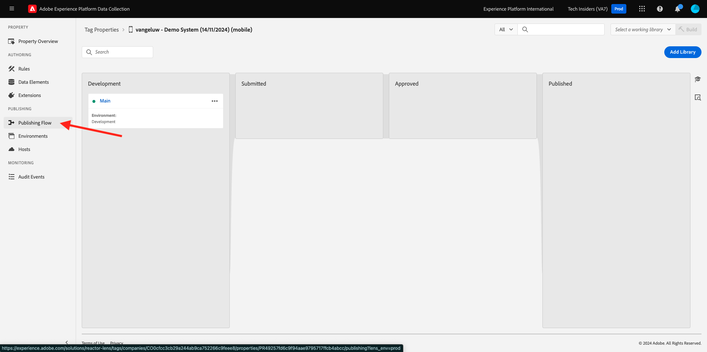
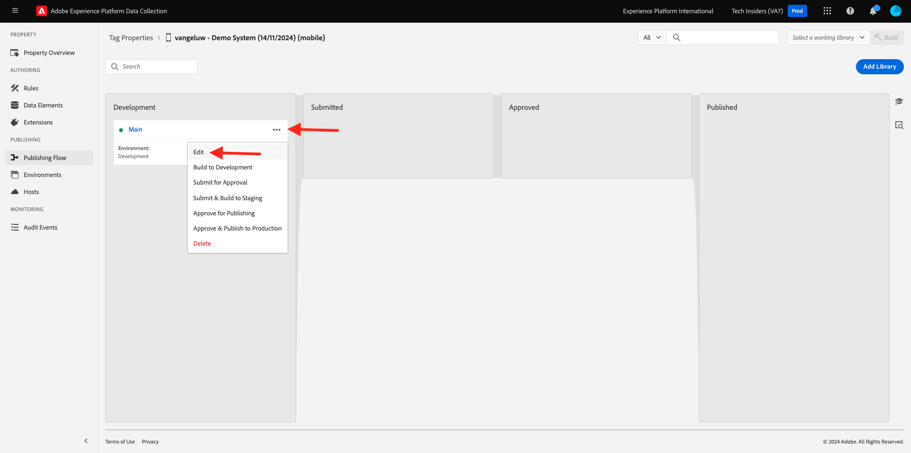

# 0.3 データストリームの作成

[https://experience.adobe.com/#/data-collection/](https://experience.adobe.com/#/data-collection/) に移動します。 前の演習の後、2 つのデータ収集プロパティが得られました。1 つは web 用で、もう 1 つはモバイル用です。

これらのプロパティは、ほとんど使用する準備ができていますが、これらのプロパティを使用してデータの収集を開始する前に、データストリームを設定する必要があります。 データストリームとは何か、および演習 1.2 でのデータストリームの意味に関する概念について詳しく説明します。

今のところ、次の手順に従ってください。

## 0.3.1 Web 用データストリームの作成

**[!UICONTROL データストリーム]** または **[!UICONTROL データストリーム（Beta）]** をクリックします。

画面の右上隅にあるサンドボックス名を選択します（`--aepSandboxName--` にする必要があります）。

**[!UICONTROL 新規データストリーム]** をクリックします。

**[!UICONTROL わかりやすい名前]** と、オプションの説明に `--aepUserLdap-- - Demo System Datastream` と入力します。 「イベントスキーマ」で、「**デモシステム - Web サイトのイベントスキーマ （グローバル v1.1）**」を選択します。 「**保存**」をクリックします。

その後、これが表示されます。 **サービスを追加** をクリックします。

サービス **[!UICONTROL Adobe Experience Platform]** を選択すると、追加のフィールドが表示されます。 その後、これが表示されます。

「イベントデータセット」で **「Demo System - Event Dataset for Website （Global v1.1）」を選択し** 「プロファイルデータセット」で **「Demo System - Profile Dataset for Website （Global v1.1）**」を選択します。 「**保存**」をクリックします。

この画面が表示されます。

今のところはこれで終わりです。 [ モジュール 1.1](./../../../modules/datacollection/module1.1/data-ingestion-launch-web-sdk.md) では、Web SDK とその機能をすべて設定する方法について説明します。

左側のメニューで、「**[!UICONTROL タグ]**」をクリックします。

検索結果をフィルタリングして、2 つのデータ収集プロパティを表示します。 **Web** プロパティをクリックして開きます。

その後、これが表示されます。 **拡張機能** をクリックします。

Adobe Experience Platform Web SDK 拡張機能で、「**設定**」をクリックします。

その後、これが表示されます。 **データストリーム** の場合、現在、ダミーの値が 1 に設定されています。 ここで、「**リストから選択**」ラジオボタンをクリックする必要があります。 ドロップダウンリストで、前に作成したデータストリームを選択します。

**データストリーム** が選択されていることを確認します。 ヒント：`--aepUserLdap--` を入力することで、ドロップダウン内の結果を簡単にフィルタリングできます。

**データ収集** が表示されるまで下にスクロールします。 **クリックデータ収集を有効にする** のチェックボックスが有効になっていないことを確認してください。 「**保存**」をクリックして変更を保存します。

**公開フロー** に移動します。

**メイン** の「**...**」をクリックし、「**編集**」をクリックします。

「**変更されたリソースをすべて追加**」をクリックし、「**開発用に保存してビルド**」をクリックします。

変更を公開中です。数分後に準備が整います。

## 0.3.2 モバイル用データストリームの作成

[https://experience.adobe.com/#/data-collection/](https://experience.adobe.com/#/data-collection/) に移動します。

**[!UICONTROL データストリーム]** または **[!UICONTROL データストリーム（Beta）]** をクリックします。

画面の右上隅にあるサンドボックス名を選択します（`--aepSandboxName--` にする必要があります）。

**[!UICONTROL 新規データストリーム]** をクリックします。

**[!UICONTROL わかりやすい名前]** と、オプションの説明に `--aepUserLdap-- - Demo System Datastream (Mobile)` と入力します。 「イベントスキーマ」で、「**デモシステム – モバイルアプリのイベントスキーマ （グローバル v1.1）**」を選択します。 「**保存**」をクリックします。

「**[!UICONTROL 保存]**」をクリックします。

その後、これが表示されます。 **サービスを追加** をクリックします。

サービス **[!UICONTROL Adobe Experience Platform]** を選択すると、追加のフィールドが表示されます。 その後、これが表示されます。

「イベントデータセット」で **「デモシステム – モバイルアプリのイベントデータセット （グローバル v1.1）**」を選択し、「プロファイルデータセット」で **「デモシステム – モバイルアプリのプロファイルデータセット （グローバル v1.1）**」を選択します。 「**保存**」をクリックします。

その後、これが表示されます。

これで、モバイル用Adobe Experience Platform データ収集クライアントプロパティでデータストリームを使用する準備が整いました。

**タグ** に移動し、検索結果をフィルタリングして、2 つのデータ収集プロパティを表示します。 **モバイル** のプロパティをクリックして開きます。

その後、これが表示されます。 **拡張機能** をクリックします。

**Adobe Experience Platform Edge Network** 拡張機能で、「**設定**」をクリックします。

その後、これが表示されます。 ここで、設定した正しいサンドボックスとデータストリームを選択する必要があります。 使用するサンドボックスは `--aepSandboxName--` で、データストリームは `--aepUserLdap-- - Demo System Datastream (Mobile)` と呼ばれます。

**Edge Network ドメイン** の場合は、既定のドメイン **edge.adobedc.net** を使用してください。

「**保存**」をクリックして変更を保存します。

**公開フロー** に移動します。

**メイン** の横にある「**...**」をクリックし、「**編集**」をクリックします。

「**変更されたリソースをすべて追加**」をクリックし、「**開発用に保存してビルド**」をクリックします。

変更を公開中です。数分後に準備が整います。

次の手順：[0.4 Web サイトを使用する ](./ex4.md)

[モジュール 0 に戻る](./getting-started.md)

[すべてのモジュールに戻る](./../../../overview.md)