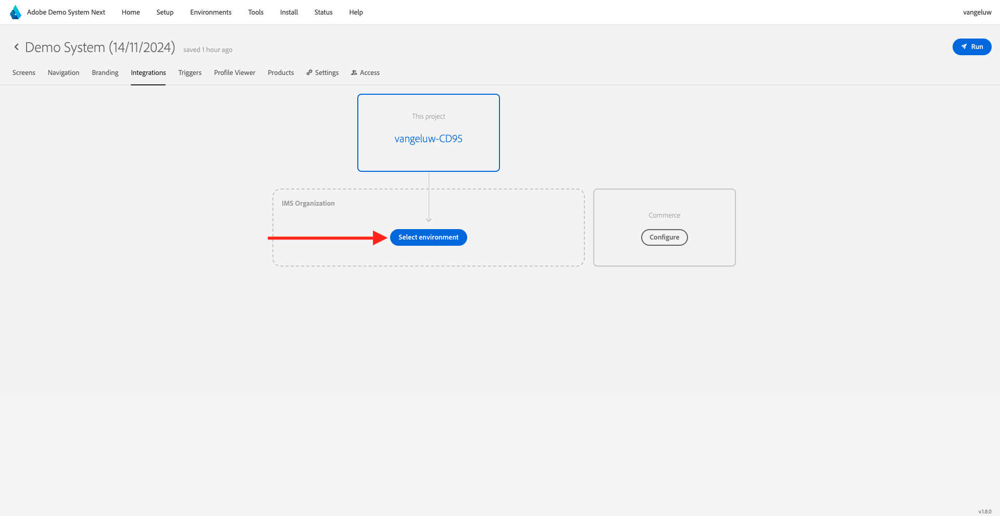
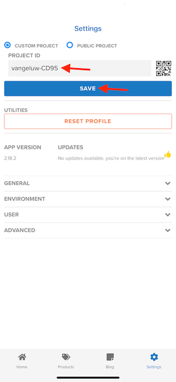

# 0.5 モバイルアプリの使用

## 0.5.1 アプリのダウンロード

コンピューターの ](https://bit.ly/dx-demo-app)0}https://bit.ly/dx-demo-app} に移動します。 [その後、これが表示されます。

スマートフォンの **カメラ** アプリを使って、デバイスの OS に対応したモバイルアプリをインストールします。 このイネーブルメントでは、Adobe Experience Platform Mobile SDK を使用する **バージョン 2.x** をインストールする必要があります。

>[!NOTE]
>
>iOS デバイスにアプリを初めてインストールした後、アプリを開こうとすると、「**信頼できないエンタープライズデベロッパー**」というエラーメッセージが表示される場合があります。 この問題を修正するには、**設定/一般/デバイス管理/Adobe Systems Inc.** に移動し、**Trust Adobe Systems Inc.** をクリックする必要があります。

アプリがインストールされると、デバイスのホーム画面に表示されます。 アイコンをクリックして、アプリを開きます。

アプリを初めて使用する場合は、Adobe IDを使用してログインするように求められます。 ログインプロセスを完了します。

ログインすると、通知を送信する権限を要求する通知が表示されます。 チュートリアルの一部として通知を送信するので、「**許可**」をクリックします。

その後、アプリのホームページが表示されます。 **設定** に移動します。

設定では、現在 **公開プロジェクト** がアプリに読み込まれていることがわかります。 **カスタムプロジェクト** をクリックします。

これで、カスタムプロジェクトを読み込めるようになりました。 QR コードをクリックして、プロジェクトを簡単に読み込みます。

演習 0.1 の後、この結果が得られました。 クリックして、作成された **モバイル小売プロジェクト** を開きます。

誤ってブラウザーウィンドウを閉じてしまった場合や、今後のデモまたはイネーブルメントセッションの際には、[https://builder.adobedemo.com/projects](https://builder.adobedemo.com/projects) にアクセスして web サイトプロジェクトにアクセスすることもできます。 Adobe IDでログインすると、このが表示されます。 モバイルアプリプロジェクトをクリックして開きます。

その後、これが表示されます。 **統合** をクリックします。

演習 0.1 で作成したモバイルのデータ収集プロパティを選択する必要があります。次に、「**実行** をクリックします。

QR コードを含むこのポップアップが表示されます。 モバイルアプリ内からこの QR コードをスキャンします。

プロジェクト ID がアプリに表示されたら、「**保存**」をクリックします。

次に、アプリで **ホーム** に戻ります。 これで、アプリを使用する準備が整いました。

モジュール 0 が完了しました。

[モジュール 0 に戻る](./getting-started.md)

[すべてのモジュールに戻る](./../../../overview.md)
